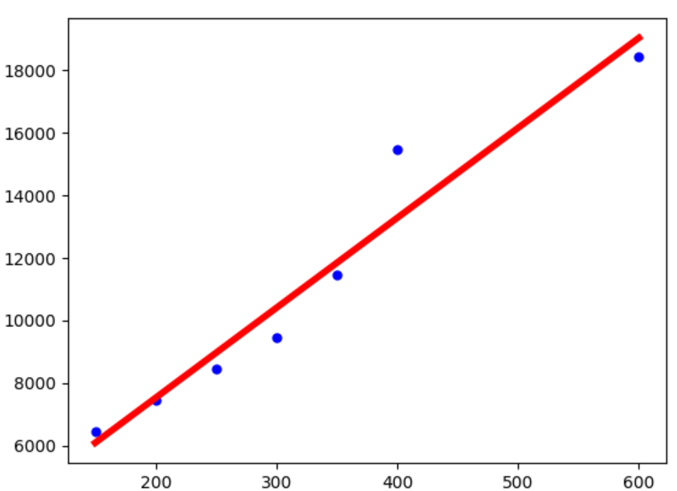
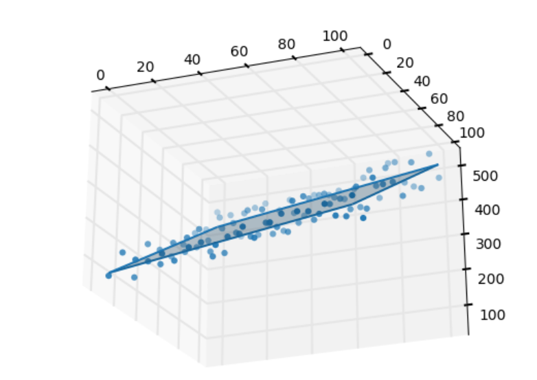
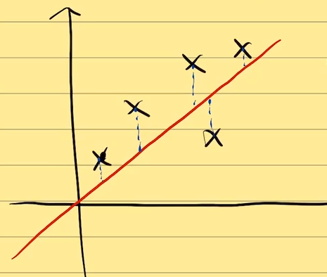

# 矩阵求导

[toc]

## 1. 为什么在机器学习中需要矩阵求导

机器学习中有大量数据，都是表格的形式。

1. Vectorization 

   吴恩达课程，coursea MachineLearning DeepLearning

   方程用矩阵和向量表示

2. 求导在优化算法中的广泛应用

​		机器学习要求目标函数可导

以上两点推出：矩阵求导


向量化的优点：

1. 简洁

   方程式：

$$
\begin{cases}
y_1=w_1x_{11}+w_2x_{12} \\
y_2=w_1x_{21}+w_2x_{22} \\
\end{cases}
$$

​		矩阵式：
$$
Y=X\cdot W
$$
​		其中
$$
Y=
\left[
\begin{matrix}
y_1	\\
y_2 \\
\end{matrix}
\right],

X=\left[
\begin{matrix}
x_{11} & x_{12}	\\
x_{21} & x_{22} \\
\end{matrix}
\right],

W=
\left[
\begin{matrix}
w_1	\\
w_2 \\
\end{matrix}
\right]
$$


​	方程式再扩展成为：
$$
\begin{cases}
y_1=w_1x_{11}+w_2x_{12}+\cdots+w_mx_{1m} \\
y_2=w_1x_{21}+w_2x_{22}+\cdots+w_mx_{2m} \\
\vdots					\\
y_n=w_1x_{n1}+w_2x_{n2}++\cdots+w_mx_{nm}\\
\end{cases}
$$
矩阵表达式任然是：
$$
Y=X\cdot W
$$

2. 可加速运算

比如python可以通过numpy加速矩阵的运算。

```python
import time
import numpy as np

a = np.random.rand(1000000)
b = np.random.rand(1000000)

tic = time.time()
c = np.dot(a, b)
toc = time.time()

print(c)
print(f"vectorized version: {1000 * (toc - tic)} ms")

c = 0
tic = time.time()
for i in range(1000000):
    c += a[i] * b[i]
toc = time.time()

print(c)
print(f"for loop version: {1000 * (toc - tic)} ms")
```

```
250486.11214622343
vectorized version: 1.007080078125 ms
250486.11214621752
for loop version: 454.00166511535645 ms
```

使用 numpy 远远快于 for loop实现

尽量用向量的表示形式，尽量不用for循环

看算法的时候尽量从向量的角度和矩阵的角度来看待。


现在问题有一般求导，如：
$$
f(x)=x^2	\\
f'(x)=2x
$$
转化为：
$$
x=\left[ 
\begin{matrix}
x_1		\\
x_2		\\
\vdots	\\
x_p		\\
\end{matrix}
\right]_{p\times1},

f(x)=x^T\cdot x,

\frac{df(x)}{dx}=?
$$
这个问题就需要用到对向量或者矩阵进行求导


## 2. 向量函数与矩阵求导入门

**标量函数：输出为标量的函数**

如：输入是标量，输出是标量的函数：
$$
f(x)=x^2			\\
					\\
R \rightarrow R		\\
					\\
x \rightarrow x^2
\tag{1}
$$
输入是向量，输出是标量的函数：
$$
f(x)=x_1^2+x_2^2	\\
					\\
R^2 \rightarrow R	\\
					\\
\left[
\begin{matrix}
x_1	\\
x_2
\end{matrix}
\right]
\rightarrow x_1^2+x_2^2
\tag{2}
$$


​	

**向量函数：输出为向量（矩阵/张量）的函数**

如：输入为标量，输出为向量的函数：
$$
f(x)=
\left[
\begin{matrix}
f_1(x)=x	\\
f_2(x)=x^2	\\
\end{matrix}
\right]				\\
					\\
R \rightarrow R^2	\\
					\\
x \rightarrow 
\left[
\begin{matrix}
x	\\
x^2	\\
\end{matrix}
\right]
\tag{3}
$$
如：输入为标量，输出为矩阵的函数：
$$
f(x)=
\left[
\begin{matrix}
f_{11}(x)=x		& f_{12}(x)=x^2	\\
f_{21}(x)=x^3	& f_{22}(x)=x^4	\\
\end{matrix}
\right]						\\
							\\
R \rightarrow R^{2\times2}	\\
							\\
x \rightarrow
\left[
\begin{matrix}
x	& x^2\\
x^3	& x^4	\\
\end{matrix}
\right]
\tag{4}
$$


如：输入为向量，输出为向量：
$$
f(x)=
\left[
\begin{matrix}
f_{11}(x)=x_1+x_2		& f_{12}(x)=x_1^2+x_2^2	\\
f_{21}(x)=x_1^3+x_2^3	& f_{22}(x)=x_1^4+x_2^4	\\
\end{matrix}
\right]							\\
								\\
R^2 \rightarrow R^{2\times2}	\\
								\\
\left[
\begin{matrix}
x_1		\\
x_2		\\
\end{matrix}
\right]
\rightarrow
\left[
\begin{matrix}
x_1+x_2		& x_1^2+x_2^2	\\
x_1^3+x_2^3	& x_1^4+x_2^4	\\
\end{matrix}
\right]
\tag{5}
$$
总结：

输入 $x$ 可以是**标量**、**向量**、矩阵

输出 $f(x)$ 可以是**标量**、**向量**、矩阵

这个重点讨论输入和输出为**标量和向量**的形式的函数的求导：
$$
\frac{df(x)}{dx}=?
$$
输入和输出为标量和向量存在4中情况，


矩阵求导的本质：
$$
\frac{dA}{dB}
$$
就是**矩阵 $A$ 中每个元素对矩阵 $B$ 中的每个元素求导**，是一个遍历的过程。

从求导后元素的个数的角度分析：

| $A$          | $B$          | $\frac{dA}{dB}$                |
| ------------ | ------------ | ------------------------------ |
| $1 \times 1$ | $1 \times 1$ | $1 \times 1$                   |
| $1 \times p$ | $1 \times n$ | $p \times n$                   |
| $q \times p$ | $m \times n$ | $q \times p \times m \times n$ |


## 3. 求导秘技- $YX$ 拉伸

**1. 标量不变，向量拉伸**

**2.前面横向拉，后面纵向拉**

矩阵 $A$ 对矩阵 $B$ 求导就是要矩阵 $A$ 中每个元素对矩阵 $B$ 中的每个元素求导，如果 $A$ 有 $n$ 个元素， $B$  有 $m$ 个元素，则求导后有 $n \times m$ 个元素，那么，求导后的各个元素如何排列？

对于
$$
\frac{df(x)}{dx}
$$
如果 $f(x)$ 是向量或者 $x$  是向量，则要对它进行拉伸，如果 $f(x)$ 是标量或者 $x$  是标量，则不要对它进行拉伸。

拉伸有两种方向，一种是横向拉伸，一种是纵向拉伸。那如何判断是横向拉伸还是纵向拉伸呢？**前面横向拉，后面纵向拉**。$Y$ 在 $X$ 前面，$Y$ 横向拉， $X$ 纵向拉。


示例1： $f(x)$ 是标量函数， $x$ 是向量
$$
f(x)=f(x_1, x_2, \cdots x_n)	\\
x=
\left[
\begin{matrix}
x_1		\\
x_2		\\
\vdots	\\
x_n		\\
\end{matrix}
\right]
$$
根据标量不变，向量拉伸原则， $f(x)$ 不变， $x$ 需要拉伸，又根据 $Y$ 横向拉， $X$ 纵向拉的原则， 此处 $x$  需要纵向拉伸。
$$
\frac{df(x)}{dx}=
\left[
\begin{matrix}
\frac{\partial f(x)}{\partial x_1}	\\
\frac{\partial f(x)}{\partial x_2}	\\
\vdots						\\
\frac{\partial f(x)}{\partial x_n}	\\
\end{matrix}
\right]
$$
这个就是标量 $f(x)$ 不变， 向量  $x$ 纵向拉伸的结果。实际拉伸结果就是将多元函数的偏导写在一个列向量里。


示例2：  $f(x)$ 是向量函数， $x$ 是标量
$$
f(x)=
\left[
\begin{matrix}
f_1(x)		\\
f_2(x)		\\
\vdots		\\
f_n(x)		\\
\end{matrix}
\right]
$$
根据标量不变，向量拉伸原则， $f(x)$ 需要拉伸， $x$ 不变，又根据 $Y$ 横向拉， $X$ 纵向拉的原则， 此处 $f(x)$  需要横向拉伸。
$$
\frac{df(x)}{dx}=
\left[
\begin{matrix}
\frac{df_1(x)}{d x}, &
\frac{df_2(x)}{dx}, &
\cdots,	&
\frac{df_n(x)}{dx}
\end{matrix}
\right]
$$


示例3： $f(x)$ 是向量函数， $x$ 是向量
$$
f(x)=
\left[
\begin{matrix}
f_1(x)		\\
f_2(x)		\\
\vdots		\\
f_n(x)		\\
\end{matrix}
\right],
&
x=
\left[
\begin{matrix}
x_1		\\
x_2		\\
\vdots	\\
x_n		\\
\end{matrix}
\right]
$$
可以先拉伸 $X$ 再拉伸 $Y$ ，也可以先拉伸 $Y$ 再拉伸 $X$ ，结果都是一样的，这里先固定 $f(x)$ ， 拉伸 $x$
$$
\frac{df(x)}{dx}=
\left[
\begin{matrix}
\frac{\partial f(x)}{\partial x_1}	\\
\frac{\partial f(x)}{\partial x_2}	\\
\vdots						\\
\frac{\partial f(x)}{\partial x_n}	\\
\end{matrix}
\right]
$$
对于上式中每一项 $\frac{\partial f(x)}{\partial x_i}$ 中 $f(x)$ 为向量，$x_i$ 为标量，每一项都是向量函数对标量求导，如例2中，还需要横向拉伸：
$$
\frac{df(x)}{dx}=
\left[
\begin{matrix}
\frac{\partial f(x)}{\partial x_1}	\\
\frac{\partial f(x)}{\partial x_2}	\\
\vdots						\\
\frac{\partial f(x)}{\partial x_n}	\\
\end{matrix}
\right]
=
\left[
\begin{matrix}
\frac{\partial f_1(x)}{\partial x_1}, & \frac{\partial f_2(x)}{\partial x_1}, & \cdots, & \frac{\partial f_n(x)}{\partial x_1}	\\

\frac{\partial f_1(x)}{\partial x_2}, & \frac{\partial f_2(x)}{\partial x_2}, & \cdots, & \frac{\partial f_n(x)}{\partial x_2}	\\

\vdots						\\

\frac{\partial f_1(x)}{\partial x_n}, & \frac{\partial f_2(x)}{\partial x_n}, & \cdots, & \frac{\partial f_n(x)}{\partial x_n}	\\

\end{matrix}
\right]_{n \times n}
$$


## 4. 常见矩阵求导公式推导

例1：
$$
f(x)=A^T\cdot X, &

A=
\left[
\begin{matrix}
a_1		\\
a_2		\\
\vdots	\\
a_n		\\
\end{matrix}
\right]_{n \times 1}, &

X=
\left[
\begin{matrix}
x_1		\\
x_2		\\
\vdots	\\
x_n		\\
\end{matrix}
\right]_{n \times 1}， &
\frac{df(x)}{dx}=?
$$
注意：基本在机器学习中，向量没有指明是行向量还是列向量时，**默认为列向量**。在机器学习中，一般遇到的向量指的都是列向量。

上式中 $f(x)=A^T \cdot X$ 结果为标量，所以 $f(x)$  为标量函数。而 $x$ 为向量，需要拉伸，而且根据  $YX$ 拉伸法， $x$ 要纵向拉伸。

解：
$$
f(x)=A^T \cdot X =\sum_{i=1}^na_ix_i		\\
\\
\frac{df(x)}{dx}=

\left[
\begin{matrix}
\frac{\partial f(x)}{\partial x_1}			\\
\frac{\partial f(x)}{\partial x_2}			\\
\vdots	\\
\frac{\partial f(x)}{\partial x_n}			\\
\end{matrix}
\right]

=

\left[
\begin{matrix}
\frac{\partial \sum_{i=1}^na_ix_i}{\partial x_1}			\\
\frac{\partial \sum_{i=1}^na_ix_i}{\partial x_2}			\\
\vdots	\\
\frac{\partial \sum_{i=1}^na_ix_i}{\partial x_n}			\\
\end{matrix}
\right]

=

\left[
\begin{matrix}
a_1			\\
a_2			\\
\vdots	\\
a_n			\\
\end{matrix}
\right]

= 

A
$$
注意：$f(x)=A^T \cdot X$ 是标量函数，所以进行转置还是本身，即： $f(x)=A^T \cdot X = f(x)^T = (A^T\cdot X)^T = X^T \cdot A$ 

**结论**：
$$
\frac{dA^T\cdot X}{dX} = \frac{dX^T \cdot A}{dX} = A
$$


例2：
$$
f(x)=X^T\cdot A \cdot X								
,\quad
X=
\left[
\begin{matrix}
x_1		\\
x_2		\\
\vdots	\\
x_n		\\
\end{matrix}
\right]_{n \times 1}
,\quad

A=
\left[
\begin{matrix}
a_{11}, & a_{12}, & \cdots, & a_{1n}	\\
a_{21}, & a_{22}, & \cdots, & a_{2n}	\\
\vdots						\\
a_{n1}, & a_{n2}, & \cdots, & a_{nn}	\\
\end{matrix}
\right]_{n \times n}
,\quad

\frac{f(x)}{dx}=?
$$
分析：$f(x)=X^T_{1\times n} \cdot A_{n \times n} \cdot X_{n\times 1}$ 结果为 $1\times 1$ 的标量

解：
$$
\begin{aligned}
f(x) &= 
\left[
\begin{matrix}
x_1,\,		
x_2,\,
\cdots\,
x_n
\end{matrix}
\right]

\left[
\begin{matrix}
a_{11}, & a_{12}, & \cdots, & a_{1n}	\\
a_{21}, & a_{22}, & \cdots, & a_{2n}	\\
\vdots						\\
a_{n1}, & a_{n2}, & \cdots, & a_{nn}	\\
\end{matrix}
\right]

\left[
\begin{matrix}
x_1		\\
x_2		\\
\vdots	\\
x_n		\\
\end{matrix}
\right]
\\
\\
&=
\left[
\begin{matrix}
a_{11}x_1+a_{21}x_2+\cdots+a_{n1}x_n,\,		
a_{12}x_1+a_{22}x_2+\cdots+a_{n2}x_n,\,
\cdots\,
a_{1n}x_1+a_{2n}x_2+\cdots+a_{nn}x_n
\end{matrix}
\right]

\left[
\begin{matrix}
x_1		\\
x_2		\\
\vdots	\\
x_n		\\
\end{matrix}
\right]
\\
&=

\left[
\begin{matrix}
\sum_{i=1}^na_{i1}x_i,\,		
\sum_{i=1}^na_{i2}x_i,\,
\cdots\,
\sum_{i=1}^na_{in}x_i
\end{matrix}
\right]

\left[
\begin{matrix}
x_1		\\
x_2		\\
\vdots	\\
x_n		\\
\end{matrix}
\right]
\\
&=
(\sum_{i=1}^na_{i1}x_i)x_1+(\sum_{i=1}^na_{i2}x_i)x_2+\cdots+(\sum_{i=1}^na_{in}x_i)x_n
\\
&=\sum_{j=1}^n\sum_{i=1}^na_{ij}x_ix_j
\end{aligned}
$$


$$
\begin{aligned}
\frac{f(x)}{dx}&=

\left[
\begin{matrix}
\frac{\partial f(x)}{\partial x_1}			\\
\frac{\partial f(x)}{\partial x_2}			\\
\vdots	\\
\frac{\partial f(x)}{\partial x_n}			\\
\end{matrix}
\right]
=
\left[
\begin{matrix}
\frac{d \sum_{j=1}^n\sum_{i=1}^na_{ij}x_ix_j}{d x_1}			\\
\frac{d \sum_{j=1}^n\sum_{i=1}^na_{ij}x_ix_j}{d x_2}			\\
\vdots	\\
\frac{d \sum_{j=1}^n\sum_{i=1}^na_{ij}x_ix_j}{d x_n}			\\
\end{matrix}
\right]
=
\left[
\begin{matrix}
\sum_{j=1}^na_{1j}x_j+\sum_{i=1}^na_{i1}x_i						\\
\sum_{j=1}^na_{2j}x_j+\sum_{i=1}^na_{i2}x_i						\\
\vdots	\\
\sum_{j=1}^na_{nj}x_j+\sum_{i=1}^na_{in}x_i						\\
\end{matrix}
\right]
\\
&=

\left[
\begin{matrix}
\sum_{j=1}^na_{1j}x_j						\\
\sum_{j=1}^na_{2j}x_j						\\
\vdots	\\
\sum_{j=1}^na_{nj}x_j						\\
\end{matrix}
\right]
+
\left[
\begin{matrix}
\sum_{i=1}^na_{i1}x_i						\\
\sum_{i=1}^na_{i2}x_i						\\
\vdots	\\
\sum_{i=1}^na_{in}x_i						\\
\end{matrix}
\right]
\\
&=

\left[
\begin{matrix}
a_{11}, & a_{12}, & \cdots, & a_{1n}	\\
a_{21}, & a_{22}, & \cdots, & a_{2n}	\\
\vdots						\\
a_{n1}, & a_{n2}, & \cdots, & a_{nn}	\\
\end{matrix}
\right]

\left[
\begin{matrix}
x_1		\\
x_2		\\
\vdots	\\
x_n		\\
\end{matrix}
\right]
+
\left[
\begin{matrix}
a_{11}, & a_{21}, & \cdots, & a_{n1}	\\
a_{12}, & a_{22}, & \cdots, & a_{n2}	\\
\vdots						\\
a_{1n}, & a_{2n}, & \cdots, & a_{nn}	\\
\end{matrix}
\right]

\left[
\begin{matrix}
x_1		\\
x_2		\\
\vdots	\\
x_n		\\
\end{matrix}
\right]
\\
\\
&=
A\cdot X+A^T\cdot X
\\
&=(A+A^T)\cdot X

\end{aligned}
$$
**结论**：
$$
\frac{dX^T\cdot A\cdot X}{dX} = (A+A^T)\cdot X
$$


## 6. 矩阵求导细节补充

### 6.1  两种布局

布局就是元素的排布方式。有两种：

1. 分母布局，使用$YX$拉伸术
2. 分子布局，使用$XY$拉伸术

区别：没有本质区别，只有表象的区别，分母布局和分子布局的拉伸方向是相反的，注意：拉伸方向口诀不变，**前面横向拉伸，后面纵向拉伸**

-  $YX$拉伸术，对应分母布局，$Y$在前面，进行横向拉伸，$X$在后面，进行纵向拉伸。
-  $XY$拉伸术，对应分子布局，$X$在前面，进行横向拉伸，$Y$在后面，进行纵向拉伸。

求导后矩阵的排列方式不同，互为**转置关系**，即$\frac{dY}{dX}_{YX}^T=\frac{dY}{dX}_{XY}$

无论是分母布局还是分子布局，求导后的元素是一样的。都是$Y$中每个元素对$X$中的每个元素求导。

示例：
$$
f(X)=X^T\cdot X,\, X=

\left[
\begin{matrix}
x_1		\\
x_2		\\
\vdots	\\
x_n		\\
\end{matrix}
\right]
,\,
\frac{df(X)}{dX}=?
$$
解：
$$
f(x)=\sum_{i=1}^nx_i^2
$$
分母布局：
$$
\frac{df(x)}{dx}=

\left[
\begin{matrix}
\frac{\partial f(x)}{\partial x_1}		\\
\frac{\partial f(x)}{\partial x_2}		\\
\vdots	\\
\frac{\partial f(x)}{\partial x_n}		\\
\end{matrix}
\right]
=
\left[
\begin{matrix}
2x_1		\\
2x_2		\\
\vdots	\\
2x_n		\\
\end{matrix}
\right]
=2X
$$
分子布局：
$$
\frac{df(x)}{dx}=

\left[
\begin{matrix}
\frac{\partial f(x)}{\partial x_1}		,&
\frac{\partial f(x)}{\partial x_2}		,&
\cdots									,&
\frac{\partial f(x)}{\partial x_n}		
\end{matrix}
\right]
=
\left[
\begin{matrix}
2x_1		,&
2x_2		,&
\cdots		,&
2x_n		
\end{matrix}
\right]
=2X^T
$$

### 6.2 运算法则

定义向量函数$U$、$V$ 及向量$X$
$$
U=
\left[
\begin{matrix}
u_1(x)		\\
u_2(x)		\\
\vdots	\\
u_n(x)		\\
\end{matrix}
\right]_{n\times 1}
,\,
V=
\left[
\begin{matrix}
v_1(x)		\\
v_2(x)		\\
\vdots	\\
v_n(x)		\\
\end{matrix}
\right]_{n\times 1}
,\,

X=
\left[
\begin{matrix}
x_1		\\
x_2		\\
\vdots	\\
x_n		\\
\end{matrix}
\right]_{n\times 1}
$$


#### 6.2.1 矩阵求导的乘法公式

$$
\\
\\
\frac{dU^TV}{dx}=\frac{\partial U}{\partial x}V+\frac{\partial V}{\partial x}U
$$

#### 6.2.2 矩阵求导的加法公式

$$
\frac{d(U+V)}{dx} = \frac{dU}{dx}+\frac{dV}{dx}
$$


## 7.应用：最小二乘法-线性回归问题

以分母部分推导

背景：有一些样本点，$X_1[x_{11}, x_{12},\cdots,x_{1n}],X_2[x_{21},x_{22},\cdots, x_{2n}],\cdots X_n[x_{n1}, x_{n2},\cdots, x_{nn}]$

以及样本的取值$Y[y_1,y_2,\dots y_n]^T$，要找到一组参数$W[w_1,w_2,\dots,w_n]$对样本数据进行线性拟合，如下列示例：





如何评价拟合结果的好坏呢？可以定义真实值到拟合值得垂直距离最短即最好的拟合结果。



### 7.1 一维模型

存在样本点 $(x_1, y_1), (x_2, y_2), \cdots , (x_n, y_n)$ ，$y$与$x$近似服从线性关系$y=kx+b$，求解 $k$ 和 $b$ 的取值。
$$
\begin{aligned}
loss&=\frac{1}{n}\sum_{i=1}^{n}(kx_i+b-y_i)^2								\\
\\

\frac{\partial L}{\partial b}&=\frac{1}{n}\sum_{i=1}^{n}2(kx_i+b-y_i)		\\
&=2k\frac{1}{n}\sum_{i=1}^{n}x_i+2b-\frac{1}{n}\sum_{i=1}^{n}y_i			\\
&=2k\bar x+2b-\bar y														\\
\frac{\partial L}{\partial b} &= 0 
\\ 
\\
\Rightarrow b&=\bar y-k\bar x
\\
\\

\frac{\partial L}{\partial k}&=\frac{1}{n}\sum_{i=1}^{n}2(kx_i+b-y_i)x_i	\\
&=\frac{2}{n}\sum_{i=1}^{n}(kx_i^2+bx_i-x_iy_i)								\\
&=\frac{2k}{n}\sum_{i=1}^{n}x_i^2+2b\frac{1}{n}\sum_{i=1}^{n}x_i-\frac{2}{n}\sum_{i=1}^{n}x_iy_i													\\
&=\frac{2k}{n}\sum_{i=1}^{n}x_i^2+2(\bar y-k\bar x)\bar x-\frac{2}{n}\sum_{i=1}^{n}x_iy_i \\

\frac{\partial L}{\partial k} &= 0	\\
\Rightarrow
k\sum_{i=1}^{n}x_i^2+n\bar x\bar y-kn\bar x^2-\sum_{i=1}^{n}x_iy_i &= 0 \\
k&=\frac{\sum_{i=1}^{n}(x_iy_i) -n\bar x\bar y}{\sum_{i=1}^{n}x_i^2-n \bar x^2}
\end{aligned}
$$


### 7.2 多维模型

存在样本集$X$包含$m$ 个样本点$X_1(x_{11},x_{12}, \dots, x_{1n}), X_2(x_{21},x_{22}, \dots, x_{2n}), \cdots, X_m(x_m1,x_m2, \dots, x_{mn})$，每个样本点有 $n$ 个特征值，$m$个样本点的对应取值为$Y(y_1, y_2, \cdots, y_m)^T$，假设$Y$与$X$存在线性关系，即$\hat y_i=w_1xi_1+w2x_i2+\cdots+w_nx_in+b$，$\hat y$为预测值，求解$w1,w2, \cdots, w_n$及$b$的取值。

解：
$$
Y = 
\left[
\begin{matrix}
y_1		\\
y_2		\\
\vdots	\\
y_m
\end{matrix}
\right]
\\

\hat y_i = X_iW=[1, x_{i1}, x_{i2}, \cdots, x_{in}]
\left[
\begin{matrix}
b			\\
w_1			\\
w_2			\\
\vdots		\\
w_n
\end{matrix}
\right]
\\
\hat Y = X \cdot W=

\left[
\begin{matrix}
1, x_{11}, x_{12}, \cdots, x_{1n}			\\
1, x_{21}, x_{22}, \cdots, x_{2n}			\\
\vdots		\\
1, x_{m1}, x_{m2}, \cdots, x_{mn}			\\
\end{matrix}
\right]

\cdot

\left[
\begin{matrix}
b			\\
w_1			\\
w_2			\\
\vdots		\\
w_n
\end{matrix}
\right]
\\


\begin{aligned}
loss&=\frac{1}{m}\sum_{i=1}^{m}(\hat y_i - y_i)^2		\\
&=\frac{1}{m}\sum_{i=1}^{m}([1, x_{i1}, x_{i2}, \cdots , x_{in}]
\left[
\begin{matrix}
b			\\
w_1			\\
w_2			\\
\vdots		\\
w_n
\end{matrix}
\right]
-y_i)
([1, x_{i1}, x_{i2}, \cdots , x_{in}]
\left[
\begin{matrix}
b			\\
w_1			\\
w_2			\\
\vdots		\\
w_n
\end{matrix}
\right]
-y_i)		\\


&=\frac{1}{m}[

[1, x_{11}, x_{12}, \cdots , x_{1n}]
\left[
\begin{matrix}
b			\\
w_1			\\
w_2			\\
\vdots		\\
w_n
\end{matrix}
\right]-y_1)
([1, x_{11}, x_{12}, \cdots , x_{1n}]
\left[
\begin{matrix}
b			\\
w_1			\\
w_2			\\
\vdots		\\
w_n
\end{matrix}
\right]-y_1)

\\+\\

[1, x_{21}, x_{22}, \cdots , x_{2n}]
\left[
\begin{matrix}
b			\\
w_1			\\
w_2			\\
\vdots		\\
w_n
\end{matrix}
\right]-y_2)
([1, x_{21}, x_{22}, \cdots , x_{2n}]
\left[
\begin{matrix}
b			\\
w_1			\\
w_2			\\
\vdots		\\
w_n
\end{matrix}
\right]-y_2)

\\+\cdots+\\

[1, x_{m1}, x_{m2}, \cdots , x_{mn}]
\left[
\begin{matrix}
b			\\
w_1			\\
w_2			\\
\vdots		\\
w_n
\end{matrix}
\right]-y_m)
([1, x_{m1}, x_{m2}, \cdots , x_{mn}]
\left[
\begin{matrix}
b			\\
w_1			\\
w_2			\\
\vdots		\\
w_n
\end{matrix}
\right]-y_m)

]
\\

&= \frac{1}{m}[
(X_1\cdot W-y_1)(X_1\cdot W-y_1)+(X_2\cdot W-y_2)(X_2\cdot W-y_2)+\cdots+(X_m\cdot W-y_m)(X_m\cdot W-y_m)
]
\\
&=\frac{1}{m}[
[X_1\cdot W-y_1, X_2\cdot W-y_2, \cdots, X_m\cdot W-y_m]
\left[
\begin{matrix}
X_1\cdot W-y_1\\X_2\cdot W-y_2\\ \vdots\\ X_m\cdot W-y_m
\end{matrix}
\right]
]
\\

[X_1\cdot W-y_1, X_2\cdot W-y_2, \cdots, X_m\cdot W-y_m]
&=[X_1\cdot W, X_2\cdot W, \cdots, X_m\cdot W] - [y_1, y_2, \cdots, y_m]
\\
&=[X_1\cdot W, X_2\cdot W, \cdots, X_m\cdot W] - Y^T
\\

X_i\cdot W &=[1, x_{i1}, x_{i2}, \cdots, x_{in}]
\left[
\begin{matrix}
b		\\
w_1		\\
w_2		\\
\vdots	\\
w_n
\end{matrix}
\right]
=b+w_1x_{i1}+w_2x_{i2}+\cdots+w_nx_{in}
\\
[X_1\cdot W, X_2\cdot W, \cdots, X_m\cdot W]
&=[b+w_1x_{11}+w_2x_{12}+\cdots+w_nx_{1n},b+w_1x_{21}+w_2x_{22}+\cdots+w_nx_{2n}, \cdots, b+w_1x_{m1}+w_2x_{m2}+\cdots+w_nx_{mn}]
\\
&=[b,w_1, w_2, \cdots, w_n]
\left[
\begin{matrix}
1,		&1,			&\cdots,	&1			\\
x_{11},	&x_{21}, 	&\cdots, 	&x_{m1}		\\
x_{12}, &x_{22}, 	&\cdots, 	&x_{m2}		\\
\vdots										\\
x_{1n}, &x_{2n}, 	&\cdots, 	&x_{mn}		\\
\end{matrix}
\right]
\\
&=W^T\cdot X^T
\\

[X_1\cdot W-y_1, X_2\cdot W-y_2, \cdots, X_m\cdot W-y_m]
&=W^T\cdot X^T-Y^T
\\

\left[
\begin{matrix}
X_1\cdot W-y_1\\X_2\cdot W-y_2\\ \vdots\\ X_m\cdot W-y_m
\end{matrix}
\right]
&=[X_1\cdot W-y_1, X_2\cdot W-y_2, \cdots, X_m\cdot W-y_m]^T
\\
&=(W^T\cdot X^T-Y^T)^T
\\
&=(X\cdot W-Y)
\\

loss &=\frac{1}{m}(W^T\cdot X^T-Y^T)(X\cdot W-Y)
\\
L(W)&=(W^T\cdot X^T-Y^T)(X\cdot W-Y)
\\
&=W^TX^TXW-Y^TXW-W^TX^TY+Y^TY
\\
&=W^TX^TXW-2W^TX^TY+Y^TY
\\
\frac{dL(W)}{dW}
&=\frac{dW^TX^TXW}{dW}-2\frac{dW^TX^TY}{dW}+\frac{dY^TY}{dW}
\\
&=(X^TX+(X^TX)^T)W-2X^TY
\\
&=2X^TXW-2X^TY
\\
\frac{dL(W)}{dW} = 0
\\
2X^TXW-2X^TY &= 0
\\
X^TXW&=X^TY
\\
W&=(X^TX)^{-1}X^TY
\\

\end{aligned}
$$


## 参考资料

​	MIT线代 [B站](https://www.bilibili.com/video/BV16Z4y1U7oU)

​	Mathematics for Machine Learning书籍下载地址：https://mml-book.github.io/

​	The Matrix Cookbook

​	空狐公子：[B站](https://www.bilibili.com/video/BV1fK411W7oh)

​	西凉阿土伯：[B站](https://www.bilibili.com/video/BV13J41157Wq)
