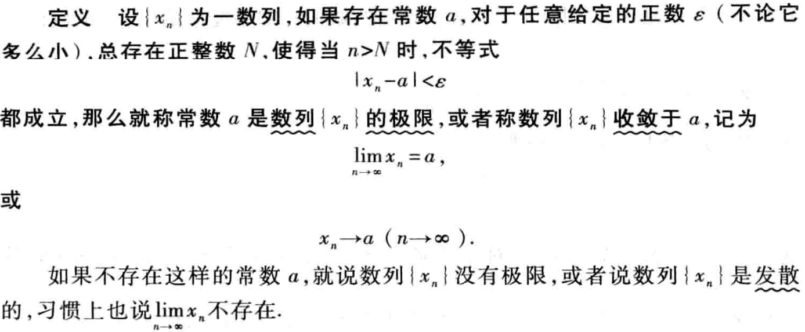

# 函数与极限

[toc]

## 1. 映射与函数

### 1.1 映射

#### 1.1.1 映射的概念

定义域：Domain，值域：Range，不是实数的R，映射不一定是实数。X,Y是非空集合，不一定是数字，可以是任何事物。

映射是集合到集合的关系，不管元素是什么都可以。

也就是说，Y中的所有元素不一定都能用上，但是X中的每个元素都要用上。

每个X中的元素 $x_i$ 与Y中的元素$y_i$一一对应，可得X、Y元素数量一样多。

#### 1.1.2 逆映射与复合映射

注意

​	1. 要求f是**单射**，单射才能定义逆映射

2. 要求$y\in R_f$而不是$Y$，因为Y中可能有部分元素没有使用上。

**设有两个映射**

注意：$R_g \subset D_f$

### 1.2 函数

#### 1.2.1 函数的概念

>  **$R$** 是实数集，R是实数的简写， $R_f$是值域，Range的简写

函数表示法：

- 表格法
- 图形法
- 解析式法/公式法

### 1.2 函数的几种特性

> $\forall$ 对于任意的， A倒过来， Any 
>
> $\exists$ 存在 E倒过来 exists

**上界和下界可以有很多个**

### 1.3 反函数和复合函数

### 1.4 函数的运算

### 1.5 初等函数

>  **无限次**相加不是初等函数

## 2. 数列的极限

### 2.1 数列极限的定义

