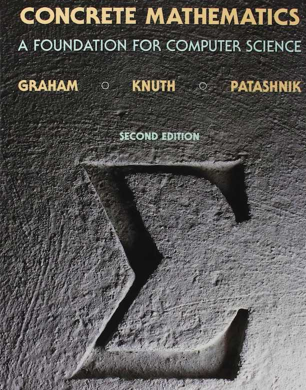

# 推荐教材

作者：Alfoil
链接：https://www.zhihu.com/question/36512716/answer/69017140
来源：知乎
著作权归作者所有。商业转载请联系作者获得授权，非商业转载请注明出处。

**高等数学或微积分：**

- Adrian Banner 的**《**[普林斯顿微积分读本](https://book.douban.com/subject/26899701/)**》**只有单变量微积分部分，可以作为参考【★★★★★】
- 《[托马斯微积分](https://book.douban.com/subject/1231399/)》，书非常厚, 介绍非常详细~【★★★★★】
- James Stewart 的《[Calculus Early Transcendentals 5th Ed](https://book.douban.com/subject/2298729/)》，作者靠这一本教材成为千万富翁的故事~
- Dale Varberg 的《[微积分](https://book.douban.com/subject/6822205/)》，看版本号就知道了……
- 龚昇的《[简明微积分](https://book.douban.com/subject/2025549/)》，编排很有新意。（顺道安利龚老的几本小册子：《话说微积分》、《微积分五讲》、《微积分杂谈》、《线性代数五讲》）【★★★★★】

“**更数学”（数学分析、实分析）：**

- 日本大数学家、菲尔兹奖得主小平邦彦的[《微积分入门（修订版）》](https://book.douban.com/subject/30387400/)，突出“严密”与“直观”的结合，重视数学中的“和谐”与“美感”，讲解新颖别致、自成体系。【★★★★★】
- 大数学家 Richard Courant (柯朗) 的《[微积分和数学分析引论](https://book.douban.com/subject/1281343/?i=0)》，世图也有出版的英文版影印版【★★★★★】
- 苏联菲赫金哥尔茨的《[微积分学教程](https://book.douban.com/subject/1707158/)》，三卷巨著，经典教材【★★★★★】
- 图灵社区引进翻译出版的新书《[普林斯顿数学分析读本](https://book.douban.com/subject/35172355/)》，与上面的《普林斯顿微积分读本》和下文的《普林斯顿概率论读本》同属一个系列【★★★★★】
- 特仑苏·陶哲轩的《[陶哲轩实分析](https://book.douban.com/subject/30227556/)》，不多说了，站在人类智商巅峰的男人【★★★★★】
- 分析学名著 ——Rudin 的《[数学分析原理](https://book.douban.com/subject/1230288/)》，被数学系学生称为 “Baby Rudin”
- 苏联数学家辛钦的《[数学分析八讲](https://book.douban.com/subject/26593890/)》，
- 已故北大教授张筑生的《[数学分析新讲](https://book.douban.com/subject/1130381/)》，国内教材佳作【★★★★★】
- 齐民友的[《重温微积分》](https://book.douban.com/subject/1239791/)，前武大校长齐民友教授力作

------

**线性代数：**

- MIT 教授 Gilbert Strang 的《[Introduction to Linear Algebra](https://book.douban.com/subject/26824921/)》，配合公开课 [Linear Algebra](http://ocw.mit.edu/courses/mathematics/18-06-linear-algebra-spring-2010/index.htm)（网易公开课有翻译），网上推荐这个公开课的一大堆，我就不多说了，最适合用来作为线代入门的，没有之一。【★★★★★】2019 年了，终于有国内的出版社引进了。清华大学出版社有第5版的影印版出版。老爷子另有一本《[Linear Algebra and Its Applications](https://book.douban.com/subject/2862541/)》，内容差不多。
- David C. Lay 的《[线性代数及其应用](https://book.douban.com/subject/30310517/)》，比 Strang 那本好的地方是有中文翻译 (囧)【★★★★★】
- 斯坦福 Stephen Boyd 的一本新书《[应用线性代数：向量、矩阵及最小二乘](https://book.douban.com/subject/35197538/)》，英文版有[公开的 PDF](https://web.stanford.edu/~boyd/vmls/vmls.pdf)。如果你看过 Boyd 的《凸优化》，这本书好不好，就不言而喻了【★★★★★】

“**更数学”（高等代数、矩阵论、数值线性代数）：**

- Sheldon Axler 的《[线性代数应该这样学 (Linear Algebra Done Right)](https://book.douban.com/subject/26886299/)》，很多人给没有线代基础的童鞋推荐这本书，我个人觉得这本书起点还是比较高的，而且缺少具象的应用例子，适合学过一遍之后用于加深理解【★★★★★】
- 有 "Done Right" 自然有 "Done Wrong"：《[Linear Algebra Done Wrong](http://www.math.brown.edu/~treil/papers/LADW/LADW.html)》，来自布朗大学教授 Sergei Treil，是公开的电子书
- 第三本《[线性代数及其应用](https://book.douban.com/subject/3309541/)》，来自大数学家 Peter D. Lax，比前两本 Linear Algebra and Its Applications 立意要高，难度要大……
- Horn 的赫赫有名的《[矩阵分析](https://book.douban.com/subject/1281543/)》，矩阵分析领域的圣经级著作，数学专业教材，内容比较庞杂……【★★★★★】
- Jan R. Magnus 的[《Matrix Differential Calculus with Applications in Statistics and Econometrics》](https://book.douban.com/subject/4706310/)，矩阵微积分专著，已经有第三版了【★★★★★】
- 清华教授张贤达的《[矩阵分析与应用](https://book.douban.com/subject/25811213/)》，实用向手册类教材【★★★★★】（教授2020年3月仙逝，缅怀……）
- Gene H. Golub (已故著名数值计算专家) 的被称为数值线性代数圣经的《[矩阵计算](https://book.douban.com/subject/5975393/)》【如果有用，★★★★★】

------

**概率论与数理统计：**

- 最优化领域的大师 Dimitri P. Bertsekas 的《[概率导论](https://book.douban.com/subject/26694188/)》，图灵社区出品【★★★★★】
- William Feller 的《[概率论及其应用](https://book.douban.com/subject/1785817/)》，书名里有“及其应用”就感觉很亲切有木有~~~
- Steven J. Miller《[普林斯顿概率论读本](https://book.douban.com/subject/35193606/)》，普林斯顿数学读本三剑客之一
- Sheldon M. Ross 的《[概率论基础教程](https://book.douban.com/subject/1803862/)》，大量的例题和习题，优秀的入门教材
- 哈佛大学 Joseph K.Blitzstein 的《[概率论导论](https://book.douban.com/subject/31195286/)》，有配套的公开课
- George Casella 的《[统计推断](https://book.douban.com/subject/4214656/)》【★★★★★】
- 陈希孺的《[概率论与数理统计](https://book.douban.com/subject/2201479/?from=tag)》、《[数理统计学教程 ](https://book.douban.com/subject/3996242/)》，行文优美，简直不像是数学教材【★★★★★】

包含随机过程相关内容的教材：

- A. Papoulis 的 [《概率、随机变量与随机过程》](https://book.douban.com/subject/15994890/)【★★★★★】

“**更数学”（有实变函数或测度论的内容）：**

- 著名概率学家 Kai Lai Chung (钟开莱) 的《[概率论教程》](https://book.douban.com/subject/4818683/)、《[初等概率论](https://book.douban.com/subject/4619399/)》
- 一本神书《[Probability Theory: The Logic of Science](https://book.douban.com/subject/3629804/)》，译名为《概率论沉思录》，暂时没有翻译（据说图灵社区准备出版译本，期待~）

------

**额外福利——数学科普类名著：**

- 由柯尔莫哥洛夫等苏联大数学家编写的科普名著《[数学：它的内容，方法和意义](https://book.douban.com/subject/1230328/)》【★★★★★】
- 上面提到的大数学家柯朗（Richard Courant）的《[什么是数学](https://book.douban.com/subject/1320282/)》【★★★★★】
- 菲利克斯·克莱因（Felix Klein，“克莱因瓶”那个德国大数学家）的《[高观点下的初等数学](https://book.douban.com/subject/3249247/)》【★★★★★】
- 美国数学史家莫里斯·克莱因（Morris Kline）的《[古今数学思想（新版）](https://book.douban.com/subject/25809761/)》【★★★★★】
- 莫里斯·克莱因的《[数学简史：确定性的消失](https://book.douban.com/subject/30296440/)》【★★★★★】
- 美国数学史家 William Dunham 的《[天才引导的历程：数学中的伟大定理](https://book.douban.com/subject/20453160/)》【★★★★★】
- William Dunham 的 《[微积分的历程：从牛顿到勒贝格](https://book.douban.com/subject/4904723/)》，学点数学史，看看那些数学大师的天才想法是怎么诞生的【★★★★★】

作者：250-1
链接：https://www.zhihu.com/question/35454260/answer/63794021
来源：知乎
著作权归作者所有。商业转载请联系作者获得授权，非商业转载请注明出处。

算法相关的数学书。。。“相关”两个字就是搞算法的人的大坑（根本没个头），一开始认为算法需要的只是一些实用的数学（这里微积分线性代数这些过于基础的就不说了），，，于是初等数论，组合数学，图论等等就出现了，这些数学知识相关的算法大部分是关于处理“数据结构”（等类似问题）那种问题（语言表达不好，不过这些问题很多是智力题）；后来才知道算法的应用场景才很大程度决定到底需要哪些数学，，，所以才是大坑！资源优化模型（“资源”不仅指物，也指人）经常需要运筹学，密码算法的设计很难不用到抽象代数（比起写一堆数论符号或矩阵表示来说，抽代那几个小巧玲珑的符号可爱太多了），图像算法数值计算算法的知识简直用到骨子里去了，人工智能或者机器学习或者数据挖掘的残暴程度几乎囊括所有基础数学与应用数学的基础知识，比如泛函分析，变分学，控制论，微分方程与动力系统以及相关的最优化理论（工程计算或者神经网络设计离不开这些），这些还只是分析学的范畴与延伸应用（范畴这个词只是通俗意思哦~），，，ML，AI，DM都很难离开统计学，，，统计学啊统计学，就不得不提到概率，，，我听过一些非数学专业的吐槽，为什么概率没了换成了测度？好处是离散型和连续型的随机变量不用分开讲了，麻烦是。。。你懂的，又要挖个坑埋新东西了。。。统计学，随机过程等延伸就不说了（类似的还有模糊数学与信息论，信息论必须了解一点，不然会脱离这个时代的），因为大家熟知的几何还没出现呢  几何这个东西吧，对很多人来讲，坐标系的引入和微积分的发展逐渐让人淡忘了还有这么一门学科，估计不少大学生对几何的认识只停留在中学几何和大学解析几何程度，毕竟微积分和线性代数实在太强大了，，，可惜啊，微积分和线性代数一结合处理的几何问题大多离不开与某种量的计算，也就是“可计算”量相关的问题，大声吼一句——几何还有什么？拓扑学出现，虽然不能完全认为拓扑学就是另一种几何学，但是这门课的最实用的地方我目前只能想到与几何相关的部分。。。基础拓扑学没啥计算，看起来和算法不太搭噶，，，不过基础的修补完了，拓扑学就会有新花样——微分拓扑和代数拓扑，，，搞算法的多少可能听过流形学习（manifold learning）这个概念吧，这也算是近年来比较伟大的产物了，据我了解可能是本世纪才真正茁壮发展的东西。。。前面的那些数学学科不够过瘾的话，就来玩玩这些拓扑课吧，流形作为最实用的拓扑空间已经渐渐在机器学习界占据了不小的地位，特别是图像算法，怎么用尽情百度吧，只有你想不到的，没有它用不到的~微分流形的一大好处是其上存在度量，于是就有可计算的花样，嗯没错，微分几何可以推广了（有些微分几何课只是微积分课程的几何延伸，难度不足以虐人，体现不出数学的博大精深），感谢微分几何可以推广，不然就没有广义相对论这么伟大的东西了，几何还没完，不加点代数不过瘾，数学就是这么前仆后继，李群（Lie group）和李代数闪亮登场，它俩不是人，但能虐人！我记得有本国产书籍《李群机器学习》，里面大致介绍了一些李群李代数在机器学习中的应用，同时包含了Finsler几何（好像还有Riemannian几何）的应用，那本书内容丰富，还有同调代数和范畴论的理论以及应用（这个范畴才是代数里的范畴~），这个同调代数建议学完代数拓扑（里面有同调代数）再了解吧，前者还是能给出一些同调的直观理解，对学习纯代数有帮助的。。。说了这么多，其实还没完，刚刚提到了一点物理，又得挖个坑了，搞基础计算机科学与算法的肯定要了解计算理论，什么DNA计算，膜计算以及最近几年很火的量子计算，，，这个量子计算，就我浅薄的理解，等于披着物理羊皮的数学狼，相关算法实在太多。。。搞算法研究的人用到的数学都是千奇百怪，我一个研究生搞量子控制的朋友只是简单地说了一些张量代数与李代数等等经常用到的概念，另一个研究生搞细胞自动机的朋友告诉了我经常会用到拓扑动力系统与符号动力系统的知识，废话就不多说了~~

综上所述，你想搞算法搞得越深，数学就越是无底洞（相信很多算法工程师一定有这个感觉）。其他领域不了解，算法设计分析这一块的东西深究到底就是数学，想玩好就要学数学，，，你真正要学的不是算法，而是数学，而且永远学不够，你要用一种雄壮的感觉，因为算法的深入会直接为你背上人类文明最耀眼的光芒之一——数学！

PS：有些冷门的数学分支一样很有用，数理逻辑就是其中之一，计算理论和数理逻辑关系很大，，，哦哦，还有泛代数(universal algebra)，反正我觉得这门课挺有趣的，还有很多，我说的只是冰山一角，坐等各路大神发言~

最后，年轻人加油！！！

离散数学及其应用

Concrete Mathematics 

![img](resources/adbcd6d400be8274aabb67ea04ed79d8_r.jpg

sigma as hardcore as you can.

作者：暮山
链接：https://www.zhihu.com/question/35454260/answer/64772140
来源：知乎
著作权归作者所有。商业转载请联系作者获得授权，非商业转载请注明出处。

看看《具体数学》这本书吧，写的是与计算机相关的数学

离散数学及其应用，组合数学。

概率论与数理统计，矩阵分析，微积分，图论，凸优化，运筹学。

https://zhuanlan.zhihu.com/p/144769910

https://zhuanlan.zhihu.com/p/146176683

http://www.huaxiaozhuan.com/%E6%95%B0%E5%AD%A6%E5%9F%BA%E7%A1%80/chapters/1_algebra.html

http://www.huaxiaozhuan.com/%E6%95%B0%E5%AD%A6%E5%9F%BA%E7%A1%80/chapters/2_probability.html

https://zhuanlan.zhihu.com/p/85443994

https://zhuanlan.zhihu.com/p/140551711

https://mp.weixin.qq.com/mp/homepage?__biz=MzI2MDU3OTgyOQ==&hid=1&sn=8fd2e718341c2dfb59493084c3ed7a76&scene=18#wechat_redirect

https://zhuanlan.zhihu.com/p/140551711
