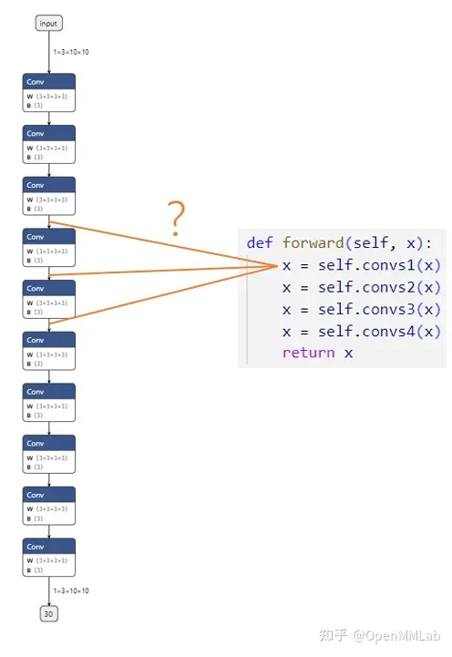
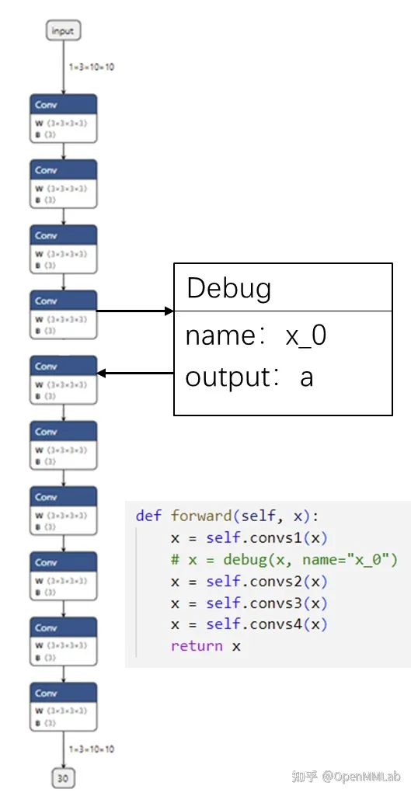
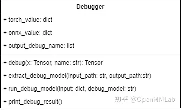
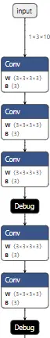
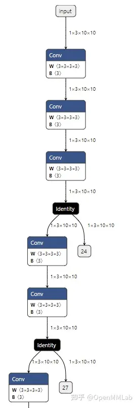
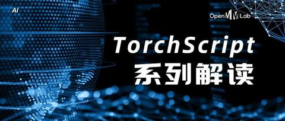

# 模型部署入门教程（六）：实现 PyTorch-ONNX 精度对齐工具

久等啦！模型部署入门教程更新啦！前几期教程中，我们系统学习了 PyTorch & ONNX 相关知识。大家或许学会了许多 API 用法，却不清楚怎么用到自己的项目中。今天，我们来综合之前学到的，实现一个 PyTorch-ONNX 精度对齐工具。

精度对齐，是模型部署中重要的一个环节。在把深度学习框架模型转换成中间表示模型后，部署工程师们要做的第一件事就是精度对齐，确保模型的计算结果与之前相当。精度对齐时最常用的方法，就是使用测试集评估一遍中间表示模型，看看模型的评估指标（如准确度、相似度）是否下降。

而在 PyTorch 到 ONNX 这条部署路线上，这种精度对齐方式有一些不便：一旦我们发现 PyTorch 模型和 ONNX 模型的评估指标有了出入，我们很难去追踪精度是在哪一个模块出了问题。这是因为 PyTorch 和 ONNX 模块总是难以对应。如下面的例子所示：



假设我们现在有一个由很多卷积块 `convs1, convs2...` 组成的网络，我们想对齐 PyTorch 模型和 ONNX 模型的精度。第一步，我们想比较第一个卷积块的输出 `x = self.convs1(x)`。模块在PyTorch 模型中的输出可以很轻松地得到，可是，这个输出究竟对应 ONNX 模型里的哪一个输出呢？在小模型里，我们或许能够通过阅读 PyTorch 模型的源码，推断出每个 ONNX 模块与 PyTorch 模块的对应关系；但是，在大模型中，我们是难以建立 PyTorch 与 ONNX 的对应关系的。

在这篇教程中，我们就来利用之前学过的自定义算子、子模型提取等工具，实现一个简单的 PyTorch-ONNX 精度对齐工具。

## 设计思路

为了把 PyTorch 和 ONNX 模块对应起来，我们可以使用一种储存了调试信息的自定义算子，如下图所示：




我们可以定义一个叫做 `Debug` 的 ONNX 算子，它有一个属性调试名 `name`。而由于每一个 ONNX 算子节点又自带了输出张量的名称，这样一来，ONNX 节点的输出名和调试名绑定在了一起。我们可以顺着 PyTorch 里的调试名，找到对应 ONNX 里的输出，完成 PyTorch 和 ONNX 的对应。

比如在上图的例子中，我们把第一个卷积块输出 `x=self.convs1(x)` 接入一个带有调试名 `x_0` 的调试算子。在最后生成的 ONNX 模型中，假设调试名 `x_0` 对应的输出张量叫做 `a`。知道了这一信息后，我们只需要先运行一遍 PyTorch 模型，记录第一个卷积块的输出；再运行一遍 ONNX 模型，用[上篇教程](https://zhuanlan.zhihu.com/p/516920606)中提到的截取 ONNX 中间结果的方法，记录中间张量 `a` 的值。这样，我们就可以对齐某 PyTorch 模块和它对应的 ONNX 模块的输出了。

## 代码实现

### Debug 算子


首先，我们需要实现之前提到的 Debug 算子：

```python
import torch 
 
class DebugOp(torch.autograd.Function): 
    @staticmethod 
    def forward(ctx, x, name): 
        return x 
 
    @staticmethod 
    def symbolic(g, x, name): 
        return g.op("my::Debug", x, name_s=name) 
 
debug_apply = DebugOp.apply 
```


Debug 算子的调用接口有两个参数：输入张量 `x` 和调试名 `name`。为了把这个算子“伪装”成一个普通的算子，使之能正常地参与推理、构建计算图的操作，我们还是需要正确定义对输入 `x` 进行操作的 `forward` 函数。而在表示 PyTorch 与 ONNX 映射规则的 `symbolic` 函数里，我们要定义一个带有调试名的 ONNX 算子，并把输入的 `name` 传给算子。

由于 Debug 算子本身不表示任何计算，因此在 `forward` 函数中，直接把输入 `x` 返回即可。

而 `symbolic` 函数定义了一个新算子 `my::Debug`：算子有一个输入 `x`，一个属性 `name`。我们直接把算子调用接口里的 `x`，`name` 传入即可。

这里需要补充介绍算子定义函数 `g.op()` 的一些规范。在`g.op()`中，算子的属性需要以 `{attibute_name}_{type}=attibute_value` 这样的格式传入。其中 `{attibute_name}` 为属性名，`{type}` 指定了算子属性的数据类型。比如说我们上面的算子属性写成 `name_s`，实际上是定义了一个字符串类型，名字叫做 `name` 的属性。除了表示字符串类型的 `_s` 外，还有表示 `float` 型的 `_f`，表示 `tensor` 型的 `_t`。

在完成算子的定义后，我们可以通过 `debug_apply = DebugOp.apply` 获取算子的调用接口。这样以后就可以通过 `debug_apply(x, name)` 来使用这个算子了。

> 如果对 torch.autograd.Function 的用法不熟，欢迎回顾[第四篇教程](https://zhuanlan.zhihu.com/p/513387413)。

###  Debugger 类


接着，我们来实现精度对齐工具的核心——Debugger 类。这个类包含了实现精度对齐所需的所有操作。其定义如下：



Debugger 类有三个成员变量：

- `torch_value` 记录了运行 PyTorch 模型后每个调试张量的值。
- `onnx_value` 记录了运行 ONNX 模型后每个调试张量的值。
- `output_debug_name` 记录了把调试张量加入 ONNX 的输出后，每个输出张量的调试名。

稍后我们会在类实现的代码里看到这些成员变量的具体用法。

Debugger 类有以下方法：

- `debug` 封装了之前编写好的 `debug_apply`。该方法需要在原 PyTorch 模型中调用，可以为导出的 ONNX 模型添加 Debug 算子节点，同时记录 PyTorch 调试张量值。
- `extract_debug_model` 和 ONNX 的子模型提取函数的用法类似，可以把带调试节点的 ONNX 模型转化成一个可以输出调试张量的 ONNX 模型。
- `run_debug_model` 会使用 ONNX Runtime 运行模型，得到 ONNX 调试张量值。
- `print_debug_result` 会比较 PyTorch 和 ONNX 的调试张量值，输出比较的结果。

这 4 个方法会依次被调用。下面我们来具体探究一下每个方法的实现。

### 生成调试节点

```python
def debug(self, x, name): 
    self.torch_value[name] = x.detach().cpu().numpy() 
    return debug_apply(x, name) 
```

如前文所述，`debug`完成了两件事：记录 PyTorch 模型中调试张量的值、添加 Debug 节点。我们使用 `self.torch_value[name] = x.detach().cpu().numpy()` 把调试张量转成 numpy 格式并保存进 `torch_value` 词典里。之后，我们调用之前编写的 `debug_apply` 算子。

###  提取调试模型

```python
def extract_debug_model(self, input_path, output_path): 
    model = onnx.load(input_path) 
    inputs = [input.name for input in model.graph.input] 
    outputs = [] 
 
    for node in model.graph.node: 
        if node.op_type == 'Debug': 
            # 记录调试张量名 
            debug_name = node.attribute[0].s.decode('ASCII') 
            self.output_debug_name.append(debug_name) 
 
            # 添加输入 
            output_name = node.output[0] 
            outputs.append(output_name) 
 
            # 转换 Debug 节点为 Indentity 节点 
            node.op_type = 'Identity' 
            node.domain = '' 
            del node.attribute[:] 
 
    e = onnx.utils.Extractor(model) 
    extracted = e.extract_model(inputs, outputs) 
    onnx.save(extracted, output_path) 
```

在 PyTorch 模型中插入 `debug` 方法后，我们可以得到一个包含了若干 Debug 节点的 ONNX 模型。但是，这个 ONNX 模型不是我们最终拿来执行的模型。为了得到 Debug 节点的输出（即调试张量的值），我们需要做三项处理以提取出一个可运行的调试模型：

1. 记录每个调试张量的调试名，为之后对齐 PyTorch、ONNX 调试张量值做准备。
2. 把所有 Debug 节点的输出加入到整个模型的输出中，这样在运行模型后就能得到这些中间节点的输出了。
3. 自定义的 Debug 节点在推理引擎中是没有实现的，为了让处理后的 ONNX 模型运行起来，需要把 Debug 节点转化成可运行的 Identity （恒等）节点。

完成了这三项处理后，我们才能进行模型提取。下面，我们来看看模型提取和这几项处理是怎么实现的。
首先，看一下和模型提取有关的代码：

```python
model = onnx.load(input_path) 
inputs = [input.name for input in model.graph.input] 
outputs = [] 
 
# 获取 outputs 
... 
 
# 调用提取模型 API 
e = onnx.utils.Extractor(model) 
extracted = e.extract_model(inputs, outputs) 
 
# 保存模型 
onnx.save(extracted, output_path) 
```


在提取模型时，我们要准备新模型的输入和输出。输入张量 `inputs` 还是保持原状，而输出张量 `outputs` 会在之后填入 Debug 节点的输出。获取完 `outputs` 后，我们调用提取模型的 API，得到处理过后的模型，并保存此模型。

接着，看一下主处理逻辑：

```python
for node in model.graph.node: 
    if node.op_type == 'Debug': 
        ... 
```

为了获取和 Debug 节点相关的信息，我们需要遍历 ONNX 模型的所有节点，找出那些类型为 `Debug` 的节点，并对这些节点执行操作。

下面的代码实现了记录调试张量名：

```text
debug_name = node.attribute[0].s.decode('ASCII') 
self.output_debug_name.append(debug_name) 
```

这段代码的作用是：从节点的第一个属性（即 `name` )中取出调试名信息，并存入 `output_debug_name` 中。节点第一个属性的值可以通过 `node.attribute[0]` 获得。由于 `name` 是属性是字符串，这里要用 `.s` 获取属性的字符串值。又由于 ONNX 是以二进制的形式保存所有数据的，这里要用 `.decode('ASCII')` 把二进制字符串转成一个文本字符串。

接下来的代码用于填写新模型输出 `outputs`：

```python
output_name = node.output[0] 
outputs.append(output_name) 
```


`node.output[0]` 就是 Debug 节点的输出张量在 ONNX 里的名称。把这个名称加入新模型的输出后，只要运行新模型，就可以得到该输出张量的值了。

最后这段代码用于更改 Debug 节点的类型：

```python
node.op_type = 'Identity' 
node.domain = '' 
del node.attribute[:] 
```

为了消除 ONNX 不支持的 Debug 节点，一种比较简单的方式是直接把 Debug 节点修改成不执行任何操作的 `Indentity` 类型的节点。为了做这个转换，我们要先修改节点类型名 `node.op_type` 为`Identity`，再把节点的域（即命名空间）`node.domain` 修改成空，最后删除节点的所有属性，保证节点符合 ONNX 的规范。
回忆一下，如果一个节点的 `domain` 为空，这个节点就会被当成一个 ONNX 原生算子节点。

###  运行调试模型

在生成调试节点时，我们已经顺便记录了 PyTorch 模型调试张量的值。下一步，我们要运行调试模型，记录 ONNX 模型调试张量的值。其实现如下：

```python
def run_debug_model(self, input, debug_model): 
    sess = onnxruntime.InferenceSession(debug_model,  
    providers=['CPUExecutionProvider']) 
    onnx_outputs = sess.run(None, input) 
 
    for name, value in zip(self.output_debug_name, onnx_outputs): 
        self.onnx_value[name] = value 
```

在运行调试模型前，我们要给出模型输入、模型名这两个参数。根据这些参数，`run_debug_model` 会调用 ONNX Runtime 的 API，对 ONNX 模型进行推理。在得到了 ONNX 模型的输出后，我们要使用上一步得到的 `output_debug_name` 信息，填写 `onnx_value`，把 ONNX 的中间运算结果绑定到调试名上。完成了这些步骤之后，我们就有足够的信息做精度对齐了。

### 输出调试信息

```python
 def print_debug_result(self): 
    for name in self.torch_value.keys(): 
        if name in self.onnx_value: 
            mse = np.mean(self.torch_value[name] - self.onnx_value[name])**2) 
            print(f"{name} MSE: {mse}") 
```

最后，我们同时遍历 `self.torch_value` 和 `self.onnx_value` 这两个词典，比较同一个张量在 PyTorch 模型和 ONNX 模型里的输出。在循环体中，我们只需要使用 `self.torch_value[name]` 和 `self.onnx_value[name]` 就可以访问同一个张量在 PyTorch 里的值和在 ONNX 里的值。作为示例，这里我们可以计算二者的均方误差 `mse`，以此为精度对齐的依据。

整理一下，整个工具库的代码如下：

```python
import torch 
import onnx 
import onnxruntime 
import numpy as np 
 
class DebugOp(torch.autograd.Function): 
    @staticmethod 
    def forward(ctx, x, name): 
        return x 
 
    @staticmethod 
    def symbolic(g, x, name): 
        return g.op("my::Debug", x, name_s=name) 
 
debug_apply = DebugOp.apply 
 
class Debugger(): 
    def __init__(self): 
        super().__init__() 
        self.torch_value = dict() 
        self.onnx_value = dict() 
        self.output_debug_name = [] 
 
    def debug(self, x, name): 
        self.torch_value[name] = x.detach().cpu().numpy() 
        return debug_apply(x, name) 
 
    def extract_debug_model(self, input_path, output_path): 
        model = onnx.load(input_path) 
        inputs = [input.name for input in model.graph.input] 
        outputs = [] 
 
        for node in model.graph.node: 
            if node.op_type == 'Debug': 
                debug_name = node.attribute[0].s.decode('ASCII') 
                self.output_debug_name.append(debug_name) 
 
                output_name = node.output[0] 
                outputs.append(output_name) 
 
                node.op_type = 'Identity' 
                node.domain = '' 
                del node.attribute[:] 
        e = onnx.utils.Extractor(model) 
        extracted = e.extract_model(inputs, outputs) 
        onnx.save(extracted, output_path) 
 
    def run_debug_model(self, input, debug_model): 
        sess = onnxruntime.InferenceSession(debug_model,  
        providers=['CPUExecutionProvider']) 
 
        onnx_outputs = sess.run(None, input) 
        for name, value in zip(self.output_debug_name, onnx_outputs): 
            self.onnx_value[name] = value 
 
    def print_debug_result(self): 
        for name in self.torch_value.keys(): 
            if name in self.onnx_value: 
                mse = np.mean(self.torch_value[name] - self.onnx_value[name])**2) 
                print(f"{name} MSE: {mse}") 
```

###  使用方法

实现了精度对齐工具后，我们来看看该怎么把这个工具用起来。

现在，假设我们得到了一个这样的模型：

```text
class Model(torch.nn.Module): 
 
    def __init__(self): 
        super().__init__() 
        self.convs1 = torch.nn.Sequential(torch.nn.Conv2d(3, 3, 3, 1, 1), 
                                          torch.nn.Conv2d(3, 3, 3, 1, 1), 
                                          torch.nn.Conv2d(3, 3, 3, 1, 1)) 
        self.convs2 = torch.nn.Sequential(torch.nn.Conv2d(3, 3, 3, 1, 1), 
                                          torch.nn.Conv2d(3, 3, 3, 1, 1)) 
        self.convs3 = torch.nn.Sequential(torch.nn.Conv2d(3, 3, 3, 1, 1), 
                                          torch.nn.Conv2d(3, 3, 3, 1, 1)) 
        self.convs4 = torch.nn.Sequential(torch.nn.Conv2d(3, 3, 3, 1, 1), 
                                          torch.nn.Conv2d(3, 3, 3, 1, 1), 
                                          torch.nn.Conv2d(3, 3, 3, 1, 1)) 
 
    def forward(self, x): 
        x = self.convs1(x) 
        x = self.convs2(x) 
        x = self.convs3(x) 
        x = self.convs4(x) 
        return x 
 
torch_model = Model() 
```


没错！这就是本文开头展示的那个全卷积网络。现在我们想对齐 `convs1` 至 `convs4` 这每一个卷积块的输出精度，该怎么使用之前写好的精度对齐工具呢？

首先，我们生成管理类 `Debugger` 的一个实例：

```python
debugger = Debugger() 
```


之后，我们要设法把 Debug 节点插入原模型：

```python
from types import MethodType 
 
def new_forward(self, x): 
    x = self.convs1(x) 
    x = debugger.debug(x, 'x_0') 
    x = self.convs2(x) 
    x = debugger.debug(x, 'x_1') 
    x = self.convs3(x) 
    x = debugger.debug(x, 'x_2') 
    x = self.convs4(x) 
    x = debugger.debug(x, 'x_3') 
    return x 
 
torch_model.forward = MethodType(new_forward, torch_model) 
```

我们可以为原模型新写一个 `forward` 函数。在这个新的函数函数中，我们可以通过 `debugger.debug` 把每一个输出张量标记起来，并各取一个不重复的调试名。

有了 `new_forward` 函数，我们需要使用 `MethodType` 这个 Python API 把这个函数变成模型实例 `torch_model` 的一个成员方法，确保 `torch_model` 的 `forward` 函数能够被正确替换。

实现了”狸猫换太子“般巧妙的操作后，我们就可以使用 PyTorch API 导出一个带有 Debug 节点的 ONNX 模型了：

```python
dummy_input = torch.randn(1, 3, 10, 10) 
torch.onnx.export(torch_model, dummy_input, 'before_debug.onnx', input_names=['input']) 
```

由于 `torch.onnx.export` 模型使用的是跟踪法，模型的 `forward` 函数会被执行一次， `debugger.debug` 操作可以把 PyTorch 模型的调试张量输出记录在 `debugger.torch_value` 里。

这个 `before_debug.onnx` 模型的部分可视化结果如下：



接下来，我们替换掉所有 Debug 节点，并记录每个 Debug 输出张量的 ONNX 名与调试名的对应关系：

```python
debugger.extract_debug_model('before_debug.onnx', 'after_debug.onnx') 
```

这步操作得到的 `after_debug.onnx` 模型的部分可视化结果如下：



我们可以使用下面的代码运行这个模型：

```text
debugger.run_debug_model({'input':dummy_input.numpy()}, 'after_debug.onnx') 
```

这样，ONNX 模型的调试张量输出会记录在 `debugger.onnx_value` 里。

总算，一切准备工作结束了。我们可以轻轻松松地用一行代码输出精度对齐的结果：

```python
debugger.print_debug_result() 
```

这个函数大致会输出以下内容：

```python
x_0 MSE: 8.465450562766819e-16  
x_1 MSE: 1.4122021817221354e-16  
x_2 MSE: 6.501743508551734e-17  
x_3 MSE: 1.7635199492054931e-16 
```

这份输出表明，在这一轮精度对齐测试中，所有模块的精度误差都很小。我们几乎可以认为，ONNX 模型的运行结果等价于 PyTorch 模型的运行结果。

如果有某些模块的误差比较大，我们可以深入子模块，去加更多的 debug 节点，看看是哪一步、哪一个算子出现了问题。

## 总结


基于前几篇教程中的知识，本文我们介绍了一个与 PyTorch 转 ONNX 相关的实战项目。相信通过这个项目，大家既巩固了之前学过的 ONNX 相关知识，又获得了一个在模型部署中十分实用的工具，可谓是收获颇丰。让我们再一起回顾下本文用到了之前教程中的哪些知识：

- [教程（三）：PyTorch 转 ONNX 详解](https://zhuanlan.zhihu.com/p/498425043)

- - 在 ONNX 文档里查找 `Identity`算子的定义。
  - `torch.onnx.export`的调用方法。
  - `torch.onnx.export`默认使用跟踪法生成 ONNX 文件。


- [教程（四）：在 PyTorch 中支持更多 ONNX 算子](https://zhuanlan.zhihu.com/p/513387413)

- - 使用 `torch.autograd.Function`实现自定义 ONNX 算子 `my::Debug`。


- [教程（五）：ONNX 模型的修改与调试](https://zhuanlan.zhihu.com/p/516920606)

- - 利用子模型提取输出 ONNX 模型的中间张量值。
  - 访问、修改 ONNX 模型中的节点。

其实，这篇教程提到的精度对齐工具还有很大的优化空间，比如：

- 现在测试输入`dummy_input`不太方便管理，能不能优化它的管理逻辑？
- 现在我们默认是用 ONNX Runtime 执行 ONNX 模型，可否拓展到其他后端？
- 能不能把无效的 Identity 节点从调试模型中删除？

如果大家学有余力，可以动手开发出一个更强大的精度对齐工具，并把它用到生产实践中。

学完这些教程后，相信大家对 ONNX 已经有了一个比较全面的认识，知道在模型部署中如何应用 ONNX，并学会如何去解决 ONNX 相关的报错。至此，我们对 ONNX 的介绍就结束了。 敬请期待我们之后的内容哦~


**码字不易，如果觉得对你有帮助，欢迎给我们点个赞呀~也欢迎大家来 MMDelpoy 体验**

[https://github.com/open-mmlab/mmdeploygithub.com/open-mmlab/mmdeploy](https://github.com/open-mmlab/mmdeploy)

## 系列传送门

[OpenMMLab：模型部署入门教程（一）：模型部署简介172 赞同 · 22 评论文章213 赞同 · 24 评论文章764 赞同 · 58 评论文章](https://zhuanlan.zhihu.com/p/477743341)

[OpenMMLab：模型部署入门教程（二）：解决模型部署中的难题77 赞同 · 22 评论文章89 赞同 · 27 评论文章274 赞同 · 45 评论文章](https://zhuanlan.zhihu.com/p/479290520)

[OpenMMLab：模型部署入门教程（三）：PyTorch 转 ONNX 详解131 赞同 · 25 评论文章146 赞同 · 32 评论文章484 赞同 · 71 评论文章](https://zhuanlan.zhihu.com/p/498425043)

[OpenMMLab：模型部署入门教程（四）：在 PyTorch 中支持更多 ONNX 算子68 赞同 · 19 评论文章80 赞同 · 28 评论文章257 赞同 · 72 评论文章](https://zhuanlan.zhihu.com/p/513387413)

[OpenMMLab：模型部署入门教程（五）：ONNX 模型的修改与调试86 赞同 · 4 评论文章115 赞同 · 10 评论文章305 赞同 · 35 评论文章](https://zhuanlan.zhihu.com/p/516920606)

[OpenMMLab：TorchScript 解读（一）：初识 TorchScript83 赞同 · 10 评论文章106 赞同 · 15 评论文章342 赞同 · 24 评论文章](https://zhuanlan.zhihu.com/p/486914187)

[OpenMMLab：TorchScript 解读（二）：Torch jit tracer 实现解析39 赞同 · 2 评论文章46 赞同 · 2 评论文章109 赞同 · 7 评论文章](https://zhuanlan.zhihu.com/p/489090393)

[OpenMMLab：TorchScript 解读（三）：jit 中的 subgraph rewriter24 赞同 · 0 评论文章29 赞同 · 0 评论文章55 赞同 · 0 评论文章](https://zhuanlan.zhihu.com/p/493955209)

[OpenMMLab：TorchScript 解读（四）：Torch jit 中的别名分析7 赞同 · 0 评论文章14 赞同 · 0 评论文章33 赞同 · 1 评论文章](https://zhuanlan.zhihu.com/p/530242380)


编辑于 2022-07-20 19:10