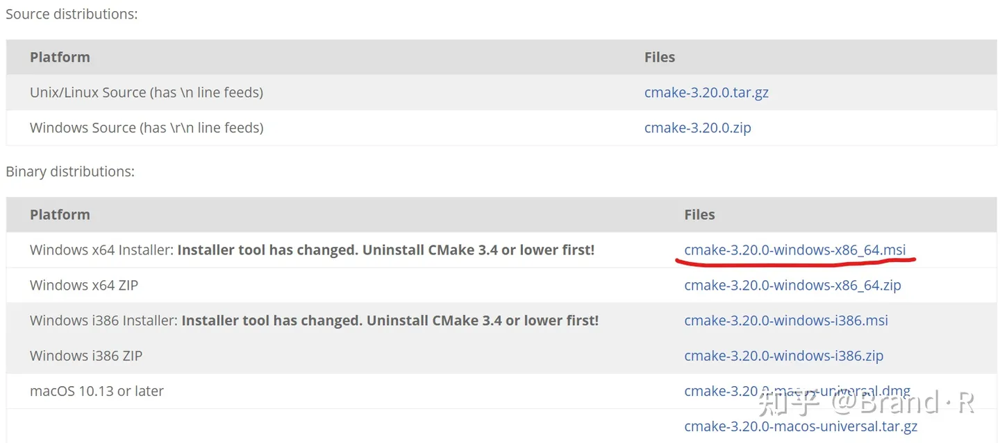
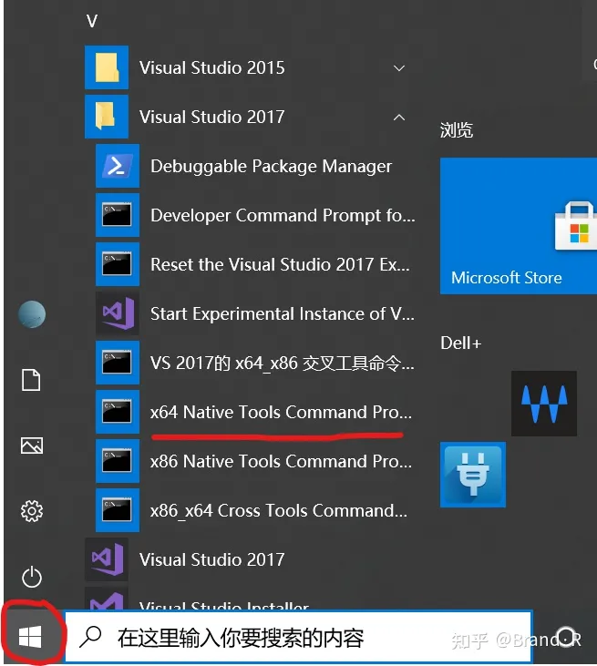
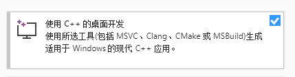
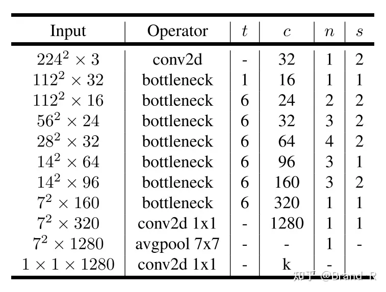
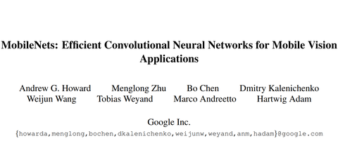

# 深度学习(DL)部署方案（一） Pytorch->onnx->ncnn【win10+vs2017】

**前言**

在目标检测、图像分类等领域，相对于传统的算法来说，深度学习占据绝对优势。然而其巨大的计算量及内存消耗又使得难以部署在移动设备。因此近几年有很多将深度学习落地的研究及成果出现，本文主要实现将pytorch的模型转为ncnn模型并实现在windows+vs2017环境下运行。需要说明的是，整个实验按照我的流程是没问题，如果你改动了一些东西，我也不能保证能成功。

**1、实验配置环境**

操作系统: windows(x64)10

编译软件：Pycharm（解释器：python3.7.6）、VS2017

相关库文件：torch1.8.1+cu102、torchvision0.9.1+cu102、PIL、tqdm、onnx、 onnxruntime、onnx-simplifier

其它配置：opencv3.4.6、cmake3.20、protobuf-3.4.0、ncnn

**2、实验基本流程说明**

1. 通过pytorch框架实现mobilenetv2网络猫狗分类任务。
2. 利用torch.onnx将训练好的模型mobilenetv2.pth转化为mobilenetv2.onnx。
3. 利用onnx-simplifier简化mobilenetv2.onnx。
4. 通过ncnn将mobilenetv2.onnx转化为mobilenetv2.param和mobilenetv2.bin。
5. vs2017环境下载入mobilenetv2.param和mobilenetv2.bin完成分类任务。

**3、环境配置说明**

1. 实验在windows10下进行。
2. 实验首先需要完成一个简单的目标分类任务，所以关于深度学习的一些基本配置应该满足，比如安装好较新的torch版本及torchvision，太老版本的好多功能没有，以及英伟达相应的CUDA、cuDNN版本，这些去官网下载安装即可。
3. 提前安装好Visual Studio Community 2017 及以上和opencv，官网安装噢。
4. 以上完成后通过pip命令安装tqdm、onnx、onnxruntime、onnx-simplifier。

```text
pip install tqdm
pip install onnx onnxruntime onnx-simplifier
```

5. 下载 protobuf-3.4.0 [https://github.com/google/protobuf/archive/v3.4.0.zip](https://link.zhihu.com/?target=https%3A//github.com/google/protobuf/archive/v3.4.0.zip) ，同时下载安装好cmake（官网[Download | CMake](https://link.zhihu.com/?target=https%3A//cmake.org/download/) ），下一步会用到。强调下**5、6、7**三步的安装也可参考官网哈：（[how to build · Tencent/ncnn Wiki (github.com)](https://link.zhihu.com/?target=https%3A//github.com/Tencent/ncnn/wiki/how-to-build%23build-for-windows-x64-using-visual-studio-community-2017)）



6. 在windows开始菜单栏中依此找到: `Start → Programs → Visual Studio 2017 → Visual Studio Tools → x64 Native Tools Command Prompt for VS 2017` 点击进入后依此输入以下命令，就是如下地方哈：



```text
> cd <protobuf-root-dir>
> mkdir build
> cd build
> cmake -G"NMake Makefiles" -DCMAKE_BUILD_TYPE=Release -DCMAKE_INSTALL_PREFIX=%cd%/install -Dprotobuf_BUILD_TESTS=OFF -Dprotobuf_MSVC_STATIC_RUNTIME=OFF ../cmake
> nmake
> nmake install
```

注：<protobuf-root-dir> 表示你的protobuf-3.4.0所在的目录，其它类似。mkdir build就是在当前目录建立一个名为build的文件夹，如果已有此文件夹或者不能成功换个名字也可，如：mkdir newbuild等等。**如果更换名字以后对应的目录名都要改噢**！能不换最好别换。

7. 上一步成功之后去ncnn官网将ncnn下载下来，安装了git可直接使用命令下载ncnn：

```text
git clone https://github.com/Tencent/ncnn.git
```

然后依此在vs对应的命令行下输入如下命令：

```text
> cd <ncnn-root-dir>
> mkdir -p build
> cd build
> cmake -G"NMake Makefiles" -DCMAKE_BUILD_TYPE=Release -DCMAKE_INSTALL_PREFIX=%cd%/install -DProtobuf_INCLUDE_DIR=<protobuf-root-dir>/build/install/include -DProtobuf_LIBRARIES=<protobuf-root-dir>/build/install/lib/libprotobuf.lib -DProtobuf_PROTOC_EXECUTABLE=<protobuf-root-dir>/build/install/bin/protoc.exe -DNCNN_VULKAN=OFF .. -DOpenCV_DIR=C:/opencv/opencv/build
> nmake
> nmake install
```

注：上面需要改的路径不要看漏了，这之前你应该已经安装好opencv了，上面命令最长的那一个结尾处就是需要依赖opencv噢，这句和官网有点不一样，官网-DNCNN_VULKAN=ON我的是-DNCNN_VULKAN=OFF，官网那个安装我不能成功，换成OFF就成功了。到此安装部分基本完成，下面还需要将opencv、 protobuf-3.4.0、ncnn配置到VS中，也就是包含目录，库目录，附加依赖项那些东西，这部分也可以到后面在配置。

1）在VS工程对应的在**包含目录**中依次添加如下内容：

```text
<opencv-root-dir>/build/include 
<opencv-root-dir>/build/include/opencv 
<opencv-root-dir>/build/include/opencv2 
<ncnn-root-dir>/build/install/include/ncnn
<protobuf-root-dir>/build/install/include 
```

2）在**库目录**中依次添加如下内容：

```text
<opencv-root-dir>/build/x64/vc15/lib
<ncnn-root-dir>/build/install/lib
<protobuf-root-dir>/build/install/lib
```

注：上面指令中的<protobuf-root-dir>表示其根目录，其他类似。上面的路径都有build这个文件夹，所以你如果之前改动了，这儿也需要改动。

3）在**附加依赖项**中依次添加如下内容：

```text
ncnn.lib
libprotobuf.lib
opencv_world346.lib 
```

注：我的是opencv3.4.6，所以添加opencv_world346.lib ，根据自己的版本来。对于opencv在vs的配置其实可以看看官网，了解下全局配置和局部配置的区别，也方便以后运用，这里就不多说了，放个链接吧： [OpenCV: How to build applications with OpenCV inside the "Microsoft Visual Studio"](https://link.zhihu.com/?target=https%3A//docs.opencv.org/master/dd/d6e/tutorial_windows_visual_studio_opencv.html)

本部分配置也可参考如下：

[（一）ncnn | Windows10 + VS2019环境配置blog.csdn.net/Skies_/article/details/109318667](https://link.zhihu.com/?target=https%3A//blog.csdn.net/Skies_/article/details/109318667)

到此安装配置基本完成了。**需要注意的是，在VS2017的运行窗口栏处依次选择Release和x64，与上面的选择对应。**这个后面还会再提。

**4、Pytorch实现mobilenetv2猫狗分类任务**

本文实验主要是实现mobilenetv2分类任务，所以首要任务是理解mobilenetv2网络结构及实现。其基本结构如下图所示：



注：此部分详细理解可参考此文：

[R.JD：轻量级神经网络“巡礼”（二）—— MobileNet，从V1到V31873 赞同 · 107 评论文章](https://zhuanlan.zhihu.com/p/70703846)

Mobilenetv2网络实现代码如下：

```text
import torch
from config import opt
from torch import nn
from torch.nn import functional as F


class Bottleneck(nn.Module):
    def __init__(self, inchannel, outchannel, stride=1, t=1):
        super(Bottleneck, self).__init__()
        self.stride = stride
        self.inchannel = inchannel
        self.outchannel = outchannel
        self.one_conv=nn.Sequential(nn.Conv2d(inchannel, inchannel*t, 1, 1, 0, bias=False),
                                    nn.BatchNorm2d(inchannel*t),
                                    nn.ReLU6())

        self.two_conv=nn.Sequential(nn.Conv2d(inchannel*t, inchannel*t, 3, stride, 1, bias=False, groups=inchannel*t),
                                    nn.BatchNorm2d(inchannel*t),
                                    nn.ReLU6())

        self.three_conv=nn.Sequential(nn.Conv2d(inchannel*t, outchannel, 1, 1, 0, bias=False),
                                      nn.BatchNorm2d(outchannel))

    def forward(self, x):
        out = self.one_conv(x)
        out = self.two_conv(out)
        out = self.three_conv(out)
        if self.stride == 1 and self.inchannel == self.outchannel:
            out += x
        return out


class make_layer(nn.Module):
    def __init__(self, inchannel, outchannel, t, nums_block, stride):
        super(make_layer, self).__init__()
        layers = []
        layers.append(Bottleneck(inchannel, outchannel, stride, t))
        for i in range(1, nums_block):
            layers.append(Bottleneck(outchannel, outchannel, 1, t))

        self.block = nn.Sequential(*layers)

    def forward(self, x):
        return self.block(x)


class mobileNetv2(nn.Module):
    def __init__(self):
        super(mobileNetv2, self).__init__()
        self.num_classes=opt.nums_class
        self.conv2d=nn.Conv2d(3,32,3,2,1,bias=False)
        self.layer1=make_layer(32,16,1,1,1)
        self.layer2=make_layer(16,24,6,2,2)
        self.layer3=make_layer(24,32,6,3,2)
        self.layer4=make_layer(32,64,6,4,2)
        self.layer5=make_layer(64,96,6,3,1)
        self.layer6=make_layer(96,160,6,3,2)
        self.layer7=make_layer(160,320,6,1,1)
        self.conv=nn.Conv2d(320,1280,1,1,0)

        self.avg_pool = nn.AvgPool2d(7)
        self.dropout = nn.Dropout(p=0.2, inplace=True)
        self.fc = nn.Linear(1280, self.num_classes)
        # self.fcn=nn.Conv2d(1280,self.num_classes,1,1,0)

        # 权重初始化
        for m in self.modules():
            if isinstance(m, nn.Conv2d):
                nn.init.kaiming_normal_(m.weight)
            elif isinstance(m, nn.BatchNorm2d):
                nn.init.constant_(m.weight, 1)
                nn.init.constant_(m.bias, 0)
            elif isinstance(m, nn.Linear):
                nn.init.normal_(m.weight, std=0.001)
                if m.bias is not None:
                    nn.init.constant_(m.bias, 0)

    def forward(self, x):
        out = self.conv2d(x)
        out = self.layer1(out)
        out = self.layer2(out)
        out = self.layer3(out)
        out = self.layer4(out)
        out = self.layer5(out)
        out = self.layer6(out)
        out = self.layer7(out)
        out = self.conv(out)

        out = self.avg_pool(out)
        out = self.dropout(out)
        out = out.view(out.size(0), -1)

        out = self.fc(out)
        # out = F.softmax(out, dim=1)
        return out
```

完整的基于mobilenetv2实现猫狗分类任务代码可在我的github中下载：

[REN-HT/MobileNetv2github.com/REN-HT/MobileNetv2](https://link.zhihu.com/?target=https%3A//github.com/REN-HT/MobileNetv2)

**5、mobilenetv2.pth转mobilenetv2.onnx及验证**

当完成模型训练后可以得到mobilenetv2.pth需要利用以下代码来转化为mobilenetv2.onnx，对于这部分内容也可参考pytorch官网的教程：

[torch.onnx — PyTorch 1.8.1 documentationpytorch.org/docs/stable/onnx.html](https://link.zhihu.com/?target=https%3A//pytorch.org/docs/stable/onnx.html)

```text
import torch
from model.mobileNetv2 import mobileNetv2

dummy_input=torch.randn(1,3, 224, 224, device='cuda')
model=mobileNetv2().cuda()
state_dic=torch.load('C:/AllProgram/Pytorch/MobileNetv2/model_weight1.pth')
model.load_state_dict(state_dic)
input_names=['actual_input']
output_names=['output']
torch.onnx.export(model, dummy_input, 'mobilenetv2.onnx',  verbose=True,
                      input_names=input_names, output_names=output_names)
```

注：为了快速跑通整个流程，你可以先大概粗略训练一个模型来验证就行。上面代码具体意思可以参考官网，成功后会生成mobilenetv2.onnx文件。此时生成的mobilenetv2.onnx直接转mobilenetv2.param和mobilenetv2.bin不容易成功，需要先进行如下操作简化，也可以直接下一步操作，不能成功再简化：

```text
cd <mobilenetv2.onnx所在路径下>
python -m onnxsim mobilenetv2.onnx mobilenetv2_sim.onnx
```

然后我们可以验证转化是否成功，通过如下代码：

```text
import onnx
import torch
import onnxruntime as ort
    
model=onnx.load('mobilenetv2_sim.onnx')
onnx.checker.check_model(model)
print(onnx.helper.printable_graph(model.graph))

dummy_input=torch.randn(1,3, 224, 224)
ort_session = ort.InferenceSession('mobilenetv2_sim.onnx')
outputs = ort_session.run(None, {'actual_input': dummy_input.numpy()})
print(outputs)
```

**6、mobilenetv2.onnx转mobilenetv2.param和mobilenetv2.bin**

在得到 mobilenetv2_sim.onnx且验证成功后，在当前目录下使用如下命令：

```text
../ncnn/build/tools/onnx/onnx2ncnn mobilenetv2_sim.onnx mobilenetv2.param mobilenetv2.bin 
```

此时如果没报错的话就成功生成mobilenetv2.param和mobilenetv2.bin文件了。至于报错的话就自求多福吧，慢慢查，慢慢改，可以在ncnn官方qq问，也可以在官网的问题区去找答案噢。然后也可以执行以下命令，后面可能会用到：

```text
../ncnn/build/tools/ncnn2mem mobilenetv2.param mobilenetv2.bin mobilenetv2.id.h mobilenetv2.mem.h
```

注：上一步是因为当我们在vs 运行代码可能遇到find_blob_index_by_name data failed这个问题，这儿有解释：

[pytorch模型find_blob_index_by_name data failed 怎么解决 · Issue #868 · Tencent/ncnngithub.com/Tencent/ncnn/issues/868](https://link.zhihu.com/?target=https%3A//github.com/Tencent/ncnn/issues/868)

**7、ncnn在win10+vs2017环境下实现分类任务**

当我们成功获得mobilenetv2.param和mobilenetv2.bin文件，此时根据先前的配置，在VS2017中新建工程，在VS2017的运行窗口栏处**依次选择Release和x64**，与上面的选择对应，使用如下代码：

```text
#include "cpu.h"
#include "net.h"
#include "gpu.h"
#include "benchmark.h"
#include "datareader.h"
#include "mobilenetv2.id.h"

#include<vector>
#include<stdio.h>
#include<fstream>
#include<iostream>
#include<algorithm>
#include<opencv2/core/core.hpp>
#include<opencv2/highgui/highgui.hpp>
#include<opencv2/imgproc/imgproc.hpp>

int demo(cv::Mat& image, ncnn::Net& detector, int detector_size_with, int detector_size_height) {

	cv::Mat bgr = image.clone();
	int image_width = bgr.cols;
	int image_height = bgr.rows;

	ncnn::Mat input = ncnn::Mat::from_pixels_resize(bgr.data, ncnn::Mat::PIXEL_BGR2RGB,
		bgr.cols, bgr.rows, detector_size_with, detector_size_height);
	// 数据预处理
	const float mean_vals[3] = { 0.f, 0.f, 0.f };
	const float norm_vals[3] = { 1 / 255.f,1 / 255.f,1 / 255.f };
	input.substract_mean_normalize(mean_vals, norm_vals);

	ncnn::Extractor ex = detector.create_extractor();
	//ex.set_light_mode(true);
	ex.set_num_threads(8);
        //ex.input("data", input);
	ex.input(mobilenetv2_param_id::BLOB_actual_input, input);
	ncnn::Mat out;
	ex.extract(mobilenetv2_param_id::BLOB_output, out);

	const float* values = out.row(0);
	float label1 = values[0];
	float label2 = values[1];
	std::cout << label1<<","<<label2 <<std::endl;

	return 0;
}

int test() {
	// 定义mobilenetv2分类器
	ncnn::Net detector;
        //detector.load_param_bin("mobilenetv2.param.bin");
	detector.load_param("mobilenetv2.param");
	detector.load_model("mobilenetv2.bin");
	// 定义输入图像尺寸
	int detector_size_width = 224;
	int detector_size_height = 224;
	// 测试图像
	cv::Mat image = cv::imread("cat.9.jpg");
	// 调用函数开始检测
	demo(image, detector, detector_size_width, detector_size_height);
	return 0;
}

int main() {
	test();
	system("pause");
	return 0;
}
```

注：以上如果报错find_blob_index_by_name data failed，先加上这个头文件噢，前面我们有生成这个文件以防万一，如果有其他错误可以先去ncnn的问题区找找答案。

```text
#include "mobilenetv2.id.h"
```

改动是这儿：

```text
//ex.input("data", input);这句就有可能会报错
ex.input(mobilenetv2_param_id::BLOB_actual_input, input);//这儿也是随便在mobilenetv2.id.h文件中找的一个名字，反正就行了
ncnn::Mat out;
ex.extract(mobilenetv2_param_id::BLOB_output, out);
```

这上面整段代码理解可以参考这儿：

[Tencent/ncnngithub.com/Tencent/ncnn/wiki/use-ncnn-with-alexnet.zh](https://link.zhihu.com/?target=https%3A//github.com/Tencent/ncnn/wiki/use-ncnn-with-alexnet.zh)

整体流程到这儿基本就完了，当然如果你熟悉掌握的话，可以做很多改动。很多东西在我这儿也许可以，到你那儿可能不行，需要大家自行查阅。

下面是网上的一段代码，在VS2017下实现yolo-fastest目标检测可直接运行：

[REN-HT/yolo-fastest-ncnngithub.com/REN-HT/yolo-fastest-ncnn](https://link.zhihu.com/?target=https%3A//github.com/REN-HT/yolo-fastest-ncnn)

模型文件去这儿下载：

[Yolo-Fastest/sample/ncnn/model at master · dog-qiuqiu/Yolo-Fastest (github.com)github.com/dog-qiuqiu/Yolo-Fastest/tree/master/sample/ncnn/model](https://link.zhihu.com/?target=https%3A//github.com/dog-qiuqiu/Yolo-Fastest/tree/master/sample/ncnn/model)

本文参考：

[Tencent/ncnngithub.com/Tencent/ncnn](https://link.zhihu.com/?target=https%3A//github.com/Tencent/ncnn)

[dog-qiuqiu/Yolo-Fastestgithub.com/dog-qiuqiu/Yolo-Fastest](https://link.zhihu.com/?target=https%3A//github.com/dog-qiuqiu/Yolo-Fastest)

[（一）ncnn | Windows10 + VS2019环境配置blog.csdn.net/Skies_/article/details/109318667](https://link.zhihu.com/?target=https%3A//blog.csdn.net/Skies_/article/details/109318667)

[torch.onnx — PyTorch 1.8.1 documentationpytorch.org/docs/stable/onnx.html](https://link.zhihu.com/?target=https%3A//pytorch.org/docs/stable/onnx.html)

**如果文本对你有用，欢迎点赞+关注噢！**