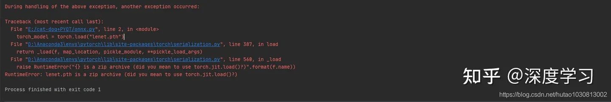
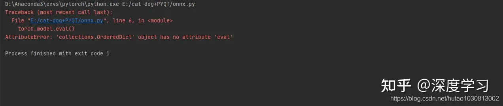

# 将训练好的pytorch模型的pth文件转换成onnx模型（亲测成功）

## 将训练好的pytorch模型的pth文件转换成onnx模型（亲测成功）

> 声明：本文原创，csdn同步更新
> [https://blog.csdn.net/hutao1030813002/article/details/114984988](https://blog.csdn.net/hutao1030813002/article/details/114984988)
> 相关资源[window10下openvino安装和踩坑。_hutao1030813002的博客-CSDN博客](https://blog.csdn.net/hutao1030813002/article/details/114386640)

## **模型转换**

由于我们要进行openvino部署，pytorch模型不能直接转化为openvino部署所需要的IR中间文件。

openvino只接受tensorflow、caffe、onnx等模型直接生成IR文件。因此我们要先将pytorch模型转化为onnx模型，在将onnx模型生成.xml和.bin文件。

```text
import torch
import torchvision

dummy_input = torch.randn(1, 3, 224, 224, device='cuda')
model = torch.load("savepath.pth")

//给输入输出取个名字
input_names = ["input_1"]
output_names = ["output_1"]

torch.onnx.export(model, dummy_input, "Lenet.onnx", verbose=True, input_names=input_names, output_names=output_names)
```


```text
model = torch.load("savepath.pth")
```

这个就是加载自己训练好的模型权重


verbose就是将网络打印成我们人类能够认识的样子。

运行成功后就是下面的样子

```text
D:\Anaconda3\envs\pytorch\python.exe E:/cat-dog+PYQT/onnx_2.py
graph(%input_1 : Float(1, 3, 224, 224),
      %conv1.weight : Float(16, 3, 5, 5),
      %conv1.bias : Float(16),
      %conv2.weight : Float(32, 16, 5, 5),
      %conv2.bias : Float(32),
      %fc1.weight : Float(120, 89888),
      %fc1.bias : Float(120),
      %fc2.weight : Float(84, 120),
      %fc2.bias : Float(84),
      %fc3.weight : Float(2, 84),
      %fc3.bias : Float(2)):
  %11 : Float(1, 16, 220, 220) = onnx::Conv[dilations=[1, 1], group=1, kernel_shape=[5, 5], pads=[0, 0, 0, 0], strides=[1, 1]](%input_1, %conv1.weight, %conv1.bias), scope: LeNet/Conv2d[conv1]
  %12 : Float(1, 16, 220, 220) = onnx::Relu(%11), scope: LeNet
  %13 : Float(1, 16, 110, 110) = onnx::MaxPool[kernel_shape=[2, 2], pads=[0, 0, 0, 0], strides=[2, 2]](%12), scope: LeNet/MaxPool2d[pool1]
  %14 : Float(1, 32, 106, 106) = onnx::Conv[dilations=[1, 1], group=1, kernel_shape=[5, 5], pads=[0, 0, 0, 0], strides=[1, 1]](%13, %conv2.weight, %conv2.bias), scope: LeNet/Conv2d[conv2]
  %15 : Float(1, 32, 106, 106) = onnx::Relu(%14), scope: LeNet
  %16 : Float(1, 32, 53, 53) = onnx::MaxPool[kernel_shape=[2, 2], pads=[0, 0, 0, 0], strides=[2, 2]](%15), scope: LeNet/MaxPool2d[pool2]
  %17 : Float(1, 89888) = onnx::Flatten[axis=1](%16), scope: LeNet
  %18 : Float(1, 120) = onnx::Gemm[alpha=1, beta=1, transB=1](%17, %fc1.weight, %fc1.bias), scope: LeNet/Linear[fc1]
  %19 : Float(1, 120) = onnx::Relu(%18), scope: LeNet
    : Float(1, 84) = onnx::Gemm[alpha=1, beta=1, transB=1](%19, %fc2.weight, %fc2.bias), scope: LeNet/Linear[fc2]
  %21 : Float(1, 84) = onnx::Relu( ), scope: LeNet
  %output_1 : Float(1, 2) = onnx::Gemm[alpha=1, beta=1, transB=1](%21, %fc3.weight, %fc3.bias), scope: LeNet/Linear[fc3]
  return (%output_1)


Process finished with exit code 0
```

## 遇到的问题和解决方法

## 问题一：



**这个错误是由于pytorch版本不一致导致的。由于我重新装过pytorch，权重文件时之前pytroch版本训练的，现在这个版本不兼容。**

解决办法：
**重新训练生成权重文件即可解决。**

## 问题二：




**错误原因和解决办法：**

**我们的训练代码中只保存了权重参数，没有保存整个模型，一般不涉及模型转换我们也只要保存权重参数就行了，因此将下面训练代码**

```text
savepath = './lenet.pth'
torch.save(model.state_dict(), savepath)
```

改为

```text
torch.save(model, 'savepath.pth')
```

然后重新训练保存即可。