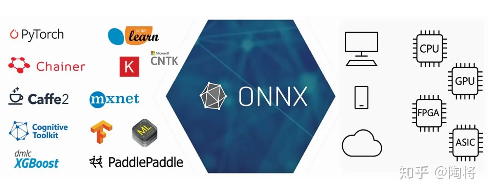
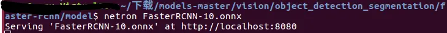
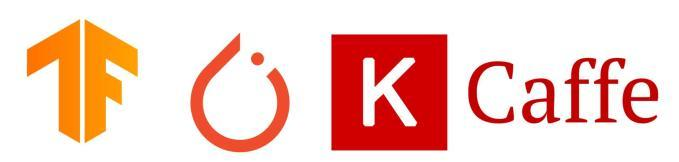

# ONNX（Open Neural Network Exchange）概述

Open Neural Network Exchange(ONNX)是一个开放的生态系统，它使人工智能开发人员在推进项目时选择合适的工具，不用被框架或者生态系统所束缚。ONNX支持不同框架之间的互操作性，简化从研究到生产之间的道路。ONNX支持许多框架（TensorFlow, Pytorch, Keras, MxNet, MATLAB等等），这些框架中的模型都可以导出或者转换为标准ONNX格式。模型采用ONNX格式后，就可在各种平台和设备上运行。

## **概述**

神经网络的深度学习是通过在数据流图上计算完成的。一些框架，比如Tensorflow和Caffe2等，使用静态图；而有一些框架，比如Pytorch等，则使用动态图。所有的框架都提供了接口，使得开发人员能够容易地构建计算图和以优化的方式运行图从而减少运行时间。graph作为一种中间表示(Intermediate Representation, IR)，能够捕捉开发者源代码的特定意图，有助于在特定设备上（CPU，GPU，FPGA等）优化和转化运行。

尽管每种框架都可以看做是API、graph和runtimes 的独立栈，提供类似的功能，但是它们各有自己专有的graph表示。而且，框架通常针对某些特性进行优化，比如快速训练，支持复杂的网络架构，在移动设备上推断（inference）等等。Tensorflow易于部署，TensorFlow Lite支持部署在移动设备升，但是debug麻烦；Pytorch使用动态图容易debug，对初学者友好，但是不容易部署。Caffe虽然上手容易，但是深入学习很难，而且部署时必须从源代码编译。Keras高度集成，方便开发人员验证想法，但是高封装使得开发人员很难添加新的操作或者获取底层数据信息。

开发者根据深度学习框架优劣选择某个框架，但是这些框架适应不同的开发阶段，由于必须进行转换，从而导致了研究和生产之间的重大延迟。ONNX格式一个通用的IR，能够使得开发人员在开发或者部署的任何阶段选择最适合他们项目的框架。ONNX通过提供计算图的通用表示，帮助开发人员为他们的任务选择合适的框架。

ONNX是一种开放规范，包括三种组件：

1. 可扩展的计算图模型
2. 标准数据类型
3. 内嵌运算符

ONNX有两个官方的ONNX变体（variants），ONNX和ONNX-ML。ONNX-ML扩展不依赖神经网络的机器学习算法的ONNX运算符集合。这两个变体之间的主要区别在于支持的类型和默认的运算符集合。只有神经网络的ONNX变体仅仅能够识别张量类型的输入和输出，然而对于经典的机器学习扩展，ONNX-ML，还可以识别序列（sequences）和映射（maps）。

## **onnx 可视化**

onnx模型可以通过[netron](https://netron.app/)进行可视化。下面仅仅介绍netron在linux上的安装和使用。

在linux上可以下载[Netron-X.X.X.AppImage](https://github.com/lutzroeder/netron/releases/tag/v4.6.3)文件进行安装netron，或者直接命令行snap install netronan安装。

netron还支持python服务，pip install netron在python环境下安装，netron [FILE]或者netron.start('[FILE]')进行查看。

## **参考**

[onnxgithub.com/onnx/onnx](https://github.com/onnx/onnx)

[TensorFlow, PyTorch, Keras and Caffeaotu.ai/zh/blog/2020/09/28/comparison-between-common-deep-learning-frameworks/](https://aotu.ai/zh/blog/2020/09/28/comparison-between-common-deep-learning-frameworks/)

[Netronnetron.app/](https://netron.app/)

发布于 2020-11-22 13:38