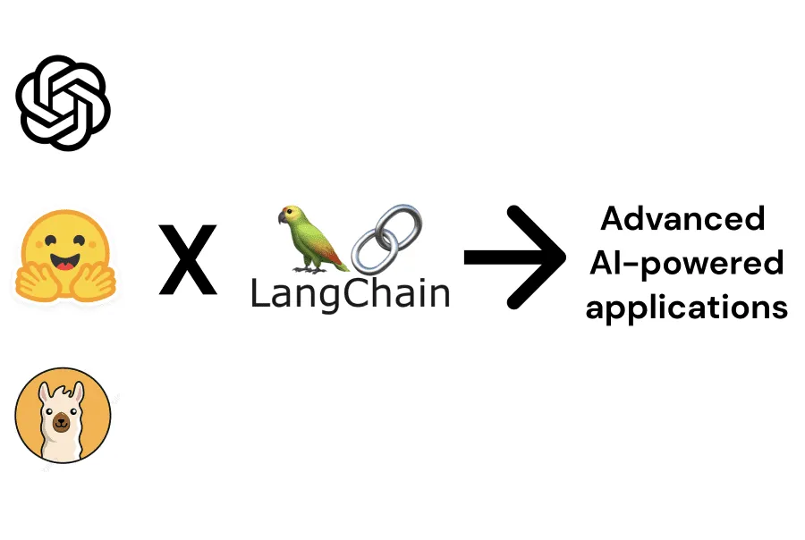
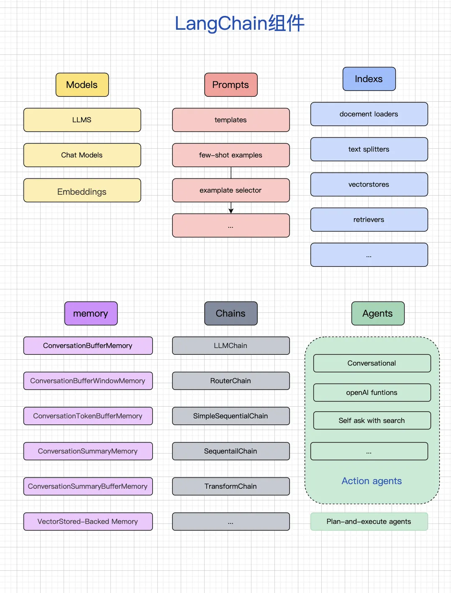
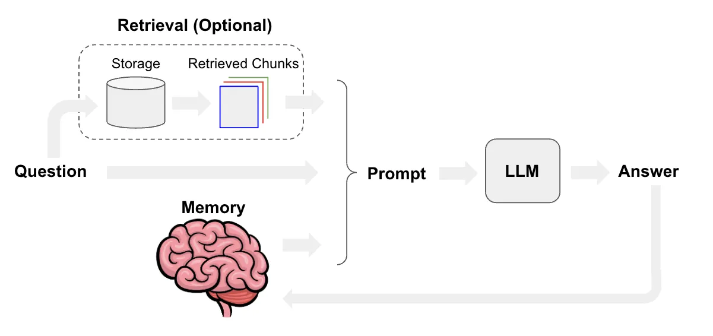

# langchain到底该怎么使用，大家在项目中实践有成功的案例吗?


作者：悦木Ivy陪娃成长
链接：https://www.zhihu.com/question/609483833/answer/3420895685
来源：知乎
著作权归作者所有。商业转载请联系作者获得授权，非商业转载请注明出处。


LangChain之所以大火，是因为它提供了一系列方便的工具、组件和接口，大大降低了 AI 应用开发的门槛，也极大简化了[大模型](https://www.zhihu.com/search?q=大模型&search_source=Entity&hybrid_search_source=Entity&hybrid_search_extra={"sourceType"%3A"answer"%2C"sourceId"%3A3420895685})应用程序的开发过程。




## 为什么需要 Langchain？


大模型的智能效果令人振奋，可是当开发人员试图将大模型这颗“聪明脑”放入应用程序时，却发现了前所未有的挑战。

- [prompt](https://www.zhihu.com/search?q=prompt&search_source=Entity&hybrid_search_source=Entity&hybrid_search_extra={"sourceType"%3A"answer"%2C"sourceId"%3A3420895685})的结构如何标准化？ 
- 如果我想中途随时切换大模型，怎样简单方便地操作？
- LLM的输出是非结构化的，它如何与结构化的程序接口相互交互？
- 预训练模型的知识落后，如何让它知道最新的信息？
- 如何让这颗大脑拥有记忆？
- 如何给这颗“聪明脑”装上“五官”，让它能够感知环境输入？
- 怎样给这颗“聪明脑”装上“手”和“脚”，让它帮我执行具体的任务？
- ...


LangChain 尝试解决的，就是这些问题。


LangChain框架背后的核心思想是**将自然语言处理序列分解为各个部分，允许开发人员根据自己的需求高效地定制工作流程。** 


##  Langchain的核心模块

 Langchain有6大核心模块：

Models：模型，是各种类型的模型和模型集成。

- Prompts：提示，包括提示管理、提示优化和提示序列化。
- Memory：记忆，用来保存和模型交互时的上下文状态。
- Indexes：索引，用来结构化文档，以便和模型交互。包括文档加载程序、向量存储器、[文本分割器](https://www.zhihu.com/search?q=文本分割器&search_source=Entity&hybrid_search_source=Entity&hybrid_search_extra={"sourceType"%3A"answer"%2C"sourceId"%3A3420895685})和检索器等。
- Agents：代理，决定模型采取哪些行动，执行并且观察流程，直到完成为止。
- [Chains：链](https://www.zhihu.com/search?q=Chains：链&search_source=Entity&hybrid_search_source=Entity&hybrid_search_extra={"sourceType"%3A"answer"%2C"sourceId"%3A3420895685})，一系列对各种组件的调用。





LangChain 通常被用作「粘合剂」，将构建 LLM 应用所需的各个模块连接在一起。使用Langchain中不同组件的特性和能力，可以构建不同场景下的应用，如聊天机器人、基于文档的问答、知识管理、个人助理、Agent智能体等等。


例如，使用 [Models模块](https://www.zhihu.com/search?q=Models模块&search_source=Entity&hybrid_search_source=Entity&hybrid_search_extra={"sourceType"%3A"answer"%2C"sourceId"%3A3420895685}) 可以很方便地使用 OpenAI 的模型接口，


```text
from LangChain.llms import OpenAI 
llm = OpenAI(temperature=0, model_name='gpt-3.5-turbo', openai_api_key=OPENAI_APIKEY) 
res = llm("Tell me a joke") 
print(res)
```


如果需在本地或离线环境下使用大模型，需要首先将所需的模型下载至本地，通常开源 LLM 与 [Embedding 模型](https://www.zhihu.com/search?q=Embedding 模型&search_source=Entity&hybrid_search_source=Entity&hybrid_search_extra={"sourceType"%3A"answer"%2C"sourceId"%3A3420895685})可以从 HuggingFace 下载。


再比如，使用Index部分涉及的RAG技术，可以将特定领域的资料存在向量数据库里，在调用大模型时找出相关的部分作为“参考资料”传给大模型，以得到更为符合业务要求的回答。




## Langchain的学习路径

1、从官方文档入手，掌握LangChain的基本概念和使用方法。

2、了解LangChain的6大主要模块。

3、通读官方给出的示例，对于各个模块有更加直观的认识。

4、找一个具体的[开源项目](https://www.zhihu.com/search?q=开源项目&search_source=Entity&hybrid_search_source=Entity&hybrid_search_extra={"sourceType"%3A"answer"%2C"sourceId"%3A3420895685})深入学习，提高对LangChain的理解和应用能力。


如果嫌自己摸索太麻烦，正好最近有一个知乎[知学堂](https://www.zhihu.com/search?q=知学堂&search_source=Entity&hybrid_search_source=Entity&hybrid_search_extra={"sourceType"%3A"answer"%2C"sourceId"%3A3420895685})联合AGI课堂推出的程序员的AI大模型进阶之旅免费公开课**。**


这个课正是为了适应当下AI大模型的发展而推出的，由几位业内大佬主讲，主要面向的就是想系统性学习AI大模型的同学。会带你深度解析此轮AI变革和以往有何根本不同，还能学习大模型相关的[Langchain技术](https://www.zhihu.com/search?q=Langchain技术&search_source=Entity&hybrid_search_source=Entity&hybrid_search_extra={"sourceType"%3A"answer"%2C"sourceId"%3A3420895685})，以及如何fine-tune模型等。


重要的是有 **[AI 大模型](https://www.zhihu.com/search?q=AI 大模型&search_source=Entity&hybrid_search_source=Entity&hybrid_search_extra={"sourceType"%3A"answer"%2C"sourceId"%3A3420895685})学习资源包，以及好用的 AI工具**等。感兴趣的可以关注一下 ↓ ↓ ↓


🔥2024大模型公开课👉训练方法+应用场景+个人增收

￥0.00点击领取


LangChain是一座桥，将混沌的非结构化AI世界与精确的结构化的传统计算机世界连接起来。


就在1月份，[LangChain团队](https://www.zhihu.com/search?q=LangChain团队&search_source=Entity&hybrid_search_source=Entity&hybrid_search_extra={"sourceType"%3A"answer"%2C"sourceId"%3A3420895685})刚刚宣布,他们的首个稳定版本LangChain [v0.1.0](https://www.zhihu.com/search?q=v0.1.0&search_source=Entity&hybrid_search_source=Entity&hybrid_search_extra={"sourceType"%3A"answer"%2C"sourceId"%3A3420895685})正式发布。这个版本集成了模块化设计、服务治理等功能,提供了更完善的文档和示例,使LangChain变得更加易于上手和扩展。这个稳定版本的发布，标志着LangChain已然从概念验证阶段进入产品化和成熟化的新阶段。


## 参考资料：

官方文档：[Introduction |  ️  Langchain](https://link.zhihu.com/?target=https%3A//python.langchain.com/docs/get_started/introduction)

[How to Make Large Language Models Play Nice with Your Software Using LangChain - KDnuggets](https://link.zhihu.com/?target=https%3A//www.kdnuggets.com/how-to-make-large-language-models-play-nice-with-your-software-using-langchain)


## **其他语言的LangChain：**

[Golang](https://www.zhihu.com/search?q=Golang&search_source=Entity&hybrid_search_source=Entity&hybrid_search_extra={"sourceType"%3A"answer"%2C"sourceId"%3A3420895685}): [https://github.com/tmc/langchaingo](https://link.zhihu.com/?target=https%3A//github.com/tmc/langchaingo)

Ruby：[GitHub - tmc/langchaingo: LangChain for Go, the easiest way to write LLM-based programs in Go](https://link.zhihu.com/?target=https%3A//github.com/tmc/langchaingo)

Java:[https://github.com/langchain4j/langchain4j](https://link.zhihu.com/?target=https%3A//github.com/langchain4j/langchain4j)


## **开源项目：**

【Chat Langchain】本地托管的聊天机器人，专门针对LangChain文档中的问题回答：

[GitHub - langchain-ai/chat-langchain](https://link.zhihu.com/?target=https%3A//github.com/langchain-ai/chat-langchain)


【Langchain Chat】一个用于LangChain Chat的Next.js前端：

[GitHub - zahidkhawaja/langchain-chat-nextjs: Next.js frontend for LangChain Chat.](https://link.zhihu.com/?target=https%3A//github.com/zahidkhawaja/langchain-chat-nextjs)


【Notion QA】 Notion问答机器人：

[https://github.com/hwchase17/notion-qa](https://link.zhihu.com/?target=https%3A//github.com/hwchase17/notion-qa)


【[知识GPT](https://www.zhihu.com/search?q=知识GPT&search_source=Entity&hybrid_search_source=Entity&hybrid_search_extra={"sourceType"%3A"answer"%2C"sourceId"%3A3420895685})】为您的文档提供准确的答案和即时引用：

[https://github.com/mmz-001/knowledge_gpt](https://link.zhihu.com/?target=https%3A//github.com/mmz-001/knowledge_gpt)


【ChatFiles】基于文档的问答：

[https://github.com/guangzhengli/ChatFiles](https://link.zhihu.com/?target=https%3A//github.com/guangzhengli/ChatFiles)


【SolidGPT】使用您的代码库进行聊天，提出代码库级别的问题，并讨论您的需求。

[https://github.com/AI-Citizen/SolidGPT](https://link.zhihu.com/?target=https%3A//github.com/AI-Citizen/SolidGPT)


【MindGeniusAI】 使用ChatGPT自动生成思维导图：

[GitHub - xianjianlf2/MindGeniusAI: Auto generate MindMap with ChatGPT](https://link.zhihu.com/?target=https%3A//github.com/xianjianlf2/MindGeniusAI)


【Langchain-Chatchat 】可离线部署的检索增强生成 (RAG) 大模型的本地知识库问答应用项目：

[GitHub：https://github.com/chatchat-space/Langchain-Chatchat](https://link.zhihu.com/?target=https%3A//github.com/chatchat-space/Langchain-Chatchat)

[发布于 2024-03-06 17:37](http://www.zhihu.com/question/609483833/answer/3420895685)・IP 属地天津

真诚赞赏，手留余香