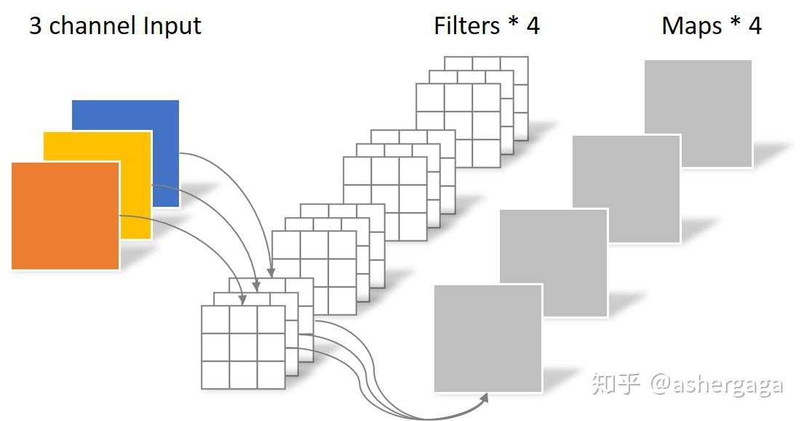
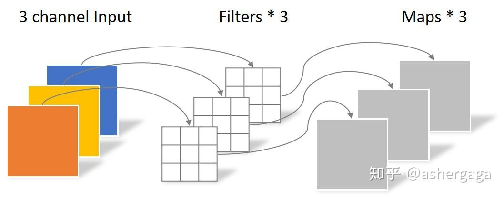
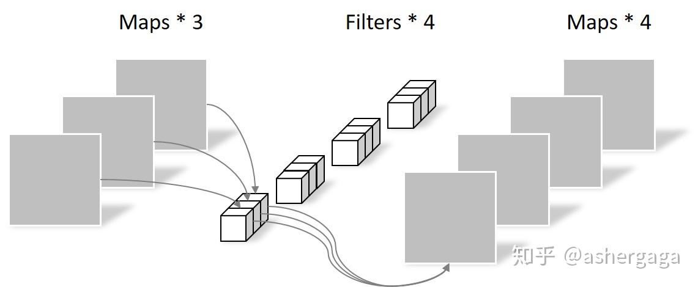

# Depthwise卷积与Pointwise卷积

Depthwise(DW)卷积与Pointwise(PW)卷积，合起来被称作Depthwise Separable Convolution(参见Google的Xception)，该结构和常规卷积操作类似，可用来提取特征，但相比于常规卷积操作，其参数量和运算成本较低。所以在一些轻量级网络中会碰到这种结构如MobileNet。

## **常规卷积操作**

对于一张5×5像素、三通道彩色输入图片（shape为5×5×3）。经过3×3[卷积核](https://zhida.zhihu.com/search?content_id=105916614&content_type=Article&match_order=1&q=卷积核&zhida_source=entity)的卷积层（假设输出通道数为4，则卷积核shape为3×3×3×4），最终输出4个Feature Map，如果有same padding则尺寸与输入层相同（5×5），如果没有则为尺寸变为3×3。

此时，卷积层共4个Filter，每个Filter包含了3个Kernel，每个Kernel的大小为3×3。因此[卷积层](https://zhida.zhihu.com/search?content_id=105916614&content_type=Article&match_order=3&q=卷积层&zhida_source=entity)的参数数量可以用如下公式来计算：
N_std = 4 × 3 × 3 × 3 = 108

## **Depthwise Separable Convolution**

Depthwise Separable Convolution是将一个完整的卷积运算分解为两步进行，即Depthwise Convolution与Pointwise Convolution。

### **Depthwise Convolution**

不同于常规卷积操作，Depthwise Convolution的一个卷积核负责一个通道，一个通道只被一个卷积核卷积。上面所提到的[常规卷积](https://zhida.zhihu.com/search?content_id=105916614&content_type=Article&match_order=5&q=常规卷积&zhida_source=entity)每个卷积核是同时操作输入图片的每个通道。

同样是对于一张5×5像素、三通道彩色输入图片（shape为5×5×3），Depthwise Convolution首先经过第一次卷积运算，不同于上面的常规卷积，DW完全是在二维平面内进行。卷积核的数量与上一层的通道数相同（通道和卷积核一一对应）。所以一个[三通道](https://zhida.zhihu.com/search?content_id=105916614&content_type=Article&match_order=3&q=三通道&zhida_source=entity)的图像经过运算后生成了3个Feature map(如果有same padding则尺寸与输入层相同为5×5)，如下图所示。

其中一个Filter只包含一个大小为3×3的Kernel，卷积部分的参数个数计算如下：
N_depthwise = 3 × 3 × 3 = 27

Depthwise Convolution完成后的Feature map数量与输入层的通道数相同，无法扩展[Feature map](https://zhida.zhihu.com/search?content_id=105916614&content_type=Article&match_order=3&q=Feature+map&zhida_source=entity)。而且这种运算对输入层的每个通道独立进行卷积运算，没有有效的利用不同通道在相同空间位置上的feature信息。因此需要Pointwise Convolution来将这些Feature map进行组合生成新的Feature map。

### **Pointwise Convolution**

Pointwise Convolution的运算与常规卷积运算非常相似，它的卷积核的尺寸为 1×1×M，M为上一层的通道数。所以这里的[卷积运算](https://zhida.zhihu.com/search?content_id=105916614&content_type=Article&match_order=5&q=卷积运算&zhida_source=entity)会将上一步的map在深度方向上进行[加权组合](https://zhida.zhihu.com/search?content_id=105916614&content_type=Article&match_order=1&q=加权组合&zhida_source=entity)，生成新的Feature map。有几个卷积核就有几个输出Feature map。如下图所示。

由于采用的是1×1卷积的方式，此步中卷积涉及到的参数个数可以计算为：
N_pointwise = 1 × 1 × 3 × 4 = 12

经过Pointwise Convolution之后，同样输出了4张Feature map，与常规卷积的输出维度相同。

## **参数对比**

回顾一下，常规卷积的参数个数为：
N_std = 4 × 3 × 3 × 3 = 108

Separable Convolution的参数由两部分相加得到：
[N_depthwise](https://zhida.zhihu.com/search?content_id=105916614&content_type=Article&match_order=2&q=N_depthwise&zhida_source=entity) = 3 × 3 × 3 = 27
N_pointwise = 1 × 1 × 3 × 4 = 12
N_separable = N_depthwise + N_pointwise = 39

相同的输入，同样是得到4张Feature map，Separable Convolution的参数个数是常规卷积的约1/3。因此，在参数量相同的前提下，采用Separable Convolution的[神经网络层数](https://zhida.zhihu.com/search?content_id=105916614&content_type=Article&match_order=1&q=神经网络层数&zhida_source=entity)可以做的更深。

参考：

https://blog.csdn.net/tintinetmilou/article/details/81607721

https://yinguobing.com/separable-convolution/#fn2

