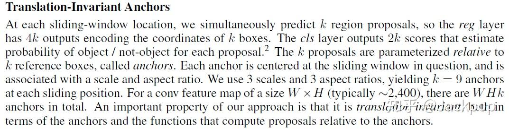
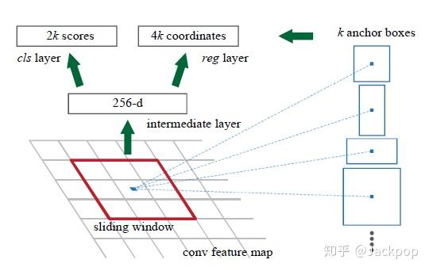
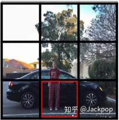
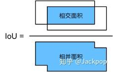
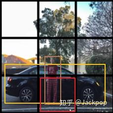
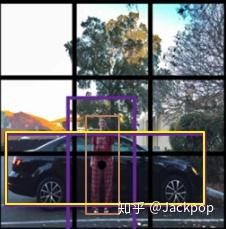
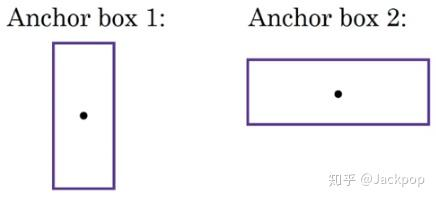
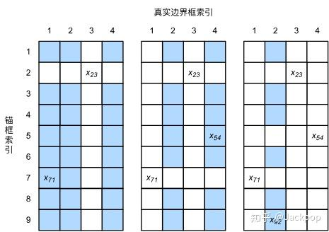
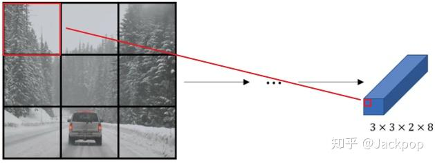
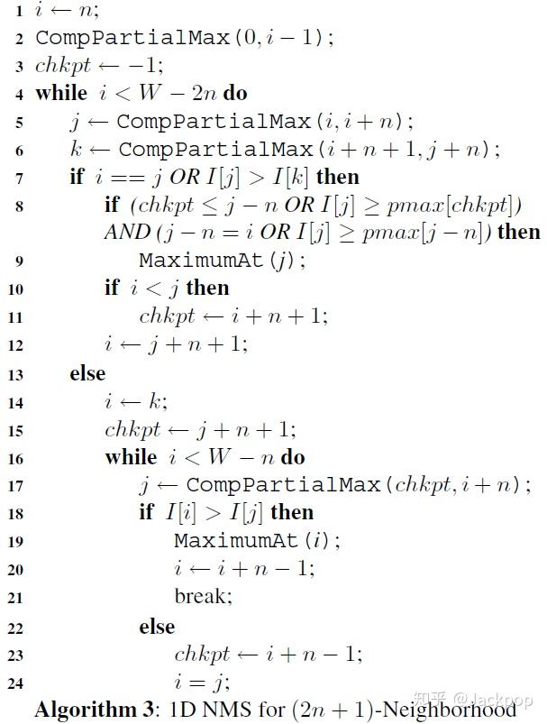

# 锚框：Anchor box综述

## 前言

anchor boxes是学习[卷积神经网络](https://zhida.zhihu.com/search?content_id=102134828&content_type=Article&match_order=1&q=卷积神经网络&zhida_source=entity)用于目标识别过程中最重要且最难理解的一个概念。这个概念最初是在Faster R-CNN中提出，此后在SSD、YOLOv2、YOLOv3等优秀的目标识别模型中得到了广泛的应用，这里就详细介绍一下anchor boxes到底是什么？有什么作用？在哪里起作用？

## **问题1：为什么需要anchor box？**

要了解为什么需要anchor box需要首先了解一下在此之前的一些目标识别方法。

**1.[滑动窗口](https://zhida.zhihu.com/search?content_id=102134828&content_type=Article&match_order=1&q=滑动窗口&zhida_source=entity)**

这是比较原始的目标检测方法，给定一个固定尺寸的窗口，根据设定的步伐，一步一步的从左至右、从上至下滑动，把每个窗口输入到卷积神经网络中进行预测和分类，这样做有两个缺点:

- 由于窗口尺寸固定，因此不适合形变较大的物体
- 窗口较多，运算量大

**2.[区域建议](https://zhida.zhihu.com/search?content_id=102134828&content_type=Article&match_order=1&q=区域建议&zhida_source=entity)**

这是R-CNN系列中核心的思想，以Faster R-CNN为例，模型中使用了两个神经网络，一个是是CNN，一个是RPN(Regional Proposal)，区域建议网络不负责图像的分类，它只负责选取出图像中可能属于数据集其中一类的候选区域。接下来就是把RPN产生的候选区域输入到分类网络中进行最终的分类。

**3.anchor box**

anchor box第一次是出现在Faster R-CNN的论文里，要理解anchor box 首先要理解两个问题。

***为什么提出anchor box？\***

主要有两个原因：

- 一个窗口只能检测一个目标
- 无法解决[多尺度](https://zhida.zhihu.com/search?content_id=102134828&content_type=Article&match_order=1&q=多尺度&zhida_source=entity)问题。

以往的模型一个窗口只能预测一个目标，把窗口输入到[分类网络](https://zhida.zhihu.com/search?content_id=102134828&content_type=Article&match_order=2&q=分类网络&zhida_source=entity)中，最终得到一个预测概率，这个概率偏向哪个类别则把窗口内的目标预测为相应的类别，例如在图中红色框内回归得到的行人概率更大，则认为这个目标为行人。此外，在解决多尺度问题时主要采用一种思想--[金字塔](https://zhida.zhihu.com/search?content_id=102134828&content_type=Article&match_order=1&q=金字塔&zhida_source=entity)，或者是例如DPM模型中经典的[特征金字塔](https://zhida.zhihu.com/search?content_id=102134828&content_type=Article&match_order=1&q=特征金字塔&zhida_source=entity)。在不同分辨率的特征图下检测不同尺寸的目标。但是这样存在一个问题，就是大大的增加了计算量。

***为什么使用不同尺寸和不同长宽比？\***

为了得到更大的[交并比](https://zhida.zhihu.com/search?content_id=102134828&content_type=Article&match_order=1&q=交并比&zhida_source=entity)(intersection over union, IOU)。

以训练阶段为例。

对于计算机视觉，比较容易理解的是真实标签(ground truth)，人为为每个目标标记的标签。但是在加入anchor box思想之后，在训练集中，我们将每个锚框视为一个训练样本。因此，为了训练目标模型，需要标记每个anchor box的标签，这里的标签包括两个部分：

- 类别标签
- 偏移量

有多个anchor box，到底该选取哪一个呢？这是就要通过交并比进行选择。试想一下，如果用一个固定尺寸的anchor，那么对于anchor的标记就没有了针对性。

举例说明一下，图中棕色的为行人的真实标签，黄色的为车辆的真实标签，红色的框是从[feature map](https://zhida.zhihu.com/search?content_id=102134828&content_type=Article&match_order=1&q=feature+map&zhida_source=entity)映射的anchor box，这样的话通过交并比就很难获取feature map中每个单元对应的标签。

这样的话，可以用anchor box1与行人的交并比比较大，可以用于训练和预测行人，anchor box 2与汽车的交并比较大，可以用于训练和预测汽车。使用不同长宽比和尺寸的anchor box，这样更加具有针对性。

***anchor box的尺寸该怎么选择？***

目前anchor box的选择主要有三种方式：

- 人为经验选取
- k-means聚类
- 作为[超参数](https://zhida.zhihu.com/search?content_id=102134828&content_type=Article&match_order=1&q=超参数&zhida_source=entity)进行学习

## 问题2：anchor box用在哪个阶段？

当然是既用于训练阶段，也用于预测阶段。但问题来了，在训练阶段和预测阶段都是怎么使用的？

前面看的云里雾里的没事，这里详细讲一下。

**1.训练阶段**

**标注**

在训练阶段，是把anchor box作为训练样本，为了训练样本我们需要为每个锚框标注两类标签：一是锚框所含目标的类别，简称类别；二是[真实边界框](https://zhida.zhihu.com/search?content_id=102134828&content_type=Article&match_order=1&q=真实边界框&zhida_source=entity)相对锚框的偏移量，简称偏移量（offset）。在目标检测时，我们首先生成多个锚框，然后为每个锚框预测类别以及偏移量，接着根据预测的偏移量调整锚框位置从而得到预测边界框，最后筛选需要输出的预测边界框。

已经知道每个目标的[ground truth](https://zhida.zhihu.com/search?content_id=102134828&content_type=Article&match_order=2&q=ground+truth&zhida_source=entity)，怎么标注anchor box的标签呢？

使用[最大交并比](https://zhida.zhihu.com/search?content_id=102134828&content_type=Article&match_order=1&q=最大交并比&zhida_source=entity)(IOU)

图片来源于[动手学深度学习](https://zh.gluon.ai/chapter_computer-vision/anchor.html)

假设图像中有 na 个anchor box，有 nb 个真实边界框，这样的话就形成了一个anchor box与真实边界框之间的对应关系矩阵 X∈Rna×nb ，那么就根据这个对应关系找出与每个anchor box交并比最大的真实边界框，然后真实边界框的标签作为anchor box的标签，然后计算anchor box相对于真实边界框的偏移量。

这样的话就标记好了每个anchor box：标签和偏移量。

**训练**

***训练阶段在什么时候触发anchor box?\***

在经过一系列卷积和[池化](https://zhida.zhihu.com/search?content_id=102134828&content_type=Article&match_order=1&q=池化&zhida_source=entity)之后，在feature map层使用anchor box，如上图所示，经过一系列的[特征提取](https://zhida.zhihu.com/search?content_id=102134828&content_type=Article&match_order=1&q=特征提取&zhida_source=entity)，最后针对 3×3 的网格会得到一个 3×3×2×8 的特征层，其中2是anchor box的个数，以《[deep learning](https://zhida.zhihu.com/search?content_id=102134828&content_type=Article&match_order=1&q=deep+learning&zhida_source=entity)》课程为例选择两个anchor box，8代表每个anchor box包含的变量数，分别是4个[位置偏移量](https://zhida.zhihu.com/search?content_id=102134828&content_type=Article&match_order=1&q=位置偏移量&zhida_source=entity)、3个类别(one-hot标注方式)、1个anchor box标注(如果anchor box与真实边框的交并比最大则为1，否则为0)。

到了特征层之后对每个cell映射到原图中，找到预先标注的anchor box，然后计算这个anchor box与ground truth之间的损失，训练的主要目的就是训练出用anchor box去拟合真实边框的模型参数。

看一下[损失函数](https://zhida.zhihu.com/search?content_id=102134828&content_type=Article&match_order=1&q=损失函数&zhida_source=entity)会更加有助于理解这个概念，Faster R-CNN原文中采用的损失函数为：

L({pi},{ti})=1Ncls∑iLcls(pi,pi∗)+λ1Nreg∑ipi∗Lreg(ti,ti∗)

Lcls(pi,pi∗) 是[类别损失](https://zhida.zhihu.com/search?content_id=102134828&content_type=Article&match_order=1&q=类别损失&zhida_source=entity)， pi∗ 是真实标签，如果是正样本，标注为1,如果是负样本标注为0。同理， Lreg(ti,ti∗) 为位置偏移损失， ti∗ 是真实边框相对于anchor box的4个[参数化坐标](https://zhida.zhihu.com/search?content_id=102134828&content_type=Article&match_order=1&q=参数化坐标&zhida_source=entity)的向量，训练的最终目标就是使得损失函数 L({pi},{ti}) 最小化，这样会得到使得预测类别 pi 、预测偏移量 ti 与真实标注最佳拟合模型参数。

**2.预测阶段**

***在模型的预测阶段，怎么才能获得预测的边界框呢？\***

首先在图像中生成多个anchor box，然后根据训练好的模型参数去预测这些anchor box的类别和偏移量，进而得到预测的边界框。由于阈值和anchor box数量选择的问题，同一个目标可能会输出多个相似的预测边界框，这样不仅不简洁，而且会增加计算量，为了解决这个问题，常用的措施是使用[非极大值抑制](https://zhida.zhihu.com/search?content_id=102134828&content_type=Article&match_order=1&q=非极大值抑制&zhida_source=entity)(non-maximum suppression，NMS)。

***怎么理解NMS?\***

NMS就是一个抑制冗余的反复迭代-遍历的过程。

对于一个预测边界框 B ，模型最终会输出会计算它属于每个类别的概率值，其中概率值最大对应的类别就是预测边界框的类别。在同一副图像上，把所有预测边界框(不区分类别)的预测概率从大到小进行排列，然后取出最大概率的预测边界框 B1 作为基准，然后计算剩余的预测边界框与 B1 的交并比，如果大于给定的某个阈值，则将这个预测边界框移除。这样的话保留了概率最大的预测边界框并移除了其他与其相似的边界框。接下来要做的就是从剩余的预测边界框中选出概率值最大的预测边界框 B2 计算过程重复上述的过程。

[https://ieeexplore.ieee.org/stamp/stamp.jsp?tp=&arnumber=1699659ieeexplore.ieee.org/stamp/stamp.jsp?tp=&arnumber=1699659](https://ieeexplore.ieee.org/stamp/stamp.jsp?tp=&arnumber=1699659)

------

## 更多我的作品

[Jackpop：PinSage：GCN在商业推荐系统首次成功应用](https://zhuanlan.zhihu.com/p/63214411)

[Jackpop：【动手学计算机视觉】第三讲：图像预处理之图像分割](https://zhuanlan.zhihu.com/p/60847136)

> ## 前言
>
> anchor boxes是学习[卷积神经网络](https://zhida.zhihu.com/search?content_id=102134828&content_type=Article&match_order=1&q=卷积神经网络&zhida_source=entity)用于目标识别过程中最重要且最难理解的一个概念。这个概念最初是在Faster R-CNN中提出，此后在SSD、YOLOv2、YOLOv3等优秀的目标识别模型中得到了广泛的应用，这里就详细介绍一下anchor boxes到底是什么？有什么作用？在哪里起作用？
>
> 
>
> ## **问题1：为什么需要anchor box？**
>
> 要了解为什么需要anchor box需要首先了解一下在此之前的一些目标识别方法。
>
> **1.[滑动窗口](https://zhida.zhihu.com/search?content_id=102134828&content_type=Article&match_order=1&q=滑动窗口&zhida_source=entity)**
>
> 这是比较原始的目标检测方法，给定一个固定尺寸的窗口，根据设定的步伐，一步一步的从左至右、从上至下滑动，把每个窗口输入到卷积神经网络中进行预测和分类，这样做有两个缺点:
>
> - 由于窗口尺寸固定，因此不适合形变较大的物体
> - 窗口较多，运算量大
>
> **2.[区域建议](https://zhida.zhihu.com/search?content_id=102134828&content_type=Article&match_order=1&q=区域建议&zhida_source=entity)**
>
> 
>
> 这是R-CNN系列中核心的思想，以Faster R-CNN为例，模型中使用了两个神经网络，一个是是CNN，一个是RPN(Regional Proposal)，区域建议网络不负责图像的分类，它只负责选取出图像中可能属于数据集其中一类的候选区域。接下来就是把RPN产生的候选区域输入到分类网络中进行最终的分类。
>
> **3.anchor box**
>
> anchor box第一次是出现在Faster R-CNN的论文里，要理解anchor box 首先要理解两个问题。
>
> ***为什么提出anchor box？\***
>
> 主要有两个原因：
>
> - 一个窗口只能检测一个目标
> - 无法解决[多尺度](https://zhida.zhihu.com/search?content_id=102134828&content_type=Article&match_order=1&q=多尺度&zhida_source=entity)问题。
>
> 
>
> 以往的模型一个窗口只能预测一个目标，把窗口输入到[分类网络](https://zhida.zhihu.com/search?content_id=102134828&content_type=Article&match_order=2&q=分类网络&zhida_source=entity)中，最终得到一个预测概率，这个概率偏向哪个类别则把窗口内的目标预测为相应的类别，例如在图中红色框内回归得到的行人概率更大，则认为这个目标为行人。此外，在解决多尺度问题时主要采用一种思想--[金字塔](https://zhida.zhihu.com/search?content_id=102134828&content_type=Article&match_order=1&q=金字塔&zhida_source=entity)，或者是例如DPM模型中经典的[特征金字塔](https://zhida.zhihu.com/search?content_id=102134828&content_type=Article&match_order=1&q=特征金字塔&zhida_source=entity)。在不同分辨率的特征图下检测不同尺寸的目标。但是这样存在一个问题，就是大大的增加了计算量。
>
> ***为什么使用不同尺寸和不同长宽比？\***
>
> 
>
> 为了得到更大的[交并比](https://zhida.zhihu.com/search?content_id=102134828&content_type=Article&match_order=1&q=交并比&zhida_source=entity)(intersection over union, IOU)。
>
> 以训练阶段为例。
>
> 对于计算机视觉，比较容易理解的是真实标签(ground truth)，人为为每个目标标记的标签。但是在加入anchor box思想之后，在训练集中，我们将每个锚框视为一个训练样本。因此，为了训练目标模型，需要标记每个anchor box的标签，这里的标签包括两个部分：
>
> - 类别标签
> - 偏移量
>
> 有多个anchor box，到底该选取哪一个呢？这是就要通过交并比进行选择。试想一下，如果用一个固定尺寸的anchor，那么对于anchor的标记就没有了针对性。
>
> 
>
> 举例说明一下，图中棕色的为行人的真实标签，黄色的为车辆的真实标签，红色的框是从[feature map](https://zhida.zhihu.com/search?content_id=102134828&content_type=Article&match_order=1&q=feature+map&zhida_source=entity)映射的anchor box，这样的话通过交并比就很难获取feature map中每个单元对应的标签。
>
> 
>
> 
>
> 这样的话，可以用anchor box1与行人的交并比比较大，可以用于训练和预测行人，anchor box 2与汽车的交并比较大，可以用于训练和预测汽车。使用不同长宽比和尺寸的anchor box，这样更加具有针对性。
>
> ***anchor box的尺寸该怎么选择？***
>
> 目前anchor box的选择主要有三种方式：
>
> - 人为经验选取
> - k-means聚类
> - 作为[超参数](https://zhida.zhihu.com/search?content_id=102134828&content_type=Article&match_order=1&q=超参数&zhida_source=entity)进行学习
>
> ## 问题2：anchor box用在哪个阶段？
>
> 当然是既用于训练阶段，也用于预测阶段。但问题来了，在训练阶段和预测阶段都是怎么使用的？
>
> 前面看的云里雾里的没事，这里详细讲一下。
>
> **1.训练阶段**
>
> **标注**
>
> 在训练阶段，是把anchor box作为训练样本，为了训练样本我们需要为每个锚框标注两类标签：一是锚框所含目标的类别，简称类别；二是[真实边界框](https://zhida.zhihu.com/search?content_id=102134828&content_type=Article&match_order=1&q=真实边界框&zhida_source=entity)相对锚框的偏移量，简称偏移量（offset）。在目标检测时，我们首先生成多个锚框，然后为每个锚框预测类别以及偏移量，接着根据预测的偏移量调整锚框位置从而得到预测边界框，最后筛选需要输出的预测边界框。
>
> 已经知道每个目标的[ground truth](https://zhida.zhihu.com/search?content_id=102134828&content_type=Article&match_order=2&q=ground+truth&zhida_source=entity)，怎么标注anchor box的标签呢？
>
> 使用[最大交并比](https://zhida.zhihu.com/search?content_id=102134828&content_type=Article&match_order=1&q=最大交并比&zhida_source=entity)(IOU)
>
> 
>
> 图片来源于[动手学深度学习](https://zh.gluon.ai/chapter_computer-vision/anchor.html)
>
> 假设图像中有 na 个anchor box，有 nb 个真实边界框，这样的话就形成了一个anchor box与真实边界框之间的对应关系矩阵 X∈Rna×nb ，那么就根据这个对应关系找出与每个anchor box交并比最大的真实边界框，然后真实边界框的标签作为anchor box的标签，然后计算anchor box相对于真实边界框的偏移量。
>
> 这样的话就标记好了每个anchor box：标签和偏移量。
>
> **训练**
>
> 
>
> ***训练阶段在什么时候触发anchor box?\***
>
> 在经过一系列卷积和[池化](https://zhida.zhihu.com/search?content_id=102134828&content_type=Article&match_order=1&q=池化&zhida_source=entity)之后，在feature map层使用anchor box，如上图所示，经过一系列的[特征提取](https://zhida.zhihu.com/search?content_id=102134828&content_type=Article&match_order=1&q=特征提取&zhida_source=entity)，最后针对 3×3 的网格会得到一个 3×3×2×8 的特征层，其中2是anchor box的个数，以《[deep learning](https://zhida.zhihu.com/search?content_id=102134828&content_type=Article&match_order=1&q=deep+learning&zhida_source=entity)》课程为例选择两个anchor box，8代表每个anchor box包含的变量数，分别是4个[位置偏移量](https://zhida.zhihu.com/search?content_id=102134828&content_type=Article&match_order=1&q=位置偏移量&zhida_source=entity)、3个类别(one-hot标注方式)、1个anchor box标注(如果anchor box与真实边框的交并比最大则为1，否则为0)。
>
> 到了特征层之后对每个cell映射到原图中，找到预先标注的anchor box，然后计算这个anchor box与ground truth之间的损失，训练的主要目的就是训练出用anchor box去拟合真实边框的模型参数。
>
> 看一下[损失函数](https://zhida.zhihu.com/search?content_id=102134828&content_type=Article&match_order=1&q=损失函数&zhida_source=entity)会更加有助于理解这个概念，Faster R-CNN原文中采用的损失函数为：
>
> L({pi},{ti})=1Ncls∑iLcls(pi,pi∗)+λ1Nreg∑ipi∗Lreg(ti,ti∗)
>
> Lcls(pi,pi∗) 是[类别损失](https://zhida.zhihu.com/search?content_id=102134828&content_type=Article&match_order=1&q=类别损失&zhida_source=entity)， pi∗ 是真实标签，如果是正样本，标注为1,如果是负样本标注为0。同理， Lreg(ti,ti∗) 为位置偏移损失， ti∗ 是真实边框相对于anchor box的4个[参数化坐标](https://zhida.zhihu.com/search?content_id=102134828&content_type=Article&match_order=1&q=参数化坐标&zhida_source=entity)的向量，训练的最终目标就是使得损失函数 L({pi},{ti}) 最小化，这样会得到使得预测类别 pi 、预测偏移量 ti 与真实标注最佳拟合模型参数。
>
> **2.预测阶段**
>
> ***在模型的预测阶段，怎么才能获得预测的边界框呢？\***
>
> 首先在图像中生成多个anchor box，然后根据训练好的模型参数去预测这些anchor box的类别和偏移量，进而得到预测的边界框。由于阈值和anchor box数量选择的问题，同一个目标可能会输出多个相似的预测边界框，这样不仅不简洁，而且会增加计算量，为了解决这个问题，常用的措施是使用[非极大值抑制](https://zhida.zhihu.com/search?content_id=102134828&content_type=Article&match_order=1&q=非极大值抑制&zhida_source=entity)(non-maximum suppression，NMS)。
>
> ***怎么理解NMS?\***
>
> 
>
> NMS就是一个抑制冗余的反复迭代-遍历的过程。
>
> 对于一个预测边界框 B ，模型最终会输出会计算它属于每个类别的概率值，其中概率值最大对应的类别就是预测边界框的类别。在同一副图像上，把所有预测边界框(不区分类别)的预测概率从大到小进行排列，然后取出最大概率的预测边界框 B1 作为基准，然后计算剩余的预测边界框与 B1 的交并比，如果大于给定的某个阈值，则将这个预测边界框移除。这样的话保留了概率最大的预测边界框并移除了其他与其相似的边界框。接下来要做的就是从剩余的预测边界框中选出概率值最大的预测边界框 B2 计算过程重复上述的过程。
>
> [https://ieeexplore.ieee.org/stamp/stamp.jsp?tp=&arnumber=1699659ieeexplore.ieee.org/stamp/stamp.jsp?tp=&arnumber=1699659](https://ieeexplore.ieee.org/stamp/stamp.jsp?tp=&arnumber=1699659)
>
> ------
>
> ## 更多我的作品
>
> [Jackpop：PinSage：GCN在商业推荐系统首次成功应用](https://zhuanlan.zhihu.com/p/63214411)
>
> [Jackpop：【动手学计算机视觉】第三讲：图像预处理之图像分割](https://zhuanlan.zhihu.com/p/60847136)
>
> > 更多"福利"，请关注公众号【平凡而诗意】~
>
> 发布于 2019-04-23 21:17