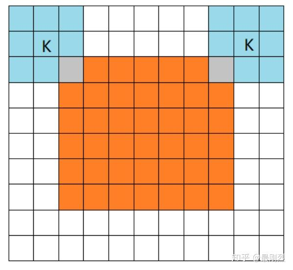
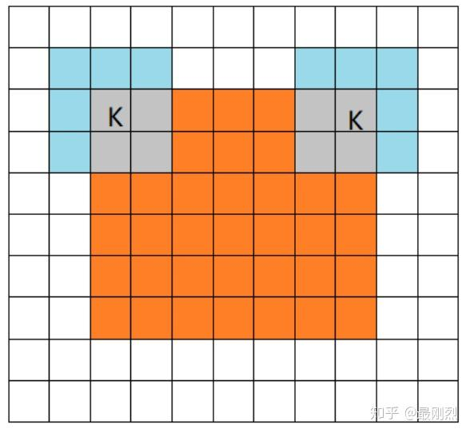
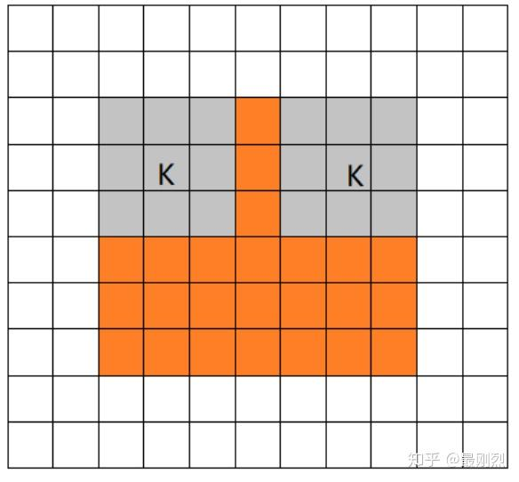
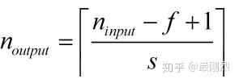
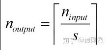

# 卷积的三种模式full, same, valid以及padding的same, valid

总结自[csdn](https://link.zhihu.com/?target=https%3A//blog.csdn.net/leviopku/article/details/80327478)和[简书](https://link.zhihu.com/?target=https%3A//www.jianshu.com/p/05c4f1621c7e)。

## **一、以下展示卷积三种模式的不同之处**

其实这三种不同模式是对[卷积核](https://zhida.zhihu.com/search?content_id=102076333&content_type=Article&match_order=1&q=卷积核&zhida_source=entity)移动范围的不同限制。设 image的大小是7x7，filter的大小是3x3。

**1 full mode**

橙色部分为image, 蓝色部分为filter。full模式的意思是，**从filter和image刚相交开始做卷积，**白色部分为填0。filter的运动范围如图所示。

**2 same mode**

**当filter的中心(K)与image的边角重合时，开始做卷积运算**，可见filter的运动范围比full模式小了一圈。注意：这里的same还有一个意思，卷积之后输出的[feature map](https://zhida.zhihu.com/search?content_id=102076333&content_type=Article&match_order=1&q=feature+map&zhida_source=entity)尺寸保持不变(相对于输入图片)。当然，same模式不代表完全输入输出尺寸一样，也跟卷积核的[步长](https://zhida.zhihu.com/search?content_id=102076333&content_type=Article&match_order=1&q=步长&zhida_source=entity)有关系。same模式也是最常见的模式，因为这种模式可以在前向传播的过程中让特征图的大小保持不变，调参师不需要精准计算其尺寸变化(因为尺寸根本就没变化)。

**3.valid**

**当filter全部在image里面的时候，进行卷积运算**，可见filter的移动范围较same更小了。

- **输入图片大小*****W×W\***
- **Filter大小*****F×F\***
- **步长*****S\***
- **[padding](https://zhida.zhihu.com/search?content_id=102076333&content_type=Article&match_order=1&q=padding&zhida_source=entity)的像素数*****P\***
- **N = (\*W − F\*+ 2\*P\*)/\*S\*+1 输出大小为N×N**

## 二、tf的padding有两个值，一个是[SAME](https://zhida.zhihu.com/search?content_id=102076333&content_type=Article&match_order=1&q=SAME&zhida_source=entity)，一个是[VALID](https://zhida.zhihu.com/search?content_id=102076333&content_type=Article&match_order=1&q=VALID&zhida_source=entity)

如果padding设置为SAME，则说明输入图片大小和输出图片大小是一致的，如果是VALID则图片经过滤波器后可能会变小。

**padding = “VALID”输入和输出大小关系如下：**

conv2d的VALID方式不会在原有输入的基础上添加新的像素（假定我们的输入是图片数据，因为只有图片才有像素），输出矩阵的大小直接按照公式计算即可。

**padding = “SAME”**输入和输出大小关系如下**：**输出大小等于输入大小除以步长向上取整

在高度上需要pad的像素数为：
pad_needed_height = (new_height – 1) × S + F - W

根据上式，输入矩阵上方添加的像素数为：
pad_top = pad_needed_height / 2 （结果取整）

下方添加的像素数为：
pad_down = pad_needed_height - pad_top

以此类推，在宽度上需要pad的像素数和左右分别添加的像素数为
pad_needed_width = (new_width – 1) × S + F - W
pad_left = pad_needed_width / 2 （结果取整）
pad_right = pad_needed_width – pad_left

