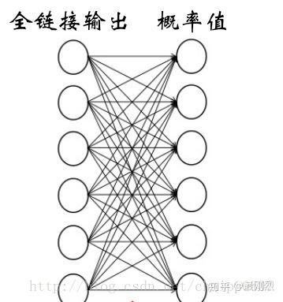

# 经典卷积网络（一）-AlexNet、VGG、GoogleNet（inception）

## **一、 AlexNet及一些基本理解（总结自csdn [chaibubble](https://link.zhihu.com/?target=https%3A//blog.csdn.net/chaipp0607)的博客）**

**卷积层：5层，全连接层：3层，深度：8层，分类数目：1000类**，参数个数：60M，神经元个数：650k**。**

**池化在卷积之后，用于卷积层内，操作类似卷积，作用是特征融合和降维，它的参数都是超参数，不需要学习。**严格意义上，池化层不属于cnn单独层，不计入层数，所以说Alexnet共8层，其实他还有池化层。

**激活操作则在卷积层和全连接层都会用到。增加非线性。如**ReLU，在全连接层中的激活过程就很好理解了，因为全连接层内所有的神经元的输出都是一个数，只要这个数x>0，则x=x；x<0，则x=0。**在卷积层中的激活针对的是每一个像素值**，比如某卷积层输出中某个通道中i行j列像素值为x，只要这个数x>0，则x=x；x<0，则x=0。

**卷积核的厚度=被卷积的图像的通道数；卷积核的个数=卷积操作后输出的通道数。参数=卷积核个数\*卷积核宽\*高\*厚度。**

**例：**输入图像尺寸5×5×35×5×3（宽/高/通道数）,卷积核尺寸：3×3×33×3×3（宽/高/厚度），步长：1，边界填充：0，卷积核数量：1。用这样的一个卷积核去卷积图像中某一个位置后，是将该位置上宽3，高3，通道3上27个像素值分别乘以卷积核上27个对应位置的参数，得到一个数，依次滑动，得到卷积后的图像，这个图像的通道数为1（与卷积核个数相同），图像的高宽尺寸如下公式： （5-3+2*0）/1 + 1 = 3. 所以，卷积后的图像尺寸为：3×3×13×3×1（宽/高/通道数）

- **输入图片大小 \*W×W\***
- **Filter大小 \*F×F\***
- **步长 \*S\***
- **padding的像素数 \*P\***
- **N = (\*W − F\*+ 2\*P\*)/\*S\*+1 输出大小为N×N**

**全连接，**第一层的全连接层用于链接卷积层的输出，它还有一个作用是去除空间信息（通道数），是一种将三维矩阵变成向量的过程（一种[全卷积](https://zhida.zhihu.com/search?content_id=102063706&content_type=Article&match_order=1&q=全卷积&zhida_source=entity)操作），其操作如下：

输入图像是W×H×CW×H×C，那么卷积核的尺寸为W×H×CW×H×C，这样的话整个输入图像就变成了一个数，一共有k个数（第一层全连接层后的神经元个数），就有K个这样的W×H×CW×H×C的卷积核。所以全连接层（尤其是第一层）的参数量是非常可怕的。通过第一层全连接后，后面的链接方式和ANN就没有区别了。要学习的参数也从卷积核参数变成了全连接中的权系数。

**Softmax**层也不属于CNN中单独的层，一般要用CNN做分类的话，我们习惯的方式是将神经元的输出变成概率的形式：

显然Softmax层所有的输出相加为1。某一个输出的就是概率，最后我们按照这个概率的大小确定到底属于哪一类。

AlexNet最后的分类数目为1000，也就是最后的输出为1000，输入为4096，中间通过R3链接，R3就是最后一层了，全连接的第3层，所有层数的第8层。

**AlexNet—NiN—VGG—GoogLeNet—ResNet ----**DenseNet 在这些结构中： NiN 引入1×1卷积层（Bottleneck layer）和全局池化； VGG将7×7替换成三个3×3； GoogLeNet引入了Inception模块； ResNet引入了直连思想； DenseNet引入稠密链接，将当前的层与之后的所有层直连。

其中的一些网络甚至替换了AlexNet中提出的一些思想，但是CNN大体上结构依旧遵循着AlexNet，甚至还有很多传统ANN的思想存在。

## **二、VGG及一些基本理解（总结自csdn** [leo_whz](https://link.zhihu.com/?target=https%3A//blog.csdn.net/whz1861)和[frank909](https://link.zhihu.com/?target=https%3A//blog.csdn.net/briblue)**的博客）**

GG 是 ImageNet 2014 年目标定位竞赛的第一名，图像分类竞赛的第二名，需要注意的是，图像分类竞赛的第一名是大名鼎鼎的 GoogLeNet，那么为什么人们更愿意使用第二名的 VGG 呢？**因为 VGG 够简单。**

最大的特点就是它在之前的网络模型上，比较彻底地采用 3x3 尺寸的卷积核来堆叠神经网络，从而加深整个神经网络的层级。

它证明了网络更深表现会更好，也证明了小卷积核尺寸的作用。

**3\*3 小卷积核堆叠：** 3*3是最小能捕获像素八邻域信息的尺寸。 2个33堆叠的感受野是5*5，3个堆叠感受野是7*7。小卷积核堆叠可以在保持感受野大小不变的情况下替代大卷积核。而且参数量变小。 小卷积核堆叠层数加深，比一个大卷积核具有更多非线性。

**1\*1 小卷积核:** 如果还需要加深网络，可以继续用3*3也可以在3*3后面堆一层1*1。它可以在不改变感受野的情况下，升维降维，同时加深网络深度。

**VGG 的网络结构，**直观看是被实验出来的。

AlexNet 有 5 层卷积层，而 VGG 就是针对这 5 层卷积层进行改造，共进行了 6 种配置，得到了 6 中网络结构：

所有的 VGG 网络中，卷积核的 stride 是 1，padding 是 1. max-pooling 的滑动窗口大小是 2x2 ，stride 也是 2.

VGG19虽然比16表现要好，但是参数量大很多，所以大家喜欢用16.

训练输入： 采用随机裁剪的方式，获取固定大小224x224的输入图像。并且采用了随机水平镜像和随机平移图像通道来丰富数据。

Training image size: 令S为图像的最小边，如果最小边S=224S=224，则直接在图像上进行224x224区域随机裁剪，这时相当于裁剪后的图像能够几乎覆盖全部的图像信息；如果最小边S>>224S>>224，那么做完224x224区域随机裁剪后，每张裁剪图，只能覆盖原图的一小部分内容。 注：因为训练数据的输入为224x224，从而图像的最小边S，不应该小于224。

数据生成方式：首先对图像进行放缩变换，将图像的最小边缩放到S大小，然后： 方法1: 在S=224和S=384的尺度下，对图像进行224x224区域随机裁剪。 方法2: 令S随机的在[Smin,Smax][Smin,Smax]区间内值，放缩完图像后，再进行随机裁剪（其中Smin=256,Smax=512Smin=256,Smax=512）

预测方式： 方法1: multi-crop，即对图像进行多样本的随机裁剪，然后通过网络预测每一个样本的结构，最终对所有结果平均。 方法2: densely， 利用FCN的思想，将原图直接送到网络进行预测，将最后的全连接层改为1x1的卷积，这样最后可以得出一个预测的score map，再对结果求平均。

上述两种方法分析： Szegedy et al.在2014年得出multi-crops相对于FCN效果要好。 multi-crops相当于对于dense evaluatio的补充，原因在于，两者在边界的处理方式不同：multi-crop相当于padding补充0值，而dense evaluation相当于padding补充了相邻的像素值，并且增大了感受野。 [multi-crop](https://zhida.zhihu.com/search?content_id=102063706&content_type=Article&match_order=5&q=multi-crop&zhida_source=entity)存在重复计算带来的效率的问题。

## **三、GoogLeNet及一些基本理解（总结自csdn** [loveliuzz](https://link.zhihu.com/?target=https%3A//blog.csdn.net/loveliuzz)**的博客）**

获得高质量模型最保险的做法就是增加模型的深度（层数）或者是其宽度（层核或者神经元数），但会出现如下的缺陷：1.参数太多，若训练数据集有限，容易过拟合；2.网络越大计算复杂度越大，难以应用；3.网络越深，梯度越往后穿越容易消失，难以优化模型。

解决上述两个缺点的根本方法是将全连接甚至一般的卷积都转化为稀疏连接。为了打破网络对称性和提高学习能力，传统的网络都使用了随机稀疏连接。但是，计算机软硬件对非均匀稀疏数据的计算效率很差，所以在AlexNet中又重新启用了全连接层，目的是为了更好地优化并行运算。现在的问题是有没有一种方法，**既能保持网络结构的稀疏性，又能利用密集矩阵的高计算性能。**

**Inception\*架构的主要思想是找出\*如何用密集成分来近似最优的局部稀疏结。**

对上图做以下说明： 1 . 采用不同大小的卷积核意味着不同大小的感受野，最后拼接意味着不同尺度特征的融合； 2 . 卷积核大小采用1*1、3*3和5*5，主要是为了方便对齐。设定卷积步长stride=1之后，分别设padding =0、1、2，用same卷积可得到相同维度的特征，然后直接拼接在一起； 3 . 文章说很多地方都表明pooling挺有效，所以Inception里面也嵌入了[pooling](https://zhida.zhihu.com/search?content_id=102063706&content_type=Article&match_order=3&q=pooling&zhida_source=entity)。 4 . 网络越到后面特征越抽象，且每个特征涉及的感受野也更大，随着层数的增加，3x3和5x5卷积的比例也要增加。

naive版的Inception缺陷：计算成本。使用5x5的卷积核计算量仍然巨大，约1.2亿次的计算。

为减少计算成本，采用1x1卷积核来进行降维。 示意图如下：

在3x3和5x5的过滤器前面，max pooling后分别加上了1x1的卷积核，最后将它们全部以通道/厚度为轴拼接起来，最终输出大小为28*28*256，卷积的参数数量比原来减少了4倍，得到最终版本的Inception模块：

**1、googLeNet——Inception V1结构，**主要思想就是围绕这两个思路去做的：

（1）深度，层数更深，文章采用了22层，为了避免梯度消失问题，googlenet巧妙的在不同深度处增加了两个loss来保证梯度回传消失的现象。

（2）宽度，增加了多种核 1x1，3x3，5x5，还有直接max pooling的，但是如果简单的将这些应用到feature map上的话，concat起来的feature map厚度将会很大，所以在googlenet中为了避免这一现象提出的inception具有如下结构，在3x3前，5x5前，max pooling后分别加上了1x1的卷积核起到了降低feature map厚度的作用。

对上图做如下说明：

（1）显然GoogLeNet采用了Inception模块化（9个）的结构，共22层，方便增添和修改； （2）网络最后采用了average pooling来代替全连接层，想法来自NIN,参数量仅为AlexNet的1/12,性能优于AlexNet，可以将TOP1 accuracy提高0.6%。但是，实际在最后还是加了一个全连接层，主要是为了方便finetune； （3）虽然移除了全连接，但是网络中依然使用了Dropout ; （4）为了避免梯度消失，网络额外增加了2个辅助的softmax用于向前传导梯度。文章中说这两个辅助的分类器的loss应该加一个衰减系数，但看caffe中的model也没有加任何衰减。此外，实际测试的时候，这两个额外的softmax会被去掉。 （5）上述的GoogLeNet的版本成它使用的Inception V1结构。

**2、googLeNet——Inception V2结构**，利用3*3卷积核堆叠代替5*5卷积核。

**3、googLeNet——Inception V3结构**，大卷积核分解的更小。

文章考虑了 nx1 卷积核，如下图所示的取代3x3卷积：于是，任意nxn的卷积都可以通过1xn卷积后接nx1卷积来替代。实际上，作者发现在网络的前期使用这种分解效果并不好，还有在中度大小的[feature map](https://zhida.zhihu.com/search?content_id=102063706&content_type=Article&match_order=4&q=feature+map&zhida_source=entity)上使用效果才会更好，对于mxm大小的feature map,建议m在12到20之间。用nx1卷积来代替大卷积核，这里设定n=7来应对17x17大小的feature map。该结构被正式用在GoogLeNet V2中。

**4、googLeNet——Inception V4结构**，结合了残差神经网络ResNet。

**5、googLeNet——Inception V5结构，**ResNet V1 &Inception——ResNet V2。

**整体架构代码实现**：[csdn](https://link.zhihu.com/?target=https%3A//blog.csdn.net/loveliuzz/article/details/79135583)此篇文章的后半部分。

**四、NIN及一些基本理解（总结自csdn** [张雨石](https://link.zhihu.com/?target=https%3A//blog.csdn.net/stdcoutzyx/article/details/51052847)**的博客）**

GoogLeNet提出之时，说到其实idea是来自NIN，NIN就是Network in Network了。

NIN有两个特性，是它对CNN的贡献：

- MLP代替GLM
- Global Average Pooling

**1 mlpconv**

普通的卷积可以看做是比较特殊的GLM，GLM就是[广义线性模型](https://zhida.zhihu.com/search?content_id=102063706&content_type=Article&match_order=1&q=广义线性模型&zhida_source=entity)。那么MLP是指，在做卷积操作的时候，把线性操作变为多层感知机。

这个idea的理论基础是多层感知机的抽象能力更强。假如我们把从图像中抽取出来的特征称作是这个图像的隐含概念（只是一个名称罢了，不要过度追究），那么如果隐含概念是线性可分的，那么，GLM抽取出来的特征没有问题，抽象表达能力刚刚好。但是假如隐含概念并不是线性可分的，那么就悲剧了，在只使用GLM的情况下，不得不过度的使用filter来表现这个隐含概念的各个方面，然后在下一层卷积的时候重新将这些概念组合，形成更加抽象的概念。

所以，基于如上，可以认为，在抽特征的时候直接做了非线性变换，可以有效的对图像特征进行更好的抽象。从而，Linear [convolution layer](https://zhida.zhihu.com/search?content_id=102063706&content_type=Article&match_order=1&q=convolution+layer&zhida_source=entity)就变成了Mlpconv layer。

值得一提的是，**Mlpconv相当于在正常的卷积层后面，再添加一个1×1的卷积层（**包含后面的激活函数部分）**。**

**2 Global Average Pooling，**做法是将全连接层去掉。

全连接层的存在有两个缺点：

a 全连接层是传统的神经网络形式，使用了全连接层以为着卷积层只是作为特征提取器来提取图像的特征，而全连接层是不可解释的，从而CNN也不可解释了。

b 全连接层中的参数往往占据CNN整个网络参数的一大部分，从而使用全连接层容易导致过拟合。

Global Average Pooling在最后一层，将卷积层设为与类别数目一致，然后全局pooling，从而输出类别个数个结果。

使用了mlpconv和Global Average Pooling之后，网络结构如下：

