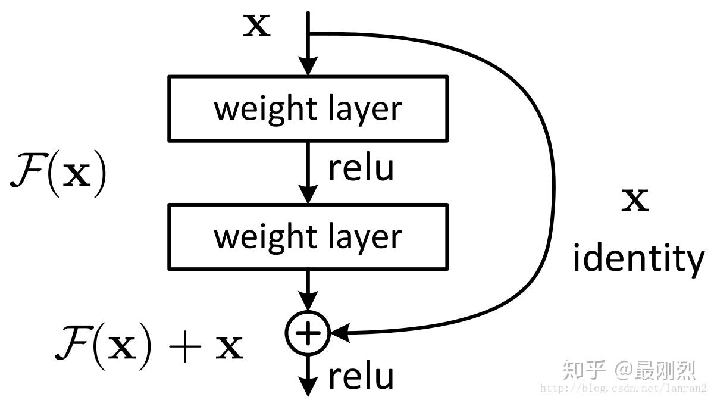
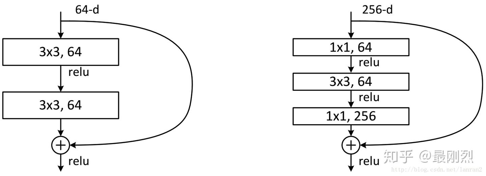
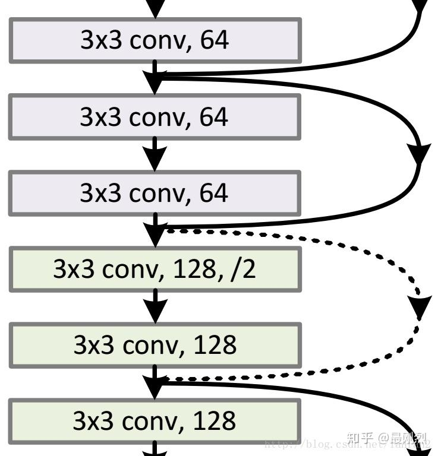
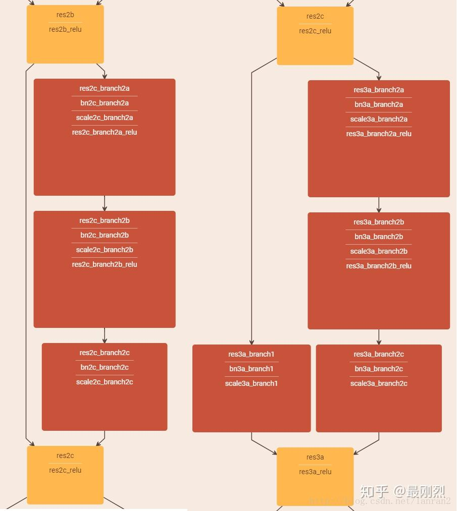
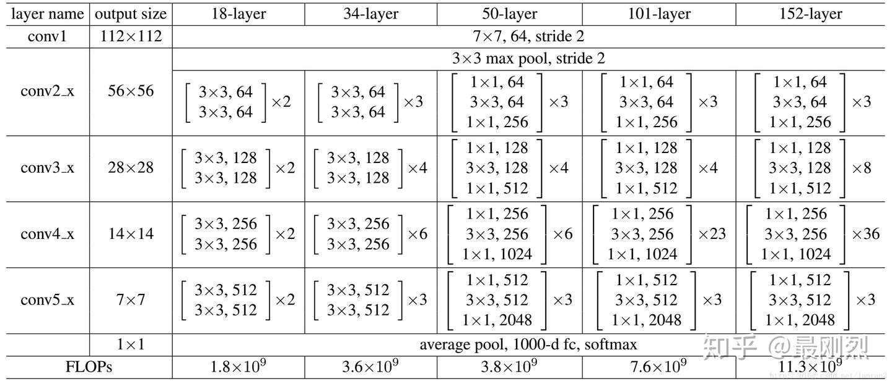
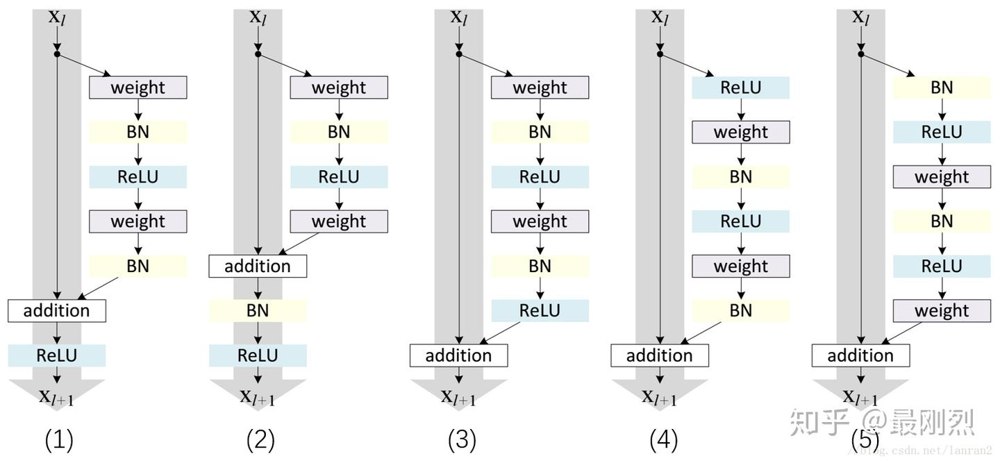
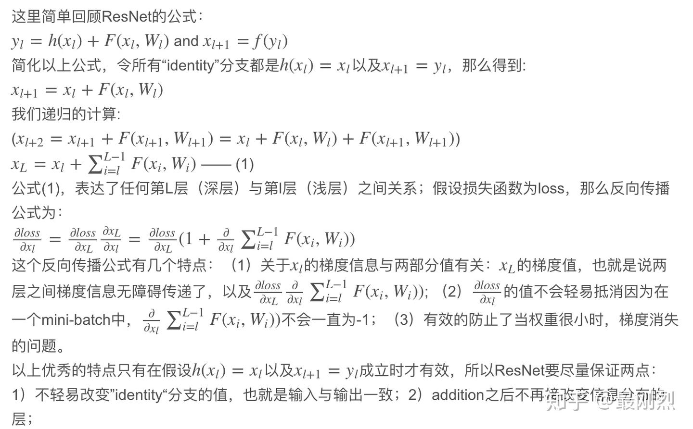
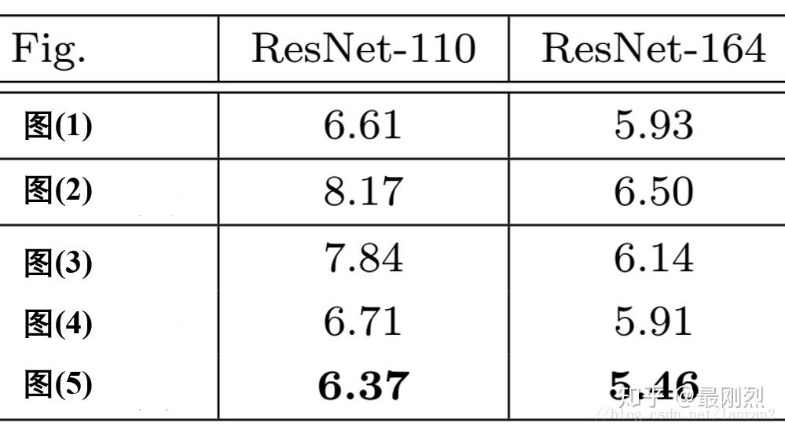
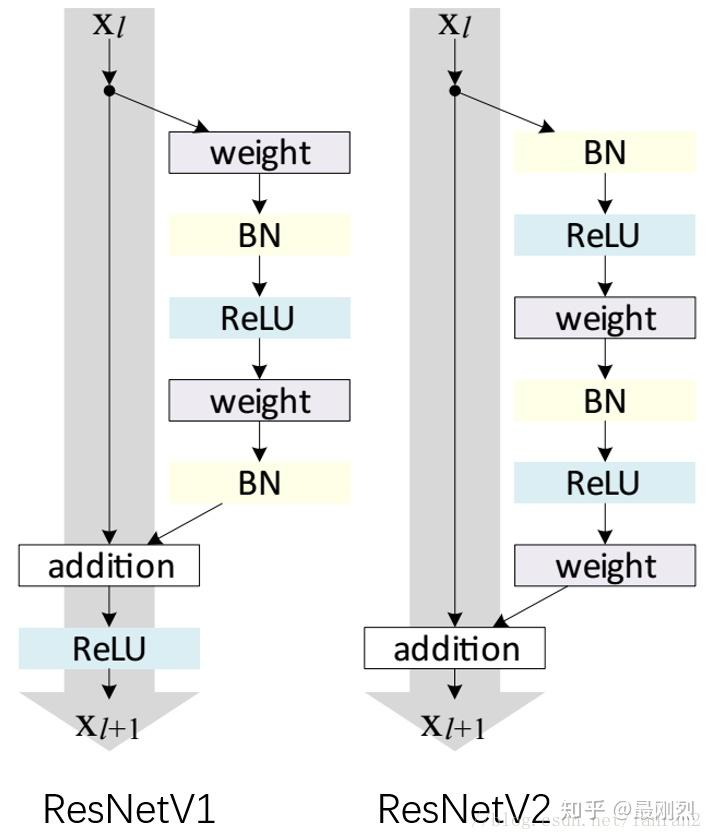

# 经典卷积网络（二）-ResNet

## 一、[ResNet](https://zhida.zhihu.com/search?content_id=102083893&content_type=Article&match_order=1&q=ResNet&zhida_source=entity)（总结自[csdn](https://link.zhihu.com/?target=https%3A//blog.csdn.net/lanran2/article/details/79057994)文章）

随着网络的加深，出现了训练集准确率下降的现象，确定这不是由于Overfit过拟合造成的。作者针对这个问题提出了一种全新的网络，叫[深度残差网络](https://zhida.zhihu.com/search?content_id=102083893&content_type=Article&match_order=1&q=深度残差网络&zhida_source=entity)，它允许网络尽可能的加深，其中引入了全新的结构如图1：

### **残差指的是什么？**

其中ResNet提出了两种mapping：

一种是[identity mapping](https://zhida.zhihu.com/search?content_id=102083893&content_type=Article&match_order=1&q=identity+mapping&zhida_source=entity)，指的就是图1中”弯弯的曲线”，另一种[residual mapping](https://zhida.zhihu.com/search?content_id=102083893&content_type=Article&match_order=1&q=residual+mapping&zhida_source=entity)，指的就是除了”弯弯的曲线“那部分，所以最后的输出是 y=F(x)+x。identity mapping顾名思义，就是指本身，也就是公式中的x，而residual mapping指的是“差”，也就是y−x，所以残差指的就是F(x)部分。

### **为什么ResNet可以解决“随着网络加深，准确率不下降”的问题？**

理论上，对于“随着网络加深，准确率下降”的问题，Resnet提供了两种选择方式，也就是identity mapping和residual mapping，**如果网络已经到达最优，继续加深网络，residual mapping将被push为0，只剩下identity mapping，这样理论上网络一直处于最优状态了**，网络的性能也就不会随着深度增加而降低了。

### **ResNet结构**

它使用了一种连接方式叫做“[shortcut connection](https://zhida.zhihu.com/search?content_id=102083893&content_type=Article&match_order=1&q=shortcut+connection&zhida_source=entity)”，顾名思义，shortcut就是“抄近道”的意思。“弯弯的弧线“这个就是所谓的”shortcut connection“，也是文中提到**identity mapping**，这张图也诠释了ResNet的真谛，真正在使用的ResNet模块**并不是这么单一**，文章中就提出了两种方式：

这两种结构分别针对ResNet34（左图）和ResNet50/101/152（右图），一般称整个结构为一个”building block“。其中右图又称为”bottleneck design”，目的一目了然，就是为了降低参数的数目，第一个1x1的卷积把256维channel降到64维，然后在最后通过1x1卷积恢复，整体上用的参数数目：1x1x256x64 + 3x3x64x64 + 1x1x64x256 = 69632，而不使用bottleneck的话就是两个3x3x256的卷积，参数数目: 3x3x256x256x2 = 1179648，差了16.94倍。

对于常规ResNet，可以用于34层或者更少的网络中，对于Bottleneck Design的ResNet通常用于更深的如101这样的网络中，目的是减少计算和参数量（实用目的）。

### **如果F(x)和x的channel个数不同怎么办，因为F(x)和x是按照channel维度相加的，channel不同怎么相加呢？**

针对channel个数是否相同，要分成两种情况考虑，如下图：

实线的的Connection部分(”第一个粉色矩形和第三个粉色矩形“)都是执行3x3x64的卷积，他们的channel个数一致，所以采用计算方式： y=F(x)+xy=F(x)+x

虚线的的Connection部分(”第一个绿色矩形和第三个绿色矩形“)分别是3x3x64和3x3x128的卷积操作，他们的channel个数不同(64和128)，所以采用计算方式： y=F(x)+Wxy=F(x)+Wx

其中W是卷积操作，用来调整x的channel维度的；

*两种Shortcut Connection方式实例（左图channel一致，右图channel不一样）*

### ResNet50和ResNet101

Resnet网络结构的设计遵循两种设计规则：1）对于相同的输出特征图尺寸，层具有相同数量的滤波器；2）如果特征图大小减半，则滤波器的数量加倍，以便保持每一层的时间复杂度。

这里把ResNet50和ResNet101特别提出，主要因为它们的出镜率很高，所以需要做特别的说明。给出了它们具体的结构：

上面一共提出了5中深度的ResNet，分别是18，34，50，101和152，首先看表2最左侧，我们发现所有的网络都分成5部分，分别是：conv1，conv2_x，conv3_x，conv4_x，conv5_x，之后的其他论文也会专门用这个称呼指代ResNet50或者101的每部分。

**实现部分的 tricks：**

图片resize：短边长random.randint(256,480)；裁剪：224＊224随机采样，含水平翻转；减均值；标准颜色扩充[2]

conv和activation间加batch normalization帮助解决vanishing/exploding问题

minibatch-size:256

learning-rate: 初始0.1, error平了lr就除以10

weight decay：0.0001

momentum：0.9

没用dropout[3]

### 二、[ResNet V2](https://zhida.zhihu.com/search?content_id=102083893&content_type=Article&match_order=1&q=ResNet+V2&zhida_source=entity)（总结自[csdn](https://link.zhihu.com/?target=https%3A//blog.csdn.net/lanran2/article/details/80247515)文章）

下面（1）-（5）的结构哪个是我们常用的ResNet结构？

其中weight指conv层，BN指Batch Normalization层，ReLU指激活层，addition指相加；

根据ResNet的描述，似乎以上五组都符合，那么2016年ResNet原文是哪一个结构呢？以及其他四组结构也都work么？

针对第一个问题，ResNet原文中使用的结构是（1），（1）的特点有两个：1）BN和ReLU在weight的后面；2）最后的ReLU在addition的后面；对于特点1），属于常规范畴，我们平时也都这个顺序：Conv->BN->ReLU；对于特点2），为什么ReLU放在addition后面呢？按照常规，不是应该是图（3）这种么，那么我们接下来引出的问题就是：

图（3）的结构work么？

对于每个图右侧部分我们称作“residual”分支，左侧部分我们称作“identity”分支，如果ReLU作为“residual”分支的结尾，我们不难发现“residual”分支的结果永远非负，这样前向的时候输入会单调递增，从而会影响特征的表达能力，所以我们希望“residual”分支的结果应该在（-∞， +∞）；这点也是我们以后设计网络时所要注意的。

对于图（3）不OK的情况，那如果把BN也挪到addition后面呢？如图（2），同时也保证了“residual”分支的取值范围；

这里BN改变了“identity”分支的分布，影响了信息的传递，在训练的时候会阻碍loss的下降；这里大家肯定又有个问题：

为什么“identity”分支发生变化，会影响信息传递，从而影响训练呢？

**到此也就彻底回答了图（2）的结构为何会阻碍反向传播时的信息。**

在分析图（4）和图（5）之前，我们引出一个概念：”Post-activation”和”Pre-activation”，其中Post和Pre的概念是相对于weight(conv)层来说的，那么我们不难发现，图(1), (2), (3)都是”Post-activation”，图(4), (5)都是”Pre-activation”，那么两种模式哪一个更好呢？这里我们就用实验结果说话。

上图是5种结构在[Cifar10](https://zhida.zhihu.com/search?content_id=102083893&content_type=Article&match_order=1&q=Cifar10&zhida_source=entity)上的实验结果，一共实验了两种网络ResNet110和ResNet164（注：这里直接摘抄了原文的图片，本人并没有真实的试验过）；

从实验结果上，我们可以发现图(4)的结构与ResNet原结构伯仲之间，稍稍逊色，然而图(5)的结构却好于ResNet原结构。图5的结构好的原因在于两点：1）反向传播基本符合假设，信息传递无阻碍；2）BN层作为pre-activation，起到了正则化的作用；

最后我们通常把图5的结构称作ResNetV2，把ResNetV1和ResNetV2结构再次show：

