# 激活函数、ReLU 函数、 Sigmoid 函数、Tanh 函数

我们已经了解了如何使用非线性激活函数（如 ReLU、sigmoid 和 tanh）来构建具有更强表达能力的多层神经网络。值得一提的是，如今借助开源的深度学习框架，只需几行代码即可快速构建模型，而在 20 世纪 90 年代，训练这些网络可能需要数千行 C 或 Fortran 代码。


## 4.1.2 激活函数

激活函数（activation function）用于计算加权和并加上偏置，决定神经元是否被激活。它将输入信号转化为可微的输出，大多数激活函数是非线性的。激活函数是深度学习的基础，下面介绍几种常见的激活函数。

### ReLU 函数

最受欢迎的激活函数是修正线性单元（Rectified Linear Unit, ReLU），它实现简单且在各种预测任务中表现优异。ReLU 提供了一种非常简单的非线性变换，定义为：

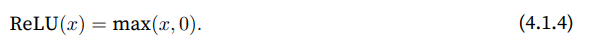

通俗地说，ReLU 通过将负值设为 0，仅保留正数。我们可以通过下列代码绘制 ReLU 函数的曲线来直观感受其行为。正如图中所示，ReLU 是分段线性的。

```apache
import torch
from d2l import torch as d2l

x = torch.arange(-8.0, 8.0, 0.1, requires_grad=True)
y = torch.relu(x)
d2l.plot(x.detach(), y.detach(), 'x', 'relu(x)', figsize=(5, 2.5))
```

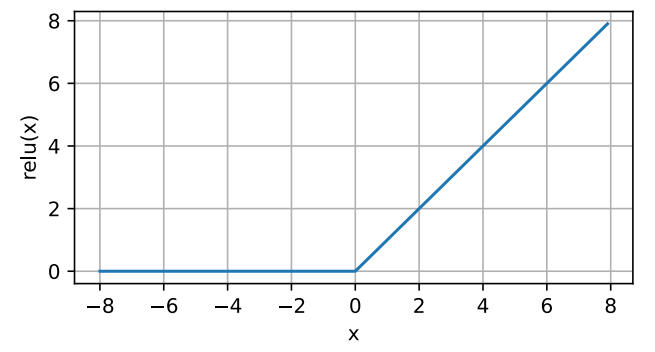

当输入为负时，ReLU 的导数为 0；当输入为正时，导数为 1。当输入值精确等于 0 时，ReLU 不可导，但我们通常忽略这种情况，假设导数为 0。我们可以绘制 ReLU 函数的导数曲线。

```stylus
y.backward(torch.ones_like(x), retain_graph=True)
d2l.plot(x.detach(), x.grad, 'x', 'grad of relu', figsize=(5, 2.5))
```

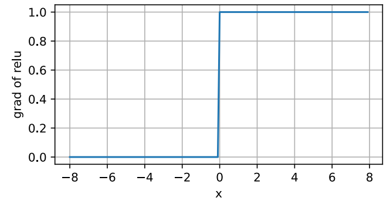

ReLU 的求导性质使得参数要么消失，要么通过，从而优化效果更好，缓解了神经网络中常见的梯度消失问题（将在后续章节介绍）。

#### 参数化 ReLU

ReLU 有许多变体，其中包括参数化 ReLU（Parameterized ReLU, pReLU）。pReLU 为 ReLU 添加了一个线性项，使得即使输入为负，仍有信息可以传递：

pReLU ( x ) = max ⁡ ( 0 , x ) + α min ⁡ ( 0 , x ) . \text{pReLU}(x) = \max(0, x) + \alpha \min(0, x). pReLU(x)=max(0,x)+αmin(0,x).

### Sigmoid 函数

对于定义域在 R \mathbb{R} R 中的输入，sigmoid 函数将输入变换为区间 ( 0 , 1 ) (0, 1) (0,1) 上的输出，因此 sigmoid 通常称为挤压函数（squashing function）。它将任意输入压缩到区间 ( 0 , 1 ) (0, 1) (0,1) 中的某个值，定义如下：

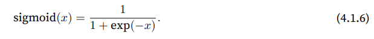

#### 背景

在早期的神经网络中，科学家们通过 sigmoid 函数模拟生物神经元的激发和非激发。它是阈值单元的平滑可微近似，当输入低于某个阈值时输出接近 0，超过阈值时输出接近 1。由于 sigmoid 的平滑性和可导性，它在基于梯度的学习中得到广泛应用，特别是在将输出视为二元分类问题的概率时，仍然使用 sigmoid 作为输出层的激活函数。

然而，随着 ReLU 函数的引入，sigmoid 在隐藏层中的应用逐渐减少，因为 ReLU 更简单且更易于训练。在后续关于循环神经网络的章节中，我们将探讨如何使用 sigmoid 来控制时序信息流。

#### 绘制 sigmoid 函数

我们可以通过代码绘制 sigmoid 函数曲线。注意，当输入接近 0 时，sigmoid 函数近似线性。

```gcode
y = torch.sigmoid(x)
d2l.plot(x.detach(), y.detach(), 'x', 'sigmoid(x)', figsize=(5, 2.5))
```

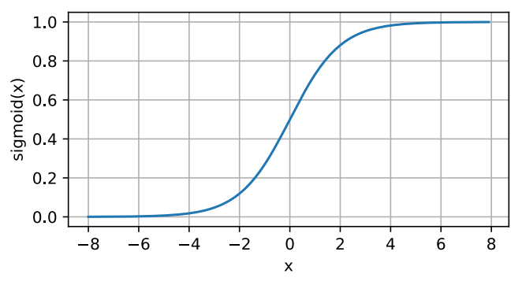

#### Sigmoid 函数的导数

sigmoid 函数的导数公式如下：

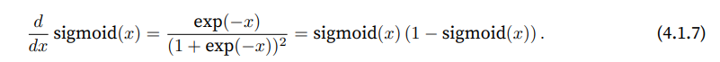

我们可以通过代码绘制 sigmoid 函数的导数曲线。注意，当输入为 0 时，sigmoid 函数的导数达到最大值 0.25；而当输入远离 0 时，导数逐渐趋近于 0。

```routeros
# 清除以前的梯度
x.grad.data.zero_()
y.backward(torch.ones_like(x), retain_graph=True)
d2l.plot(x.detach(), x.grad, 'x', 'grad of sigmoid', figsize=(5, 2.5))
```

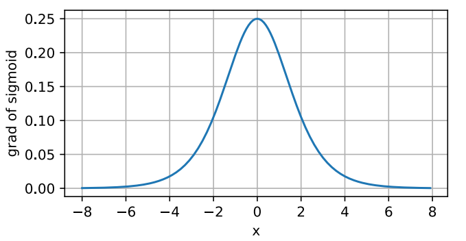

这表明 sigmoid 函数在输入较大或较小时的梯度非常小，这导致在深层网络中可能会出现梯度消失问题。

### Tanh 函数

与 sigmoid 函数类似，tanh（双曲正切）函数也可以将输入压缩到区间 ( − 1 , 1 ) (-1, 1) (−1,1) 上。tanh 函数的公式如下：

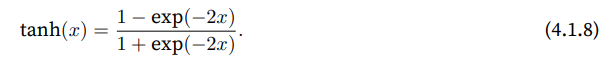

我们可以通过代码绘制 tanh 函数。注意，当输入在 0 附近时，tanh 函数接近线性，且函数关于原点对称。

```stylus
y = torch.tanh(x)
d2l.plot(x.detach(), y.detach(), 'x', 'tanh(x)', figsize=(5, 2.5))
```

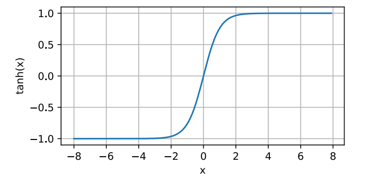

#### Tanh 函数的导数

tanh 函数的导数为：

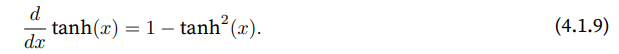

当输入接近 0 时，tanh 函数的导数接近最大值 1。类似于 sigmoid 函数，当输入远离 0 时，导数逐渐趋近于 0。我们可以绘制 tanh 函数的导数图像。

```routeros
# 清除以前的梯度
x.grad.data.zero_()
y.backward(torch.ones_like(x), retain_graph=True)
d2l.plot(x.detach(), x.grad, 'x', 'grad of tanh', figsize=(5, 2.5))
```

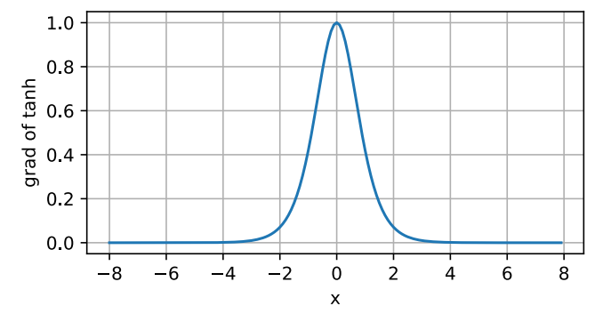

#### 总结

我们已经了解了如何使用非线性激活函数（如 ReLU、sigmoid 和 tanh）来构建具有更强表达能力的多层神经网络。值得一提的是，如今借助开源的深度学习框架，只需几行代码即可快速构建模型，而在 20 世纪 90 年代，训练这些网络可能需要数千行 C 或 Fortran 代码。