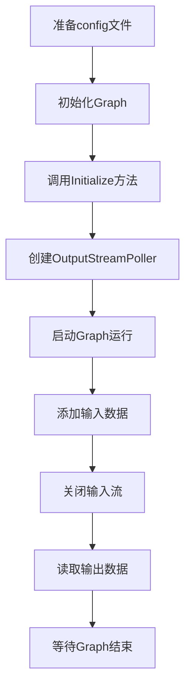

# MediaPipe框架源码分析

## 背景

MediaPipe是由Google开发的开源多媒体机器学习框架，用于构建复杂的媒体处理流水线（Pipeline）。它支持多种平台（移动设备、桌面、Web等），提供预构建的解决方案（如人脸检测、手势识别等），同时允许开发者自定义处理流程。

## 源代码位置

https://github.com/google/mediapipe

## 框架核心概念

MediaPipe的核心是**Graph（图）** 的执行模型：

- **Calculator（计算器）**：基本处理单元，执行具体任务
- **Stream（数据流）**：Calculator之间的通信通道
- **Packet（数据包）**：在Stream中传输的数据单元
- **Side Packet（边包）**：在整个Graph生命周期中保持不变的数据

官方框架概念文档：
 https://google.github.io/mediapipe/framework_concepts/framework_concepts.html#the-basics

## Hello World示例分析

`hello_world.cc`位置：
 https://github.com/google/mediapipe/blob/master/mediapipe/examples/desktop/hello_world/hello_world.cc

### Graph运行流程详解



### 详细步骤解析

1. **准备config文件**

   - 定义Graph结构的protobuf文本配置

   - 示例配置：

     ```proto
     input_stream: "in"
     output_stream: "out"
     node {
       calculator: "PassThroughCalculator"
       input_stream: "in"
       output_stream: "out"
     }
     ```

2. **初始化Graph**

   ```cpp
   mediapipe::CalculatorGraph graph;
   MP_RETURN_IF_ERROR(graph.Initialize(config));
   ```

3. **创建输出流轮询器(OutputStreamPoller)**

   ```cpp
   ASSIGN_OR_RETURN(mediapipe::OutputStreamPoller poller,
                    graph.AddOutputStreamPoller("out"));
   ```

4. **启动Graph运行**

   ```cpp
   MP_RETURN_IF_ERROR(graph.StartRun({}));
   ```

5. **添加输入数据**

   ```cpp
   for (int i = 0; i < 10; ++i) {
     mediapipe::Timestamp timestamp(i);
     MP_RETURN_IF_ERROR(graph.AddPacketToInputStream(
         "in", mediapipe::MakePacket<int>(i).At(timestamp)));
   }
   ```

6. **关闭输入流**

   ```cpp
   MP_RETURN_IF_ERROR(graph.CloseInputStream("in"));
   ```

7. **读取输出数据**

   ```cpp
   mediapipe::Packet packet;
   while (poller.Next(&packet)) {
     LOG(INFO) << "Output: " << packet.Get<int>();
   }
   ```

8. **等待Graph结束**

   ```cpp
   MP_RETURN_IF_ERROR(graph.WaitUntilDone());
   ```

## 关键源码分析

### Calculator实现

`PassThroughCalculator`核心代码：

```cpp
class PassThroughCalculator : public CalculatorBase {
 public:
  static absl::Status GetContract(CalculatorContract* cc) {
    cc->Inputs().Index(0).SetAny();
    cc->Outputs().Index(0).SetSameAs(&cc->Inputs().Index(0));
    return absl::OkStatus();
  }

  absl::Status Process(CalculatorContext* cc) final {
    cc->Outputs().Index(0).AddPacket(cc->Inputs().Index(0).Value());
    return absl::OkStatus();
  }
};
```

### 核心类说明

1. **CalculatorGraph**
   - 图执行引擎
   - 负责调度Calculator的执行
   - 管理数据流和生命周期
2. **CalculatorBase**
   - 所有计算器的基类
   - 开发者必须实现：
     - `GetContract()`：定义输入输出规范
     - `Process()`：实际处理逻辑
3. **Packet**
   - 类型化的数据容器
   - 包含时间戳信息
   - 支持基本类型和自定义protobuf

## 框架优势

1. **跨平台支持**：统一的API支持Android、iOS、桌面和Web
2. **高性能**：基于C++实现，支持GPU加速
3. **模块化设计**：可复用组件和预构建解决方案
4. **灵活的数据流管理**：支持同步/异步处理模式
5. **丰富的内置组件**：提供超过60个预构建的Calculator

## 总结

MediaPipe通过Graph的执行模型，将复杂的媒体处理流程分解为可管理的计算单元。其核心设计围绕Calculator、Stream和Packet展开，提供了高效、灵活的多媒体处理能力。Hello World示例展示了最基本的Graph执行流程，而实际应用中可组合多个Calculator构建复杂的处理流水线。