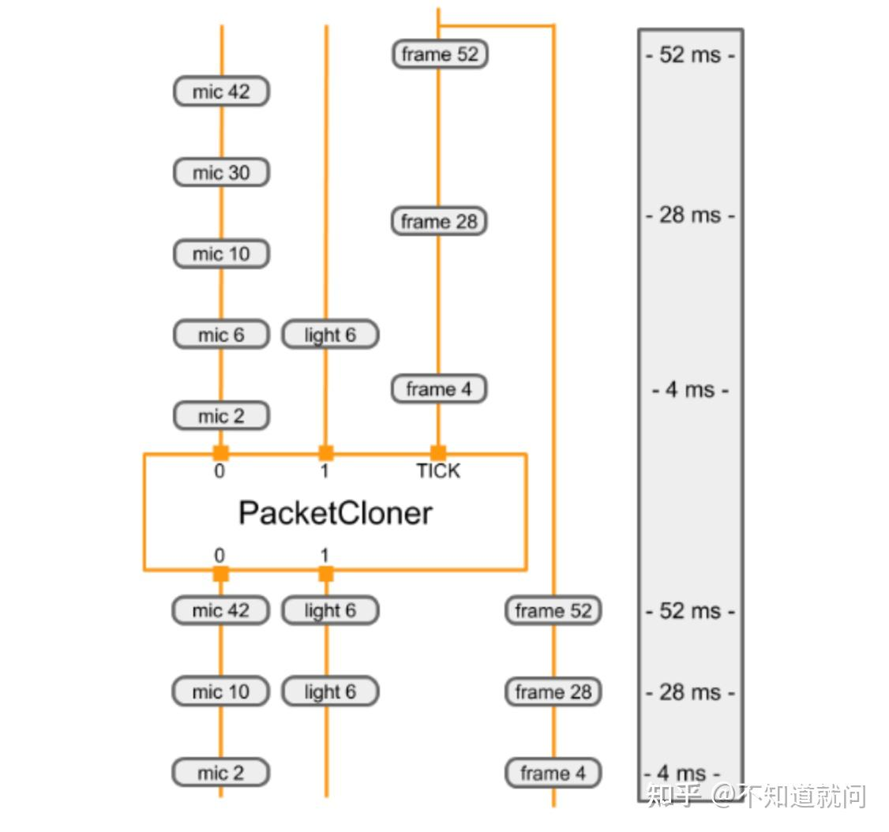

# MediaPipe学习笔记二（Calculators详讲）

## **Calculators**

每一个calculator都是graph中一个节点，这篇文章我们将描述如何创建一个calculator，如何初始化calculator，如何执行计算，输入和输出流，时间戳和选项；每一个graph中的node都称为`Calculator`,大部分graph 的执行发生在Calculator内部。一个calculator 可以接受零个或多个输入流/side packets，同时也可以生成零个或者多个输出流/side packets。

## **CalculatorBase**

一个`Calculator`被`CalculatorBase`类的一个子类创建，实现了一些方法，在Mediapipe中注册了新的子类，一个新的`Calculator`至少要实现以下四个方法

- `GetContract()`

- - `Calculator` 的作者可以在`GetContract()`指定一个`Calculator`预计的输入和输出。当一个graph被初始化时，架构将调用一个[静态方法](https://zhida.zhihu.com/search?content_id=219995475&content_type=Article&match_order=1&q=静态方法&zhida_source=entity)来验证连接的输入和输出的packet类型是否与本规范中的信息匹配。

- `Open()`

- - graph开始运行后，架构将调用`Open()`。The input side packets可用于此时的`Calculator`。`Open()`解析node配置，准备`Calculator` 的per-graph-run 状态。该函数也能将packets写入calculator 输出。`Open()`的运行错误可以终止graph的运行。

- `Process()`

- - 对于有输入的`Calculator`,只要至少一个输入流有可用的packet，架构就会重复调用`Process()`。默认情况下，框架保证所有输入具有相同的时间戳。启用[并行执行](https://zhida.zhihu.com/search?content_id=219995475&content_type=Article&match_order=1&q=并行执行&zhida_source=entity)时，可以同时调用多个 `Process()` 调用。如果在 `Process()` 期间发生错误，框架将调用 `Close()` 并且图形运行终止。

- `Close()`

- - 所有的Process()执行结束或者所有的输入流都已关闭，框架将调用`Close()`。如果Open()被调用并成功，即使graph运行因错误而终止也会始终调用此函数。在调用close()期间，任何输入流都是不可用的输入。但它仍然可以访问输入端数据包，因此可以写入输出。Close() 返回后，`Calculator`应被视为死节点。一旦graph运行完毕，`Calculator`对象就会被销毁。

以下是CalculatorBase相关代码

```cpp
class CalculatorBase {
 public:
  ...

  // The subclasses of CalculatorBase must implement GetContract.
  // ...
  static absl::Status GetContract(CalculatorContract* cc);

  // Open is called before any Process() calls, on a freshly constructed
  // calculator.  Subclasses may override this method to perform necessary
  // setup, and possibly output Packets and/or set output streams' headers.
  // ...
  virtual absl::Status Open(CalculatorContext* cc) {
    return absl::OkStatus();
  }

  // Processes the incoming inputs. May call the methods on cc to access
  // inputs and produce outputs.
  // ...
  virtual absl::Status Process(CalculatorContext* cc) = 0;

  // Is called if Open() was called and succeeded.  Is called either
  // immediately after processing is complete or after a graph run has ended
  // (if an error occurred in the graph).  ...
  virtual absl::Status Close(CalculatorContext* cc) {
    return absl::OkStatus();
  }

  ...
};
```


## **Life of a calculator（calculator 生命周期）**

一个 MediaPipe graph被初始化期间，框架调用GetContract()静态方法确定预期的packet类型。

graph负责整个calculator的运行构建和销毁。在graph运行期间昂贵的大的对象应该被输入侧供应，为了在后续的运行中不会被重复计算。

初始化之后，graph每次运行都会按以下顺序：

- `Open()`
- `Process()` (repeatedly)
- `Close()`

框架调用`Open()`去初始化`calculator`，`open()`解析任何选项并设置`calculator`的per-graph-run 状态。`Open()` 可以获得输入侧数据包并将数据包写入`calculator`输出。如果合适，它应该调用 `SetOffset()` 来减少输入流的数据包缓冲。

如果调用`Open()`或者`Process()`发生错误，graph 将被终止该`calculator`的方法，该`calculator`被销毁。

对于具有输入的`calculator`，只要至少一个输入有可用的数据包，框架就会调用 Process()。框架保证所有的输入都有相同的时间戳，时间戳随着每次调用 `Process()` 而增加，并且所有数据包都已传入。因此，调用 Process() 时，某些输入可能没有任何数据包。缺少数据包的输入似乎会产生一个空数据包（没有时间戳）。

调用`process（）`之后会调用`close()`。所有的输入都已经完成，但 `Close()` 可以访问输入端数据包并可以写入输出。 `Close`返回后，`calculator`被销毁。

没有输入的`calculator`称为源（`sources`）,只要`source calculator`返回`ok` 状态，它将会继续调用`Process()`。一个`source calculator`通过返回一个`stop`状态来表示它已经执行完。（例如`mediaPipe::tool::StatusStop()`.）

## **Identifying inputs and outputs**

`calculator`的公共接口由一组输入流和输出流组成。在`CalculatorGraphConfiguration`中，一些`calculator`的输出连接到其他`calculator`得输入。`stream`的命名通常是小写的，而输入和输出的标签通常是大写的。在下面的例子中，有标签名`VIDEO`的输出通过名字为`video_stream`的`stream`连接到标签为`VIDEO_IN`的输入上。

```text
# Graph describing calculator SomeAudioVideoCalculator
node {
  calculator: "SomeAudioVideoCalculator"
  input_stream: "INPUT:combined_input"
  output_stream: "VIDEO:video_stream"
}
node {
  calculator: "SomeVideoCalculator"
  input_stream: "VIDEO_IN:video_stream"
  output_stream: "VIDEO_OUT:processed_video"
}
```

输入和输出流可以通过索引号，标签名或者标签名加索引组合识别。在下面的例子中能看到输入和输出标识符的示例。`SomeAudioVideoCalculator`通过标签识别其视频输出，通过标签和索引的组合识别其音频输出。带有`VIDEO`标签的输入连接到名为`video_stream`的`stream`上。带有`AUDIO`标签的输出和索引`0`和`1`连接到名为`audio_left`和`audio_right`的`stream`上。`SomeAudioCalculator`仅通过索引识别其音频输入（不需要标签）

```text
# Graph describing calculator SomeAudioVideoCalculator
node {
  calculator: "SomeAudioVideoCalculator"
  input_stream: "combined_input"
  output_stream: "VIDEO:video_stream"
  output_stream: "AUDIO:0:audio_left"
  output_stream: "AUDIO:1:audio_right"
}

node {
  calculator: "SomeAudioCalculator"
  input_stream: "audio_left"
  input_stream: "audio_right"
  output_stream: "audio_energy"
}
```

在calculator实现中，输入和输出也由标签名称和索引号标识。在下面的函数中，输入和输出被识别：

- 索引号：组合输入流仅由索引 0 标识。
- 标签名称：视频输出流由标签名称“VIDEO”标识。
- 标签名称和索引号：输出音频流由标签名称 AUDIO 和索引号 0 和 1 的组合标识。

```cpp
// c++ Code snippet describing the SomeAudioVideoCalculator GetContract() method
class SomeAudioVideoCalculator : public CalculatorBase {
 public:
  static absl::Status GetContract(CalculatorContract* cc) {
    cc->Inputs().Index(0).SetAny();
    // SetAny() is used to specify that whatever the type of the
    // stream is, it's acceptable.  This does not mean that any
    // packet is acceptable.  Packets in the stream still have a
    // particular type.  SetAny() has the same effect as explicitly
    // setting the type to be the stream's type.
    cc->Outputs().Tag("VIDEO").Set<ImageFrame>();
    cc->Outputs().Get("AUDIO", 0).Set<Matrix>();
    cc->Outputs().Get("AUDIO", 1).Set<Matrix>();
    return absl::OkStatus();
  }
```

## **Processing**

`Process()`在非源节点上调用必须返回`absl::OkStatus()`以表示执行成功，或者返回任何其他状态码表示错误。

如果一个 `non-source calculator` 返回`tool::StatusStop()`，然后这标志着`graph`被提前取消了。在这种情况下，所有的`source calculators`和`graph input streams` 将被关闭。

只要`source node` 返回 `absl::OkStatus()`，图中的源节点将继续调用 `Process()`。`source node` 返回 `tool::StatusStop()`表示没有更多的数据生成了。除此之外任何其他的状态都表示发生了错误。

`Close()`返回`absl::OkStatus()`表示成功，任何其他状态都表示失败。

这是最基本的Process()函数，它使用input()方法（只有当calculator只有一个输入时才能使用）去请求他的输入数据。然后它使用 `std::unique_ptr` 分配输出数据包所需的内存，并进行计算。完成后，它会将指针添加到输出流并释放指针。

```cpp
absl::Status MyCalculator::Process() {
  const Matrix& input = Input()->Get<Matrix>();
  std::unique_ptr<Matrix> output(new Matrix(input.rows(), input.cols()));
  // do your magic here....
  //    output->row(n) =  ...
  Output()->Add(output.release(), InputTimestamp());
  return absl::OkStatus();
}
```

## **Calculator options**

`calculator`通过 (1) 输入流数据包 (2) 输入端数据包和 (3)`calculator option`接受处理参数。如果指定 `calculator option`,则在 `CalculatorGraphConfiguration.Node` 消息的 `node_options` 字段中显示。

```cpp
node {
    calculator: "TfLiteInferenceCalculator"
    input_stream: "TENSORS:main_model_input"
    output_stream: "TENSORS:main_model_output"
    node_options: {
      [type.googleapis.com/mediapipe.TfLiteInferenceCalculatorOptions] {
        model_path: "mediapipe/models/detection_model.tflite"
      }
    }
  }
```

`node_options` 字段接受 `proto3` 语法。或者，可以使用 `proto2` 语法在选项字段中指定`calculator options`。

```text
node {
    calculator: "TfLiteInferenceCalculator"
    input_stream: "TENSORS:main_model_input"
    output_stream: "TENSORS:main_model_output"
    node_options: {
      [type.googleapis.com/mediapipe.TfLiteInferenceCalculatorOptions] {
        model_path: "mediapipe/models/detection_model.tflite"
      }
    }
}
```

并非所有的`calculator`都要有`calculator options`，为了接受这个配置，`calculator`需要定义一个新的`protobuf` 消息类型来表示它的配置，像`PacketClonerCalculatorOptions`。`calculator`随后将读取`protobuf message` 在它的`CalculatorBase::Open`方法里，也可能在其`CalculatorBase::GetContract` 或者`CalculatorBase::Process`方法里。通常情况下，一个新的 `protobuf message type` 将被定义成一个“`.proto`”文件并通过`mediapipe_proto_library()`建立规则。

```text
  mediapipe_proto_library(
      name = "packet_cloner_calculator_proto",
      srcs = ["packet_cloner_calculator.proto"],
      visibility = ["//visibility:public"],
      deps = [
          "//mediapipe/framework:calculator_options_proto",
          "//mediapipe/framework:calculator_proto",
      ],
  )
```


## **Example calculator**

本节讨论 PacketClonerCalculator 的实现，它做的工作相对简单，并在许多calculator graphs中使用。 PacketClonerCalculator 只是按需生成其最新输入数据包的副本。

当到达数据包的时间戳没有完全对齐时，PacketClonerCalculator 很有用。 假设我们有一个房间，里面有麦克风、光传感器和正在收集感官数据的摄像机。 每个传感器独立运行并间歇性地收集数据。 假设每个传感器的输出为：

- 麦克风 = 房间内声音的响度（以分贝为单位） (Integer)
- 光传感器 = 房间的亮度 (Integer)
- 摄像机 = 房间的RGB图像框 (ImageFrame)

我们简单的感知管道旨在处理来自这 3 个传感器的感官数据，以便在任何时候当我们从相机获得与最后收集的图像帧数据与麦克风响度数据和光传感器亮度数据同步。 要使用 MediaPipe 做到这一点，我们的感知管道有 3 个输入流：

- room_mic_signal - 表示带有时间戳的房间中的音频音量（此输入流中的每个数据包都是整数数据）
- room_lightening_sensor - 表示带有时间戳的房间照明度。（此输入流中的每个数据包都是整数数据）
- room_video_tick_signal - 表示从房间中的摄像机收集的带有时间戳的视频。（此输入流中的每个数据包都是视频数据的图像帧）

下面是 `PacketClonerCalculator` 的实现。您可以看到 `GetContract()`、`Open()` 和 `Process()` 方法以及保存最新输入数据包的实例变量 current_。

```cpp
// This takes packets from N+1 streams, A_1, A_2, ..., A_N, B.
// For every packet that appears in B, outputs the most recent packet from each
// of the A_i on a separate stream.

#include <vector>

#include "absl/strings/str_cat.h"
#include "mediapipe/framework/calculator_framework.h"

namespace mediapipe {

// For every packet received on the last stream, output the latest packet
// obtained on all other streams. Therefore, if the last stream outputs at a
// higher rate than the others, this effectively clones the packets from the
// other streams to match the last.
//
// Example config:
// node {
//   calculator: "PacketClonerCalculator"
//   input_stream: "first_base_signal"
//   input_stream: "second_base_signal"
//   input_stream: "tick_signal"
//   output_stream: "cloned_first_base_signal"
//   output_stream: "cloned_second_base_signal"
// }
//
class PacketClonerCalculator : public CalculatorBase {
 public:
  static absl::Status GetContract(CalculatorContract* cc) {
    const int tick_signal_index = cc->Inputs().NumEntries() - 1;
    // cc->Inputs().NumEntries() returns the number of input streams
    // for the PacketClonerCalculator
    for (int i = 0; i < tick_signal_index; ++i) {
      cc->Inputs().Index(i).SetAny();
      // cc->Inputs().Index(i) returns the input stream pointer by index
      cc->Outputs().Index(i).SetSameAs(&cc->Inputs().Index(i));
    }
    cc->Inputs().Index(tick_signal_index).SetAny();
    return absl::OkStatus();
  }

  absl::Status Open(CalculatorContext* cc) final {
    tick_signal_index_ = cc->Inputs().NumEntries() - 1;
    current_.resize(tick_signal_index_);
    // Pass along the header for each stream if present.
    for (int i = 0; i < tick_signal_index_; ++i) {
      if (!cc->Inputs().Index(i).Header().IsEmpty()) {
        cc->Outputs().Index(i).SetHeader(cc->Inputs().Index(i).Header());
        // Sets the output stream of index i header to be the same as
        // the header for the input stream of index i
      }
    }
    return absl::OkStatus();
  }

  absl::Status Process(CalculatorContext* cc) final {
    // Store input signals.
    for (int i = 0; i < tick_signal_index_; ++i) {
      if (!cc->Inputs().Index(i).Value().IsEmpty()) {
        current_[i] = cc->Inputs().Index(i).Value();
      }
    }

    // Output if the tick signal is non-empty.
    if (!cc->Inputs().Index(tick_signal_index_).Value().IsEmpty()) {
      for (int i = 0; i < tick_signal_index_; ++i) {
        if (!current_[i].IsEmpty()) {
          cc->Outputs().Index(i).AddPacket(
              current_[i].At(cc->InputTimestamp()));
          // Add a packet to output stream of index i a packet from inputstream i
          // with timestamp common to all present inputs
        } else {
          cc->Outputs().Index(i).SetNextTimestampBound(
              cc->InputTimestamp().NextAllowedInStream());
          // if current_[i], 1 packet buffer for input stream i is empty, we will set
          // next allowed timestamp for input stream i to be current timestamp + 1
        }
      }
    }
    return absl::OkStatus();
  }

 private:
  std::vector<Packet> current_;
  int tick_signal_index_;
};

REGISTER_CALCULATOR(PacketClonerCalculator);
}  // namespace mediapipe
```

通常，calculator只有一个 .cc 文件。 不需要 .h，因为 mediapipe 使用注册来让calculator为它所知。 定义calculator类后，使用宏调用 REGISTER_CALCULATOR(calculator_class_name) 对其进行注册。

下面是一个简单的 MediaPipe 图，它有 3 个输入流、1 个节点 (PacketClonerCalculator) 和 2 个输出流。

```text
input_stream: "room_mic_signal"
input_stream: "room_lighting_sensor"
input_stream: "room_video_tick_signal"

node {
   calculator: "PacketClonerCalculator"
   input_stream: "room_mic_signal"
   input_stream: "room_lighting_sensor"
   input_stream: "room_video_tick_signal"
   output_stream: "cloned_room_mic_signal"
   output_stream: "cloned_lighting_sensor"
 }
```

下图显示了 `PacketClonerCalculator` 如何根据其一系列输入数据包（顶部）定义其输出数据包（底部）。



每次在其 TICK 输入流上接收到数据包时，PacketClonerCalculator 都会从其每个输入流中输出最新的数据包。 输出数据包的顺序（底部）由输入数据包的顺序（顶部）及其时间戳决定。 时间戳显示在图表的右侧。


参考[Calculators](https://link.zhihu.com/?target=https%3A//google.github.io/mediapipe/framework_concepts/calculators.html)

