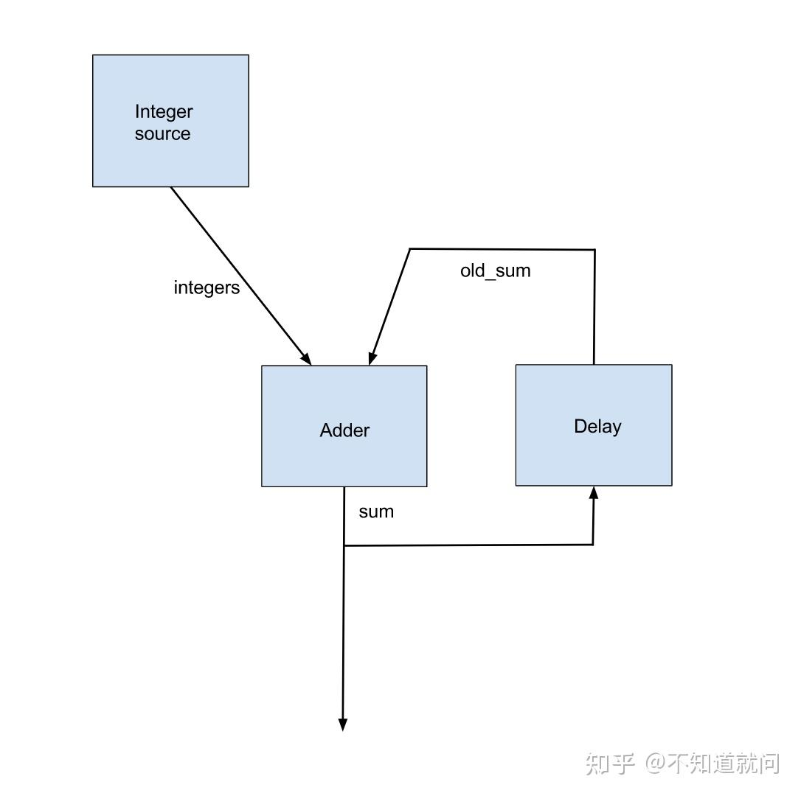

# MediaPipe学习笔记三（Graph详讲）

## **前言**

**Graph**定义了节点(**Node**)之间的数据包流路径。一个**Graph**可以有任意数量的输入和输出，**Packet** 可以向前流动，也可构成循环，其流动路径与实际业务相关。用户通过编写[配置文件](https://zhida.zhihu.com/search?content_id=219961774&content_type=Article&match_order=1&q=配置文件&zhida_source=entity)（GraphConfig）来描述 **Graph** 的拓扑结构以及实现的[业务流程](https://zhida.zhihu.com/search?content_id=219961774&content_type=Article&match_order=1&q=业务流程&zhida_source=entity)，可在配置文件中定义 **Graph** 的输入和输出。

## **GraphConfig(graph配置文件)**

`GraphConfig` 是描述MediaPipe graph的拓扑结构和功能的规范，在该规范中，一个node代表一个特定calculator的实例。node的所有必要配置必须在规范中进行描述，像其类型，输入和输出。node的描述也包括一些可选字段，比如特定节点选项，输入策略和执行程序，详见【MediaPipe学习笔记（Synchronization.）】

`GraphConfig` 有一些字段来配置全局graph-level 的配置，例如：图执行器配置（graph executor configs）, 线程数（number of threads）, and输入流的最大队列大小（ maximum queue size of input streams），这些配置对于调整Graph 在不同平台（桌面或者移动端）上的性能很有用。例如，在移动设备上，将重型模型推理calculator附加到单独的执行器（executor）能提高实时应用的性能。

下面是一个简单的 GraphConfig 示例：

```text
# This graph named main_pass_throughcals_nosubgraph.pbtxt contains 4
# passthrough calculators.
input_stream: "in"
node {
    calculator: "PassThroughCalculator"
    input_stream: "in"
    output_stream: "out1"
}
node {
    calculator: "PassThroughCalculator"
    input_stream: "out1"
    output_stream: "out2"
}
node {
    calculator: "PassThroughCalculator"
    input_stream: "out2"
    output_stream: "out3"
}
node {
    calculator: "PassThroughCalculator"
    input_stream: "out3"
    output_stream: "out4"
}
```


## **Subgraph（子图）**

为了模版化`CalculatorGraphConfig`变成sub-modules 和重用感知解决方案，因此一个MediaPipe graph可以被定义成`Subgraph`,`Subgraph`的公共接口由一组输入和输出流组成，类似于calculator的公共接口。`Subgraph`的语义和性能与相应的计算器图相同。

1. 定义一个`Subgraph`

```text
# This subgraph is defined in two_pass_through_subgraph.pbtxt
# and is registered as "TwoPassThroughSubgraph"

type: "TwoPassThroughSubgraph"
input_stream: "out1"
output_stream: "out3"

node {
    calculator: "PassThroughCalculator"
    input_stream: "out1"
    output_stream: "out2"
}
node {
    calculator: "PassThroughCalculator"
    input_stream: "out2"
    output_stream: "out3"
}
```

`Subgraph`公共接口包括：

- Graph input streams
- Graph output streams
- Graph input side packets
- Graph output side packets

1. 注册一个`Subgraph`使用BUILD规则`mediapipe_simple_subgraph`参数`register_as`定义新`Subgraph`的组件名

```text
# Small section of BUILD file for registering the "TwoPassThroughSubgraph"
# subgraph for use by main graph main_pass_throughcals.pbtxt

mediapipe_simple_subgraph(
    name = "twopassthrough_subgraph",
    graph = "twopassthrough_subgraph.pbtxt",
    register_as = "TwoPassThroughSubgraph",
    deps = [
            "//mediapipe/calculators/core:pass_through_calculator",
            "//mediapipe/framework:calculator_graph",
    ],
)
```

1. 在主graph中使用subgraph

```text
# This main graph is defined in main_pass_throughcals.pbtxt
# using subgraph called "TwoPassThroughSubgraph"

input_stream: "in"
node {
    calculator: "PassThroughCalculator"
    input_stream: "in"
    output_stream: "out1"
}
node {
    calculator: "TwoPassThroughSubgraph"
    input_stream: "out1"
    output_stream: "out3"
}
node {
    calculator: "PassThroughCalculator"
    input_stream: "out3"
    output_stream: "out4"
}
```

## **Graph Options（图选项）**

可以为graph 指定“graph options”类似于calculator的“calculator o ptions”。

在CalculatorGraphConfig 中，subgraph的option与calculatoroptions 类似，如下：

```text
node {
  calculator: "FlowLimiterCalculator"
  input_stream: "image"
  output_stream: "throttled_image"
  node_options: {
    [type.googleapis.com/mediapipe.FlowLimiterCalculatorOptions] {
      max_in_flight: 1
    }
  }
}

node {
  calculator: "FaceDetectionSubgraph"
  input_stream: "IMAGE:throttled_image"
  node_options: {
    [type.googleapis.com/mediapipe.FaceDetectionOptions] {
      tensor_width: 192
      tensor_height: 192
    }
  }
}
```

在CalculatorGraphConfig 中，graph options 用于补充calculator options，如下：

```text
graph_options: {
  [type.googleapis.com/mediapipe.FaceDetectionOptions] {}
}

node: {
  calculator: "ImageToTensorCalculator"
  input_stream: "IMAGE:multi_backend_image"
  node_options: {
    [type.googleapis.com/mediapipe.ImageToTensorCalculatorOptions] {
        keep_aspect_ratio: true
        border_mode: BORDER_ZERO
    }
  }
  option_value: "output_tensor_width:options/tensor_width"
  option_value: "output_tensor_height:options/tensor_height"
}

node {
  calculator: "InferenceCalculator"
  node_options: {
    [type.googleapis.com/mediapipe.InferenceCalculatorOptions] {}
  }
  option_value: "delegate:options/delegate"
  option_value: "model_path:options/model_path"
}
```

在这个例子中，`FaceDetectionSubgraph` 接受图形选项 protobuf `FaceDetectionOptions`。 `FaceDetectionOptions` 用于定义calculator options `ImageToTensorCalculatorOptions` 中的一些字段值以及subgraph options InferenceCalculatorOptions 中的一些字段值。 使用 option_value: 语法定义字段值。

在 `CalculatorGraphConfig::Node`中字段`node_options:`和`option_value:`共同定义calculator option。例如`ImageToTensorCalculator`，`node_options:`字段定义了一系列常量。`option_value:`字段定义了从graph获取的信息，在上面的例子中`option_value: "output_tensor_width:options/tensor_width"`使用了`FaceDetectionOptions.tensor_width`.

`option_value:`的语法类似于`input_stream:`语法为：`option_value: "LHS:RHS"`LHS标识 calculator option字段，RHS 标识graph option字段。更具体地说，LHS 和 RHS 每个都包含一系列 protobuf field names，用于标识嵌套的 protobuf 消息和由“/”分隔的字段。被称为“ProtoPath”语法。 LHS 或 RHS 中引用的嵌套消息必须已经在封闭的 protobuf 中定义，以便使用 `option_value:` 遍历。

## **Cycles（循环）**

默认 Graph 是非循环的，即 Graph 必须是[有向无环图](https://zhida.zhihu.com/search?content_id=219961774&content_type=Article&match_order=1&q=有向无环图&zhida_source=entity)。如需支持循环的 Graph （即 Graph 是有向环状的），需在 Node 中针对接收 Back Edge 的 input stream 增加“input_stream_info”结构体，在该结构体中配置“back_edge”为“true”。如果同一个 Node 中多个 input stream 都需要设置 Back Edge，则需增加多个“input_stream info”结构体。

使用CalculatorGraphTest.Cycle[单元测试](https://zhida.zhihu.com/search?content_id=219961774&content_type=Article&match_order=1&q=单元测试&zhida_source=entity)`mediapipe/framework/calculator_graph_test.cc`作为示例代码，下图是该的[循环图](https://zhida.zhihu.com/search?content_id=219961774&content_type=Article&match_order=1&q=循环图&zhida_source=entity)。Adder的sum输出是 `integer source calculator`产生的integers累加；



### **Back Edge Annotation**

我们要求每个循环中的一条边被标注为back edge。并要求MediaPipe 的[拓扑排序](https://zhida.zhihu.com/search?content_id=219961774&content_type=Article&match_order=1&q=拓扑排序&zhida_source=entity)在移除所有back edge后仍然起作用。

有很多方法确定back edge，任何一条边被标记成back edge作用的节点将被定义成上下游节点，这将会影响MediaPipe分配给节点的优先级。

例如， `CalculatorGraphTest.Cycle`标记`old_sum`边作为back edge。因此，`the Delay node`被认为是下游节点，`the adder node`拥有更高的优先级。或者，我们能标记`sum`做为`back edge`,在这种情况下`the delay node`被认为是上游节点，`the adder node` 拥有更低的优先级。

### **Initial Packet（初始化包）**

为了使`the adder calculator`在来自`integer source`的第一个整数到达时可运行，我们需要一个初始packet，其值为 0 并具有相同的时间戳，在加法器的 old_sum 输入流上。 这个初始packet应该由`the delay calculator`中的 Open() 方法中的输出。

### **Delay in a Loop（延迟循环）**

每个循环都应产生延迟，以将前一个总和输出与下一个整数输入对齐。这也是由延迟节点(delay node)完成的。所以延迟节点需要知道 integer source calculator的时间戳如下：

- 第一个输出的时间戳。
- 连续输出之间的时间戳增量。

我们计划添加一个替代调度策略，它只关心数据包顺序而忽略数据包时间戳，这将消除这种不便。

### **Early Termination of a Calculator When One Input Stream is Done**

默认情况下，MediaPipe 在其所有输入流完成时调用非源计算器( non-source calculator)的 Close() 方法。 在示例图中，我们希望在整数源完成后立即停止`the adder node`。 这是通过使用替代输入流处理程序 `EarlyCloseInputStreamHandler` 配置`the adder node`来实现的。

### **Relevant Source Code（相关源码）**

### **DELAY CALCULATOR**

请注意 Open() 中输出初始数据包的代码和 Process() 中向输入数据包添加（单位）延迟的代码。 如上所述，此延迟节点假定其输出流与数据包时间戳为 0、1、2、3 ……的输入流一起使用

```cpp
class UnitDelayCalculator : public Calculator {
 public:
  static absl::Status FillExpectations(
      const CalculatorOptions& extendable_options, PacketTypeSet* inputs,
      PacketTypeSet* outputs, PacketTypeSet* input_side_packets) {
    inputs->Index(0)->Set<int>("An integer.");
    outputs->Index(0)->Set<int>("The input delayed by one time unit.");
    return absl::OkStatus();
  }

  absl::Status Open() final {
    Output()->Add(new int(0), Timestamp(0));
    return absl::OkStatus();
  }

  absl::Status Process() final {
    const Packet& packet = Input()->Value();
    Output()->AddPacket(packet.At(packet.Timestamp().NextAllowedInStream()));
    return absl::OkStatus();
  }
};
```

### **GRAPH CONFIG**

请注意 back_edge 注释和替代的 `input_stream_handler`。

```text
node {
  calculator: 'GlobalCountSourceCalculator'
  input_side_packet: 'global_counter'
  output_stream: 'integers'
}
node {
  calculator: 'IntAdderCalculator'
  input_stream: 'integers'
  input_stream: 'old_sum'
  input_stream_info: {
    tag_index: ':1'  # 'old_sum'
    back_edge: true
  }
  output_stream: 'sum'
  input_stream_handler {
    input_stream_handler: 'EarlyCloseInputStreamHandler'
  }
}
node {
  calculator: 'UnitDelayCalculator'
  input_stream: 'sum'
  output_stream: 'old_sum'
}
```


参考：[Graphs](https://google.github.io/mediapipe/framework_concepts/graphs.html)