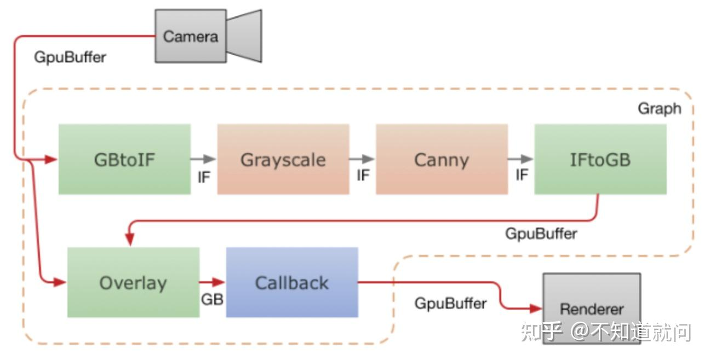

# MediaPipe学习笔记五（GPU支持）

## **Overview**

MediaPipe 支持用于 GPU 计算和渲染的calculator节点，并允许组合多个 GPU 节点，以及将它们与基于 CPU 的calculator节点混合。[移动平台](https://zhida.zhihu.com/search?content_id=220016525&content_type=Article&match_order=1&q=移动平台&zhida_source=entity)上存在多个 GPU API（例如，OpenGL ES、Metal 和 Vulkan）。MediaPipe 不会尝试提供单一的跨 API GPU 抽象。各个节点可以使用不同的 API 编写，允许它们在需要时利用平台特定的功能。

GPU 支持对于移动平台的良好性能至关重要，尤其是对于实时视频。 MediaPipe 使开发人员能够编写支持 GPU 用于以下用途的 GPU 兼容的calculator：

- 设备上实时处理，而不仅仅是批处理
- 视频渲染和效果，不只是分析

下面是MediaPipe中GPU支持的设计原则

- 基于GPU的calculator应该能够出现在graph的任何地方，不一定用于屏幕渲染。
- 将帧数据从一个基于 GPU 的calculator传输到另一个calculator应该很快，并且不会产生昂贵的复制操作。
- CPU 和 GPU 之间的帧数据传输应该与平台允许的一样高效。
- 因为不同的平台可能需要不同的技术来获得最佳性能，所以 API 应该允许在实现上的方式具有灵活性。
- 允许计算器在使用 GPU 进行全部或部分操作时具有最大的灵活性，必要时也能将其与 CPU 结合使用。

## **OpenGL ES Support**

> **OpenGL**（英语：*Open Graphics Library*，译名：**开放[图形库](https://zhida.zhihu.com/search?content_id=220016525&content_type=Article&match_order=1&q=图形库&zhida_source=entity)**或者“[开放式图形库](https://zhida.zhihu.com/search?content_id=220016525&content_type=Article&match_order=1&q=开放式图形库&zhida_source=entity)”）是用于[渲染](https://link.zhihu.com/?target=https%3A//zh.wikipedia.org/wiki/%E6%B8%B2%E6%9F%93)[2D](https://link.zhihu.com/?target=https%3A//zh.wikipedia.org/wiki/%E4%BA%8C%E7%BB%B4%E8%AE%A1%E7%AE%97%E6%9C%BA%E5%9B%BE%E5%BD%A2)、[3D](https://link.zhihu.com/?target=https%3A//zh.wikipedia.org/wiki/%E4%B8%89%E7%B6%AD%E8%A8%88%E7%AE%97%E6%A9%9F%E5%9C%96%E5%BD%A2)[矢量图形](https://link.zhihu.com/?target=https%3A//zh.wikipedia.org/wiki/%E7%9F%A2%E9%87%8F%E5%9C%96%E5%BD%A2)的跨[语言](https://link.zhihu.com/?target=https%3A//zh.wikipedia.org/wiki/%E7%A8%8B%E5%BC%8F%E8%AA%9E%E8%A8%80)、[跨平台](https://link.zhihu.com/?target=https%3A//zh.wikipedia.org/wiki/%E8%B7%A8%E5%B9%B3%E5%8F%B0)的[应用程序编程接口](https://link.zhihu.com/?target=https%3A//zh.wikipedia.org/wiki/%E5%BA%94%E7%94%A8%E7%A8%8B%E5%BA%8F%E7%BC%96%E7%A8%8B%E6%8E%A5%E5%8F%A3)（API）。这个接口由近350个不同的函数调用组成，用来从简单的图形比特绘制复杂的三维景象。而另一种[程序接口](https://zhida.zhihu.com/search?content_id=220016525&content_type=Article&match_order=1&q=程序接口&zhida_source=entity)系统是仅用于[Microsoft Windows](https://link.zhihu.com/?target=https%3A//zh.wikipedia.org/wiki/Microsoft_Windows)上的[Direct3D](https://link.zhihu.com/?target=https%3A//zh.wikipedia.org/wiki/Direct3D)。OpenGL常用于[CAD](https://link.zhihu.com/?target=https%3A//zh.wikipedia.org/wiki/%E8%AE%A1%E7%AE%97%E6%9C%BA%E8%BE%85%E5%8A%A9%E8%AE%BE%E8%AE%A1)、[虚拟现实](https://link.zhihu.com/?target=https%3A//zh.wikipedia.org/wiki/%E8%99%9B%E6%93%AC%E5%AF%A6%E5%A2%83)、科学可视化程序和[电子游戏开发](https://link.zhihu.com/?target=https%3A//zh.wikipedia.org/wiki/%E7%94%B5%E5%AD%90%E6%B8%B8%E6%88%8F%E5%BC%80%E5%8F%91)。
> OpenGL的高效实现（利用图形加速硬件）存在于[Windows](https://link.zhihu.com/?target=https%3A//zh.wikipedia.org/wiki/Microsoft_Windows)，部分[UNIX](https://link.zhihu.com/?target=https%3A//zh.wikipedia.org/wiki/UNIX)平台和[Mac OS](https://link.zhihu.com/?target=https%3A//zh.wikipedia.org/wiki/Mac_OS)。这些实现一般由显示设备厂商提供，而且非常依赖于该厂商提供的硬件。[开放源代码](https://link.zhihu.com/?target=https%3A//zh.wikipedia.org/wiki/%E9%96%8B%E6%94%BE%E5%8E%9F%E5%A7%8B%E7%A2%BC)库[Mesa](https://link.zhihu.com/?target=https%3A//zh.wikipedia.org/wiki/Mesa_library)是一个纯基于软件的图形API，它的代码兼容于OpenGL。但是，由于许可证的原因，它只声称是一个“非常相似”的API。

MediaPipe 在 Android/Linux 上支持最高 3.2 版的 OpenGL ES，在 iOS 上最高支持 ES 3.0。此外，MediaPipe 还支持 iOS 上的 Metal。

运行机器学习推理calculators和graphs需要 OpenGL ES 3.1 或更高版本（在 Android/Linux 系统上）。

MediaPipe 允许graphs在多个 GL 上下文中运行 OpenGL。例如，这在将较慢的 GPU inferences paths（例如，10 FPS）与更快的 GPU [渲染路径](https://zhida.zhihu.com/search?content_id=220016525&content_type=Article&match_order=1&q=渲染路径&zhida_source=entity)（例如，30 FPS）相结合的图形中非常有用：由于一个 GL 上下文对应一个顺序[命令队列](https://zhida.zhihu.com/search?content_id=220016525&content_type=Article&match_order=1&q=命令队列&zhida_source=entity)，因此对两个任务使用相同的上下文会降低渲染帧率。

MediaPipe 使用多个上下文解决的一项挑战是跨上下文进行通信的能力。一个示例场景是将输入视频发送到渲染和inferences paths，并且渲染需要访问inferences的最新输出。

多个线程不能同时访问 OpenGL 上下文。此外，在同一线程上切换活动 GL 上下文在某些 Android 设备上可能会很慢。因此，MediaPipe的方法是为每个上下文设置一个专用线程。每个线程发出 GL 命令，在其上下文中建立一个串行命令队列，然后由 GPU 异步执行。

## **Life of a GPU Calculator**

本节介绍从基类 `GlSimpleCalculator` 派生的 `GPU calculator`的 `Process` 方法的基本结构。该`GPU calculator`作为示例显示（`LuminanceCalculator`），`LuminanceCalculator::GlRender` 方法从 `GlSimpleCalculator::Process` 调用。

```cpp
// Converts RGB images into luminance images, still stored in RGB format.
// See GlSimpleCalculator for inputs, outputs and input side packets.
class LuminanceCalculator : public GlSimpleCalculator {
 public:
  absl::Status GlSetup() override;
  absl::Status GlRender(const GlTexture& src,
                        const GlTexture& dst) override;
  absl::Status GlTeardown() override;

 private:
  GLuint program_ = 0;
  GLint frame_;
};
REGISTER_CALCULATOR(LuminanceCalculator);

absl::Status LuminanceCalculator::GlRender(const GlTexture& src,
                                           const GlTexture& dst) {
  static const GLfloat square_vertices[] = {
      -1.0f, -1.0f,  // bottom left
      1.0f,  -1.0f,  // bottom right
      -1.0f, 1.0f,   // top left
      1.0f,  1.0f,   // top right
  };
  static const GLfloat texture_vertices[] = {
      0.0f, 0.0f,  // bottom left
      1.0f, 0.0f,  // bottom right
      0.0f, 1.0f,  // top left
      1.0f, 1.0f,  // top right
  };

  // program
  glUseProgram(program_);
  glUniform1i(frame_, 1);

  // vertex storage
  GLuint vbo[2];
  glGenBuffers(2, vbo);
  GLuint vao;
  glGenVertexArrays(1, &vao);
  glBindVertexArray(vao);

  // vbo 0
  glBindBuffer(GL_ARRAY_BUFFER, vbo[0]);
  glBufferData(GL_ARRAY_BUFFER, 4 * 2 * sizeof(GLfloat), square_vertices,
               GL_STATIC_DRAW);
  glEnableVertexAttribArray(ATTRIB_VERTEX);
  glVertexAttribPointer(ATTRIB_VERTEX, 2, GL_FLOAT, 0, 0, nullptr);

  // vbo 1
  glBindBuffer(GL_ARRAY_BUFFER, vbo[1]);
  glBufferData(GL_ARRAY_BUFFER, 4 * 2 * sizeof(GLfloat), texture_vertices,
               GL_STATIC_DRAW);
  glEnableVertexAttribArray(ATTRIB_TEXTURE_POSITION);
  glVertexAttribPointer(ATTRIB_TEXTURE_POSITION, 2, GL_FLOAT, 0, 0, nullptr);

  // draw
  glDrawArrays(GL_TRIANGLE_STRIP, 0, 4);

  // cleanup
  glDisableVertexAttribArray(ATTRIB_VERTEX);
  glDisableVertexAttribArray(ATTRIB_TEXTURE_POSITION);
  glBindBuffer(GL_ARRAY_BUFFER, 0);
  glBindVertexArray(0);
  glDeleteVertexArrays(1, &vao);
  glDeleteBuffers(2, vbo);

  return absl::OkStatus();
}
```

上面介绍的设计原则在MediaPipe GPU 体现如下：

- 我们有一个GPU数据类型，称为GpuBuffer，用于表示图像数据，该数据类型针对GPU的使用进行了优化。该数据类型的具体内容是不透明的并且平台特定（platform-specific）。
- 基于组合的低级（low-level ）API，任何想要使用GPU的calculator都可以创建拥有GlCalculatorHelper自己的实例。此类提供了一个与平台无关的API，用于管理Open GL上下文，为输入和输出设置结构。
- 基于子类的高级API，简单的calculators实现图片过滤子类来自于GlSimpleCalculator 并且只需要重写几个使用特定的OpenGL代码编写的virtual methods 。
- 需要在所有基于 GPU 的calculators之间共享的数据作为外部输入提供，该输入作为graph服务实现并由 GlCalculatorHelper 类管理。
- calculator-specific helpers 和shared graph service相结合使得我们能更加灵活的使用GPU资源：每个calculator我们可以有一个单独的上下文，共享一个上下文，共享一个锁或其他[同步原语](https://zhida.zhihu.com/search?content_id=220016525&content_type=Article&match_order=1&q=同步原语&zhida_source=entity)等。所有的这些都由helper管理，并且对各个calculators隐藏。

## **GpuBuffer to ImageFrame Converters**

mediaPipe提供了两个calcultors分别是GpuBufferToImageFrameCalculator 和ImageFrameToGpuBufferCalculator。它们用于ImageFrame和GpuBuffer相互转换，允许有GPU和CPU的calculators的graphs构建。他们支持在iOS 和 Android上。

这些[calculators](https://zhida.zhihu.com/search?content_id=220016525&content_type=Article&match_order=6&q=calculators&zhida_source=entity) 使用平台特定的功能在CPU和GPU之间共享数据，而无需复制。

下图显示了数据流在一个移动应用的过程，从相机捕捉视频，通过MediaPipe graph 运行它并在屏幕上实时呈现输出。虚线表示哪些部分在MediaPipe graph的内部。这个应用运行使用OpenCV实现了一个精细的边缘检测运行在CPU上，并使用GPU将其叠加在原始视频之上。



来自相机的视频帧被送入graph作为GpuBuffer packets。这个输入流被两个calculators同时访问。GpuBufferToImageFrameCalculator 将buffer转化成ImageFrame，然后送入一个灰度转化器和一个canny中（基于OpenCV运行在CPU上），然后输出再转化成GpuBuffer。一个多输入的GPU calculator （GlOverlayCalculator）将原始GpuBuffer和边缘检测器的输出作为输入，并用overlay 覆盖它们。然后使用回调calculator将输出发送回应用程序。然后应用程序使用 OpenGL 将图像呈现到屏幕上。


参考：[https://google.github.io/mediap](https://link.zhihu.com/?target=https%3A//google.github.io/mediapipe/framework_concepts/gpu.html%23opengl-es-support)

