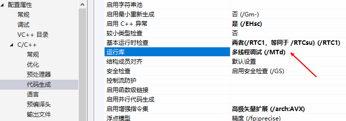

# win10 + VS2017 + MNN 编译使用


## 1. VS2017 安装

1. 从[这里](https://visualstudio.microsoft.com/zh-hans/vs/older-downloads/)下载在线安装器，随后在 cmd 窗口中离线下载安装包：

```
vs_Professional.exe --layout D:\vs2017-offline --lang zh-CN 
```

下载完后，双击 vs_setup.exe 安装


## 2. 配置高版本 cmake 到环境变量

 去[这里](https://cmake.org/download/)下载好了 ，然后将可执行程序所在文件夹添加到环境变量

```
D:\cmake-3.20.2-windows-x86_64\bin
```


## 3. MNN 推理框架编译

去官网下载 MNN 源码到本地

### 3.1 编译 flatbuffers

右键管理员运行 “VS 2017 的开发人员命令提示符”

```
"C:\Program Files (x86)\Microsoft Visual Studio\2017\Professional\VC\Auxiliary\Build\vcvars64.bat"
cd D:\MNN\3rd_party\flatbuffers
mkdir tmp && cd tmp
cmake -G "Ninja" -DCMAKE_BUILD_TYPE=Release ..
ninja
```


### 3.2 编译 推理框架

右键管理员运行 “VS 2017 的开发人员命令提示符”, 这里需要借助 powershell 

```
"C:\Program Files (x86)\Microsoft Visual Studio\2017\Professional\VC\Auxiliary\Build\vcvars64.bat"
cd D:\MNN
powershell set-executionpolicy -executionpolicy unrestricted
powershell ./schema/generate.ps1
powershell .\package_scripts\win\build_lib.ps1 -path MNN-CPU/lib/x64
```

完成后在 D:\MNN\MNN-CPU 这地方会有各种版本的推理库


## 4. MNN Demo& Convert 编译


### 4.1 编译 protobuf

参考[官方教程](https://github.com/protocolbuffers/protobuf/blob/master/cmake/README.md )

这里我选择使用 VS 编译 Debug 和 Release 版本

右键管理员运行 “VS 2017 的开发人员命令提示符”:

```
"C:\Program Files (x86)\Microsoft Visual Studio\2017\Professional\VC\Auxiliary\Build\vcvars64.bat"
cd cmake
mkdir build & cd build
mkdir solution & cd solution
cmake -G "Visual Studio 15 2017 Win64" -Dprotobuf_MSVC_STATIC_RUNTIME=ON -Dprotobuf_BUILD_TESTS=OFF -DCMAKE_INSTALL_PREFIX=../../../../install ../..
```

然后用 VS2017 分别编译出 Debug 和 Release 版本，双击 extract_includes.bat 复制头文件

最后将 include 和 Release(Debug）生成文件夹加入环境变量


### 4.2 单独编译 demo

右键管理员运行 “VS 2017 的开发人员命令提示符”:

```
"C:\Program Files (x86)\Microsoft Visual Studio\2017\Professional\VC\Auxiliary\Build\vcvars64.bat"
cd D:\MNN
mkdir build_demo
cd build_demo
cmake -G "NMake Makefiles" -DCMAKE_BUILD_TYPE=Release -DMNN_BUILD_DEMO=ON ..
nmake
```

 

### 4.3 单独编译 convert

 右键管理员运行 “VS 2017 的开发人员命令提示符”:

```
"C:\Program Files (x86)\Microsoft Visual Studio\2017\Professional\VC\Auxiliary\Build\vcvars64.bat"
cd D:\MNN
powershell set-executionpolicy -executionpolicy unrestricted
powershell .\package_scripts\win\build_tools.ps1 -path MNN-CPU/lib/x64
```

### 4.4 换个姿势

这里其实可以修改 build_tools.ps1

```
mkdir build_convert  # mkdir build  
pushd build_convert  # pushd build
```

并启用 build_all, 借助 powershell 

```
"C:\Program Files (x86)\Microsoft Visual Studio\2017\Professional\VC\Auxiliary\Build\vcvars64.bat"
cd D:\MNN
powershell set-executionpolicy -executionpolicy unrestricted
powershell .\package_scripts\win\build_tools.ps1 -path MNN-CPU/lib/x64 -build_all
```


## 5. MNN Debug 编译

### 5.1 Debug

 右键管理员运行 “VS 2017 的开发人员命令提示符”:

```
"C:\Program Files (x86)\Microsoft Visual Studio\2017\Professional\VC\Auxiliary\Build\vcvars64.bat"
cd D:\MNN
mkdir build_debug& cd build_debug
cmake -G "Visual Studio 15 2017 Win64" -DMNN_BUILD_SHARED_LIBS=ON -DMNN_BUILD_CONVERTER=ON -DMNN_BUILD_DEMO=ON -DCMAKE_BUILD_TYPE=Debug ..
```

随后打开创建的 VS 工程编译即可

注意：这里的运行库方式要和 protobuf Debug 生成时保持一致

 


### 5.2 OpenCL

同上面一样，换个姿势再来一次

右键管理员运行 “VS 2017 的开发人员命令提示符”:

```
"C:\Program Files (x86)\Microsoft Visual Studio\2017\Professional\VC\Auxiliary\Build\vcvars64.bat"
cd D:\MNN
mkdir build_opencl & cd build_opencl
cmake -G "Visual Studio 15 2017 Win64" -DMNN_OPENCL=ON DMNN_BUILD_DEMO=ON -DCMAKE_BUILD_TYPE=Debug ..
```

随后打开创建的 VS 工程编译即可


### 5.2 Vulkan

。。。, 换个姿势再来一次

右键管理员运行 “VS 2017 的开发人员命令提示符”:

```
"C:\Program Files (x86)\Microsoft Visual Studio\2017\Professional\VC\Auxiliary\Build\vcvars64.bat"
cd D:\MNN
mkdir build_vulkan & cd build_vulkan
cmake -G "Visual Studio 15 2017 Win64" -DMNN_VULKAN=ON -DMNN_BUILD_DEMO=ON -DCMAKE_BUILD_TYPE=Debug ..
```

随后打开创建的 VS 工程编译即可，注意 VulkanRuntime.cpp 需要改下编码格式为 ANSI


### 5.4 测试代码

选择 [caffe mobilenet ](https://github.com/shicai/MobileNet-Caffe)的分类网络


#### 5.2.1 MNN 转换模型 MNNConvert

```
-f CAFFE --modelFile D:/MNN/demo/model/MobileNet/Caffe_MobileNet_V2/mobilenet_v2.caffemodel --prototxt D:/MNN/demo/model/MobileNet/Caffe_MobileNet_V2/mobilenet_v2_deploy.prototxt --MNNModel D:/MNN/demo/model/MobileNet/mobilenet_v2.mnn --bizCode biz
```

#### 5.2.2 MNN 推理 pictureRecognition.out

```
D:/MNN/demo/model/MobileNet/mobilenet_v2.mnn D:/MNN/demo/model/MobileNet/testcat.jpg D:/MNN/demo/model/MobileNet/synset_words.txt
```

```
Can't Find type=4 backend, use 0 instead
Can't Find type=4 backend, use 0 instead
input: w:224 , h:224, bpp: 3
origin size: 480, 360
output size:1000
Egyptian cat: 0.196567
tiger cat: 0.125614
tabby, tabby cat: 0.097382
red fox, Vulpes vulpes: 0.092684
kit fox, Vulpes macrotis: 0.077640
hare: 0.058969
wood rabbit, cottontail, cottontail rabbit: 0.033735
grey fox, gray fox, Urocyon cinereoargenteus: 0.026056
Norwich terrier: 0.022280
Pomeranian: 0.016270
```


#### 5.2.3 原始 python Caffe

```
import argparse
import numpy as np
import caffe


def eval(opt):
    nh, nw = opt.img_size, opt.img_size
    img_mean = np.array(opt.img_mean, dtype=np.float32)

    # caffe.set_mode_cpu()
    caffe.set_device(0)
    caffe.set_mode_gpu()
    net = caffe.Net(opt.proto, opt.model, caffe.TEST)

    im = caffe.io.load_image(opt.image)
    h, w, _ = im.shape
    if h < w:
        off = int((w - h) / 2)
        im = im[:, off:off + h]
    else:
        off = (h - w) / 2
        im = im[off:off + h, :]
    im = caffe.io.resize_image(im, [nh, nw])

    transformer = caffe.io.Transformer({'data': net.blobs['data'].data.shape})
    transformer.set_transpose('data', (2, 0, 1))  # row to col
    transformer.set_channel_swap('data', (2, 1, 0))  # RGB to BGR
    transformer.set_raw_scale('data', 255)  # [0,1] to [0,255]
    transformer.set_mean('data', img_mean)
    transformer.set_input_scale('data', opt.img_scale)

    net.blobs['data'].reshape(1, 3, nh, nw)
    net.blobs['data'].data[...] = transformer.preprocess('data', im)
    # np.save('data', net.blobs['data'].data[0])
    out = net.forward()
    prob = out['prob']
    prob = np.squeeze(prob)
    idx = np.argsort(-prob)

    label_names = np.loadtxt('synset.txt', str, delimiter='\t')
    for i in range(5):
        label = idx[i]
        print('%.2f - %s' % (prob[label], label_names[label]))
    return


if __name__ == '__main__':
    parser = argparse.ArgumentParser(description='evaluate pretrained mobilenet models')
    parser.add_argument('--proto', dest='proto', default='MobileNet V2/mobilenet_v2_deploy.prototxt',
                        help="path to deploy prototxt.", type=str)
    parser.add_argument('--model', dest='model', default='MobileNet V2/mobilenet_v2.caffemodel',
                        help='path to pretrained weights', type=str)
    parser.add_argument('--image', dest='image', default='testcat.jpg',
                        help='path to color image', type=str)
    parser.add_argument('--img-size', type=int, default=224, help='inference size (pixels)')
    parser.add_argument('--img-mean', type=list, default=[103.94,116.78,123.68], help='image mean [103.94,116.78,123.68]')
    parser.add_argument('--img-scale', type=float, default=0.017, help='scale image 0.017/1')
    opt = parser.parse_args()
    eval(opt)
```


```
0.25 - 'tiger cat'
0.17 - ‘Egyptian cat'
0.13 - 'tabby, tabby cat'
0.06 - 'red fox, Vulpes vulpes'
0.03 - 'hare'
```


### 5.2.4 调用 python MNN

```
pip install MNN
pip install MNNCV
```

```
import numpy as np
import MNN
import cv2


def inference():
    """ inference mobilenet_v1 using a specific picture """
    interpreter = MNN.Interpreter("D:/MNN/demo/model/MobileNet/mobilenet_v2.mnn")
    interpreter.setCacheFile('.tempcache')
    config = {}
    config['precision'] = 'low'
    session = interpreter.createSession()
    input_tensor = interpreter.getSessionInput(session)
    image = cv2.imread('D:/MNN/demo/model/MobileNet/testcat.jpg')
    # cv2 read as bgr format
    # image = image[..., ::-1] # convert to RGB
    # change to rgb format
    image = cv2.resize(image, (224, 224))
    # resize to mobile_net tensor size
    image = image - (103.94, 116.78, 123.68)
    image = image * (0.017, 0.017, 0.017)
    # preprocess it
    image = image.transpose((2, 0, 1))
    # change numpy data type as np.float32 to match tensor's format
    image = image.astype(np.float32)
    # image = np.load('data.npy')
    # cv2 read shape is NHWC, Tensor's need is NCHW,transpose it
    tmp_input = MNN.Tensor((1, 3, 224, 224), MNN.Halide_Type_Float,
                           image, MNN.Tensor_DimensionType_Caffe)
    input_tensor.copyFrom(tmp_input)
    interpreter.runSession(session)
    output_tensor = interpreter.getSessionOutput(session)
    # constuct a tmp tensor and copy/convert in case output_tensor is nc4hw4
    tmp_output = MNN.Tensor((1, 1000), MNN.Halide_Type_Float, np.ones([1, 1000]).astype(np.float32),
                            MNN.Tensor_DimensionType_Caffe)
    output_tensor.copyToHostTensor(tmp_output)
    print("expect 983")
    print("output belong to class: {}".format(np.argmax(tmp_output.getData())))
    prob = np.array(tmp_output.getData())
    idx = np.argsort(-prob)
    label_names = np.loadtxt('synset.txt', str, delimiter='\t')
    for i in range(5):
        label = idx[i]
        print('%.2f - %s' % (prob[label], label_names[label]))


if __name__ == "__main__":
    inference()
```


```
0.21 - 'Egyptian cat'
0.12 - 'tiger cat'
0.10 - 'tabby, tabby cat'
0.08 - 'red fox, Vulpes vulpes'
0.07 - 'kit fox, Vulpes macrotis'
```

三者的差别在于输入图片读取方式（python mnn 的输入替换成 python caffe 的输入层，二者推理结果一致）

PS: 注意，在源代码上添加中文注释的话，记得要手动将源代码的编码改成 ANSI，否则会出现出人意料的 bug！


## 6. Others

### 6.1 模型可视化

官方推荐 [netron ](http://lutzroeder.github.io/netron/)来可视化网络结构


### 6.2 MNN 工作台

 

### 6.3 MNN 代码

1. 这里控制推理方式

```
ScheduleConfig config;
config.type = MNN_FORWARD_AUTO;
```

2. MNN 中数据按照 HxWx(C+1）存储

```
auto values = input->host<float>();
```

