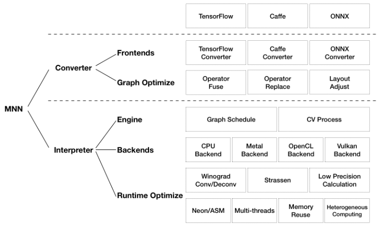
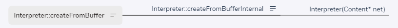

# MNN createFromBuffer（一）

## 一、MNN 资料

    MNN 是一个轻量级的深度神经网络推理引擎，在端侧加载深度神经网络模型进行推理预测。目前，MNN已经在阿里巴巴的手机淘宝、手机天猫、优酷等20多个App中使用，覆盖直播、短视频、搜索推荐、商品图像搜索、互动营销、权益发放、安全风控等场景。此外，IoT等场景下也有若干应用。

[MNN GitHub](https://github.com/alibaba/MNN)
[MNN 工作台产品手册](https://www.yuque.com/mnn/droiug/lbk1t6)
[中文文档](https://www.yuque.com/mnn/cn)

[MNN框架学习与分析](https://zhuanlan.zhihu.com/p/600907100)
[深入浅出 FlatBuffers 之 Schema](https://halfrost.com/flatbuffers_schema/)


## 1、架构设计




    MNN 可以分为 Converter 和 Interpreter 两部分。

    Converter 由 Frontends 和 Graph Optimize 构成。前者负责支持不同的训练框架，MNN 当前支持 Tensorflow(Lite)、Caffe 和 ONNX(PyTorch/MXNet 的模型可先转为 ONNX 模型再转到 MNN )；后者通过算子融合、算子替代、布局调整等方式优化图。

    Interpreter 由 Engine 和 Backends 构成。前者负责模型的加载、计算图的调度；后者包含各计算设备下的内存分配、Op 实现。在 Engine 和 Backends 中，MNN 应用了多种优化方案，包括在卷积和反卷积中应用 Winograd 算法、在矩阵乘法中应用 Strassen 算法、低精度计算、Neon 优化、手写汇编、多线程优化、内存复用、异构计算等。

## 二、使用示例

		// 创建解释器 Interpreter
		auto net_ = Interpreter* createFromFile(const char* file);
		
		// 创建运行时 Runtime
		ScheduleConfig config;
		config.numberThread = 4;
		auto runtimeInfo = Interpreter::createRuntime({config});		
	
		// 创建会话 Session
		auto session = net_->createSession(config, runtimeInfo);
	
		// 执行推理
		net_->runSession(session1);	
	


## 三、源码分析

1、createFromFile、createFromBuffer
    createFromFile、createFromBuffer 把模型读入，并放置在结构体 Content 的 buffer 中。



    // source/core/Interpreter.cpp
    Interpreter* Interpreter::createFromFile(const char* file) {
        Content* net = loadModelFile(file);
        if (nullptr == net) {
            return nullptr;
        }
    
        return createFromBufferInternal(net, true);
    }
    
    Interpreter* Interpreter::createFromBuffer(const void* buffer, size_t size) {
        if (nullptr == buffer || 0 == size) {
            MNN_PRINT("Buffer is null for create interpreter\n");
            return nullptr;
        }
        auto net = new Content;
        net->buffer.reset((int)size);
        if (nullptr == net->buffer.get()) {
            MNN_ERROR("Memory not enought!\n");
            return nullptr;
        }
        ::memcpy(net->buffer.get(), buffer, size);
    
        return createFromBufferInternal(net, true);
    }
    


### 1.1 Content

```
// source/core/Interpreter.cpp
struct Content {
    AutoStorage<uint8_t> buffer;
    const Net* net = nullptr;
    std::vector<std::unique_ptr<Session>> sessions;
    std::map<Tensor*, const Session*> tensorMap;
    Session::ModeGroup modes;
    AutoStorage<uint8_t> cacheBuffer;
    std::string cacheFile;
    std::mutex lock;
    size_t lastCacheSize = 0;
    std::string bizCode;
    std::string uuid;
    std::string externalFile;
#ifdef MNN_INTERNAL_ENABLED
    std::map<std::string, std::string> basicLogginData;
    std::map<const Session*, std::tuple<int, int>> sessionInfo;
#endif
};

```


### 1.2 createFromBufferInternal

```
// source/core/Interpreter.cpp
Interpreter* Interpreter::createFromBufferInternal(Content* net, bool enforceAuth) {
    if (nullptr == net) {
        MNN_PRINT("Buffer is null for create interpreter\n");
        return nullptr;
    }
#ifndef MNN_BUILD_MINI
	// 验证模型
    flatbuffers::Verifier verify((const uint8_t*)(net->buffer.get()), net->buffer.size());
    if (false == VerifyNetBuffer(verify)) {
        MNN_PRINT("Invalidate buffer to create interpreter\n");
        delete net;
        return nullptr;
    }
#endif
	// 获取网络
    net->net = GetNet(net->buffer.get());
    if (nullptr == net->net->oplists()) {
        MNN_ERROR("Model has no oplist\n");
        delete net;
        return nullptr;
    }
    // 验证模型算子
    int opSize = net->net->oplists()->size();
    for (int i = 0; i < opSize; ++i) {
        auto op = net->net->oplists()->GetAs<Op>(i);
        if (nullptr == op || nullptr == op->outputIndexes()) {
            MNN_ERROR("Invalid Model, the %d op is empty\n", i);
            delete net;
            return nullptr;
        }
    }
    // 新建解释器
    return new Interpreter(net);
}

```


### 1.3 Net

```
// schema/current/MNN_generated.h
struct Net FLATBUFFERS_FINAL_CLASS : private flatbuffers::Table {
  typedef NetT NativeTableType;
  static const flatbuffers::TypeTable *MiniReflectTypeTable() {
    return NetTypeTable();
  }
  const flatbuffers::String *bizCode() const {
    return GetPointer<const flatbuffers::String *>(4);
  }
  const flatbuffers::Vector<flatbuffers::Offset<TensorDescribe>> *extraTensorDescribe() const {
    return GetPointer<const flatbuffers::Vector<flatbuffers::Offset<TensorDescribe>> *>(6);
  }
  const ExtraInfo *extraInfo() const {
    return GetPointer<const ExtraInfo *>(8);
  }
  const flatbuffers::Vector<flatbuffers::Offset<Op>> *oplists() const {
    return GetPointer<const flatbuffers::Vector<flatbuffers::Offset<Op>> *>(10);
  }
  const flatbuffers::Vector<flatbuffers::Offset<flatbuffers::String>> *outputName() const {
    return GetPointer<const flatbuffers::Vector<flatbuffers::Offset<flatbuffers::String>> *>(12);
  }
  ForwardType preferForwardType() const {
    return static_cast<ForwardType>(GetField<int8_t>(14, 0));
  }
  NetSource sourceType() const {
    return static_cast<NetSource>(GetField<int8_t>(16, 0));
  }
  const flatbuffers::Vector<flatbuffers::Offset<flatbuffers::String>> *tensorName() const {
    return GetPointer<const flatbuffers::Vector<flatbuffers::Offset<flatbuffers::String>> *>(18);
  }
  int32_t tensorNumber() const {
    return GetField<int32_t>(20, 0);
  }
  Usage usage() const {
    return static_cast<Usage>(GetField<int8_t>(22, 0));
  }
  const flatbuffers::Vector<flatbuffers::Offset<SubGraphProto>> *subgraphs() const {
    return GetPointer<const flatbuffers::Vector<flatbuffers::Offset<SubGraphProto>> *>(24);
  }
  const flatbuffers::String *mnn_uuid() const {
    return GetPointer<const flatbuffers::String *>(26);
  }
  bool Verify(flatbuffers::Verifier &verifier) const {
    return VerifyTableStart(verifier) &&
           VerifyOffset(verifier, 4) &&
           verifier.VerifyString(bizCode()) &&
           VerifyOffset(verifier, 6) &&
           verifier.VerifyVector(extraTensorDescribe()) &&
           verifier.VerifyVectorOfTables(extraTensorDescribe()) &&
           VerifyOffset(verifier, 8) &&
           verifier.VerifyTable(extraInfo()) &&
           VerifyOffset(verifier, 10) &&
           verifier.VerifyVector(oplists()) &&
           verifier.VerifyVectorOfTables(oplists()) &&
           VerifyOffset(verifier, 12) &&
           verifier.VerifyVector(outputName()) &&
           verifier.VerifyVectorOfStrings(outputName()) &&
           VerifyField<int8_t>(verifier, 14) &&
           VerifyField<int8_t>(verifier, 16) &&
           VerifyOffset(verifier, 18) &&
           verifier.VerifyVector(tensorName()) &&
           verifier.VerifyVectorOfStrings(tensorName()) &&
           VerifyField<int32_t>(verifier, 20) &&
           VerifyField<int8_t>(verifier, 22) &&
           VerifyOffset(verifier, 24) &&
           verifier.VerifyVector(subgraphs()) &&
           verifier.VerifyVectorOfTables(subgraphs()) &&
           VerifyOffset(verifier, 26) &&
           verifier.VerifyString(mnn_uuid()) &&
           verifier.EndTable();
  }
  NetT *UnPack(const flatbuffers::resolver_function_t *_resolver = nullptr) const;
  void UnPackTo(NetT *_o, const flatbuffers::resolver_function_t *_resolver = nullptr) const;
  static flatbuffers::Offset<Net> Pack(flatbuffers::FlatBufferBuilder &_fbb, const NetT* _o, const flatbuffers::rehasher_function_t *_rehasher = nullptr);
};

```


### 1.4 Interpreter

    /** net data holder. multiple sessions could share same net. */
    class MNN_PUBLIC Interpreter {
    public:
        /**
         * @brief create net from file.
         * @param file  given file.
         * @return created net if success, NULL otherwise.
         */
        static Interpreter* createFromFile(const char* file);
        /**
         * @brief create net from buffer.
         * @param buffer    given data buffer.
         * @param size      size of data buffer.
         * @return created net if success, NULL otherwise.
         */
        static Interpreter* createFromBuffer(const void* buffer, size_t size);
        ~Interpreter();
    
    public:
        /**
         * @brief create session with schedule config. created session will be managed in net.
         * @param config session schedule config.
         * @return created session if success, NULL otherwise.
         */
        Session* createSession(const ScheduleConfig& config);
    
        /**
         * @brief create multi-path session with schedule configs. created session will be managed in net.
         * @param configs session schedule configs.
         * @return created session if success, NULL otherwise.
         */
        Session* createMultiPathSession(const std::vector<ScheduleConfig>& configs);
    
        /**
         * @brief release session.
         * @param session   given session.
         * @return true if given session is held by net and is freed.
         */
        bool releaseSession(Session* session);
    
        /**
         * @brief call this function to get tensors ready. output tensor buffer (host or deviceId) should be retrieved
         *        after resize of any input tensor.
         * @param session given session.
         */
        void resizeSession(Session* session);
    
        /**
         * @brief call this function if don't need resize or create session any more, it will save a few memory that equal
         * to the size of model buffer
         */
        void releaseModel();
    
        /**
         * @brief Get the model buffer for user to save
         * @return std::make_pair(modelBuffer, modelSize).
         * @example:
         * std::ofstream output("trainResult.alinn")
         * auto buffer = net->getModelBuffer();
         * output.write((const char*)buffer.first, buffer.second);
         */
        std::pair<const void*, size_t> getModelBuffer() const;
    
        /**
         * @brief update Session's Tensor to model's Const Op
         * @param session   given session.
         * @return result of running.
         */
        ErrorCode updateSessionToModel(Session* session);
    
        /**
         * @brief run session.
         * @param session   given session.
         * @return result of running.
         */
        ErrorCode runSession(Session* session) const;
    
        /*
         * @brief run session.
         * @param session   given session.
         * @param before    callback before each op. return true to run the op; return false to skip the op.
         * @param after     callback after each op. return true to continue running; return false to interrupt the session.
         * @param sync      synchronously wait for finish of execution or not.
         * @return result of running.
         */
        ErrorCode runSessionWithCallBack(const Session* session, const TensorCallBack& before, const TensorCallBack& end,
                                         bool sync = false) const;
    
        /*
         * @brief run session.
         * @param session   given session.
         * @param before    callback before each op. return true to run the op; return false to skip the op.
         * @param after     callback after each op. return true to continue running; return false to interrupt the session.
         * @param sync      synchronously wait for finish of execution or not.
         * @return result of running.
         */
        ErrorCode runSessionWithCallBackInfo(const Session* session, const TensorCallBackWithInfo& before,
                                             const TensorCallBackWithInfo& end, bool sync = false) const;
    
        /**
         * @brief get input tensor for given name.
         * @param session   given session.
         * @param name      given name. if NULL, return first input.
         * @return tensor if found, NULL otherwise.
         */
        Tensor* getSessionInput(const Session* session, const char* name);
        /**
         * @brief get output tensor for given name.
         * @param session   given session.
         * @param name      given name. if NULL, return first output.
         * @return tensor if found, NULL otherwise.
         */
        Tensor* getSessionOutput(const Session* session, const char* name);
    
        /**
         * @brief get all input tensors.
         * @param session   given session.
         * @return all input tensors mapped with name.
         */
        const std::map<std::string, Tensor*>& getSessionOutputAll(const Session* session) const;
        /**
         * @brief get all output tensors.
         * @param session   given session.
         * @return all output tensors mapped with name.
         */
        const std::map<std::string, Tensor*>& getSessionInputAll(const Session* session) const;
    
    public:
        /**
         * @brief resize given tensor.
         * @param tensor    given tensor.
         * @param dims      new dims. at most 6 dims.
         */
        void resizeTensor(Tensor* tensor, const std::vector<int>& dims);
    
        /**
         * @brief resize given tensor by nchw.
         * @param batch  / N.
         * @param channel   / C.
         * @param height / H.
         * @param width / W
         */
        void resizeTensor(Tensor* tensor, int batch, int channel, int height, int width);
    
        /**
         * @brief get backend used to create given tensor.
         * @param session   given session.
         * @param tensor    given tensor.
         * @return backend used to create given tensor, may be NULL.
         */
        const Backend* getBackend(const Session* session, const Tensor* tensor) const;
    
        /**
         * @brief get business code (model identifier).
         * @return business code.
         */
        const char* bizCode() const;
    
    private:
        static Interpreter* createFromBufferInternal(Content* net);
    
        Content* mNet = nullptr;
        Interpreter(Content* net);
    
        Interpreter(const Interpreter&)  = delete;
        Interpreter(const Interpreter&&) = delete;
        Interpreter& operator=(const Interpreter&) = delete;
        Interpreter& operator=(const Interpreter&&) = delete;
    };
    } // namespace MNN


### 1.5 Interpreter::Interpreter

    把 Content 放入到 Interpreter 中

```
Interpreter::Interpreter(Content* net) {
    MNN_ASSERT(nullptr != net);
    mNet = net;
    // Store bizcode and uuid because we need them even after `releaseModel` is called.
    mNet->bizCode = std::string(mNet->net->bizCode() ? mNet->net->bizCode()->c_str() : "");
    mNet->uuid = std::string(mNet->net->mnn_uuid() ? mNet->net->mnn_uuid()->c_str() : "");
#ifdef MNN_INTERNAL_ENABLED
    mNet->basicLogginData = getBasicLoggingData();
    mNet->basicLogginData.emplace("ModelVersion", getModelVersion());
#endif
}
```


