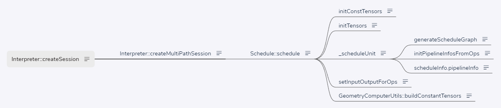

# MNN createSession 之 Schedule（三）

## 1、createSession




    依据 ScheduleConfig 和 RuntimeInfo 创建会话。

```
// source/core/Interpreter.cpp
Session* Interpreter::createSession(const ScheduleConfig& config) {
	// createMultiPathSession 会根据 ScheduleConfig 创建 RuntimeInfo
    return createMultiPathSession({config});
}

Session* Interpreter::createSession(const ScheduleConfig& config, const RuntimeInfo& runtime) {
    return createMultiPathSession({config}, runtime);
}
```


### 1.1 createMultiPathSession

```
// source/core/Interpreter.cpp
Session* Interpreter::createMultiPathSession(const std::vector<ScheduleConfig>& configs) {
    RuntimeInfo runtime = createRuntime(configs);
    runtime.second->setExternalFile(mNet->externalFile);
    runtime.second->setAllocatorType(mNet->modes.memoryAllocatorType);
    if (runtime.first.empty()) {
        MNN_ERROR("Runtime not valid for create session\n");
        return nullptr;
    }
    return createMultiPathSession(configs, std::move(runtime));
}

Session* Interpreter::createMultiPathSession(const std::vector<ScheduleConfig>& configs, const RuntimeInfo& runtime) {
    if (nullptr == mNet->buffer.get()) {
        MNN_ERROR("The model buffer has been released. Can't create session\n");
        return nullptr;
    }
    if (runtime.first.empty()) {
        MNN_ERROR("Runtime not valid for create session\n");
        return nullptr;
    }
    std::unique_lock<std::mutex> _l(mNet->lock);
#ifdef MNN_INTERNAL_ENABLED
    Timer _timer;
#endif
    int cacheMode = 0; // No cache
    // 创建 Schedule，并进行初始化
    Schedule::ScheduleInfo info;
    auto success = Schedule::schedule(info, mNet->net, configs, runtime);
    if (!success) {
        return nullptr;
    }
    RuntimeInfo rt = runtime;
    bool valid  = false;
    if (mNet->cacheBuffer.get() != nullptr) {
        for (auto iter : rt.first) {
            valid = iter.second->onSetCache(mNet->cacheBuffer.get(),
                                            mNet->cacheBuffer.size());
            if(!valid) {
                iter.second->onSetCache(nullptr, 0);
            }
            if (valid) {
                break;
            }
        }
        if (valid) {
            mNet->lastCacheSize = mNet->cacheBuffer.size();
            cacheMode = cacheMode | 1; // READ cache
        }
    }

    auto newSession =
        std::unique_ptr<Session>(new Session(std::move(info), mNet->modes, std::move(rt)));
    if (!newSession->valid()) {
        MNN_PRINT("Invalide Session!!\n");
        return nullptr;
    }
    auto result = newSession.get();
    auto validForResize = info.validForResize;
    if (validForResize && mNet->modes.inputMode == Session_Input_Inside && mNet->modes.resizeMode == Session_Resize_Direct) {
        result->resize();
    }

    if ((!mNet->cacheFile.empty()) && (!valid) && mNet->modes.backendMode == Session_Backend_Fix) {
        // Try to save extra cache
        auto buffer = result->getCache();
        if (buffer.first != nullptr && buffer.second > 0) {
            MNN_PRINT("Write cache to %s, size = %zu\n", mNet->cacheFile.c_str(), buffer.second);
            writeCacheFile(mNet, buffer);
            mNet->lastCacheSize = buffer.second;
            // Write Cache
            cacheMode = cacheMode | 2;
        }
    }
    // Reset cache
    result->loadCache(nullptr, 0);

    mNet->sessions.emplace_back(std::move(newSession));

#ifdef MNN_INTERNAL_ENABLED
    int precision = BackendConfig::Precision_Normal;
    if (nullptr != configs[0].backendConfig) {
        precision = configs[0].backendConfig->precision;
    }
    int mode = configs[0].mode;
    mNet->sessionInfo.insert(std::make_pair(result, std::make_tuple(precision, mode)));
    if (shouldLog(FREQ_HIGH)) {
        std::map<std::string, std::string> metrics = mNet->basicLogginData;
        metrics.emplace("UUID", mNet->uuid);
        metrics.emplace("Time", std::to_string((float)_timer.durationInUs() / 1024.0f));
        metrics.emplace("Backend", std::to_string(configs[0].type));
        metrics.emplace("Precision", std::to_string(precision));
        metrics.emplace("Mode", std::to_string(mode));
        metrics.emplace("Cache", std::to_string(cacheMode));
        metrics.emplace("CacheSize", std::to_string((float)(mNet->lastCacheSize / 1024.0f)));
        metrics.emplace("ModelSize", std::to_string ((float)mNet->buffer.size() / 1024.0f / 1024.0f));
        metrics.emplace("Usage", std::to_string((int) mNet->net->usage()));
        metrics.emplace("API", "Interpreter::createMultiPathSession");
        logAsync(metrics);
    }
#endif // MNN_INTERNAL_ENABLED

    return result;
}
```


#### 1.1.1 Schedule 类 OpCacheInfo、BackendCache、PipelineInfo、ScheduleInfo

    调度器

```
/** net scheduler */
class MNN_PUBLIC Schedule {
public:
    enum Type {
        // Size can be compute separately
        SEPARATE = 0,
        // When size is fixed, the content is fixed
        CONSTANT = 1,
        // Size can't be compute separately
        NOT_SEPERATE
    };
    /** pipeline info */
    struct OpCacheInfo {
        /** op */
        const Op* op;
        /** input tensors */
        std::vector<Tensor*> inputs;
        /** output tensors */
        std::vector<Tensor*> outputs;
        /** schedule type*/
        Schedule::Type type = Schedule::Type::SEPARATE;

        /**Command buffer for cache*/
        CommandBuffer cacheBuffer;

        /**Command buffer for execute*/
        CommandBuffer executeBuffer;
        
        std::map<const Op*, std::shared_ptr<Execution>> executionCache;
    };

    // Backend, Tensor, shape-dirty, content-dirty
    typedef std::tuple<Tensor*, std::shared_ptr<Tensor>, bool, bool> TENSORCACHE;
    struct BackendCache {
        Backend::Info info;
        BackendConfig config;
        std::pair<std::shared_ptr<Backend>, std::shared_ptr<Backend>> cache;
        bool needComputeShape = true;
        bool needComputeGeometry = true;
        bool reportError = true;
        std::map<Tensor*, TENSORCACHE> inputTensorCopyCache;
    };
    typedef std::pair<BackendCache, std::vector<OpCacheInfo>> PipelineInfo;

    /** schedule info */
    struct ScheduleInfo {
        /** pipelines with backend info */
        std::vector<PipelineInfo> pipelineInfo;
        /** input tensors map */
        std::map<std::string, Tensor*> inputTensors;
        /** output tensors map */
        std::map<std::string, Tensor*> outputTensor;
        /** all tensors */
        std::vector<std::shared_ptr<Tensor>> allTensors;
        /** input valid for resize*/
        bool validForResize;
        /** Default Backend for alloc const*/
        std::shared_ptr<Backend> defaultBackend;
        /** Replace Backend for alloc const*/
        std::shared_ptr<Backend> constReplaceBackend;
        /** size need input's content*/
        bool needInputContentForShape = false;
    };

    /**
     * @breif schedule net ops to pipeline with configuration.
     * @param net       given net.
     * @param config    given configuration.
     * @return schedule info.
     */
    static bool schedule(ScheduleInfo& result, const Net* net, const std::vector<ScheduleConfig>& config, const RuntimeInfo& runtimeInfo);
    static MNNForwardType getApprociateType(const ScheduleConfig& config);
};
```


##### 1.1.1.1 Backend 类 Backend::Info

    // source/core/Backend.hpp
    class Backend : public NonCopyable {
    
    public:
        /** info used to create backend */
        struct Info {
            /** forward type. */
            MNNForwardType type = MNN_FORWARD_CPU;
            /** numThread for CPU . number of threads.  gpuMode for GPU only. tuning/memory Mode setting. */
            union {
                int numThread = 4;
                int gpuMode;
            };
            /** user data. */
            BackendConfig* user = NULL;
            enum Mode {
                // The Op will be run in execution->onExecute
                DIRECT = 0,
    
                // The Op will be recorded. Run in onExecuteBegin and Wait in onExecuteEnd
                INDIRECT = 1
            };
            Mode mode = DIRECT;
            enum Allocator {
                DEFER = 0,
                EAGER = 1
            };
            Allocator allocator = DEFER;
        };
    
        /** backend buffer storage type */
        enum StorageType {
            /**
             use NOT reusable memory.
             - allocates memory when `onAcquireBuffer` is called.
             - releases memory when `onReleaseBuffer` is called or when the backend is deleted.
             - do NOTHING when `onClearBuffer` is called.
             */
            STATIC,
            /**
             use reusable memory.
             - allocates or reuses memory when `onAcquireBuffer` is called. prefers reusing.
             - collects memory for reuse when `onReleaseBuffer` is called.
             - releases memory when `onClearBuffer` is called or when the backend is deleted.
             */
            DYNAMIC,
            /**
             use NOT reusable memory.
             - allocates memory when `onAcquireBuffer` is called.
             - do NOTHING when `onReleaseBuffer` is called.
             - releases memory when `onClearBuffer` is called or when the backend is deleted.
             */
            DYNAMIC_SEPERATE
        };
    
    public:
        /**
         * @brief initializer.
         * @param type  forward type.
         */
        Backend(MNNForwardType type) : mType(type) {
            // nothing to do
        }
    
        /**
         * @brief deinitializer.
         */
        virtual ~Backend() = default;
    
    public:
    
        /**
         * @brief create execution for op with input and output tensors.
         * @param inputs    input tensors.
         * @param outputs   output tensors.
         * @param op        given op.
         * @return created execution if op is supported, nullptr otherwise.
         */
        virtual Execution* onCreate(const std::vector<Tensor*>& inputs, const std::vector<Tensor*>& outputs,
                                    const MNN::Op* op) = 0;
    
        /**
         * @brief callback before resize ops.
         */
        virtual void onResizeBegin() {
            // nothing to do
        }
        /**
         * @brief callback after resize ops.
         */
        virtual ErrorCode onResizeEnd() = 0;
    
        /**
         * @brief callback before executing ops.
         */
        virtual void onExecuteBegin() const = 0;
        /**
         * @brief callback after executing ops.
         */
        virtual void onExecuteEnd() const = 0;
    
        virtual const Runtime* getRuntime() {
            return nullptr;
        }
        const std::string externalFile();
    public:
        /**
         * @brief allocate buffer of tensor for given storage type.
         * @param tensor        buffer provider.
         * @param storageType   buffer storage type.
         * @return success or not.
         */
        MNN_PUBLIC bool onAcquireBuffer(const Tensor* tensor, StorageType storageType);
    
        /**
         * @brief release buffer of tensor for given storage type.
         * @param tensor        buffer provider.
         * @param storageType   buffer storage type.
         * @return success or not.
         */
        MNN_PUBLIC bool onReleaseBuffer(const Tensor* tensor, StorageType storageType);
    
        class MemObj {
        public:
            MemObj() {}
            virtual ~ MemObj() {}
            virtual MemChunk chunk() { return MemChunk(); }
        };
        /**
         * @brief allocate buffer of tensor for given storage type.
         * @param tensor        buffer provider.
         * @param storageType   buffer storage type.
         * @return MemObj for release, if failed, return nullptr.
         */
        virtual MemObj* onAcquire(const Tensor* tensor, StorageType storageType) = 0;
        
        /**
         * @brief get buffer from tensor directly
         * @param tensor        buffer provider.
         * @return support or not
         */
        virtual bool onGetTensorInfo(const Tensor* tensor, void* dstInfo) {
            return false;
        }
    
        /**
         * @brief clear all dynamic buffers.
         * @return success or not.
         */
        virtual bool onClearBuffer() = 0;
    
        /**
         * @brief copy buffer from tensor to tensor.
         * @param srcTensor source buffer provider.
         * @param dstTensor dest buffer provider.
         */
        virtual void onCopyBuffer(const Tensor* srcTensor, const Tensor* dstTensor) const = 0;
    
    public:
        /**
         * @brief get forward type.
         * @return forward type.
         */
        inline MNNForwardType type() const {
            return mType;
        }
    
    public:
        /**
         * @brief get Gpu Tensor map host ptr/ unmap
         */
        virtual void* onMapTensor(Tensor::MapType mtype, Tensor::DimensionType dtype, const Tensor* srcTensor) {
            return nullptr;
        }
    
        virtual bool onUnmapTensor(Tensor::MapType mtype, Tensor::DimensionType dtype, const Tensor* dstTensor, void* mapPtr) {
            return false;
        }
    
        virtual int onSync(Tensor::MapType mtype, bool toCpu, const Tensor* dstTensor) {
            return 0;
        }
    
    private:
        const MNNForwardType mType;
    };


#### 1.1.2 Schedule::schedule

```
bool Schedule::schedule(ScheduleInfo& scheduleInfo, const Net* net, const std::vector<ScheduleConfig>& configs, const RuntimeInfo& runtimeInfo) {
    if (nullptr == net->oplists()) {
        MNN_PRINT("Empty net for schedule\n");
        return false;
    }
    if (scheduleInfo.defaultBackend.get() == nullptr && scheduleInfo.allTensors.empty()) {
        // Const not init, init it
        BackendConfig defaultConfig;
        defaultConfig.flags = 4;
        // 创建默认的后端，即 CPUBackend ，source/backend/cpu/CPUBackend.cpp
        scheduleInfo.defaultBackend.reset(runtimeInfo.second->onCreate(&defaultConfig));
        ErrorCode code = NO_ERROR;
        initConstTensors(scheduleInfo.allTensors, net, scheduleInfo.defaultBackend.get(), code);
        if (NO_ERROR != code) {
            MNN_ERROR("Schedule Const init errorcode = %d\n", code);
            return false;
        }
    }
    bool valid = initTensors(scheduleInfo.allTensors, net);
    scheduleInfo.validForResize = valid;
    std::vector<std::shared_ptr<Tensor>>& allTensors = scheduleInfo.allTensors;
    std::vector<std::pair<Schedule::BackendCache, std::vector<Schedule::OpCacheInfo>>> result;

    for (auto& config : configs) {
        Backend::Info compute;
        compute.type      = getApprociateType(config);
        compute.numThread = config.numThread;
        if(config.type == MNN_FORWARD_AUTO) {
            if(compute.type == MNN_FORWARD_OPENCL || compute.type == MNN_FORWARD_METAL) {
                // AUTO set default gpu-mode MNN_GPU_TUNING_FAST
                compute.numThread = 16;
            }
        }
        compute.user      = config.backendConfig;
        // 初始化算子和张量
        auto oplists      = _scheduleUnit(net, config, allTensors);
        Schedule::BackendCache cache;
        cache.info = std::move(compute);
        result.emplace_back(std::make_pair(cache, std::move(oplists)));
    }

    scheduleInfo.pipelineInfo = std::move(result);

    // get all used op's output, drop unused op, won't change op order. always insert all Input Ops
    std::vector<const Op*> oplists;
    {
        for (std::pair<Schedule::BackendCache, vector<Schedule::OpCacheInfo>>& pipeline : scheduleInfo.pipelineInfo) {
            for (auto& info : pipeline.second) {
                oplists.push_back(info.op);
            }
        }
    }
    // set tensors' input/output usage by oplists info
    setInputOutputForOps(allTensors, oplists, net->usage() == Usage_INFERENCE_STATIC);

    // add output index by config info and outputName
    std::unordered_map<std::string, int> tensorNameIndexMap;
    for (int i = 0; i < net->tensorName()->size(); ++i) {
        tensorNameIndexMap[net->tensorName()->Get(i)->str()] = i;
    }
    bool userSetOutput = false;
    // 初始化调度输出张量
    for (auto& config : configs) {
        userSetOutput = userSetOutput || (!config.saveTensors.empty());
        for (const auto& name : config.saveTensors) {
            auto iter = tensorNameIndexMap.find(name);
            if (iter != tensorNameIndexMap.end()) {
                auto t = allTensors[iter->second].get();
                if (TensorUtils::getDescribe(t)->usage == Tensor::InsideDescribe::NORMAL) {
                    TensorUtils::getDescribe(t)->usage = Tensor::InsideDescribe::OUTPUT;
                }
                scheduleInfo.outputTensor.insert(
                           std::make_pair(net->tensorName()->GetAsString(iter->second)->c_str(), t));
            } else {
                MNN_PRINT("Bad outputname: %s\n", name.c_str());
            }
        }
    }
    // 初始化调度输出张量
    if (net->outputName()) {
        userSetOutput = userSetOutput || net->outputName()->size() >= 1;
        for (int i = 0; i < net->outputName()->size(); ++i) {
            std::string name = net->outputName()->Get(i)->str();
            auto iter = tensorNameIndexMap.find(name);
            if (iter != tensorNameIndexMap.end()) {
                auto t = allTensors[iter->second].get();
                if (TensorUtils::getDescribe(t)->usage == Tensor::InsideDescribe::NORMAL) {
                    TensorUtils::getDescribe(t)->usage = Tensor::InsideDescribe::OUTPUT;
                }
                scheduleInfo.outputTensor.insert(
                               std::make_pair(net->tensorName()->GetAsString(iter->second)->c_str(), t));
            }
        }
    }
    if (scheduleInfo.outputTensor.empty()) {
        userSetOutput = false;
    }
    // add input/output tensor to schedule's input/output
    // 初始化调度输入和输出张量
    for (int index = 0; index < allTensors.size(); index++) {
        auto t = allTensors[index].get();
        auto usage = TensorUtils::getDescribe(t)->usage;
        if (usage == Tensor::InsideDescribe::INPUT) {
        	// 如 inputTensors 大小为 1
            scheduleInfo.inputTensors.insert(std::make_pair(net->tensorName()->GetAsString(index)->c_str(), t));
        }
        if (usage == Tensor::InsideDescribe::OUTPUT && (!userSetOutput)) {
        	// 如 outputTensor 大小为 3
            scheduleInfo.outputTensor.insert(
                       std::make_pair(net->tensorName()->GetAsString(index)->c_str(), t));
        }
    }
    if (net->usage() == Usage_INFERENCE_STATIC) {
        for (auto& pipInfo : scheduleInfo.pipelineInfo) {
            pipInfo.first.needComputeGeometry = false;
            pipInfo.first.needComputeShape = false;
        }
    }

#ifndef MNN_BUILD_MINI
    for (auto iter = scheduleInfo.pipelineInfo.begin(); iter != scheduleInfo.pipelineInfo.end();) {
        if (!iter->first.needComputeGeometry) {
            // For static model don't need check const
            iter++;
            continue;
        }
        auto breakIndex = GeometryComputerUtils::buildConstantTensors(iter->second);
        if (breakIndex >= 0) {
            scheduleInfo.needInputContentForShape = true;
        }
#ifdef MNN_SEPERTE_SIZE
        if (breakIndex >= 0 && (breakIndex + 1) < iter->second.size()) {
            // Split oplist
            std::vector<Schedule::PipelineInfo> fuse;
            std::vector<Schedule::PipelineInfo> separate;
            fuse.insert(fuse.begin(), iter->second.begin(), iter->second.begin() + breakIndex + 1);
            separate.insert(separate.begin(), iter->second.begin() + breakIndex + 1, iter->second.end());
            oplists.clear();
            iter->second = std::move(separate);
            iter = scheduleInfo.pipelineInfo.insert(iter, std::make_pair(iter->first, fuse));
            iter++;
            iter++;
        } else {
            iter++;
        }
#else
        iter++;
#endif
    }
#endif
    return true;
}
```


##### 1.1.2.1 initConstTensors

```
// source/utils/InitNet.cpp
bool initConstTensors(std::vector<std::shared_ptr<Tensor>>& tensors, const Net* net, Backend* defaultBackend, ErrorCode& code) {
    bool valid    = true;
    // 按算子数分配 Tensor 张量容量，如 208
    tensors.resize(net->tensorName()->size());
    // Set up const
    // 算子数 net->oplists()->size() 为 208
    for (int opIndex = 0; opIndex < net->oplists()->size(); ++opIndex) {
        auto op = net->oplists()->GetAs<Op>(opIndex);
        // 不变算子和可训练参数 初始化
        if (OpType_Const == op->type() || OpType_TrainableParam == op->type()) {
            MNN_ASSERT(nullptr != op->outputIndexes());
            auto index = op->outputIndexes()->data()[0];
            tensors[index].reset(new Tensor);
            TensorUtils::getDescribe(tensors[index].get())->index = index;
            auto parameter = op->main_as_Blob();
            auto output    = tensors[index].get();
            bool zeroShape = false;
            if (parameter->dims() != nullptr) {
                output->buffer().dimensions = parameter->dims()->size();
                for (int i = 0; i < output->buffer().dimensions; i++) {
                    output->buffer().dim[i].extent = parameter->dims()->Get(i);
                    if (output->length(i) <= 0) {
                        zeroShape = true;
                    }
                }
            } else {
                output->buffer().dimensions = 0;
            }
            if (parameter->dataType() == DataType_DT_HALF) {
                output->setType(DataType_DT_FLOAT);
            } else {
                output->setType(parameter->dataType());
            }
            TensorUtils::getDescribe(output)->dimensionFormat = parameter->dataFormat();
            TensorUtils::getDescribe(output)->usage = Tensor::InsideDescribe::CONSTANT;
            TensorUtils::getDescribe(output)->isMutable = false;
            if (op->type() == OpType_TrainableParam) {
                TensorUtils::getDescribe(output)->usage = Tensor::InsideDescribe::TRAINABLE;
            }
            TensorUtils::setLinearLayout(output);
            TensorUtils::getDescribe(output)->setBackend(defaultBackend);
            //MNN_PRINT("Const tensor %p is %p bn\n", output, defaultBackend);
            if (zeroShape) {
                continue;
            }
            auto res = defaultBackend->onAcquireBuffer(output, Backend::STATIC);
            if (!res) {
                code = OUT_OF_MEMORY;
                return false;
            }
            if (parameter->dataType() == DataType_DT_HALF) {
                if (nullptr == parameter->uint8s()) {
                    // Error half const
                    code = INVALID_VALUE;
                    return false;
                }
                auto outputPtr = output->host<float>();
                auto size = output->elementSize();
                half_float::half* src = nullptr;
                std::unique_ptr<half_float::half[]> tmp;
                if (USE_EXTERNAL_DATA(parameter)) {
                    tmp.reset((new half_float::half[size]));
                    src = tmp.get();
                    OpCommonUtils::loadExternalDatas(defaultBackend, {reinterpret_cast<char*>(src)}, parameter->external()->data());
                } else {
                    src = (half_float::half*)parameter->uint8s()->data();
                }
                for (int i=0; i<size; ++i) {
                    outputPtr[i] = src[i];
                }
            } else {
                OpCommonUtils::loadBlobData(defaultBackend, op, output->host<char>(), output->size());
            }
        } else {
            if (nullptr != op->outputIndexes()) {
                for (int i=0; i<op->outputIndexes()->size(); ++i) {
                    auto index = op->outputIndexes()->data()[i];
                    if (nullptr == tensors[index].get()) {
                        continue;
                    }
                    auto des = TensorUtils::getDescribe(tensors[index].get());
                    if (des->usage == Tensor::InsideDescribe::CONSTANT) {
                        des->usage = Tensor::InsideDescribe::TRAINABLE;
                    }
                }
            }
        }
    }
    return valid;
}
```


##### 1.1.2.2 initTensors

    初始化张量

```
// source/utils/InitNet.cpp
bool initTensors(std::vector<std::shared_ptr<Tensor>>& tensors, const Net* net) {
    bool valid    = true;
    auto describes = net->extraTensorDescribe();
    std::vector<const TensorDescribe*> des(tensors.size());
    for (int i=0; i<tensors.size(); ++i) {
        // Init all tensor except for const
        if (tensors[i].get() == nullptr) {
            tensors[i].reset(new Tensor);
            TensorUtils::getDescribe(tensors[i].get())->index = i;
            // MNN_PRINT("initTensors create tensor:%p, index:%d, backend:%d\n", tensors[i].get(), i, TensorUtils::getDescribe(tensors[i].get())->backend);
        }
    }
    if (describes) {
        for (int i = 0; i < describes->size(); i++) {
            int index  = describes->GetAs<TensorDescribe>(i)->index();
            des[index] = describes->GetAs<TensorDescribe>(i);
        }
    }
    for (int i = 0; i < tensors.size(); ++i) {
        if (des[i] != nullptr && des[i]->quantInfo()) {
            TensorUtils::getDescribe(tensors[i].get())->quantAttr.reset(new QuantAttr);
            auto quant   = TensorUtils::getDescribe(tensors[i].get())->quantAttr.get();
            quant->scale =  des[i]->quantInfo()->scale();
            quant->zero  =  des[i]->quantInfo()->zero();
            quant->min   =  des[i]->quantInfo()->min();
            quant->max   =  des[i]->quantInfo()->max();
            // Don't copy datatype, it can be set by backend
        }
    }
    // Set Input Tensor, if the type of input is not the same with ExtraTensorDescribe, use input parameter
    for (int opIndex = 0; opIndex < net->oplists()->size(); ++opIndex) {
        auto op = net->oplists()->GetAs<Op>(opIndex);
        if (OpType_Input == op->type()) {
            MNN_ASSERT(nullptr != op->outputIndexes());
            MNN_ASSERT(op->outputIndexes()->size() == 1);
            auto index      = op->outputIndexes()->data()[0];
            auto tensor     = tensors[index].get();
            auto& tb        = tensor->buffer();
            auto inputParam = op->main_as_Input();
            if (auto idims = inputParam->dims()) {
                for (int i = 0; i < idims->size(); ++i) {
                    int extent = idims->data()[i];
                    // dim-0 is batch(when input batch is -1, set it to be 1, ignore other dim)
                    if (i == 0 && extent == -1) {
                        extent = 1;
                    }
                    if (extent < 0) {
                        valid = false;
                    }
                    tb.dim[i].extent = extent;
                }
                tb.dimensions = idims->size();
            } else {
                tb.dimensions = 0;
            }
            tensor->setType(inputParam->dtype());
            TensorUtils::getDescribe(tensor)->dimensionFormat = inputParam->dformat();
            TensorUtils::setLinearLayout(tensor);
        }
    }
    if (net->usage() != Usage_INFERENCE_STATIC) {
        return valid;
    }
    // static model will set all tensors' shape
    for (int i = 0; i < describes->size(); i++) {
        int index  = describes->GetAs<TensorDescribe>(i)->index();
        des[index] = describes->GetAs<TensorDescribe>(i);
    }
    for (int i = 0; i < tensors.size(); ++i) {
        if (TensorUtils::getDescribe(tensors[i].get())->usage != Tensor::InsideDescribe::NORMAL) {
            // Const / Trainable Shape has been inited
            continue;
        }
        auto blob = des[i]->blob();
        auto& tb = tensors[i]->buffer();
        if (auto idims = blob->dims()) {
            for (int d = 0; d < idims->size(); d++) {
                tb.dim[d].extent = idims->Get(d);
            }
            tb.dimensions = idims->size();
        } else {
            tb.dimensions = 0;
        }
        tensors[i]->setType(blob->dataType());
    }
    for (int i = 0; i < tensors.size(); ++i) {
        auto blob                                                   = des[i]->blob();
        TensorUtils::getDescribe(tensors[i].get())->dimensionFormat = blob->dataFormat();
        if (auto regions = des[i]->regions()) {
            auto& regs = TensorUtils::getDescribe(tensors[i].get())->regions;
            TensorUtils::getDescribe(tensors[i].get())->memoryType = Tensor::InsideDescribe::MEMORY_BACKEND;
            regs.reserve(regions->size());
            for (int r = 0; r < regions->size(); r++) {
                auto region = regions->GetAs<Region>(r);
                Tensor::InsideDescribe::Region reg;
                reg.origin     = tensors[region->origin()].get();
                reg.src.offset = region->src()->offset();
                reg.dst.offset = region->dst()->offset();
                for (int d = 0; d < 3; d++) {
                    reg.size[d]       = region->size()->data()[d];
                    reg.src.stride[d] = region->src()->stride()->data()[d];
                    reg.dst.stride[d] = region->dst()->stride()->data()[d];
                }
                regs.emplace_back(std::move(reg));
            }
        }
    }
    return valid;
}
```


##### 1.1.2.3 _scheduleUnit

```
// source/core/Schedule.cpp
static vector<Schedule::OpCacheInfo> _scheduleUnit(const Net* net, const ScheduleConfig& configs,
                                                    const vector<shared_ptr<Tensor>>& allTensors) {
    vector<Schedule::OpCacheInfo> oplists;
    vector<const Op*> ops;
    generateScheduleGraph(ops, net, configs, allTensors);
    initPipelineInfosFromOps(oplists, ops, allTensors);
    return oplists;
}
```


###### 1.1.2.3.1 generateScheduleGraph

    产生调度图谱

    // source/core/Schedule.cpp
    static void generateScheduleGraph(vector<const Op*>& ops, const Net* net, const ScheduleConfig& configs,
                                      const vector<shared_ptr<Tensor>>& allTensors) {
    
            // for (int i = 0; i < net->oplists()->size(); ++i) {
            //     auto op       = net->oplists()->Get(i);
            //     MNN_PRINT("generateScheduleGraph, op type:%s, op name:%s\n", EnumNameOpType(op->type()), op->name()->c_str());
            // }
    
        if (configs.path.inputs.empty() && configs.path.outputs.empty()) {
            // Use Default Linear schedule
            ops.clear();
            ops.reserve(net->oplists()->size());
            // 获取算子，208
            for (int i = 0; i < net->oplists()->size(); ++i) {
                auto op = net->oplists()->GetAs<Op>(i);
                ops.emplace_back(op);
            }
            return;
        }
        // 0: not set, 1: output, 2:input
        std::vector<int> tensorMask(net->tensorName()->size());
        ::memset(tensorMask.data(), 0, tensorMask.size() * sizeof(int));
    
        // 0: use, 1: no use
        std::vector<int> opMask(net->oplists()->size());
        ::memset(opMask.data(), 0, opMask.size() * sizeof(int));
    
        // Set Initial Status
        std::set<std::string> inputNames;
        std::set<std::string> outputNames;
        for (auto& n : configs.path.inputs) {
            inputNames.insert(n);
        }
        for (auto& n : configs.path.outputs) {
            outputNames.insert(n);
        }
        if (configs.path.mode == ScheduleConfig::Path::Mode::Tensor) {
            for (int i=0; i<tensorMask.size(); ++i) {
                auto name = net->tensorName()->GetAsString(i)->c_str();
                if (outputNames.find(name) != outputNames.end()) {
                    tensorMask[i] = 1;
                }
                // If both input/output, set as input
                if (inputNames.find(name) != inputNames.end()) {
                    tensorMask[i] = 2;
                }
            }
        } else {
            // Op Mode
            for (int i=0; i<opMask.size(); ++i) {
                auto op = net->oplists()->GetAs<Op>(i);
                if (nullptr == op->name()) {
                    continue;
                }
                auto name = op->name()->c_str();
                if (outputNames.find(name) != outputNames.end()) {
                    opMask[i] = 1;
                    if (nullptr != op->outputIndexes()) {
                        for (int j=0; j<op->outputIndexes()->size(); ++j) {
                            auto index = op->outputIndexes()->data()[j];
                            if (tensorMask[index] != 2) {
                                tensorMask[index] = 1;
                            }
                        }
                    }
                    if (nullptr != op->inputIndexes()) {
                        for (int j=0; j<op->inputIndexes()->size(); ++j) {
                            auto index = op->inputIndexes()->data()[j];
                            if (tensorMask[index] != 2) {
                                tensorMask[index] = 1;
                            }
                        }
                    }
                }
                if (inputNames.find(name) != inputNames.end()) {
                    opMask[i] = 1;
                    if (nullptr != op->outputIndexes()) {
                        for (int j=0; j<op->outputIndexes()->size(); ++j) {
                            auto index = op->outputIndexes()->data()[j];
                            tensorMask[index] = 2;
                        }
                    }
                }
            }
        }
    
        bool change = false;
        do {
            change = false;
            for (int i=0; i<opMask.size(); ++i) {
                if (opMask[i] > 0) {
                    continue;
                }
                auto op = net->oplists()->GetAs<Op>(i);
                if (nullptr != op->outputIndexes()) {
                    for (int j=0; j<op->outputIndexes()->size(); ++j) {
                        auto index = op->outputIndexes()->data()[j];
                        if (tensorMask[index] == 1) {
                            opMask[i] = 1;
                            change = true;
                        }
                    }
                }
                if (nullptr != op->inputIndexes() && opMask[i]) {
                    for (int j=0; j<op->inputIndexes()->size(); ++j) {
                        auto index = op->inputIndexes()->data()[j];
                        if (tensorMask[index] != 2) {
                            tensorMask[index] = 1;
                        }
                    }
                }
            }
        } while (change);
    
        for (int i=0; i<opMask.size(); ++i) {
            if (opMask[i] > 0) {
                ops.emplace_back(net->oplists()->GetAs<Op>(i));
            }
        }
    }


###### 1.1.2.3.2 initPipelineInfosFromOps

	// source/utils/InitNet.cpp
	void initPipelineInfosFromOps(std::vector<Schedule::OpCacheInfo>& infos, std::vector<const Op*>& ops, const std::vector<std::shared_ptr<Tensor>>& allTensors) {
	    for (const Op* op : ops) {
	        // MNN_PRINT("initPipelineInfosFromOps, op type:%s, op name:%s\n", EnumNameOpType(op->type()), op->name()->c_str());
	
			// 算子缓存信息
	        Schedule::OpCacheInfo opInfo;
	        opInfo.op = op;
	        if (nullptr != op->outputIndexes()) {
	            auto data = op->outputIndexes()->data();
	            for (int j = 0; j < op->outputIndexes()->size(); ++j) {
	            	// 设置算子缓存输出张量信息
	                opInfo.outputs.push_back(allTensors[data[j]].get());
	            }
	        }
	        if (nullptr != op->inputIndexes()) {
	            auto data = op->inputIndexes()->data();
	            for (int j = 0; j < op->inputIndexes()->size(); ++j) {
	            	// 设置算子缓存输入张量信息
	                opInfo.inputs.push_back(allTensors[data[j]].get());
	            }
	        }
	        if (needComputeOp(op)) {
	            infos.emplace_back(std::move(opInfo));
	        }
	    }
	}


###### 1.1.2.3.3 Op 算子

```
// schema/current/MNN_generated.h
struct Op FLATBUFFERS_FINAL_CLASS : private flatbuffers::Table {
  typedef OpT NativeTableType;
  static const flatbuffers::TypeTable *MiniReflectTypeTable() {
    return OpTypeTable();
  }
  const flatbuffers::Vector<int32_t> *inputIndexes() const {
    return GetPointer<const flatbuffers::Vector<int32_t> *>(4);
  }
  OpParameter main_type() const {
    return static_cast<OpParameter>(GetField<uint8_t>(6, 0));
  }
  const void *main() const {
    return GetPointer<const void *>(8);
  }
  template<typename T> const T *main_as() const;
  const QuantizedAdd *main_as_QuantizedAdd() const {
    return main_type() == OpParameter_QuantizedAdd ? static_cast<const QuantizedAdd *>(main()) : nullptr;
  }
  const ArgMax *main_as_ArgMax() const {
    return main_type() == OpParameter_ArgMax ? static_cast<const ArgMax *>(main()) : nullptr;
  }
  const AsString *main_as_AsString() const {
    return main_type() == OpParameter_AsString ? static_cast<const AsString *>(main()) : nullptr;
  }
  const Axis *main_as_Axis() const {
    return main_type() == OpParameter_Axis ? static_cast<const Axis *>(main()) : nullptr;
  }
  const BatchNorm *main_as_BatchNorm() const {
    return main_type() == OpParameter_BatchNorm ? static_cast<const BatchNorm *>(main()) : nullptr;
  }
  const BinaryOp *main_as_BinaryOp() const {
    return main_type() == OpParameter_BinaryOp ? static_cast<const BinaryOp *>(main()) : nullptr;
  }
  const Blob *main_as_Blob() const {
    return main_type() == OpParameter_Blob ? static_cast<const Blob *>(main()) : nullptr;
  }
  const CastParam *main_as_CastParam() const {
    return main_type() == OpParameter_CastParam ? static_cast<const CastParam *>(main()) : nullptr;
  }
  const Convolution2D *main_as_Convolution2D() const {
    return main_type() == OpParameter_Convolution2D ? static_cast<const Convolution2D *>(main()) : nullptr;
  }
  const Crop *main_as_Crop() const {
    return main_type() == OpParameter_Crop ? static_cast<const Crop *>(main()) : nullptr;
  }
  const CropAndResize *main_as_CropAndResize() const {
    return main_type() == OpParameter_CropAndResize ? static_cast<const CropAndResize *>(main()) : nullptr;
  }
  const Dequantize *main_as_Dequantize() const {
    return main_type() == OpParameter_Dequantize ? static_cast<const Dequantize *>(main()) : nullptr;
  }
  const DetectionOutput *main_as_DetectionOutput() const {
    return main_type() == OpParameter_DetectionOutput ? static_cast<const DetectionOutput *>(main()) : nullptr;
  }
  const Eltwise *main_as_Eltwise() const {
    return main_type() == OpParameter_Eltwise ? static_cast<const Eltwise *>(main()) : nullptr;
  }
  const ExpandDims *main_as_ExpandDims() const {
    return main_type() == OpParameter_ExpandDims ? static_cast<const ExpandDims *>(main()) : nullptr;
  }
  const Fill *main_as_Fill() const {
    return main_type() == OpParameter_Fill ? static_cast<const Fill *>(main()) : nullptr;
  }
  const Flatten *main_as_Flatten() const {
    return main_type() == OpParameter_Flatten ? static_cast<const Flatten *>(main()) : nullptr;
  }
  const Gather *main_as_Gather() const {
    return main_type() == OpParameter_Gather ? static_cast<const Gather *>(main()) : nullptr;
  }
  const GatherV2 *main_as_GatherV2() const {
    return main_type() == OpParameter_GatherV2 ? static_cast<const GatherV2 *>(main()) : nullptr;
  }
  const InnerProduct *main_as_InnerProduct() const {
    return main_type() == OpParameter_InnerProduct ? static_cast<const InnerProduct *>(main()) : nullptr;
  }
  const Input *main_as_Input() const {
    return main_type() == OpParameter_Input ? static_cast<const Input *>(main()) : nullptr;
  }
  const Interp *main_as_Interp() const {
    return main_type() == OpParameter_Interp ? static_cast<const Interp *>(main()) : nullptr;
  }
  const LRN *main_as_LRN() const {
    return main_type() == OpParameter_LRN ? static_cast<const LRN *>(main()) : nullptr;
  }
  const LSTM *main_as_LSTM() const {
    return main_type() == OpParameter_LSTM ? static_cast<const LSTM *>(main()) : nullptr;
  }
  const MatMul *main_as_MatMul() const {
    return main_type() == OpParameter_MatMul ? static_cast<const MatMul *>(main()) : nullptr;
  }
  const NonMaxSuppressionV2 *main_as_NonMaxSuppressionV2() const {
    return main_type() == OpParameter_NonMaxSuppressionV2 ? static_cast<const NonMaxSuppressionV2 *>(main()) : nullptr;
  }
  const Normalize *main_as_Normalize() const {
    return main_type() == OpParameter_Normalize ? static_cast<const Normalize *>(main()) : nullptr;
  }
  const PackParam *main_as_PackParam() const {
    return main_type() == OpParameter_PackParam ? static_cast<const PackParam *>(main()) : nullptr;
  }
  const Permute *main_as_Permute() const {
    return main_type() == OpParameter_Permute ? static_cast<const Permute *>(main()) : nullptr;
  }
  const Plugin *main_as_Plugin() const {
    return main_type() == OpParameter_Plugin ? static_cast<const Plugin *>(main()) : nullptr;
  }
  const Pool *main_as_Pool() const {
    return main_type() == OpParameter_Pool ? static_cast<const Pool *>(main()) : nullptr;
  }
  const PRelu *main_as_PRelu() const {
    return main_type() == OpParameter_PRelu ? static_cast<const PRelu *>(main()) : nullptr;
  }
  const PriorBox *main_as_PriorBox() const {
    return main_type() == OpParameter_PriorBox ? static_cast<const PriorBox *>(main()) : nullptr;
  }
  const Proposal *main_as_Proposal() const {
    return main_type() == OpParameter_Proposal ? static_cast<const Proposal *>(main()) : nullptr;
  }
  const QuantizedAvgPool *main_as_QuantizedAvgPool() const {
    return main_type() == OpParameter_QuantizedAvgPool ? static_cast<const QuantizedAvgPool *>(main()) : nullptr;
  }
  const QuantizedBiasAdd *main_as_QuantizedBiasAdd() const {
    return main_type() == OpParameter_QuantizedBiasAdd ? static_cast<const QuantizedBiasAdd *>(main()) : nullptr;
  }
  const QuantizedConcat *main_as_QuantizedConcat() const {
    return main_type() == OpParameter_QuantizedConcat ? static_cast<const QuantizedConcat *>(main()) : nullptr;
  }
  const QuantizedLogistic *main_as_QuantizedLogistic() const {
    return main_type() == OpParameter_QuantizedLogistic ? static_cast<const QuantizedLogistic *>(main()) : nullptr;
  }
  const QuantizedMatMul *main_as_QuantizedMatMul() const {
    return main_type() == OpParameter_QuantizedMatMul ? static_cast<const QuantizedMatMul *>(main()) : nullptr;
  }
  const QuantizedMaxPool *main_as_QuantizedMaxPool() const {
    return main_type() == OpParameter_QuantizedMaxPool ? static_cast<const QuantizedMaxPool *>(main()) : nullptr;
  }
  const QuantizedRelu *main_as_QuantizedRelu() const {
    return main_type() == OpParameter_QuantizedRelu ? static_cast<const QuantizedRelu *>(main()) : nullptr;
  }
  const QuantizedRelu6 *main_as_QuantizedRelu6() const {
    return main_type() == OpParameter_QuantizedRelu6 ? static_cast<const QuantizedRelu6 *>(main()) : nullptr;
  }
  const QuantizedReshape *main_as_QuantizedReshape() const {
    return main_type() == OpParameter_QuantizedReshape ? static_cast<const QuantizedReshape *>(main()) : nullptr;
  }
  const QuantizedSoftmax *main_as_QuantizedSoftmax() const {
    return main_type() == OpParameter_QuantizedSoftmax ? static_cast<const QuantizedSoftmax *>(main()) : nullptr;
  }
  const QuantizeMaxMin *main_as_QuantizeMaxMin() const {
    return main_type() == OpParameter_QuantizeMaxMin ? static_cast<const QuantizeMaxMin *>(main()) : nullptr;
  }
  const QuantizeV2 *main_as_QuantizeV2() const {
    return main_type() == OpParameter_QuantizeV2 ? static_cast<const QuantizeV2 *>(main()) : nullptr;
  }
  const Range *main_as_Range() const {
    return main_type() == OpParameter_Range ? static_cast<const Range *>(main()) : nullptr;
  }
  const Rank *main_as_Rank() const {
    return main_type() == OpParameter_Rank ? static_cast<const Rank *>(main()) : nullptr;
  }
  const ReduceJoin *main_as_ReduceJoin() const {
    return main_type() == OpParameter_ReduceJoin ? static_cast<const ReduceJoin *>(main()) : nullptr;
  }
  const ReductionParam *main_as_ReductionParam() const {
    return main_type() == OpParameter_ReductionParam ? static_cast<const ReductionParam *>(main()) : nullptr;
  }
  const Relu *main_as_Relu() const {
    return main_type() == OpParameter_Relu ? static_cast<const Relu *>(main()) : nullptr;
  }
  const Relu6 *main_as_Relu6() const {
    return main_type() == OpParameter_Relu6 ? static_cast<const Relu6 *>(main()) : nullptr;
  }
  const RequantizationRange *main_as_RequantizationRange() const {
    return main_type() == OpParameter_RequantizationRange ? static_cast<const RequantizationRange *>(main()) : nullptr;
  }
  const Requantize *main_as_Requantize() const {
    return main_type() == OpParameter_Requantize ? static_cast<const Requantize *>(main()) : nullptr;
  }
  const Reshape *main_as_Reshape() const {
    return main_type() == OpParameter_Reshape ? static_cast<const Reshape *>(main()) : nullptr;
  }
  const Resize *main_as_Resize() const {
    return main_type() == OpParameter_Resize ? static_cast<const Resize *>(main()) : nullptr;
  }
  const RoiParameters *main_as_RoiParameters() const {
    return main_type() == OpParameter_RoiParameters ? static_cast<const RoiParameters *>(main()) : nullptr;
  }
  const Scale *main_as_Scale() const {
    return main_type() == OpParameter_Scale ? static_cast<const Scale *>(main()) : nullptr;
  }
  const Selu *main_as_Selu() const {
    return main_type() == OpParameter_Selu ? static_cast<const Selu *>(main()) : nullptr;
  }
  const Size *main_as_Size() const {
    return main_type() == OpParameter_Size ? static_cast<const Size *>(main()) : nullptr;
  }
  const Slice *main_as_Slice() const {
    return main_type() == OpParameter_Slice ? static_cast<const Slice *>(main()) : nullptr;
  }
  const SliceTf *main_as_SliceTf() const {
    return main_type() == OpParameter_SliceTf ? static_cast<const SliceTf *>(main()) : nullptr;
  }
  const SpaceBatch *main_as_SpaceBatch() const {
    return main_type() == OpParameter_SpaceBatch ? static_cast<const SpaceBatch *>(main()) : nullptr;
  }
  const SqueezeParam *main_as_SqueezeParam() const {
    return main_type() == OpParameter_SqueezeParam ? static_cast<const SqueezeParam *>(main()) : nullptr;
  }
  const StridedSliceParam *main_as_StridedSliceParam() const {
    return main_type() == OpParameter_StridedSliceParam ? static_cast<const StridedSliceParam *>(main()) : nullptr;
  }
  const TensorConvertInfo *main_as_TensorConvertInfo() const {
    return main_type() == OpParameter_TensorConvertInfo ? static_cast<const TensorConvertInfo *>(main()) : nullptr;
  }
  const TfQuantizedConv2D *main_as_TfQuantizedConv2D() const {
    return main_type() == OpParameter_TfQuantizedConv2D ? static_cast<const TfQuantizedConv2D *>(main()) : nullptr;
  }
  const TopKV2 *main_as_TopKV2() const {
    return main_type() == OpParameter_TopKV2 ? static_cast<const TopKV2 *>(main()) : nullptr;
  }
  const Transpose *main_as_Transpose() const {
    return main_type() == OpParameter_Transpose ? static_cast<const Transpose *>(main()) : nullptr;
  }
  const UnaryOp *main_as_UnaryOp() const {
    return main_type() == OpParameter_UnaryOp ? static_cast<const UnaryOp *>(main()) : nullptr;
  }
  const MomentsParam *main_as_MomentsParam() const {
    return main_type() == OpParameter_MomentsParam ? static_cast<const MomentsParam *>(main()) : nullptr;
  }
  const RNNParam *main_as_RNNParam() const {
    return main_type() == OpParameter_RNNParam ? static_cast<const RNNParam *>(main()) : nullptr;
  }
  const BatchMatMulParam *main_as_BatchMatMulParam() const {
    return main_type() == OpParameter_BatchMatMulParam ? static_cast<const BatchMatMulParam *>(main()) : nullptr;
  }
  const QuantizedFloatParam *main_as_QuantizedFloatParam() const {
    return main_type() == OpParameter_QuantizedFloatParam ? static_cast<const QuantizedFloatParam *>(main()) : nullptr;
  }
  const DepthSpaceParam *main_as_DepthSpaceParam() const {
    return main_type() == OpParameter_DepthSpaceParam ? static_cast<const DepthSpaceParam *>(main()) : nullptr;
  }
  const EltwiseInt8 *main_as_EltwiseInt8() const {
    return main_type() == OpParameter_EltwiseInt8 ? static_cast<const EltwiseInt8 *>(main()) : nullptr;
  }
  const ReverseSequenceParam *main_as_ReverseSequenceParam() const {
    return main_type() == OpParameter_ReverseSequenceParam ? static_cast<const ReverseSequenceParam *>(main()) : nullptr;
  }
  const Extra *main_as_Extra() const {
    return main_type() == OpParameter_Extra ? static_cast<const Extra *>(main()) : nullptr;
  }
  const Pool3D *main_as_Pool3D() const {
    return main_type() == OpParameter_Pool3D ? static_cast<const Pool3D *>(main()) : nullptr;
  }
  const Convolution3D *main_as_Convolution3D() const {
    return main_type() == OpParameter_Convolution3D ? static_cast<const Convolution3D *>(main()) : nullptr;
  }
  const ELU *main_as_ELU() const {
    return main_type() == OpParameter_ELU ? static_cast<const ELU *>(main()) : nullptr;
  }
  const DetectionPostProcessParam *main_as_DetectionPostProcessParam() const {
    return main_type() == OpParameter_DetectionPostProcessParam ? static_cast<const DetectionPostProcessParam *>(main()) : nullptr;
  }
  const OneHotParam *main_as_OneHotParam() const {
    return main_type() == OpParameter_OneHotParam ? static_cast<const OneHotParam *>(main()) : nullptr;
  }
  const PadParam *main_as_PadParam() const {
    return main_type() == OpParameter_PadParam ? static_cast<const PadParam *>(main()) : nullptr;
  }
  const WhileParam *main_as_WhileParam() const {
    return main_type() == OpParameter_WhileParam ? static_cast<const WhileParam *>(main()) : nullptr;
  }
  const IfParam *main_as_IfParam() const {
    return main_type() == OpParameter_IfParam ? static_cast<const IfParam *>(main()) : nullptr;
  }
  const RandomUniform *main_as_RandomUniform() const {
    return main_type() == OpParameter_RandomUniform ? static_cast<const RandomUniform *>(main()) : nullptr;
  }
  const LayerNorm *main_as_LayerNorm() const {
    return main_type() == OpParameter_LayerNorm ? static_cast<const LayerNorm *>(main()) : nullptr;
  }
  const TensorArray *main_as_TensorArray() const {
    return main_type() == OpParameter_TensorArray ? static_cast<const TensorArray *>(main()) : nullptr;
  }
  const LSTMBlockCell *main_as_LSTMBlockCell() const {
    return main_type() == OpParameter_LSTMBlockCell ? static_cast<const LSTMBlockCell *>(main()) : nullptr;
  }
  const GridSample *main_as_GridSample() const {
    return main_type() == OpParameter_GridSample ? static_cast<const GridSample *>(main()) : nullptr;
  }
  const LoopParam *main_as_LoopParam() const {
    return main_type() == OpParameter_LoopParam ? static_cast<const LoopParam *>(main()) : nullptr;
  }
  const ImageProcessParam *main_as_ImageProcessParam() const {
    return main_type() == OpParameter_ImageProcessParam ? static_cast<const ImageProcessParam *>(main()) : nullptr;
  }
  const CumSum *main_as_CumSum() const {
    return main_type() == OpParameter_CumSum ? static_cast<const CumSum *>(main()) : nullptr;
  }
  const flatbuffers::String *name() const {
    return GetPointer<const flatbuffers::String *>(10);
  }
  const flatbuffers::Vector<int32_t> *outputIndexes() const {
    return GetPointer<const flatbuffers::Vector<int32_t> *>(12);
  }
  OpType type() const {
    return static_cast<OpType>(GetField<int32_t>(14, 0));
  }
  MNN_DATA_FORMAT defaultDimentionFormat() const {
    return static_cast<MNN_DATA_FORMAT>(GetField<int8_t>(16, 1));
  }
  bool Verify(flatbuffers::Verifier &verifier) const {
    return VerifyTableStart(verifier) &&
           VerifyOffset(verifier, 4) &&
           verifier.VerifyVector(inputIndexes()) &&
           VerifyField<uint8_t>(verifier, 6) &&
           VerifyOffset(verifier, 8) &&
           VerifyOpParameter(verifier, main(), main_type()) &&
           VerifyOffset(verifier, 10) &&
           verifier.VerifyString(name()) &&
           VerifyOffset(verifier, 12) &&
           verifier.VerifyVector(outputIndexes()) &&
           VerifyField<int32_t>(verifier, 14) &&
           VerifyField<int8_t>(verifier, 16) &&
           verifier.EndTable();
  }
  OpT *UnPack(const flatbuffers::resolver_function_t *_resolver = nullptr) const;
  void UnPackTo(OpT *_o, const flatbuffers::resolver_function_t *_resolver = nullptr) const;
  static flatbuffers::Offset<Op> Pack(flatbuffers::FlatBufferBuilder &_fbb, const OpT* _o, const flatbuffers::rehasher_function_t *_rehasher = nullptr);
};
```


###### 1.1.2.4 setInputOutputForOps

```
// source/utils/InitNet.cpp
void setInputOutputForOps(std::vector<std::shared_ptr<Tensor>>& allTensors, const std::vector<const Op*>& ops, bool isStatic) {
    std::set<int> inputIndexes;
    std::set<int> outputIndexes;
    // 0. deal virtual tensor for static model:
    // when : A (Any_Op) -----> B (Raster_Op)
    // the tensor will be like below:
    //      A_outputs : a_tensor
    //      B_inputs  : b_tensor (virtual)
    //      b_tensor.describe.origin = a_tensor_ptr
    // b_tensor is not a InputTensot, a_tensor is not a OutputTensor
    // so add b_tensor to OutputIndexes, a_tensor to InputIndexes.
    if (isStatic) {
        std::unordered_map<Tensor*, int> tensorMap;
        for (int index = 0; index < allTensors.size(); index++) {
            tensorMap.insert(std::make_pair(allTensors[index].get(), index));
        }
        for (int index = 0; index < allTensors.size(); index++) {
            auto des = TensorUtils::getDescribe(allTensors[index].get());
            for (int i = 0; i < des->regions.size(); i++) {
                outputIndexes.insert(index);
                MNN_ASSERT(tensorMap.find(des->regions[i].origin) != tensorMap.end());
                int x = tensorMap[des->regions[i].origin];
                inputIndexes.insert(x);
            }
        }
    }
    // 1. insert all output/input index in outputIndexes/inputIndexes
    for (auto op : ops) {
        if (nullptr != op->outputIndexes()) {
            auto data = op->outputIndexes()->data();
            for (int j = 0; j < op->outputIndexes()->size(); ++j) {
                outputIndexes.insert(data[j]);
            }
        }
        if (nullptr != op->inputIndexes()) {
            auto data = op->inputIndexes()->data();
            for (int j = 0; j < op->inputIndexes()->size(); ++j) {
                inputIndexes.insert(data[j]);
            }
        }
        MNN_ASSERT(OpType_Input != op->type());
    }
    // 2. the index in outputIndexes/inputIndexed but not in inputIndexes/outputIndexes is output/input
    std::set<int> input;
    std::set<int> output;
    std::set_difference(outputIndexes.begin(), outputIndexes.end(), inputIndexes.begin(), inputIndexes.end(),
                        std::inserter(output, output.begin()));
    std::set_difference(inputIndexes.begin(), inputIndexes.end(), outputIndexes.begin(), outputIndexes.end(),
                        std::inserter(input, input.begin()));
    // 3. set usage for Tensor by index
    for (auto index : input) {
        auto des = TensorUtils::getDescribe(allTensors[index].get());
        if (des->usage == Tensor::InsideDescribe::CONSTANT || des->usage == Tensor::InsideDescribe::TRAINABLE) {
            continue;
        }
        des->usage = Tensor::InsideDescribe::INPUT;
    }
    for (auto index : output) {
        auto des = TensorUtils::getDescribe(allTensors[index].get());
        if (des->usage == Tensor::InsideDescribe::NORMAL) {
            des->usage = TensorUsage::OUTPUT;
        }
    }
}
```


##### 1.1.2.5 GeometryComputerUtils::buildConstantTensors

```
// source/geometry/GeometryComputerUtils.cpp
int GeometryComputerUtils::buildConstantTensors(std::vector<Schedule::OpCacheInfo>& infos) {
    // Check Middle Const
    // infos.size() = 171
    for (auto& info : infos) {
        if (info.op->type() == OpType_Const) {
            continue;
        }
        bool isConst = true;
        for (int i = 0; i < info.inputs.size(); ++i) {
            if (TensorUtils::getDescribe(info.inputs[i])->usage == Tensor::InsideDescribe::CONSTANT) {
                continue;
            }
            // 需要 content 则不为 Const
            if (OpCommonUtils::opNeedContent(info.op, i)) {
                isConst = false;
                break;
            }
        }
        if (isConst) {
            for (auto t : info.outputs) {
                TensorUtils::getDescribe(t)->usage = Tensor::InsideDescribe::CONSTANT;
            }
            info.type = Schedule::CONSTANT;
        }
    }
    // Check force size compute op
    int breakIndex = -1;
    for (int infoIndex=0; infoIndex < infos.size(); ++infoIndex) {
        auto& info = infos[infoIndex];
        if (info.op->type() == OpType_Const) {
            continue;
        }
        if (info.op->type() == OpType_Where && info.op->main_type() != OpParameter_Extra) {
            // For compability old model
            continue;
        }
        auto dims = SizeComputer::needInputContent(info.op, info.inputs.size());
        for (auto index : dims) {
            if (index < info.inputs.size()) {
                TensorUtils::getDescribe(info.inputs[index])->stageMask |= MNN::Tensor::InsideDescribe::StageInfo::GEOMETRY_STAGE;
                if (TensorUtils::getDescribe(info.inputs[index])->usage != Tensor::InsideDescribe::CONSTANT) {
                    breakIndex = infoIndex;
                    TensorUtils::getDescribe(info.inputs[index])->usage = Tensor::InsideDescribe::CONSTANT;
                }
            }
        }
    }
    if (breakIndex >= 0) {
        bool hasConst = true;
        while (hasConst) {
            hasConst = false;
            for (auto& info : infos) {
                if (info.type == Schedule::CONSTANT) {
                    continue;
                }
                bool turnConst = false;
                for (auto t : info.outputs) {
                    if (TensorUtils::getDescribe(t)->usage == Tensor::InsideDescribe::CONSTANT) {
                        turnConst = true;
                        break;
                    }
                }
                if (turnConst) {
                    for (auto t : info.outputs) {
                        TensorUtils::getDescribe(t)->usage = Tensor::InsideDescribe::CONSTANT;
                    }
                    for (auto t : info.inputs) {
                        TensorUtils::getDescribe(t)->usage = Tensor::InsideDescribe::CONSTANT;
                    }
                    info.type = Schedule::CONSTANT;
                    hasConst  = true;
                }
              }
        }
    }
    for (auto& info : infos) {
        if (info.type == Schedule::CONSTANT) {
            for (auto t : info.inputs) {
                TensorUtils::getDescribe(t)->stageMask |= MNN::Tensor::InsideDescribe::StageInfo::GEOMETRY_STAGE;
            }
            for (auto t : info.outputs) {
                TensorUtils::getDescribe(t)->usage = Tensor::InsideDescribe::CONSTANT;
            }
        }
    }
    return breakIndex;
}
```


1.1.2.5.1 OpCommonUtils::opNeedContent

```
bool OpCommonUtils::opNeedContent(const MNN::Op* op, int index) {
    int type = op->type();
    switch (type) {
        case OpType_ZerosLike:
        case OpType_ZeroGrad:
        case OpType_Shape:
        case OpType_Rank:
        case OpType_Const:
        case OpType_Size:
        case OpType_PriorBox:
            return false;
        case OpType_Interp:
        case OpType_Crop:
        case OpType_Reshape:
        case OpType_Reduction:
        case OpType_Resize:
            if (1 == index) {
                return false;
            }
            break;
        case OpType_GridSample:
            if (2 == index) {
                return false;
            }
            break;
#ifdef MNN_SUPPORT_RENDER
        case OpType_RasterAndInterpolate:
        {
            if (0 == index) {
                int type = 4;
                if (op->main_type() == OpParameter_Extra) {
                    auto extra = op->main_as_Extra();
                    if (nullptr != extra->attr()) {
                        for (int i=0; i<extra->attr()->size(); ++i) {
                            auto attr = extra->attr()->GetAs<Attribute>(i);
                            if (attr->key()->str() == "primitiveType") {
                                type = attr->i();
                                break;
                            }
                        }
                    }
                }
                if (type <= 4) {
                    return false;
                }
            }
            break;
        }
#endif
        default:
            break;
    }
    return true;
}
```


#### 1.1.3 Tensor 张量

    // project/android/demo/app/includes/MNN/Tensor.hpp
    class MNN_PUBLIC Tensor {
    public:
        struct InsideDescribe;
    
        /** dimension type used to create tensor */
        enum DimensionType {
            /** for tensorflow net type. uses NHWC as data format. */
            TENSORFLOW,
            /** for caffe net type. uses NCHW as data format. */
            CAFFE,
            /** for caffe net type. uses NC4HW4 as data format. */
            CAFFE_C4
        };
    
        /** handle type */
        enum HandleDataType {
            /** default handle type */
            HANDLE_NONE = 0,
            /** string handle type */
            HANDLE_STRING = 1
        };
    
        /** dimension reorder flag */
        enum DataReorderType {
            /** default reorder type, do not reorder */
            NO_REORDER = 0,
            /** reorder dimension 4 by 4. usually used with NC4HW4 or NHWC4 while data type is float. */
            REORDER_4 = 1,
            /** reorder dimension 8 by 8. usually used with NC4HW4 or NHWC4 while data type is uint8 or int8. */
            REORDER_8
        };
    
    public:
        /**
         * @brief create a tensor with dimension size and type without acquire memory for data.
         * @param dimSize   dimension size.
         * @param type      dimension type.
         */
        Tensor(int dimSize = 4, DimensionType type = CAFFE);
    
        /**
         * @brief create a tensor with same shape as given tensor.
         * @param tensor        shape provider.
         * @param type          dimension type.
         * @param allocMemory   acquire memory for data or not.
         * @warning tensor data won't be copied.
         */
        Tensor(const Tensor* tensor, DimensionType type = CAFFE, bool allocMemory = true);
    
        /** deinitializer */
        ~Tensor();
    
    private:
        // remove all assignment operator
        Tensor(const Tensor& tensor)  = delete;
        Tensor(const Tensor&& tensor) = delete;
        Tensor& operator=(const Tensor&) = delete;
        Tensor& operator=(const Tensor&&) = delete;
    
    public:
        /**
         * @brief create tensor with shape, data type and dimension type.
         * @param shape     tensor shape.
         * @param type      data type.
         * @param dimType   dimension type.
         * @return created tensor.
         * @warning memory for data won't be acquired. call backend's onAcquireBuffer to get memory ready.
         */
        static Tensor* createDevice(const std::vector<int>& shape, halide_type_t type, DimensionType dimType = TENSORFLOW);
    
        /**
         * @brief create tensor with shape and dimension type. data type is represented by `T`.
         * @param shape     tensor shape.
         * @param dimType   dimension type.
         * @return created tensor.
         * @warning memory for data won't be acquired. call backend's onAcquireBuffer to get memory ready.
         */
        template <typename T>
        static Tensor* createDevice(const std::vector<int>& shape, DimensionType dimType = TENSORFLOW) {
            return createDevice(shape, halide_type_of<T>(), dimType);
        }
    
        /**
         * @brief create tensor with shape, data type, data and dimension type.
         * @param shape     tensor shape.
         * @param type      data type.
         * @param data      data to save.
         * @param dimType   dimension type.
         * @return created tensor.
         */
        static Tensor* create(const std::vector<int>& shape, halide_type_t type, void* data = NULL,
                              DimensionType dimType = TENSORFLOW);
    
        /**
         * @brief create tensor with shape, data and dimension type. data type is represented by `T`.
         * @param shape     tensor shape.
         * @param data      data to save.
         * @param dimType   dimension type.
         * @return created tensor.
         */
        template <typename T>
        static Tensor* create(const std::vector<int>& shape, void* data = NULL, DimensionType dimType = TENSORFLOW) {
            return create(shape, halide_type_of<T>(), data, dimType);
        }
    
    public:
        /**
         * @brief for DEVICE tensor, copy data from given host tensor.
         * @param hostTensor    host tensor, the data provider.
         * @return true for DEVICE tensor, and false for HOST tensor.
         */
        bool copyFromHostTensor(const Tensor* hostTensor);
    
        /**
         * @brief for DEVICE tensor, copy data to given host tensor.
         * @param hostTensor    host tensor, the data consumer.
         * @return true for DEVICE tensor, and false for HOST tensor.
         */
        bool copyToHostTensor(Tensor* hostTensor) const;
    
        /**
         * @brief create HOST tensor from DEVICE tensor, with or without data copying.
         * @param deviceTensor  given device tensor.
         * @param copyData      copy data or not.
         * @return created host tensor.
         */
        static Tensor* createHostTensorFromDevice(const Tensor* deviceTensor, bool copyData = true);
    
    public:
        const halide_buffer_t& buffer() const {
            return mBuffer;
        }
        halide_buffer_t& buffer() {
            return mBuffer;
        }
    
        /**
         * @brief get dimension type.
         * @return dimension type.
         */
        DimensionType getDimensionType() const;
    
        /**
         * @brief handle data type. used when data type code is halide_type_handle.
         * @return handle data type.
         */
        HandleDataType getHandleDataType() const;
    
        /**
         * @brief set data type.
         * @param type data type defined in 'Type_generated.h'.
         */
        void setType(int type);
    
        /**
         * @brief get data type.
         * @return data type.
         */
        inline halide_type_t getType() const {
            return mBuffer.type;
        }
    
        /**
         * @brief visit host memory, data type is represented by `T`.
         * @return data point in `T` type.
         */
        template <typename T>
        T* host() const {
            return (T*)mBuffer.host;
        }
    
        /**
         * @brief visit device memory.
         * @return device data ID. what the ID means varies between backends.
         */
        uint64_t deviceId() const {
            return mBuffer.device;
        }
    
    public:
        int dimensions() const {
            return mBuffer.dimensions;
        }
    
        /**
         * @brief get all dimensions' extent.
         * @return dimensions' extent.
         */
        std::vector<int> shape() const;
    
        /**
         * @brief calculate number of bytes needed to store data taking reordering flag into account.
         * @return bytes needed to store data
         */
        int size() const;
    
        /**
         * @brief calculate number of elements needed to store data taking reordering flag into account.
         * @return elements needed to store data
         */
        inline int elementSize() const {
            return size() / mBuffer.type.bytes();
        }
    
    public:
        inline int width() const {
            if (getDimensionType() == TENSORFLOW) {
                return mBuffer.dim[2].extent;
            }
            
            return mBuffer.dim[3].extent;
        }
        inline int height() const {
            if (getDimensionType() == TENSORFLOW) {
                return mBuffer.dim[1].extent;
            }
            return mBuffer.dim[2].extent;
        }
        inline int channel() const {
            if (getDimensionType() == TENSORFLOW) {
                return mBuffer.dim[3].extent;
            }
            return mBuffer.dim[1].extent;
        }
        inline int batch() const {
            return mBuffer.dim[0].extent;
        }
    
        // visit dimension's extent & stride
        inline int stride(int index) const {
            return mBuffer.dim[index].stride;
        }
        inline int length(int index) const {
            return mBuffer.dim[index].extent;
        }
        inline void setStride(int index, int stride) {
            mBuffer.dim[index].stride = stride;
        }
        inline void setLength(int index, int length) {
            mBuffer.dim[index].extent = length;
        }
    
    public:
        /**
         * @brief print tensor data. for DEBUG use only.
         */
        void print() const;
    
    private:
        halide_buffer_t mBuffer;
        struct InsideDescribe* mDescribe;
    
    private:
        friend class TensorUtils;
    };


##### 1.1.3.1 Tensor::InsideDescribe

```
// source/core/TensorUtils.hpp
struct Tensor::InsideDescribe {
    struct View {
        int32_t offset = 0;
        int32_t stride[3] = {1, 1, 1};
    };
    struct Region {
        View src;
        View dst;
        int32_t size[3] = {1, 1, 1};
        Tensor* origin;
    };
    struct pad {
        int32_t left = 0;
        int32_t right = 0;
        int32_t bottom = 0;
        int32_t top = 0;
    };
    enum MemoryType {
        /** The tensor's memory come from Backend */
        MEMORY_BACKEND = 0,

        /** host memory is owned by tensor or not */
        MEMORY_HOST,

        /** The tensor don't has memory */
        MEMORY_VIRTUAL,

        /** host memory is owned by tensor or not */
        MEMORY_OUTSIDE,
    };
    enum Usage {
        NORMAL,
        INPUT,
        OUTPUT,
        CONSTANT,
        /** Whether the tensor is a trainable parameter. Trainable parameter should be stored in a different area. */
        TRAINABLE,
    };
    // For Mask
    enum StageInfo {
        GEOMETRY_STAGE = 1,
        CONVERTED_STAGE = 1 << 4
    };
    /** extra tensor info container */
    struct NativeInsideDescribe : public RefCount {
    public:
        /** dimension format */
        MNN_DATA_FORMAT dimensionFormat = MNN_DATA_FORMAT_NC4HW4;
        union {
            /** Serperate memory offset*/
            int offset;

            /** function used to free handle */
            void (*handleFreeFunction)(void*);
        } extra;
        MemoryType memoryType = MEMORY_BACKEND;
        /** for DEVICE tensor only. */
        int useCount = 0;
        Usage usage = NORMAL;
        std::vector<Region> regions;
        halide_dimension_t dims[MNN_MAX_TENSOR_DIM];
        // TensorArray Attribute
        std::shared_ptr<TensorArrayAttr> tensorArrayAttr;
        // Tensor Quant Attribute
        std::shared_ptr<QuantAttr> quantAttr;
        // Only valid when quantAttr is not nullptr
        DataType type = DataType_DT_FLOAT;
        AutoRelease<Backend::MemObj> mem;
        bool isMutable = true;
        int index = -1;
		int channel_pack_num = 4;
        bool support_pack16 = true;
        pad mPads;
        // For isMutable = false Tensor , determine whether the content can be convert to main backend
        uint32_t stageMask = 0;
        inline Backend* getBackend() const {
            return backend;
        }
        inline void setBackend(Backend* bn) {
            backend = bn;
        }
    private:
        /** for DEVICE tensor only. backend used to manage tensor's device memory. */
        Backend* backend = nullptr;
    };
    SharedPtr<NativeInsideDescribe> mContent;
};
```


##### 1.1.3.1.1 NativeInsideDescribe

    // source/core/TensorUtils.hpp
    /** extra tensor info container */
        struct NativeInsideDescribe : public RefCount {
        public:
            /** dimension format */
            MNN_DATA_FORMAT dimensionFormat = MNN_DATA_FORMAT_NC4HW4;
            union {
                /** Serperate memory offset*/
                int offset;
    
                /** function used to free handle */
                void (*handleFreeFunction)(void*);
            } extra;
            MemoryType memoryType = MEMORY_BACKEND;
            /** for DEVICE tensor only. */
            int useCount = 0;
            Usage usage = NORMAL;
            std::vector<Region> regions;
            halide_dimension_t dims[MNN_MAX_TENSOR_DIM];
            // TensorArray Attribute
            std::shared_ptr<TensorArrayAttr> tensorArrayAttr;
            // Tensor Quant Attribute
            std::shared_ptr<QuantAttr> quantAttr;
            // Only valid when quantAttr is not nullptr
            DataType type = DataType_DT_FLOAT;
            AutoRelease<Backend::MemObj> mem;
            bool isMutable = true;
            int index = -1;
    		int channel_pack_num = 4;
            bool support_pack16 = true;
            pad mPads;
            // For isMutable = false Tensor , determine whether the content can be convert to main backend
            uint32_t stageMask = 0;
            inline Backend* getBackend() const {
                return backend;
            }
            inline void setBackend(Backend* bn) {
                backend = bn;
            }
        private:
            /** for DEVICE tensor only. backend used to manage tensor's device memory. */
            Backend* backend = nullptr;
        };  
