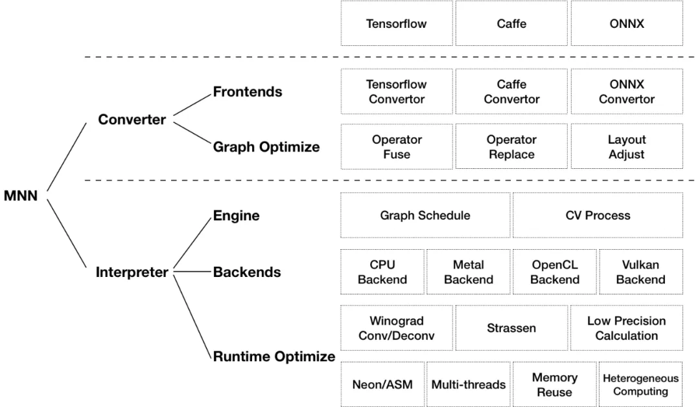

# MNN推理框架

**前言**

**MNN**全称Mobile Neural Network。MNN是阿里开源的一个**高效、轻量**的深度学习框架。它支持深度模型推理与训练，尤其在端侧的推理与训练性能在业界处于领先地位, 在阿里业务中广泛落地应用。它具有**轻量性、通用性、高性能和易用性**特点。整体架构:





MNN可以分为Converter和Interpreter两部分。Converter由Frontends和Graph Optimize构成。前者负责支持不同的训练框架，MNN当前支持Tensorflow(Lite)、Caffe和ONNX(PyTorch/MXNet的模型可先转为ONNX模型再转到MNN)；后者通过算子融合、算子替代、布局调整等方式优化图。


Interpreter由Engine和Backends构成。前者负责模型的加载、计算图的调度；后者包含各计算设备下的内存分配、Op实现。在Engine和Backends中，MNN应用了多种优化方案，包括在卷积和反卷积中应用Winograd算法、在矩阵乘法中应用Strassen算法、低精度计算、Neon优化、手写汇编、多线程优化、内存复用、异构计算等。


**源码: https://github.com/alibaba/MNN
使用文档: https://www.yuque.com/mnn/cn**
本章主要讲述MNN在移动端CPU、GPU场景下的使用。


**环境搭建**

**1.下载源码**

```
git clone https://github.com/alibaba/MNN.git
```


**2.编译**

(1).依赖安装 需要安装protobuf， ocl-icd-opencl-dev 安装opencl sdk

```
sudo apt install ocl-icd-opencl-dev
```

安装protobuf

```
$ sudo apt-get install autoconf automake libtool curl make g++ unzip
$ git clone https://github.com/google/protobuf.git
$ cd protobuf
$ git submodule update --init --recursive
$ ./autogen.sh
$ ./configure
$ make
$ make check
$ sudo make install
$ sudo ldconfig # refresh shared library cache.
```

(2)编译转换工具

```
cd MNN/
./schema/generate.sh
mkdir build
cd build
cmake .. -DMNN_BUILD_CONVERTER=true && make -j4
```

在build目录下生成模型转换工具MNNConvert


**3.编译android动态库**

```
./schema/generate.sh
cd project/android
# 编译armv7动态库
mkdir build_32 && cd build_32 && ../build_32.sh
# 编译armv8动态库
mkdir build_64 && cd build_64 && ../build_64.sh
```

动态库在jni开发中使用。


**开发步骤**

**1.基本流程**

1). 训练；
2). 导出frozen graph；
3). 转mnn模型
4). 端侧部署。


**2.模型转换**

(1).转换工具获取方式
1).方式1：通过MNN源码编译得到MNNConvert
2).方式2：通过pip install MNN得到mnnconvert


(2).MNNConvert定义

```
Usage:
MNNConvert [OPTION...]
-h, --help Convert Other Model Format To MNN Model
-v, --version show current version
-f, --framework arg model type, ex: [TF,CAFFE,ONNX,TFLITE,MNN]
--modelFile arg tensorflow Pb or caffeModel, ex: *.pb,*caffemodel
--prototxt arg only used for caffe, ex: *.prototxt
--MNNModel arg MNN model, ex: *.mnn
--fp16 save Conv's weight/bias in half_float data type
--benchmarkModel Do NOT save big size data, such as Conv's weight,BN's
gamma,beta,mean and variance etc. Only used to test
the cost of the model
--bizCode arg MNN Model Flag, ex: MNN
--debug Enable debugging mode.
```


(3)MNNConvert使用

```
usage: mnnconvert [-h] -f {TF,CAFFE,ONNX,TFLITE,MNN} --modelFile MODELFILE
[--prototxt PROTOTXT] --MNNModel MNNMODEL [--fp16 FP16]
optional arguments:
-h, --help show this help message and exit
-f {TF,CAFFE,ONNX,TFLITE,MNN}, --framework {TF,CAFFE,ONNX,TFLITE,MNN}
model type, for example:TF/CAFFE/ONNX/TFLITE/MNN
--modelFile MODELFILE
tensorflow Pb or caffeModel, for
example:xxx.pb/xxx.caffemodel
--prototxt PROTOTXT only used for caffe, for example: xxx.prototxt
--MNNModel MNNMODEL MNN model, ex: xxx.mnn
--fp16 FP16 {True,False} Boolean to change the mnn usage. If True,
the output model save data in half_float type
```

1)TensorFlow -> MNN

```
./MNNConvert -f TF --modelFile XXX.pb --MNNModel XXX.mnn --bizCode biz
```

2).TensorFlow Lite -> MNN

```
./MNNConvert -f TFLITE --modelFile XXX.tflite --MNNModel XXX.mnn --bizCode biz
```

或者

```
mnnconvert -f TFLITE --modelFile mobilenet_nsfw.tflite --MNNModel mobilenet_nsfw.mnn
```


3)PyTorch -> MNN bin -> ONNX -> MNN

```
import torch
import torchvision
dummy_input = torch.randn(10, 3, 224, 224, device='cuda')
model = torchvision.models.alexnet(pretrained=True).cuda()
# Providing input and output names sets the display names for values# within the model's graph. Setting these does not change the semantics
# of the graph; it is only for readability.
# #
The inputs to the network consist of the flat list of inputs (i.e.
# the values you would pass to the forward() method) followed by the
# flat list of parameters. You can partially specify names, i.e. provide
# a list here shorter than the number of inputs to the model, and we will
# only set that subset of names, starting from the beginning.
input_names = [ "actual_input_1" ] + [ "learned_%d" % i for i in range(16) ]
output_names = [ "output1" ]
torch.onnx.export(model, dummy_input, "alexnet.onnx", verbose=True, input_names=input_names,
output_names=output_names)
```

```
./MNNConvert -f ONNX --modelFile XXX.onnx --MNNModel XXX.mnn --bizCode biz
```


**常用API介绍**

##### 1 加载模型,创建interpreter

```
MNN::Interpreter*
interpreter = MNN::Interpreter::createFromFile(const char* file);
或者
static Interpreter* createFromBuffer(const void* buffer, size_t size);
```


##### 2 设置硬件

```
MNN::ScheduleConfig config;
config.numThread = numthreads; // 线程数
config.type = MNN_FORWARD_CPU; // CPU推理
// 或者 config.type = MNN_FORWARD_OPENCL; // OpenCL推理即GPU推理
```


##### 3 创建session

```
session = interpreter->createSession(config);
```


##### 4 获取输入tensor

```
MNN::Tensor* inputTensor = interpreter->getSessionInput(session, nullptr);
```


##### 5 输入数据

```
auto nhwcTensor = new Tensor(inputTensor, Tensor::TENSORFLOW);
// nhwcTensor-host<float>()[x] = ...
inputTensor->copyFromHostTensor(nhwcTensor);
```


##### 6 推理

```
interpreter->runSession(session);
```


##### 7 获取输出tensor

```
auto outputTensor = interpreter->getSessionOutput(session, NULL);
auto nhwcTensor = new Tensor(outputTensor, Tensor::TENSORFLOW);
outputTensor->copyToHostTensor(nhwcTensor);
auto output_data = outputTensor->host<float>(); // 获取具体数值
```


8 图像变换
1 YUV->RGB, 相机预览图格式是YUV

```
MNN::CV::ImageProcess::Config yuv_config;
yuv_config.sourceFormat = MNN::CV::ImageFormat::YUV_NV21; // 输入图像格式
yuv_config.destFormat = MNN::CV::ImageFormat::RGB; // 输出图像格式
yuv_process = MNN::CV::ImageProcess::create(yuv_config);
MNN::CV::Matrix trans;
trans.setScale(1.0 / src_width, 1.0 / src_height); // 缩小，变换到 [0,1] 区间：
trans.postRotate(degrees, 0.5, 0.5); // 以中心点[0.5, 0.5]旋转90度
switch (flip)
{
case 1:
trans.postScale(-1.0, 1.0, 0.5, 0.0); // 水平翻转
break;
case 2:
trans.postScale(1.0, -1.0, 0, 0.5); // 垂直翻转
break;
case 0:
break;
default:
break;
} t
rans.postScale(input_width, input_height); // 方法回原图大小
trans.invert(&trans);
yuv_process->setMatrix(trans); // 设置变换矩阵
yuv_process->convert((const unsigned char*)source, src_width, src_height, 0, cv_out_tensor); // 转换，结
果保存在cv_out_tensor中
```


2 RGBA -> RGB, android bitmap转换得到的图像格式是RGBA

```
MNN::CV::ImageProcess::Config rgba_config;
rgba_config.sourceFormat = MNN::CV::ImageFormat::RGBA; // 输入图像格式
rgba_config.destFormat = MNN::CV::ImageFormat::RGB; // 输出图像格式
rgba_process = MNN::CV::ImageProcess::create(rgba_config);
... 同上
```


##### 9 释放资源

```

if (interpreter) {
free(interpreter);
interpreter = nullptr;
} i
f (session) {
free(session);
session = nullptr;
} i
f (yuv_process) {
free(yuv_process);
yuv_process = nullptr;
} i
f (rgba_process) {
free(rgba_process);
rgba_process = nullptr;
} i
f (cv_out_tensor) {
free(cv_out_tensor);
cv_out_tensor = nullptr;
} i
f (output_host_tensor) {
free(output_host_tensor);
output_host_tensor = nullptr;
} i
f (model_input_tensor) {
free(model_input_tensor);
model_input_tensor = nullptr;
} i
f (model_output_tensor) {
free(model_output_tensor);
model_output_tensor = nullptr;
}
```


## 总结


### 1 推理过程可总结为以下几步：

```

# 1. 加载模型
MNN::Interpreter*
interpreter = MNN::Interpreter::createFromFile(model_file);
# 2. 创建session
MNN::ScheduleConfig config;
config.numThread = numthreads; // 线程数
config.type = MNN_FORWARD_CPU; // CPU推理
session = interpreter->createSession(config);
# 3. 设置输入
MNN::Tensor* inputTensor = interpreter->getSessionInput(session, nullptr);
# ... ImageProcess处理数据
# ... 喂数据
auto nhwcTensor = new Tensor(inputTensor, Tensor::TENSORFLOW);
// nhwcTensor-host<float>()[x] = ...
inputTensor->copyFromHostTensor(nhwcTensor);# 4. 执行推理
interpreter->runSession(session);
# 5. 获取输出
auto outputTensor = interpreter->getSessionOutput(session, NULL);
auto nhwcTensor = new Tensor(outputTensor, Tensor::TENSORFLOW);
outputTensor->copyToHostTensor(nhwcTensor);
auto output_data = outputTensor->host<float>(); // 获取具体数值
# 6. 释放资源
free(interpreter)
free(session)
...
```


2 使用cmake编译，CMakeLists.txt模板如下:

```
cmake_minimum_required(VERSION 3.4.1)
include_directories(opencv/jni/include)
include_directories(snpe/zdl)
set(lib_DIR ${CMAKE_SOURCE_DIR}/libs)
include_directories(${CMAKE_SOURCE_DIR}/includes)
set (CMAKE_C_FLAGS "${CMAKE_C_FLAGS}")
set (CMAKE_CXX_FLAGS "${CMAKE_CXX_FLAGS}")
add_library( MNN SHARED IMPORTED )
set_target_properties(
MNN
PROPERTIES IMPORTED_LOCATION
${lib_DIR}/${ANDROID_ABI}/libMNN.so
) a
dd_library( lib_opencv SHARED IMPORTED )
set_target_properties(
lib_opencv PROPERTIES IMPORTED_LOCATION
${lib_DIR}/${ANDROID_ABI}/libopencv_java4.so)
file(GLOB_RECURSE CPP_SRCS src/main/jni/*.cpp )
file(GLOB_RECURSE H_SRCS src/main/jni/*.h )
add_library( FaceCore SHARED ${CPP_SRCS} ${H_SRCS} )
find_library( log-lib log )
find_library( jnigraphics-lib jnigraphics )
add_definitions(-DMNN_USE_LOGCAT)
target_link_libraries(
FaceCore
MNN
lib_opencv
${log-lib}${jnigraphics-lib}
)
```

