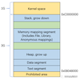

# NCNN Mat详解


## 一、数据成员

在具体看[Mat](https://link.zhihu.com/?target=https%3A//github.com/Tencent/ncnn/blob/master/src/mat.h)的实现之前，先看下Mat的几个主要数据成员，这可以更快的帮助理解Mat的功能：

```cpp
class NCNN_EXPORT Mat
{
public:
    void* data;
    int* refcount;
    size_t elemsize;
    int elempack;
    Allocator* allocator;

    int dims;
    int w;
    int h;
    int d;
    int c;

    size_t cstep;
};
```

其中每个成员的作用如下：

- data：指向数据存放的内存地址
- refcount：这是一个引用计数，后面还会详细讲
- elemsize：用来表示Mat中每一个元素的大小，Mat中的元素是无类型的，只有一个元素大小的信息
- elempack：通常用于[SIMD](https://zhida.zhihu.com/search?content_id=216689067&content_type=Article&match_order=1&q=SIMD&zhida_source=entity)的场景，可简单认为一个SIMD的寄存器里存了几个元素
- allocator：Mat对象的内存分配方法
- dims：指示Mat实际有几个维度，最多允许4维
- c/d/h/w：具体每个维度的值，其中d是指的depth，通常在3d卷积中会用到
- cstep：Mat中的数据排布是CHW顺序，这个值表示了每两个channel之间的stride

其中的elempack的详细解释可以参考这个官方文档：

[https://github.com/Tencent/ncnn/wiki/element-packinggithub.com/Tencent/ncnn/wiki/element-packing](https://link.zhihu.com/?target=https%3A//github.com/Tencent/ncnn/wiki/element-packing)

## 二、构造方法

Mat对象的构造很方便，提供了众多的构造函数：

```cpp
    Mat();

    Mat(int w, size_t elemsize = 4u, Allocator* allocator = 0);
    Mat(int w, int h, size_t elemsize = 4u, Allocator* allocator = 0);
    Mat(int w, int h, int c, size_t elemsize = 4u, Allocator* allocator = 0);
    Mat(int w, int h, int d, int c, size_t elemsize = 4u, Allocator* allocator = 0);

    Mat(int w, size_t elemsize, int elempack, Allocator* allocator = 0);
    Mat(int w, int h, size_t elemsize, int elempack, Allocator* allocator = 0);
    Mat(int w, int h, int c, size_t elemsize, int elempack, Allocator* allocator = 0);
    Mat(int w, int h, int d, int c, size_t elemsize, int elempack, Allocator* allocator = 0);

    Mat(const Mat& m);

    Mat(int w, void* data, size_t elemsize = 4u, Allocator* allocator = 0);
    Mat(int w, int h, void* data, size_t elemsize = 4u, Allocator* allocator = 0);
    Mat(int w, int h, int c, void* data, size_t elemsize = 4u, Allocator* allocator = 0);
    Mat(int w, int h, int d, int c, void* data, size_t elemsize = 4u, Allocator* allocator = 0);

    Mat(int w, void* data, size_t elemsize, int elempack, Allocator* allocator = 0);
    Mat(int w, int h, void* data, size_t elemsize, int elempack, Allocator* allocator = 0);
    Mat(int w, int h, int c, void* data, size_t elemsize, int elempack, Allocator* allocator = 0);
    Mat(int w, int h, int d, int c, void* data, size_t elemsize, int elempack, Allocator* allocator = 0);
```

可见这里除了一个空构造、一个拷贝构造之外，剩下的都是4个一组，分别处理从dims为1到dims为4的特殊构造，这些特殊构造一共有四组：

- 第一组：不用指明elempack的值，这时构造函数内会对其赋值1，这一组构造函数会进行内存分配
- 第二组：这一组指明了elempack的值，这一组构造函数会进行内存分配
- 第三组：不用指明elempack的值，这时构造函数内会对其赋值1，这一组构造函数使用外部数据指针，不会进行内存分配
- 第四组：这一组指明了elempack的值，这一组构造函数使用外部数据指针，不会进行内存分配

上面提到的内存分配，都是使用Mat内部的[create](https://link.zhihu.com/?target=https%3A//github.com/Tencent/ncnn/blob/master/src/mat.cpp%23L298)来进行的，下面看一个dims为3的内存分配实现：

```cpp
void Mat::create(int _w, int _h, int _c, size_t _elemsize, Allocator* _allocator)
{
    if (dims == 3 && w == _w && h == _h && c == _c && elemsize == _elemsize && elempack == 1 && allocator == _allocator)
        return;

    release();

    elemsize = _elemsize;
    elempack = 1;
    allocator = _allocator;

    dims = 3;
    w = _w;
    h = _h;
    d = 1;
    c = _c;

    cstep = alignSize((size_t)w * h * elemsize, 16) / elemsize;

    size_t totalsize = alignSize(total() * elemsize, 4);
    if (totalsize > 0)
    {
        if (allocator)
            data = allocator->fastMalloc(totalsize + (int)sizeof(*refcount));
        else
            data = fastMalloc(totalsize + (int)sizeof(*refcount));
    }

    if (data)
    {
        refcount = (int*)(((unsigned char*)data) + totalsize);
        *refcount = 1;
    }
}
```

这里面有下面值得注意的点：

1. 数据成员赋值，有些成员会有默认值，这个很好理解，不多做说明，cstep会按照16字节对齐，这个下一节会讲
2. 在allocator为空的情况下，会使用[fastMalloc](https://link.zhihu.com/?target=https%3A//github.com/Tencent/ncnn/blob/master/src/allocator.h%23L71)进行内存分配，这个函数很直接，使用posix_memalign或者malloc来进行内存分配，在allocator不为空的情况下，使用传入的分配器来进行分配，NCNN中实现了[PoolAllocator](https://link.zhihu.com/?target=https%3A//github.com/Tencent/ncnn/blob/master/src/allocator.cpp%23L109)，即一个简单的内存池，以后有时间再单独写文章来分析
3. 给引用计数赋初值1，这在后面引用计数的部分再细讲

## 三、数据排布和对齐

Mat中的数据排布是CHW的，即channel是最外层的维度，w是最内层的维度，而且Mat中的数据在channel这个维度是做了对齐的，两个channel之间的间距用上一节提到的cstep来表示：

```text
cstep = alignSize((size_t)w * h * elemsize, 16) / elemsize;
```

可见cstep的值并不一定等于h*w，有可能大于这个乘积，这样做的原因是由于NCNN的算子实现广泛使用了SIMD的指令来进行加速，而SIMD的指令，对于数据的对齐是有要求的，比如ARM平台的NEON寄存器，位宽是128bit，即16个字节，所以在对数据进行16字节对齐之后，相应的NEON运算能获得更高的性能。

如果想使用HWC的数据排布，有两种解决方案：

1. 在具体的Layer的forward之前，对数据进行一次重排，做一次CHW2HWC的操作，forward之后再做一次数据重排，即HWC2CHW的操作，这种方案的效率偏低，因为有额外的重排开销
2. 定制一套HWC的Mat，以及相应的Net和Extractor，这个代码改动的偏多，但是可以避免上面所说的重排开销

## 四、引用计数

### 4.1 引用计数初始化

在第二节中，已经提到了在Mat对象构造的过程中，会给引用计数分配内存，以及初始化为1，即这几句代码：

```cpp
void Mat::create(int _w, int _h, int _c, size_t _elemsize, Allocator* _allocator)
{
    ......
    size_t totalsize = alignSize(total() * elemsize, 4);
    if (totalsize > 0)
    {
        if (allocator)
            data = allocator->fastMalloc(totalsize + (int)sizeof(*refcount));
        else
            data = fastMalloc(totalsize + (int)sizeof(*refcount));
    }
    if (data)
    {
        refcount = (int*)(((unsigned char*)data) + totalsize);
        *refcount = 1;
    }
}
```

这里需要注意引用计数使用的内存和Mat中存放的数据用的是同一块内存，可以看到，分配Mat对象内存的时候，多申请了sizeof(*refcount)个字节，这个做法很有技巧，会比单独分配一块内存有效率，这和modern C++中的[shared_ptr](https://zhida.zhihu.com/search?content_id=216689067&content_type=Article&match_order=1&q=shared_ptr&zhida_source=entity)的[make_shared](https://zhida.zhihu.com/search?content_id=216689067&content_type=Article&match_order=1&q=make_shared&zhida_source=entity)这种创建方式原理相同，关于make_shared的分析，大家可以参考之前写的这篇文章的第四节：

[月踏：内存管理：具有共享所有权的智能指针（一）6 赞同 · 2 评论文章](https://zhuanlan.zhihu.com/p/399701713)

### 4.2 引用计数加1

Mat内部使用了引用计数，这样Mat就像智能指针一样，可以对内存自动进行管理，先看一下第一节中提到的拷贝构造函数的实现：

```cpp
NCNN_FORCEINLINE Mat::Mat(const Mat& m)
{
    if (refcount)
      NCNN_XADD(refcount, 1);
}
```

除了拷贝构造之外，赋值构造也会对引用计数加1，这里就不展示了，上面代码中的NCNN_XADD是原子操作，保证refcount的的加1操作在多线程情况下的正确性，下面简单看下[NCNN_XADD](https://link.zhihu.com/?target=https%3A//github.com/Tencent/ncnn/blob/master/src/allocator.h%23L113)的实现：

```text
#if NCNN_THREADS
// exchange-add operation for atomic operations on reference counters
#if defined __riscv && !defined __riscv_atomic
// riscv target without A extension
static NCNN_FORCEINLINE int NCNN_XADD(int* addr, int delta)
{
    int tmp = *addr;
    *addr += delta;
    return tmp;
}
#elif defined __INTEL_COMPILER && !(defined WIN32 || defined _WIN32)
// atomic increment on the linux version of the Intel(tm) compiler
#define NCNN_XADD(addr, delta) (int)_InterlockedExchangeAdd(const_cast<void*>(reinterpret_cast<volatile void*>(addr)), delta)
#elif defined __GNUC__
#if defined __clang__ && __clang_major__ >= 3 && !defined __ANDROID__ && !defined __EMSCRIPTEN__ && !defined(__CUDACC__)
#ifdef __ATOMIC_ACQ_REL
#define NCNN_XADD(addr, delta) __c11_atomic_fetch_add((_Atomic(int)*)(addr), delta, __ATOMIC_ACQ_REL)
#else
#define NCNN_XADD(addr, delta) __atomic_fetch_add((_Atomic(int)*)(addr), delta, 4)
#endif
#else
#if defined __ATOMIC_ACQ_REL && !defined __clang__
// version for gcc >= 4.7
#define NCNN_XADD(addr, delta) (int)__atomic_fetch_add((unsigned*)(addr), (unsigned)(delta), __ATOMIC_ACQ_REL)
#else
#define NCNN_XADD(addr, delta) (int)__sync_fetch_and_add((unsigned*)(addr), (unsigned)(delta))
#endif
#endif
#elif defined _MSC_VER && !defined RC_INVOKED
#define NCNN_XADD(addr, delta) (int)_InterlockedExchangeAdd((long volatile*)addr, delta)
#else
// thread-unsafe branch
static NCNN_FORCEINLINE int NCNN_XADD(int* addr, int delta)
{
    int tmp = *addr;
    *addr += delta;
    return tmp;
}
#endif
#else  // NCNN_THREADS
static NCNN_FORCEINLINE int NCNN_XADD(int* addr, int delta)
{
    int tmp = *addr;
    *addr += delta;
    return tmp;
}
#endif // NCNN_THREADS
```

这段代码看起来很复杂，其实很简单，里面NCNN做的主要工作就是判断所用平台或者所用编译器，然后调用相应的加1操作原子实现，可以看到只有clang、gcc、windows compiler提供了相应的原子加1函数，其他的情况都没有提供原子加，只适用于单线程的情况，非线程安全。

### 4.3 引用计数减1

关于引用计数可以加1，自然就可以减1，在Mat对象析构的时候，就会进行减1的操作，具体的实现被封装到了release这个函数中：

```cpp
NCNN_FORCEINLINE void Mat::release()
{
    if (refcount && NCNN_XADD(refcount, -1) == 1)
    {
        if (allocator)
            allocator->fastFree(data);
        else
            fastFree(data);
    }

    data = 0;

    elemsize = 0;
    elempack = 0;

    dims = 0;
    w = 0;
    h = 0;
    d = 0;
    c = 0;

    cstep = 0;

    refcount = 0;
}
```

可见release的过程，仍然是使用NCNN_XADD宏，不过这次是进行加负1的操作，即减1，然后判断引用计数是否为1，这里需要注意的是，NCNN_XADD的返回值，是加或减之前的值，这样的话，如果NCNN_XADD的返回值为1的话，说明不再有人在使用这个对象，则调用fastFree来释放内存，以及把所有数据成员置为0

## 五、辅助函数

Mat中有很多helper function，来方便开发者使用，下面简单列举一下

### 5.1 内容填充

Mat内部有一批名为fill的成员函数，可以对Mat的数据内容用指定的数据来进行填充，下面以整形填充为例做下说明：

```cpp
NCNN_FORCEINLINE void Mat::fill(int _v)
{
    int size = (int)total();
    int* ptr = (int*)data;

    int i = 0;
#if __ARM_NEON
    int32x4_t _c = vdupq_n_s32(_v);
    for (; i + 3 < size; i += 4)
    {
        vst1q_s32(ptr, _c);
        ptr += 4;
    }
#endif // __ARM_NEON
    for (; i < size; i++)
    {
        *ptr++ = _v;
    }
}
```

这里的实现有一个很有趣的技巧，通过__ARM_NEON这个条件编译宏来enable NEON的使用，在这个条件编译宏没有开启的情况下，也能通过第二个for循环来挨个进行Naive方式的赋值，在这个条件编译宏开启的情况下，则通过[vst1q_s32](https://link.zhihu.com/?target=https%3A//developer.arm.com/documentation/dui0491/i/Using-NEON-Support/Store-a-single-vector-or-lane)这个NEON指令进行加速填充，vst1q_s32指令可以一次把一个int32x4_t大小的vector存入memory中，int32x4_t可以理解为4个整数，效率自然比一次填充一个整数效率高

### 5.2 归一化

这个功能具体指的是[substract_mean_normalize](https://link.zhihu.com/?target=https%3A//github.com/Tencent/ncnn/blob/master/src/mat.cpp%23L1127)这个函数，从名字也可以猜出它是用来减均值除方差的，主要实现如下：

```cpp
void Mat::substract_mean_normalize(const float* mean_vals, const float* norm_vals)
{
    Layer* op;

    // substract mean and normalize
    op = create_layer(LayerType::Scale);
    ...
    Mat weights[2];
    weights[0] = Mat(c);
    weights[1] = Mat(c);
    for (int q = 0; q < c; q++)
    {
        weights[0][q] = norm_vals[q];
        weights[1][q] = -mean_vals[q] * norm_vals[q];
    }

    op->load_model(ModelBinFromMatArray(weights));
    op->create_pipeline(opt);
    op->forward_inplace(*this, opt);
    op->destroy_pipeline(opt);

    delete op;
}
```

这个函数其实会对mean_vals和norm_vals是否为nullptr来分别处理，上面展示的仅仅是全部不为空的情况，这个功能是通过Scale这个Layer来实现的，再看代码中的for循环，乍一看不太像减均值除方差，先看下减均值除方差的公式：

(1)y=x−meanvar

其实这个函数的norm_vals这个参数，是方差值的倒数，即上面公示中的1/var，这样的话，上面公式可被表示为：

(2)y=x∗norm_vals−mean_vals∗norm_vals

最后再调用Scale中的forward_inplace完成计算，其中inplace指的是原位计算，即把计算结果放在原来的内存位置，原始值会被覆盖。

### 5.3 图像处理

这个功能对应一系列的静态函数，主要用来辅助处理图片，基本都以from_pixels和to_pixels打头，下面仅以from_pixels为例做一些简单说明，简单来说，这个函数主要用来把cv::Mat中的数据（opencv读取的图片内容）转换到ncnn::Mat中：

```cpp
Mat Mat::from_pixels(const unsigned char* pixels, int type, int w, int h, Allocator* allocator)
{
    int type_from = type & PIXEL_FORMAT_MASK;

    if (type_from == PIXEL_RGB || type_from == PIXEL_BGR)
    {
        return Mat::from_pixels(pixels, type, w, h, w * 3, allocator);
    }
    else if (type_from == PIXEL_GRAY)
    {
        return Mat::from_pixels(pixels, type, w, h, w * 1, allocator);
    }
    else if (type_from == PIXEL_RGBA || type_from == PIXEL_BGRA)
    {
        return Mat::from_pixels(pixels, type, w, h, w * 4, allocator);
    }

    // unknown convert type
    NCNN_LOGE("unknown convert type %d", type);
    return Mat();
}
```

从上面的if/else分发可以看出来，这个函数主要处理的是灰度图（单通道）、RGB图（三通道）、RGBA图（四通道），咱们这里以三通道处理为例，继续深入看一下，最终会调到下面这个函数：

```cpp
static int from_rgb2bgr(const unsigned char* rgb, int w, int h, int stride, Mat& m, Allocator* allocator)
{
    m.create(w, h, 3, 4u, allocator);

    w = w * h;
    h = 1;

    float* ptr0 = m.channel(0);
    float* ptr1 = m.channel(1);
    float* ptr2 = m.channel(2);

#if __ARM_NEON
    int nn = w >> 3;
    int remain = w - (nn << 3);
#else
    int remain = w;
#endif // __ARM_NEON

#if __ARM_NEON
#if __aarch64__
    for (; nn > 0; nn--)
    {
        uint8x8x3_t _rgb = vld3_u8(rgb);
        uint16x8_t _r16 = vmovl_u8(_rgb.val[0]);
        uint16x8_t _g16 = vmovl_u8(_rgb.val[1]);
        uint16x8_t _b16 = vmovl_u8(_rgb.val[2]);

        float32x4_t _rlow = vcvtq_f32_u32(vmovl_u16(vget_low_u16(_r16)));
        float32x4_t _rhigh = vcvtq_f32_u32(vmovl_u16(vget_high_u16(_r16)));
        float32x4_t _glow = vcvtq_f32_u32(vmovl_u16(vget_low_u16(_g16)));
        float32x4_t _ghigh = vcvtq_f32_u32(vmovl_u16(vget_high_u16(_g16)));
        float32x4_t _blow = vcvtq_f32_u32(vmovl_u16(vget_low_u16(_b16)));
        float32x4_t _bhigh = vcvtq_f32_u32(vmovl_u16(vget_high_u16(_b16)));

        vst1q_f32(ptr2, _rlow);
        vst1q_f32(ptr2 + 4, _rhigh);
        vst1q_f32(ptr1, _glow);
        vst1q_f32(ptr1 + 4, _ghigh);
        vst1q_f32(ptr0, _blow);
        vst1q_f32(ptr0 + 4, _bhigh);

        rgb += 3 * 8;
        ptr0 += 8;
        ptr1 += 8;
        ptr2 += 8;
    }
#endif // __aarch64__
#endif // __ARM_NEON
    for (; remain > 0; remain--)
    {
        *ptr0 = rgb[2];
        *ptr1 = rgb[1];
        *ptr2 = rgb[0];

        rgb += 3;
        ptr0++;
        ptr1++;
        ptr2++;
    }

    return 0;
}
```

这段代码的主要过程如下：

1. 先通过调用Mat的create给Mat申请内存，shape为3hw，大小为4x3xhxw bytes，之所以乘以4是因为Mat中使用float来存储传进来的rgb或者bgr图
2. 如果NEON功能是enable的，那就使用NEON intrinsics来进行加速，先使用vld3_u8读入24个字节，再使用vmovl_u8把每个8bit表示的数转为16bit表示，继续使用vmovl_u16把16bit表示的数转为32bit表示，在使用vcvtq_f32_u32把32bit整数转为浮点数，最后使用vst1q_f32把浮点数存入Mat对象中
3. 最后一部分是一段Naive的C++赋值实现，如果NEON是enable的，就用来处理NEON没有处理完的数，如果NEON是disable的，就用来处理所有的数

## 六、Reference and Summary

Mat是NCNN中最重要数据结构之一，在做前向推理的过程中，Mat对象就像NCNN的血液一样，在Layer之间流淌，它的实现也非常高效、比较容易理解和使用，本文主要参考的是NCNN的官方代码，大家一起来学习这个优秀的开源项目吧：

[GitHub - Tencent/ncnn: ncnn is a high-performance neural network inference framework optimized for the mobile platformgithub.com/Tencent/ncnn](https://link.zhihu.com/?target=https%3A//github.com/Tencent/ncnn)

