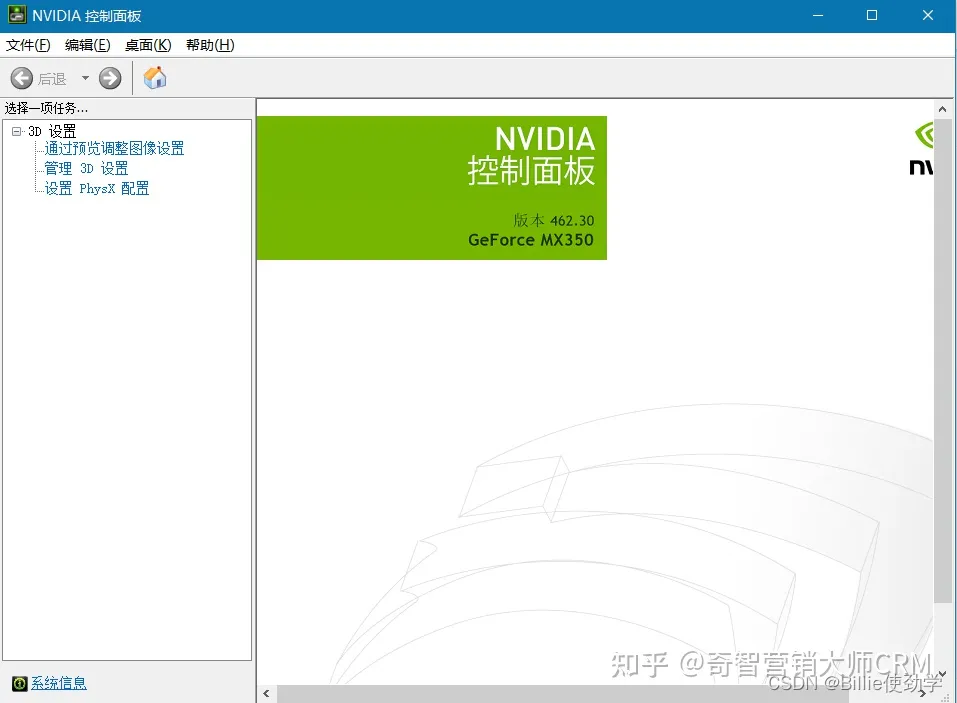
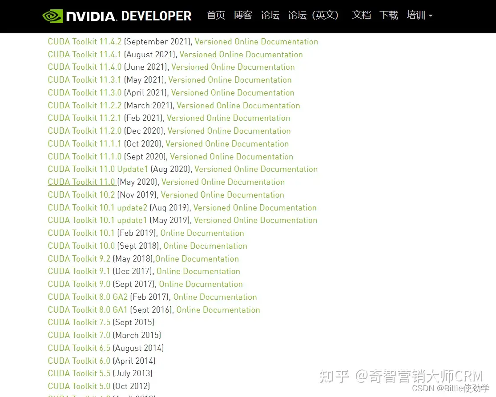
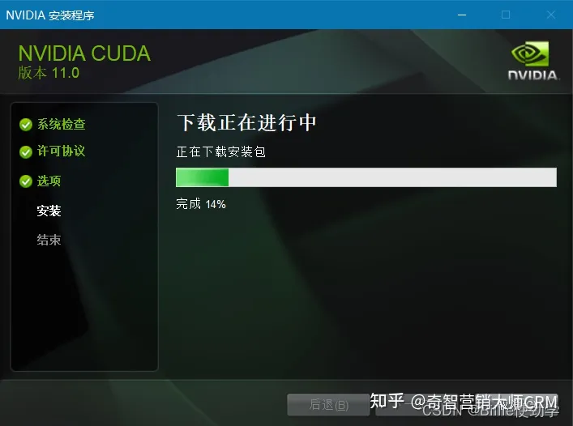
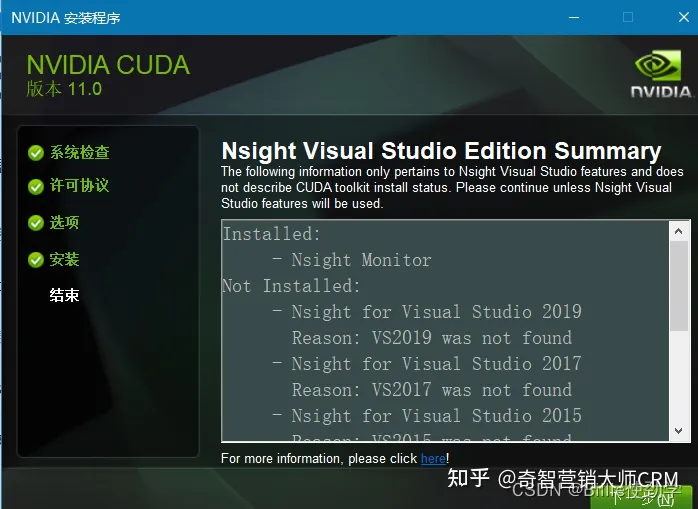

# CUDA下载及安装教程

https://www.nvidia.cn/drivers/lookup/

https://developer.nvidia.com/cuda-toolkit-archive


### 前言

windows10 版本安装 CUDA ，首先需要下载两个安装包

CUDA toolkit（toolkit就是指工具包）

cuDNN

注：cuDNN 是用于配置深度学习使用

官方教程

CUDA：Installation Guide Windows :: CUDA Toolkit Documentation

cuDNN：Installation Guide :: NVIDIA Deep Learning cuDNN Documentation

cuda的下载及安装

cuda版本

如何判断自己应该下载什么版本的cuda呢？

打开nvidia（桌面右键）->选择左下角的系统信息->组件



第三行，可以看到自己电脑支持的cuda


CUDA toolkit Download

kCUDA Toolkit Archive | NVIDIA Developer



点进去，按照如下配置选择，然后点击下载：


最终下载出.exe格式的文件


cuda安装

安装cuda时，第一次会让设置临时解压目录，第二次会让设置安装目录；

临时解压路径，建议默认即可，也可以自定义。安装结束后，临时解压文件夹会自动删除；

安装目录，建议默认即可；

注意：临时解压目录千万不要和cuda的安装路径设置成一样的，否则安装结束，会找不到安装目录的！！！

选择自定义安装

安装完成后，配置cuda的环境变量；

命令行中，测试是否安装成功；

双击“exe文件”，选择下载路径（推荐默认路径）


同意并继续


自定义安装，精简版本是下载好所有组件，并且会覆盖原有驱动，所以在这里推荐自定义下载


如果你是第一次安装，尽量全选

如果你是第n次安装，尽量只选择第一个，不然会出现错误


没有选择visual studio，后面说找不到，就返回取消了这个复选框


记住默认的安装路径


在安装了



Ok啦，点击下一步即可



查看环境变量

点击设置-->搜索高级系统设置-->查看环境变量

【如果没有需要自己添加】


系统变量的三四行有两个路径，是自动生成的


还有两个这个


有的小伙伴说后两个变量没有自动生成，没有生成的手动添加就行，注意自己的路径

这两个变量放在下面啦，方便复制

```
NVCUDASAMPLES_ROOT
NVCUDASAMPLES11_0_ROOT
```

验证是否安装成功：

运行cmd，输入

```
nvcc --version 
```

即可查看版本号；

```
set cuda
```

可以查看 CUDA 设置的环境变量。

```
nvcc --version
```

OR

```
nvcc -V
```

```
set cuda
```


安装成功

cuDNN下载及安装

cuDNN下载

cuDNN地址如下，不过要注意的是，我们需要注册一个账号，才可以进入到下载界面。大家可以放心注册的。

[https://developer.nvidia.com/rdp/cudnn-download](https://link.zhihu.com/?target=https%3A//developer.nvidia.com/rdp/cudnn-download)

点击注册


注册成功后的下载界面


可以使用下面网址，查看适配的 cuDNN

cuDNN Archive | NVIDIA Developer

选择跟自己的cuda版本适配的cudnn版本


选择如下版本


下载结果是一个压缩包


cuDNN配置

cuDNN叫配置更为准确，我们先把下载的 cuDNN 解压缩，会得到下面的文件：

下载的文件都在这个目录下：

```
D:\software\cuda\package
```

解压后的文件：


下载后发现其实cudnn不是一个exe文件，而是一个压缩包，解压后，有三个文件夹，把三个文件夹拷贝到cuda的安装目录下。

CUDA 的安装路径在前面截图中有，或者打开电脑的环境变量查看，默认的安装路径如下：

```
C:\Program Files\NVIDIA GPU Computing Toolkit\CUDA\v11.0
```

拷贝时看到，CUDA 的安装目录中，有和 cuDNN 解压缩后的同名文件夹，这里注意，不需要担心，直接复制即可。cuDNN 解压缩后的同名文件夹中的配置文件会添加到 CUDA安装目录中的同名文件夹中。【此处还是建议还是分别把文件夹的内容复制到对应文件夹中去】

现在大家应该可以理解，cuDNN 其实就是 CUDA 的一个补丁而已，专为深度学习运算进行优化的。然后再参加环境变量


添加后出现了这个，不知道会不会有问题

添加至系统变量：

往系统环境变量中的 path 添加如下路径（根据自己的路径进行修改）


C:\Program Files\NVIDIA GPU Computing Toolkit\CUDA\v11.0\bin

C:\Program Files\NVIDIA GPU Computing Toolkit\CUDA\v11.0\include

C:\Program Files\NVIDIA GPU Computing Toolkit\CUDA\v11.0\lib

C:\Program Files\NVIDIA GPU Computing Toolkit\CUDA\v11.0\libnvvp


验证安装是否成功

配置完成后，我们可以验证是否配置成功，主要使用CUDA内置的deviceQuery.exe 和 bandwidthTest.exe：

首先win+R启动cmd，cd到安装目录下的 …\extras\demo_suite,然后分别执行bandwidthTest.exe和deviceQuery.exe（进到目录后需要直接输“bandwidthTest.exe”和“deviceQuery.exe”）,应该得到下图:


————————————————

版权声明：本文为博主原创文章，遵循 CC 4.0 BY-SA 版权协议，转载请附上原文出处链接和本声明。

原文链接：[https://blog.csdn.net/m0_45447650/article/details/123704930](https://link.zhihu.com/?target=https%3A//blog.csdn.net/m0_45447650/article/details/123704930)

本文转载自 CSDN网 博主 [Billie使劲学](https://link.zhihu.com/?target=https%3A//blog.csdn.net/m0_45447650) 原创文章。感谢该博主无私奉献该篇技术文，为我们入手CUDA的安装提供了学习的教程和入门。再次感谢CSDN及原创博主。