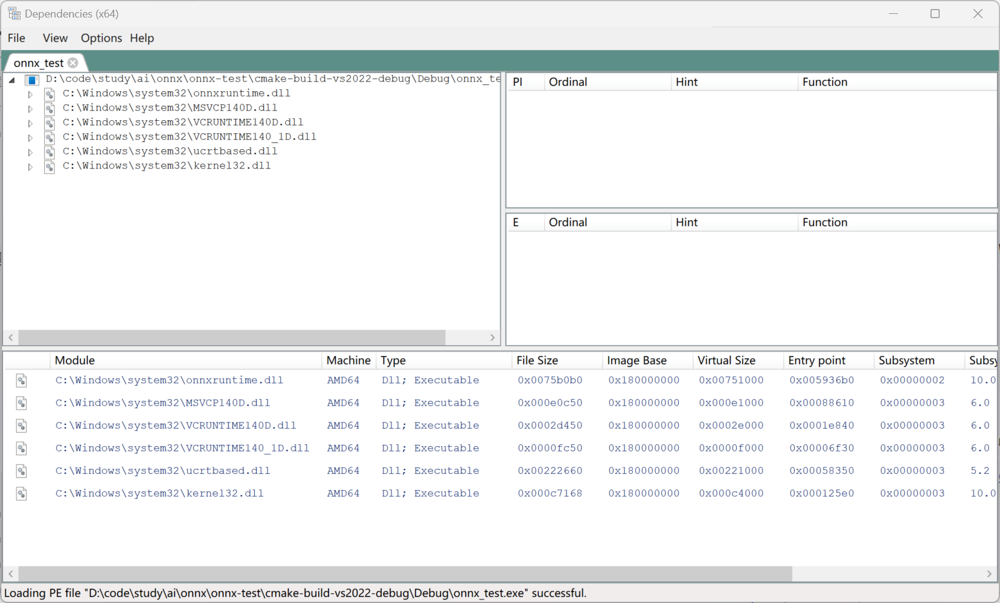

# ONNX报错处理

代码:

```cpp
#include <iostream>
#include <vector>
#include <onnxruntime_cxx_api.h>

int main() {
    Ort::Env env(ORT_LOGGING_LEVEL_WARNING, "ONNXRuntime");
    return 0;
}
```

报错:

```
The given version [19] is not supported, only version 1 to 10 is supported in this build.
```

原因:
程序加载了 C:/WINDOWS/SYSTEM32/onnxruntime.dll, 没有加载指定的这个新版本的 dll , 检测方式

使用: https://github.com/lucasg/Dependencies 这个GUI工具检查, 下载解压运行 DependenciesGui.exe 

File -> Open -> xxx.exe



可以看到加载的dll中有 C:/WINDOWS/SYSTEM32/onnxruntime.dll

解决办法:

通过CMake脚本添加命令,将指定的dll复制到exe同目录即可, exe会优先加载同目录的dll

```cmake
cmake_minimum_required(VERSION 3.28)
project(onnx_test)

set(CMAKE_CXX_STANDARD 23)

set(ONNX_INSTALL_DIR D:\\develop\\onnx\\1.19.2\\onnxruntime-win-x64-gpu-1.19.2)
# The given version [19] is not supported, only version 1 to 10 is supported in this build.
# https://github.com/microsoft/onnxruntime/issues/13606
# 程序加载了 c/WINDOWS/SYSTEM32/onnxruntime.dll, 没有加载指定的这个新版本的 dll
# 解决方案: 复制 onnxruntime.dll 到 exe 所在目录
include_directories("${ONNX_INSTALL_DIR}/include")
link_directories("${ONNX_INSTALL_DIR}/lib")

# 在运行时设置路径，以便正确加载 ONNXRuntime 的 DLL
set(EXECUTABLE_OUTPUT_PATH ${CMAKE_BINARY_DIR}/bin)

file(GLOB_RECURSE SOURCE_FILES "${CMAKE_CURRENT_SOURCE_DIR}/code/src/*.cpp")
add_executable(${PROJECT_NAME}
        ${SOURCE_FILES}
)

# 复制 DLL 到可执行文件目录
add_custom_command(TARGET ${PROJECT_NAME} POST_BUILD
        COMMAND ${CMAKE_COMMAND} -E copy_if_different
        "${ONNX_INSTALL_DIR}/lib/onnxruntime.dll"
        $<TARGET_FILE_DIR:${PROJECT_NAME}>
)

target_link_libraries(${PROJECT_NAME}
        onnxruntime
)
```

