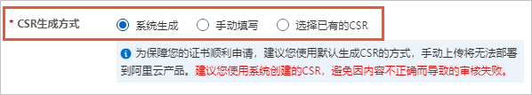
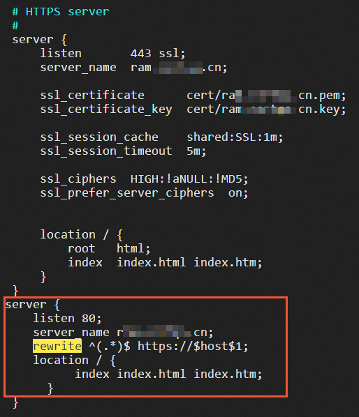
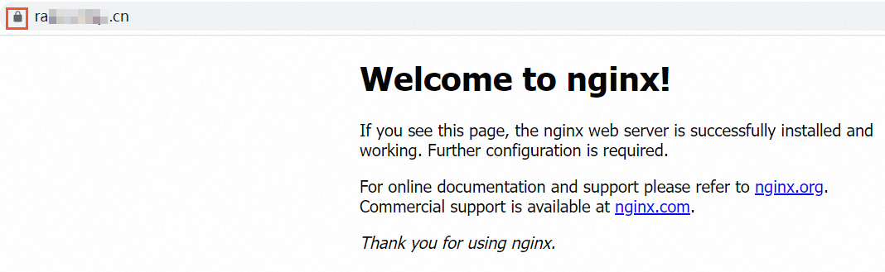

# 在Nginx或Tengine服务器安装SSL证书

更新时间：2023年6月15日 21:25:00

您可以在Nginx或Tengine服务器上安装SSL证书，实现通过HTTPS安全访问Web服务器。本文介绍如何为Nginx或Tengine服务器安装SSL证书。

**重要**

本文以CentOS 8.0 64位操作系统、Nginx 1.14.2为例介绍。不同版本的操作系统或Web服务器，部署操作可能有所差异，如有问题，请联系产品技术专家进行咨询，详情请参见[专家一对一服务](https://help.aliyun.com/document_detail/460715.html#task-2260702)。

如果您使用的是阿里云云服务器ECS（Elastic Compute Service），必须在[ECS管理控制台](https://ecs.console.aliyun.com/)的**安全组**页面，放行80端口和443端口，否则网站访问可能出现异常。关于如何配置安全组，请参见[添加安全组规则](https://help.aliyun.com/document_detail/25471.html#concept-sm5-2wz-xdb)。

本文中出现证书文件名称的地方，统一使用*cert-file-name*进行描述。例如，本文中用到的证书文件为*cert-file-name*.pem，证书私钥文件为*cert-file-name*.key。在实际操作过程中，您必须使用正确的证书文件名称替换示例代码中的*cert-file-name*。

## 前提条件

- 已通过数字证书管理服务控制台签发证书。具体操作，请参见[购买SSL证书](https://help.aliyun.com/document_detail/28542.html#task-q3j-zfp-ydb)和[提交证书申请](https://help.aliyun.com/document_detail/98574.html#concept-wxz-3xn-yfb)。
- SSL证书绑定的域名已完成DNS解析，即您的域名与主机IP地址相互映射。您可以通过DNS验证证书工具，检测域名DNS解析是否生效。具体操作，请参见[DNS验证](https://help.aliyun.com/document_detail/469153.html#section-fyr-11v-9r7)。

## 步骤一：下载SSL证书

1. 登录[数字证书管理服务控制台](https://yundunnext.console.aliyun.com/?p=cas)。

2. 在左侧导航栏，单击**SSL 证书**。

3. 在**SSL证书**页面，定位到目标证书，在**操作**列，单击**下载**。

4. 在**服务器类型**为Nginx的**操作**列，单击**下载**。

   

5. 解压缩已下载的SSL证书压缩包。

   根据您在提交证书申请时选择的CSR生成方式，解压缩获得的文件不同，具体如下表所示。

   放大查看

   | **CSR生成方式**                 | **证书压缩包包含的文件**                                     |
   | ------------------------------- | ------------------------------------------------------------ |
   | **系统生成**或**选择已有的CSR** | 包括以下文件：证书文件（PEM格式）：默认以*证书ID_证书绑定域名*命名。PEM格式的证书文件是采用Base64编码的文本文件。私钥文件（TXT格式）：证书文件的密码，默认以*证书绑定域名*命名。 |
   | **手动填写**                    | 只包括证书文件（PEM格式），您需要手动创建证书私钥文件。具体操作，请参见[创建私钥](https://help.aliyun.com/document_detail/42216.html#section-shs-zcv-ydb)。**说明**根据实际需要，您可以将PEM格式的证书文件转换成其他格式。转换证书格式的具体操作，请参见[证书格式转换](https://help.aliyun.com/document_detail/469153.html#section-7pl-isf-owk)。 |

## 步骤二：在Nginx服务器安装证书

在Nginx独立服务器、Nginx虚拟主机上安装证书的操作不同，请根据您的实际环境，选择对应的安装步骤。

### 在Nginx独立服务器上安装证书

1. 执行以下命令，在Nginx的conf目录下创建一个用于存放证书的目录。

   放大查看复制代码

   ```
   cd /usr/local/nginx/conf  #进入Nginx默认配置文件目录。该目录为手动编译安装Nginx时的默认目录，如果您修改过默认安装目录或使用其他方式安装，请根据实际配置调整。
   mkdir cert  #创建证书目录，命名为cert。
   ```

2. 将证书文件和私钥文件上传到Nginx服务器的证书目录（/usr/local/nginx/conf/cert）。

3. 编辑Nginx配置文件nginx.conf，修改与证书相关的配置。

   1. 执行以下命令，打开配置文件。

      放大查看复制代码

      ```
      vim /usr/local/nginx/conf/nginx.conf
      ```

      **重要**

      nginx.conf默认保存在/usr/local/nginx/conf目录下。如果您修改过nginx.conf的位置，可以执行`nginx -t`，查看nginx的配置文件路径，并将`/usr/local/nginx/conf/nginx.conf`进行替换。

   2. 按i键进入编辑模式。

   3. 在nginx.conf中定位到server属性配置。

      

   4. 删除行首注释符号#，并根据如下内容进行修改。

      放大查看复制代码

      ```
      server {
           #HTTPS的默认访问端口443。
           #如果未在此处配置HTTPS的默认访问端口，可能会造成Nginx无法启动。
           listen 443 ssl;
           
           #填写证书绑定的域名
           server_name <yourdomain>;
       
           #填写证书文件名称
           ssl_certificate cert/<cert-file-name>.pem;
           #填写证书私钥文件名称
           ssl_certificate_key cert/<cert-file-name>.key;
       
           ssl_session_cache shared:SSL:1m;
           ssl_session_timeout 5m;
       
           #默认加密套件
           ssl_ciphers HIGH:!aNULL:!MD5;
      	 
           #自定义设置使用的TLS协议的类型以及加密套件（以下为配置示例，请您自行评估是否需要配置）
           #TLS协议版本越高，HTTPS通信的安全性越高，但是相较于低版本TLS协议，高版本TLS协议对浏览器的兼容性较差。
           #ssl_ciphers ECDHE-RSA-AES128-GCM-SHA256:ECDHE:ECDH:AES:HIGH:!NULL:!aNULL:!MD5:!ADH:!RC4;
           #ssl_protocols TLSv1.1 TLSv1.2 TLSv1.3;
      
           #表示优先使用服务端加密套件。默认开启
           ssl_prefer_server_ciphers on;
       
       
          location / {
                 root html;
                 index index.html index.htm;
          }
      }
      ```

   5. **可选：**设置HTTP请求自动跳转HTTPS。

      如果您希望所有的HTTP访问自动跳转到HTTPS页面，则可以在需要跳转的HTTP站点下添加`rewrite`语句。

      **重要**

      以下代码片段需要放置在nginx.conf文件中`server {}`代码段后面，即设置HTTP请求自动跳转HTTPS后，nginx.conf文件中会存在两个`server {}`代码段。

      放大查看复制代码

      ```
      server {
          listen 80;
          #填写证书绑定的域名
          server_name <yourdomain>;
          #将所有HTTP请求通过rewrite指令重定向到HTTPS。
          rewrite ^(.*)$ https://$host$1;
          location / {
              index index.html index.htm;
          }
      }
      ```

      配置效果如下图所示：

      

   6. 修改完成后，按Esc键、输入:wq并按Enter键，保存修改后的配置文件并退出编辑模式。

4. 执行以下命令，重启Nginx服务。

   放大查看复制代码

   ```
   cd /usr/local/nginx/sbin  #进入Nginx服务的可执行目录。
   ./nginx -s reload  #重新载入配置文件。
   ```

   **说明**

   - 报错`the "ssl" parameter requires ngx_http_ssl_module`：您需要重新编译Nginx并在编译安装的时候加上`--with-http_ssl_module`配置。
   - 报错`"/cert/3970497_demo.aliyundoc.com.pem":BIO_new_file() failed (SSL: error:02001002:system library:fopen:No such file or directory:fopen('/cert/3970497_demo.aliyundoc.com.pem','r') error:2006D080:BIO routines:BIO_new_file:no such file)`：您需要去掉证书相对路径最前面的`/`。例如，您需要去掉`/cert/cert-file-name.pem`最前面的`/`，使用正确的相对路径`cert/cert-file-name.pem`。

### 在Nginx虚拟主机上安装证书

在不同的虚拟主机上安装证书，您需要执行不同的操作步骤。如果您使用的是阿里云的云虚拟主机，具体操作，请参见[开启HTTPS加密访问](https://help.aliyun.com/document_detail/90611.html#task-2022280)。如果您使用的是其他品牌的虚拟主机，请参考对应的虚拟主机安装证书的操作指南。

## 步骤三：验证SSL证书是否安装成功

证书安装完成后，您可通过访问证书的绑定域名验证该证书是否安装成功。

放大查看复制代码

```
https://yourdomain   #需要将yourdomain替换成证书绑定的域名。
```

如果网页地址栏出现小锁标志，表示证书已经安装成功。



## **相关文档**

[SSL证书部署后未生效或访问网站显示不安全](https://help.aliyun.com/document_detail/405712.html#6f89b5105f38v)