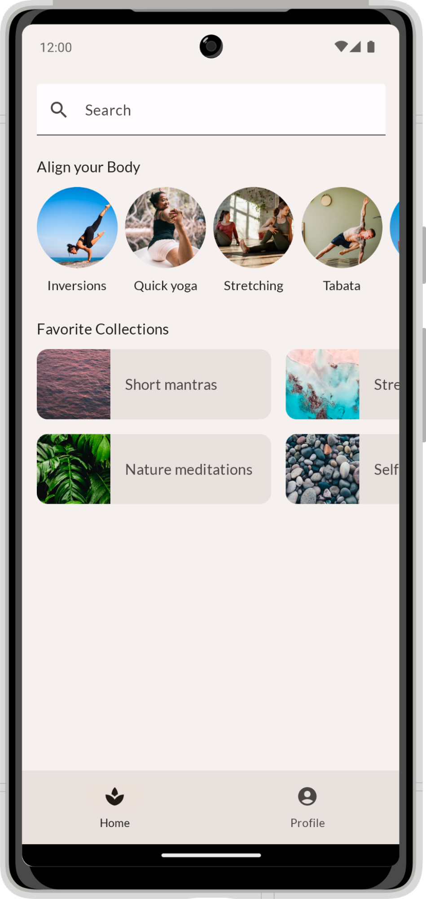
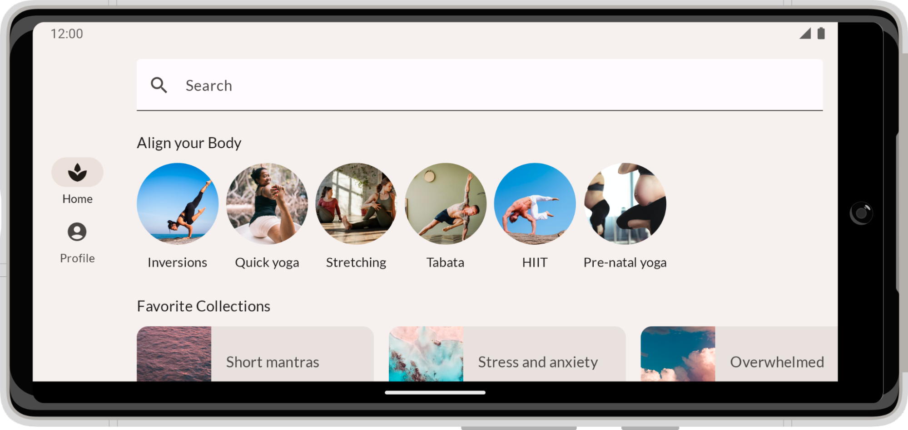

# Compose 中的基本布局

## 关于此 Codelab

*subject*上次更新时间：12月 22, 2023

*account_circle*Google 员工编写

## [1. 简介](https://developer.android.com/codelabs/jetpack-compose-layouts?hl=zh-cn#0)

Compose 是一个界面工具包，可让您轻松实现应用的设计。您只需描述自己想要的界面外观，Compose 会负责在屏幕上进行绘制。在此 Codelab 中，您将了解如何编写 Compose 界面。本文假定您了解[基础知识 Codelab](https://developer.android.com/codelabs/jetpack-compose-basics?hl=zh-cn) 中介绍的概念，因此请务必先完成该 Codelab。在基础知识 Codelab 中，您学习了如何使用 `Surfaces`、`Rows` 和 `Columns` 实现简单布局。您还使用 `padding`、`fillMaxWidth` 和 `size` 等修饰符扩充了这些布局。

在此 Codelab 中，您将实现一个**更真实、更复杂的布局**；在此过程中，您还会了解各种**开箱即用型可组合项**和**修饰符**。完成此 Codelab 后，您应该能够将基本应用的设计转换为有效代码。

在此 Codelab 中，您不用向应用添加任何实际行为。如需改为了解状态和互动，请改为完成[“在 Compose 中使用状态”Codelab](https://developer.android.com/codelabs/jetpack-compose-state?hl=zh-cn)。

如果您在学习此 Codelab 的过程中需要获得更多支持，请查看以下配套学习代码：

## 学习内容

在此 Codelab 中，您将学习：

- 如何借助修饰符扩充可组合项？
- 如何通过 Column 和 LazyRow 等标准布局组件定位可组合子项？
- 如何通过对齐方式和排列方式更改可组合子项在父项中的位置？
- 如何借助 Scaffold 和 Bottom Navigation 等 Material 可组合项创建详细布局？
- 如何使用槽位 API 构建灵活的可组合项？
- 如何为不同的屏幕配置构建布局？

## 所需条件

- [最新版 Android Studio](https://developer.android.com/studio?hl=zh-cn)。
- 有使用 Kotlin 语法（包括 lambda）的经验。
- 有使用 Compose 的基本经验。如果您还没有相关经验，请先完成[“Jetpack Compose 基础知识”Codelab](https://codelabs.developers.google.com/codelabs/jetpack-compose-basics/?hl=zh-cn)，然后再开始此 Codelab。
- 大致了解可组合项和修饰符的含义。

## 构建内容

在此 Codelab 中，您将根据设计人员提供的模拟实现真实的应用设计。**MySoothe** 是一款健康应用，其中列出了可改善身心健康的各种方法。这款应用包含两个版块，一个列出了您的收藏合集，另一个列出了各种体育锻炼。该应用如下所示：

