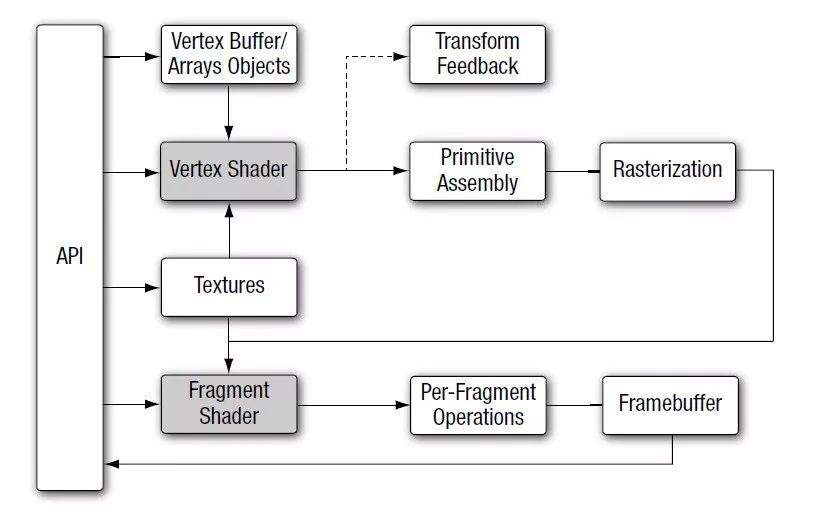

# NDK OpenGLES3.0 开发（七）：Transform Feedback

**什么是 Transform Feedback**

**Transform Feedback（变换反馈）是在 OpenGLES3.0 渲染管线中，顶点处理阶段结束之后，图元装配和光栅化之前的一个步骤。**

Transform Feedback 可以重新捕获即将装配为图元(点，线段，三角形)的顶点，然后你将它们的部分或者全部属性传递到缓存对象。

**Transform Feedback 的主要作用是可以将顶点着色器的处理结果输出，并且可以有多个输出，这样可以将大量的向量或矩阵运算交给 GPU 并行处理，这是 OpenGLES 3.0 的新特性。**



OpenGLES 3.0 图形管线

**每个顶点在传递到图元装配阶段时，将所有需要捕获的属性数据记录到一个或者多个缓存对象中，程序可以通过这些缓存读出这些数据，可以将他们用于后续的渲染操作。**

## **Transform Feedback 对象**

Transform Feedback 所有状态通过一个 Transform Feedback 对象管理，主要包括以下状态：

- 用于记录顶点数据的缓存对象；
- 用于标识缓存对象的计数器;
- 用于标识 Transform Feedback 当前是否启用的状态量。

Transform Feedback 对象的创建绑定过程和一般的 OpenGLES 对象类似，如 VAO 。

生成和绑定 Transform Feedback 对象：

```
glGenTransformFeedbacks(1, &m_TransFeedbackObjId);
glBindTransformFeedback(GL_TRANSFORM_FEEDBACK, m_TransFeedbackObjId);
```

## **Transform Feedback 缓存**

Transform Feedback 主要用来管理将顶点捕捉到缓存对象的相关状态。这个状态中包含当前连接到的 Transform Feedback 缓存绑定点的缓存对象。

可以同时给 Transform Feedback 绑定多个缓存，也可以绑定缓存对象的多个子块，甚至可以将同一个缓存对象不用子块绑定到不同的 Transform Feedback 缓存绑定点上。

创建 Transform Feedback 缓存类似于创建 VBO 。

```
glGenBuffers(1, &m_TransFeedbackBufId);
glBindBuffer(GL_TRANSFORM_FEEDBACK_BUFFER, m_TransFeedbackBufId);
// 设置缓存的大小，输出是一个 3 维向量和一个 2 维向量，一共 6 个顶点，大小为 (3 + 2) * 6 * sizeof(GLfloat)
glBufferData(GL_TRANSFORM_FEEDBACK_BUFFER, (3 + 2) * 6 * sizeof(GLfloat), NULL, GL_STATIC_READ);
```

接口 glBindBufferBase 将缓存绑定到当前 Transform Feedback 对象。

```
void glBindBufferBase(GLenum target, GLuint index, Gluint buffer);
```

其中：

- target 参数须设置为 GL_TRANSFORM_FEEDBACK_BUFFER；
- index 必须是当前绑定的 transform feedback 对象的缓存绑定点索引；
- buffer 表示被绑定的缓存对象的 ID 。

为 Transform Feedback 对象绑定缓冲区对象。

```
glGenTransformFeedbacks(1, &m_TransFeedbackObjId);
glBindTransformFeedback(GL_TRANSFORM_FEEDBACK, m_TransFeedbackObjId);
glBindBufferBase(GL_TRANSFORM_FEEDBACK_BUFFER, 0, m_TransFeedbackBufId); // Specify the index of the binding point within the array specified by target.
glBindTransformFeedback(GL_TRANSFORM_FEEDBACK, 0);
glBindBuffer(GL_TRANSFORM_FEEDBACK_BUFFER, 0);
```

## **Transform Feedback 变量**

glTransformFeedbackVaryings 用于指定变换反馈的变量，也就是顶点着色器需要输出的变量。

声明了 2 个变换反馈变量的顶点着色器：

```
#version 300 es                            
layout(location = 0) in vec4 a_position;   
layout(location = 1) in vec2 a_texCoord;   
out vec2 v_texCoord;                       
out vec3 outPos;                           
out vec2 outTex;                           
void main()                                
{                                          
   gl_Position = a_position;               
   v_texCoord = a_texCoord;                
   outPos = vec3(a_position)*3.0; //将位置向量做一个简单运算后输出         
   outTex = a_texCoord * 3.0;     //将纹理坐标向量做一个简单运算后输出          
}                                          
```

**设置变换反馈变量，需要注意的是 glTransformFeedbackVaryings 需要在 glLinkProgram 之前调用。**

```
glAttachShader(program, vertexShaderHandle);
glAttachShader(program, fragShaderHandle);

GLchar const * varyings[] = {"outPos", "outTex"};
glTransformFeedbackVaryings(m_ProgramObj, sizeof(varyings)/ sizeof(varyings[0]), varyings, GL_INTERLEAVED_ATTRIBS);

glLinkProgram(program);
```

## **Transform Feedback 捕获启动和停止**

Transform Feedback 可以随时启动、暂停和停止。

glBeginTransformFeedback 用于开始 Transform Feedback ，它的参数是用来设置将要记录的图元类型，如：GL_POINTS、GL_LINES 和 GL_TRIANGLES 。

glPuaseTransformFeedback 暂停 Transform Feedback 对变量的记录，但 Transform Feedback 还是处于启动状态。如果 Transform Feedback 没有启动则 OpenGLES 产生错误。

glResumeTransformFeedback 重新开启一个之前通过 glPuaseTransformFeedback 暂停的变换反馈过程，如果 Transform Feedback 没有启动，或者没有被处于活动状态，则产生OpenGL错误。

glEndTransformFeedback 用来结束 Transform Feedback 过程。

## **Transform Feedback 缓冲区读取**

Transform Feedback 过程结束后，通过 glMapBufferRange 读取缓冲区数据。

```
//绑定要读取的缓冲区对象
glBindBuffer(GL_TRANSFORM_FEEDBACK_BUFFER, m_TransFeedbackBufId);

//读取缓冲区数据
void* rawData = glMapBufferRange(GL_TRANSFORM_FEEDBACK_BUFFER, 0,  (3 + 2) * 6 * sizeof(GLfloat), GL_MAP_READ_BIT);

float *p = (float*)rawData;
for(int i= 0; i< 6; i++)
{
    LOGCATE("TransformFeedbackSample::Draw() read feedback buffer outPos[%d] = [%f, %f, %f], outTex[%d] = [%f, %f]", i, p[i * 5], p[i * 5 + 1], p[i * 5 + 2], i, p[i * 5 + 3], p[i * 5 + 4]);
}

//解绑
glUnmapBuffer(GL_TRANSFORM_FEEDBACK_BUFFER);
glBindBuffer(GL_TRANSFORM_FEEDBACK_BUFFER, 0);
```

# **Transform Feedback 的使用**

Transform Feedback 的一般使用流程：

1. 设置变换反馈变量；
2. 创建 Transform Feedback 缓冲区；
3. 创建 Transform Feedback 对象，并绑定缓冲区；
4. 启动变换反馈，在绘制结束后停止变换反馈；
5. 读取 Transform Feedback 缓冲区数据。

总体实现代码：

```
//1. 设置变换反馈变量；
glAttachShader(program, vertexShaderHandle);
glAttachShader(program, fragShaderHandle);

GLchar const * varyings[] = {"outPos", "outTex"};
glTransformFeedbackVaryings(m_ProgramObj, sizeof(varyings)/ sizeof(varyings[0]), varyings, GL_INTERLEAVED_ATTRIBS);

glLinkProgram(program);

//2. 创建 Transform Feedback 缓冲区；
glGenBuffers(1, &m_TransFeedbackBufId);
glBindBuffer(GL_TRANSFORM_FEEDBACK_BUFFER, m_TransFeedbackBufId);
glBufferData(GL_TRANSFORM_FEEDBACK_BUFFER, (3 + 2) * 6 * sizeof(GLfloat), NULL, GL_STATIC_READ);
glBindBuffer(GL_TRANSFORM_FEEDBACK_BUFFER, 0);

//3. 创建 Transform Feedback 对象，并绑定缓冲区；
glGenTransformFeedbacks(1, &m_TransFeedbackObjId);
glBindTransformFeedback(GL_TRANSFORM_FEEDBACK, m_TransFeedbackObjId);
glBindBufferBase(GL_TRANSFORM_FEEDBACK_BUFFER, 0, m_TransFeedbackBufId);
glBindTransformFeedback(GL_TRANSFORM_FEEDBACK, 0);
glBindBuffer(GL_TRANSFORM_FEEDBACK_BUFFER, 0);

//4. 启动变换反馈，在绘制结束后停止变换反馈；
glViewport(0, 0, screenW, screenH);
glUseProgram(m_ProgramObj);
glBindVertexArray(m_VaoId);
glActiveTexture(GL_TEXTURE0);
glBindTexture(GL_TEXTURE_2D, m_ImageTextureId);
glUniform1i(m_SamplerLoc, 0);
glBindTransformFeedback(GL_TRANSFORM_FEEDBACK, m_TransFeedbackObjId);
glBeginTransformFeedback(GL_TRIANGLES);
glDrawArrays(GL_TRIANGLES, 0, 6);
glEndTransformFeedback();
glBindTransformFeedback(GL_TRANSFORM_FEEDBACK, 0);
glBindTexture(GL_TEXTURE_2D, GL_NONE);
glBindVertexArray(GL_NONE);

//5. 读取 Transform Feedback 缓冲区数据。
// Read feedback buffer
glBindBuffer(GL_TRANSFORM_FEEDBACK_BUFFER, m_TransFeedbackBufId);
void* rawData = glMapBufferRange(GL_TRANSFORM_FEEDBACK_BUFFER, 0,  (3 + 2) * 6 * sizeof(GLfloat), GL_MAP_READ_BIT);
float *p = (float*)rawData;
for(int i= 0; i< 6; i++)
{
    LOGCATE("TransformFeedbackSample::Draw() read feedback buffer outPos[%d] = [%f, %f, %f], outTex[%d] = [%f, %f]", i, p[i * 5], p[i * 5 + 1], p[i * 5 + 2], i, p[i * 5 + 3], p[i * 5 + 4]);
}
glUnmapBuffer(GL_TRANSFORM_FEEDBACK_BUFFER);
glBindBuffer(GL_TRANSFORM_FEEDBACK_BUFFER, 0);
```

代码执行后读取 Transform Feedback 缓冲区的数据：

```
E/ByteFlow: TransformFeedbackSample::Draw() read feedback buffer outPos[0] = [-3.000000, -1.500000, 0.000000], outTex[0] = [0.000000, 3.000000]
E/ByteFlow: TransformFeedbackSample::Draw() read feedback buffer outPos[1] = [3.000000, -1.500000, 0.000000], outTex[1] = [3.000000, 3.000000]
E/ByteFlow: TransformFeedbackSample::Draw() read feedback buffer outPos[2] = [-3.000000, 1.500000, 0.000000], outTex[2] = [0.000000, 0.000000]
E/ByteFlow: TransformFeedbackSample::Draw() read feedback buffer outPos[3] = [3.000000, -1.500000, 0.000000], outTex[3] = [3.000000, 3.000000]
E/ByteFlow: TransformFeedbackSample::Draw() read feedback buffer outPos[4] = [3.000000, 1.500000, 0.000000], outTex[4] = [3.000000, 0.000000]
E/ByteFlow: TransformFeedbackSample::Draw() read feedback buffer outPos[5] = [-3.000000, 1.500000, 0.000000], outTex[5] = [0.000000, 0.000000]
```

Transform Feedback 实现代码路径：
https://github.com/githubhaohao/NDK_OpenGLES_3_0

