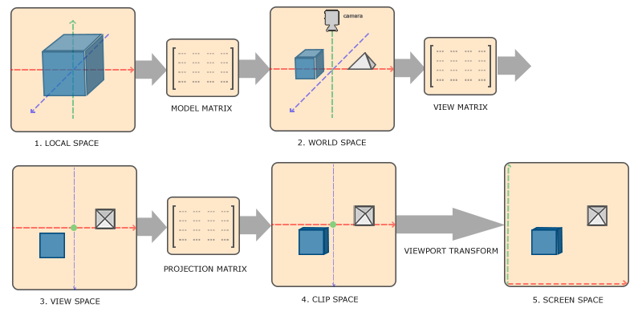
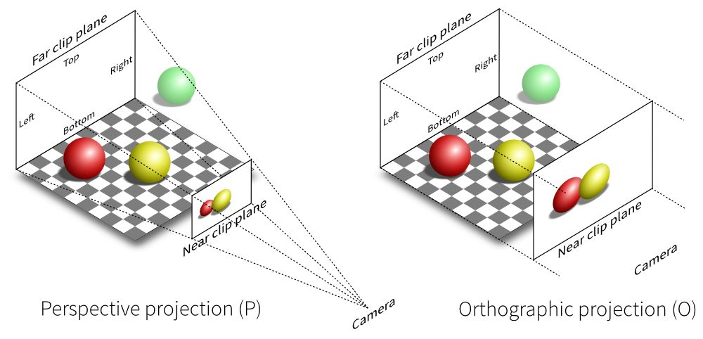
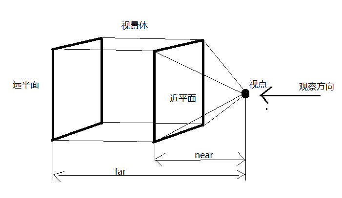
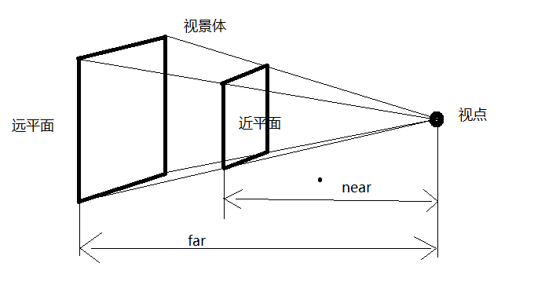
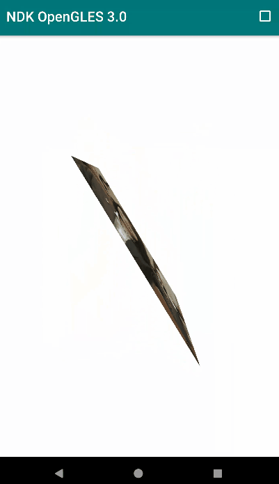

# NDK OpenGLES3.0 开发（八）：坐标系统

**OpenGL 坐标系统**

我们知道 OpenGL 坐标系中每个顶点的 x，y，z 坐标都应该在 -1.0 到 1.0 之间，超出这个坐标范围的顶点都将不可见。

将一个物体（图像）渲染到屏幕上，通常经过将物体坐标转换为标准化设备坐标，然后再将标准化设备坐标转化为屏幕坐标的过程。

该过程通常涉及多个坐标系统的变换，将所有顶点转换为片段之前，顶点需要处于不同的坐标系统进行计算，对我们来说比较重要的有 5 个坐标系统：

- **局部空间(Local Space，或者物体空间(Object Space))**
- **世界空间(World Space)**
- **观察空间(View Space，**
- **裁剪空间(Clip Space)**
- **屏幕空间(Screen Space)**


**
**


坐标系统

**局部空间**
局部空间 (Local Space) 是指对象所在的坐标空间，坐标原点由你自己指定，模型的所有顶点相对于你的对象来说都是局部的。

**世界空间**
**在世界空间（World Space）主要实现对象的平移、缩放、旋转变换，将它们放在我们指定的位置，这些变换是通过模型矩阵(Model Matrix)实现的**。

在 C/C++ 中可以利用 GLM 构建模型矩阵:

```
glm::mat4 Model = glm::mat4(1.0f); //单位矩阵
Model = glm::scale(Model, glm::vec3(2.0f, 2.0f, 2.0f)); //缩放
Model = glm::rotate(Model, MATH_PI/2, glm::vec3(1.0f, 0.0f, 0.0f)); //沿 x 轴旋转 90 度
Model = glm::translate(Model, glm::vec3(0.0f, 1.0f, 0.0f)); //沿 y 轴正方向平移一个单位
```

**GLM 是 OpenGL Mathematics 的缩写，它是一个只有头文件的库，也就是说我们只需包含对应的头文件就行了，不用链接和编译。**

GLM 可以在 Github 上下载，把头文件的根目录复制到你的includes文件夹，然后你就可以使用这个库了。

**观察空间**
**观察空间(View Space)也被称为 OpenGL 相机空间，即从摄像机的角度观察到的空间，它将对象的世界空间的坐标转换为观察者视野前面的坐标。**

这通常是由一系列的平移和旋转的组合来平移和旋转场景从而使得特定的对象被转换到摄像机前面，这些组合在一起的转换通常存储在一个**观察矩阵(View Matrix)**里。

在 C/C++ 中可以利用 GLM 构建观察矩阵:

```
// View matrix
glm::mat4 View = glm::lookAt(
            glm::vec3(0, 0, 3), // Camera is at (0,0,1), in World Space 相机位置
            glm::vec3(0, 0, 0), // and looks at the origin 观察点坐标
            glm::vec3(0, 1, 0)  // Head is up (set to 0,-1,0 to look upside-down) 相机 up 方向，即相机头部朝向
);
```

**裁剪空间**
裁剪空间(Clip Space)是用来裁剪观察对象的空间，在一个顶点着色器运行的最后，OpenGL 期望所有的坐标都能落在一个给定的范围内，且任何在这个范围之外的点都应该被裁剪掉。

**投影矩阵(Projection Matrix)用来将顶点坐标从观察空间转换到裁剪空间**。

投影矩阵一般分为两种：正交投影（Orthographic Projection）和透视投影（Perspective Projection）。

2种投影方式对比

**正交投影**

正交投影

正交投影是一种平行投影，投影点与原顶点的连线相互平行，且物体不产生“近大远小”的视觉效果。

在 C/C++ 中可以利用 GLM 构建正交投影矩阵:

```
glm::mat4 Projection = glm::ortho(-ratio, ratio, -1.0f, 1.0f, 0.0f, 100.0f); //ratio 一般表示视口的宽高比，width/height
```

前两个参数指定了平截头体的左右坐标，第三和第四参数指定了平截头体的底部和上部。

通过这四个参数我们定义了近平面和远平面的大小，然后第五和第六个参数则定义了近平面和远平面的距离。这个指定的投影矩阵将处于这些 x，y，z 范围之间的坐标转换到标准化设备坐标系中。

**透视投影**



透视投影

透视投影的投影线相交于一点，可以用来模拟真实世界“近大远小”的视觉效果。

在 C/C++ 中可以利用 GLM 构建透视投影矩阵:

```
glm::mat4 Projection = glm::perspective(45.0f, ratio, 0.1f, 100.f); //ratio 一般表示视口的宽高比，width/height, 
```

**它的第一个参数定义了 fov 的值，它表示的是视野(Field of View**)，并且设置了观察空间的大小。

对于一个真实的观察效果，它的值经常设置为 45.0，但想要看到更多结果你可以设置一个更大的值。第二个参数设置了宽高比，由视口的高除以宽。第三和第四个参数设置了平截头体的近和远平面。我们经常设置近距离为 0.1 而远距离设为 100.0 。所有在近平面和远平面的顶点且处于平截头体内的顶点都会被渲染。

最后整个坐标系统的变换矩阵可以用一个矩阵表示 `MVPMatrix = Projection * View * Model;`。

# **OpenGL 3D 变换实现**

实现 OpenGL 3D 效果最简单的方式是在顶点着色器中将顶点坐标与 MVP 变换矩阵相乘：

```
#version 300 es
layout(location = 0) in vec4 a_position;
layout(location = 1) in vec2 a_texCoord;
uniform mat4 u_MVPMatrix;
out vec2 v_texCoord;
void main()
{
    gl_Position = u_MVPMatrix * a_position; //顶点坐标与 MVP 变换矩阵相乘
    v_texCoord = a_texCoord;
}
```

在绘制之前构建变换矩阵：

```
/**
 * @param angleX 绕X轴旋转度数
 * @param angleY 绕Y轴旋转度数
 * @param ratio 宽高比
 * */
void CoordSystemSample::UpdateMVPMatrix(glm::mat4 &mvpMatrix, int angleX, int angleY, float ratio)
{
    LOGCATE("CoordSystemSample::UpdateMVPMatrix angleX = %d, angleY = %d, ratio = %f", angleX, angleY, ratio);
    angleX = angleX % 360;
    angleY = angleY % 360;

    //转化为弧度角
    float radiansX = static_cast<float>(MATH_PI / 180.0f * angleX);
    float radiansY = static_cast<float>(MATH_PI / 180.0f * angleY);


    // Projection matrix
    //glm::mat4 Projection = glm::ortho(-ratio, ratio, -1.0f, 1.0f, 0.1f, 100.0f);
    //glm::mat4 Projection = glm::frustum(-ratio, ratio, -1.0f, 1.0f, 4.0f, 100.0f);
    glm::mat4 Projection = glm::perspective(45.0f,ratio, 0.1f,100.f);

    // View matrix
    glm::mat4 View = glm::lookAt(
            glm::vec3(0, 0, 4), // Camera is at (0,0,1), in World Space
            glm::vec3(0, 0, 0), // and looks at the origin
            glm::vec3(0, 1, 0)  // Head is up (set to 0,-1,0 to look upside-down)
    );

    // Model matrix
    glm::mat4 Model = glm::mat4(1.0f);
    Model = glm::scale(Model, glm::vec3(1.0f, 1.0f, 1.0f));
    Model = glm::rotate(Model, radiansX, glm::vec3(1.0f, 0.0f, 0.0f));
    Model = glm::rotate(Model, radiansY, glm::vec3(0.0f, 1.0f, 0.0f));
    Model = glm::translate(Model, glm::vec3(0.0f, 0.0f, 0.0f));

    mvpMatrix = Projection * View * Model;

}
```

绘制时传入变换矩阵：

```
void CoordSystemSample::Draw(int screenW, int screenH)
{
    LOGCATE("CoordSystemSample::Draw()");

    if(m_ProgramObj == GL_NONE || m_TextureId == GL_NONE) return;

    // 旋转角度变换，更新变换矩阵
    UpdateMVPMatrix(m_MVPMatrix, m_AngleX, m_AngleY, (float)screenW / screenH);

    //upload RGBA image data
    glActiveTexture(GL_TEXTURE0);
    glBindTexture(GL_TEXTURE_2D, m_TextureId);
    glTexImage2D(GL_TEXTURE_2D, 0, GL_RGBA, m_RenderImage.width, m_RenderImage.height, 0, GL_RGBA, GL_UNSIGNED_BYTE, m_RenderImage.ppPlane[0]);
    glBindTexture(GL_TEXTURE_2D, GL_NONE);

    // Use the program object
    glUseProgram (m_ProgramObj);

    glBindVertexArray(m_VaoId);

    // 将总变换矩阵传入着色器程序
    glUniformMatrix4fv(m_MVPMatLoc, 1, GL_FALSE, &m_MVPMatrix[0][0]);

    // Bind the RGBA map
    glActiveTexture(GL_TEXTURE0);
    glBindTexture(GL_TEXTURE_2D, m_TextureId);
    glUniform1i(m_SamplerLoc, 0);

    glDrawElements(GL_TRIANGLES, 6, GL_UNSIGNED_SHORT, (const void *)0);

}
```

效果演示：

coor_sys.gif


实现代码路径：
https://github.com/githubhaohao/NDK_OpenGLES_3_0