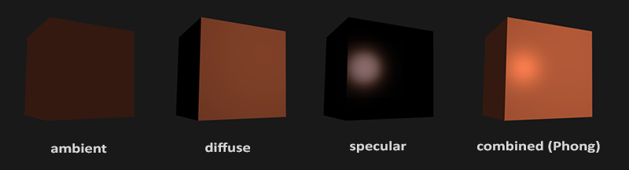
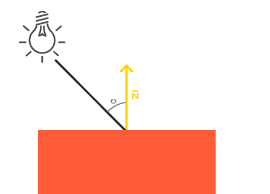
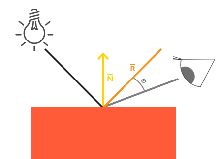
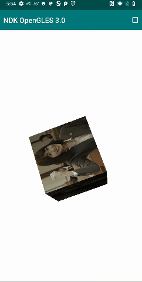

# NDK OpenGLES3.0 开发（九）：光照基础

**OpenGLES 基础光照模型**


**OpenGLES 目前还无法模拟现实世界的复杂光照效果，为了在效果要求和实现难度之间做一个平衡，往往采用一些简化的模型来模拟光照效果。**

**冯氏光照模型(Phong Lighting Model)便是其中常用的一个光照模型，它由三种元素光组成，分别是环境光(Ambient Lighting)、散射光(Diffuse Lighting)及镜面光(Specular Lighting)。**

冯氏光照模型

## **环境光**

**环境光表示从四面八方照射到物体上且各个方向都均匀的光，不依赖于光源位置，没有方向性。**

要把环境光照添加到场景里，只需用光的颜色乘以一个(数值)很小常量环境因子，再乘以物体的颜色，然后使用它作为片段的颜色：

```
void main()
{
    float ambientStrength = 0.1f; //常量环境因子
    vec3 ambient = ambientStrength * lightColor; //环境光强度

    vec3 result = ambient * objectColor;
    color = vec4(result, 1.0f);
}
```

##  

## **散射光**

**散射光表示从物体表面向各个方向均匀反射的光。****散射光的强度与入射光的强度及入射角密切相关，所以当光源位置发生变化，散射光效果也会发生明显变化。**

散射光

**`散射光最终强度 = 材质反射系数 × 散射光强度 × max(cos(入射角)，0)`**``

其中入射角表示：当前片段光源照射方向与法向量之间的夹角。

实现散射光的片段着色器脚本：

```
out vec3 fragPos;//当前片段坐标
out vec3 normal; //当前片段法向量
uniform vec3 lightPos;//光源位置
void main()
{
    float diffuseStrength = 0.5f; //材质反射系数

    vec3 norm = normalize(normal); // 归一化
    vec3 lightDir = normalize(lightPos - fragPos);//当前片段光源照射方向向量

    float diff = max(dot(norm, lightDir), 0.0);// dot 表示两个向量的点乘
    vec3 diffuse = diffuseStrength * diff * lightColor; //散射光最终强度

    vec3 result = diffuse * objectColor;
    color = vec4(result, 1.0f);
}
```

## **镜面光**

**镜面光是由光滑物体表面反射的方向比较集中的光，镜面光强度不仅依赖于入射光与法向量的夹角，也依赖于观察者的位置。**

镜面光

**`镜面光最终强度 = 材质镜面亮度因子 × 镜面光强度 × max(cos(反射光向量与视线方向向量夹角)，0)`**``

修正后的模型也可表示为：

**`镜面光最终强度 = 材质镜面亮度因子 × 镜面光强度 × max(cos(半向量与法向量夹角)，0)`**

其中半向量为镜面反射光向量与视线方向向量（从片段到观察者）的半向量。

实现镜面光的片段着色器脚本：

```
out vec3 fragPos;//当前片段坐标
out vec3 normal; //当前片段法向量
uniform vec3 lightPos;//光源位置
void main()
{
    float specularStrength = 0.5f;

    vec3 norm = normalize(normal); // 归一化
    vec3 viewDir = normalize(viewPos - FragPos); //视线方向向量 
    vec3 reflectDir = reflect(-lightDir, norm); //镜面反射光向量

    float spec = pow(max(dot(viewDir, reflectDir), 0.0), 32); 
    //视线方向向量与镜面反射光向量点乘的32次幂，这个32是高光的发光值(Shininess)。一个物体的发光值越高，反射光的能力越强，散射得越少，高光点越小。
    vec3 specular = specularStrength * spec * lightColor; //镜面光最终强度

    vec3 result = specular * objectColor;
    color = vec4(result, 1.0f);
}
```

#  

# **基础光照模型实现**

实现基础光照模型的顶点着色器：

```
#version 300 es
precision mediump float;
layout(location = 0) in vec4 a_position;
layout(location = 1) in vec2 a_texCoord;
layout(location = 2) in vec3 a_normal;
uniform mat4 u_MVPMatrix;
uniform mat4 u_ModelMatrix;
uniform vec3 lightPos;
uniform vec3 lightColor;
uniform vec3 viewPos;
out vec2 v_texCoord;
out vec3 ambient;
out vec3 diffuse;
out vec3 specular;
void main()
{
gl_Position = u_MVPMatrix * a_position;
vec3 fragPos = vec3(u_ModelMatrix * a_position);

// Ambient
float ambientStrength = 0.1;
ambient = ambientStrength * lightColor;

// Diffuse
float diffuseStrength = 0.5;
vec3 unitNormal = normalize(vec3(u_ModelMatrix * vec4(a_normal, 1.0)));
vec3 lightDir = normalize(lightPos - fragPos);
float diff = max(dot(unitNormal, lightDir), 0.0);
diffuse = diffuseStrength * diff * lightColor;

// Specular
float specularStrength = 0.9;
vec3 viewDir = normalize(viewPos - fragPos);
vec3 reflectDir = reflect(-lightDir, unitNormal);
float spec = pow(max(dot(unitNormal, reflectDir), 0.0), 16.0);
specular = specularStrength * spec * lightColor;
v_texCoord = a_texCoord;
}
```

对应的片段着色器：

```
#version 300 es
precision mediump float;
in vec2 v_texCoord;
in vec3 ambient;
in vec3 diffuse;
in vec3 specular;
layout(location = 0) out vec4 outColor;
uniform sampler2D s_TextureMap;
void main()
{
vec4 objectColor = texture(s_TextureMap, v_texCoord);
vec3 finalColor = (ambient + diffuse + specular) * vec3(objectColor);
outColor = vec4(finalColor, 1.0);
}
```

效果演示：

光照基础


实现代码路径见阅读原文末。