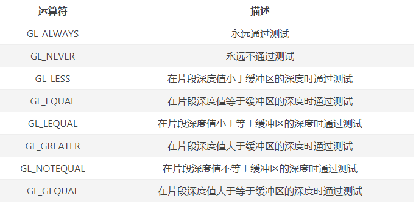

# NDK OpenGLES3.0 开发（十）：深度测试

**OpenGL 深度测试是指在片段着色器执行之后，利用深度缓冲所保存的深度值决定当前片段是否被丢弃的过程。**

**深度缓冲区通常和颜色缓冲区有着相同的宽度和高度，一般由窗口系统自动创建并将其深度值存储为 16、 24 或 32 位浮点数。**

当深度测试开启的时候， OpenGL 才会测试深度缓冲区中的深度值。如果此测试通过，深度缓冲内的值可以被设为新的深度值；如果深度测试失败，则丢弃该片段。

**深度测试是在片段着色器运行之后(并且在模板测试运行之后)在屏幕空间中执行的。**

**与屏幕空间坐标相关的视区是由 OpenGL 的视口设置函数 glViewport 函数给定，并且可以通过片段着色器中内置的 gl_FragCoord 变量访问。**

**gl_FragCoord 的 X 和 y 表示该片段的屏幕空间坐标 ((0，0) 在左下角)，其取值范围由 glViewport 函数决定，屏幕空间坐标原点位于左下角。**

gl_FragCoord 还包含一个 z 坐标，它包含了片段的实际深度值，此 z 坐标值是与深度缓冲区的内容进行比较的值。

**深度缓冲区中包含深度值介于 0.0 和 1.0 之间，物体接近近平面的时候，深度值接近 0.0 ，物体接近远平面时，深度接近 1.0 。**

(深度缓冲区的可视化)在片段着色器中将深度值转换为物体颜色显示：

```
#version 300 es
precision mediump float;
in vec2 v_texCoord;
layout(location = 0) out vec4 outColor;
uniform sampler2D s_TextureMap;
void main()
{
    vec4 objectColor = vec4(vec3(gl_FragCoord.z), 1.0f);
    outColor = objectColor;
}
```

显示结果：

深度缓冲区的可视化

从图中可以观察到，**靠近屏幕的物体颜色更黑（深度值更小），远离屏幕的物体颜色更白（深度值更大）。**

**深度测试默认是关闭的，启用深度测试使用** **`glEnable(GL_DEPTH_TEST);`****。**

启用与不启用深度测试时，绘制 3D 物体对比：

启用深度测试

不启用深度测试

**开启深度测试后，如果片段通过深度测试，OpenGL 自动在深度缓冲区存储片段的 gl_FragCoord.z 值，如果深度测试失败，那么相应地丢弃该片段。**

**如果启用深度测试，那么需要在渲染之前使用** **`glClear(GL_DEPTH_BUFFER_BIT);`** **清除深度缓冲区，否则深度缓冲区将保留上一次进行深度测试时所写的深度值。**

另外在一些场景中，我们需要进行深度测试并相应地丢弃片段，但**我们不希望更新深度缓冲区，那么可以设置深度掩码****`glDepthMask(GL_FALSE);`****实现禁用深度缓冲区的写入（只有在深度测试开启时才有效）。**

OpenGL 深度测试是通过深度测试函数 **`glDepthFunc`** 控制深度测试是否通过和如何更新深度缓冲区。

深度测试函数接收的比较运算符：

深度测试函数接收的比较运算符

**深度测试启用后，默认情况下深度测试函数使用 GL_LESS，这将丢弃深度值高于或等于当前深度缓冲区的值的片段。**

**深度测试中，深度冲突现象需要值得注意。****深度冲突(Z-fighting)是指两个平面（或三角形）相互平行且靠近的过于紧密，模板缓冲区不具有足够的精度确定哪一个平面靠前，导致这两个平面的内容不断交替显示，看上去像平面内容争夺顶靠前的位置。**

**防止深度冲突的方法：**

- 不要让物体之间靠得过近，以免它们的三角形面片发生重叠；
- 把近平面设置得远一些（越靠近近平面的位置精度越高）；
- 牺牲一些性能，使用更高精度的深度值。

实现代码路径：
https://github.com/githubhaohao/NDK_OpenGLES_3_0