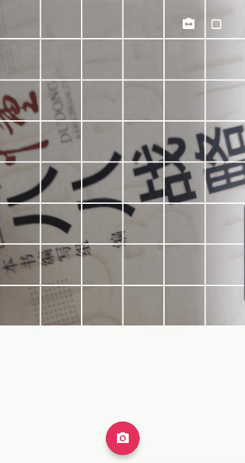
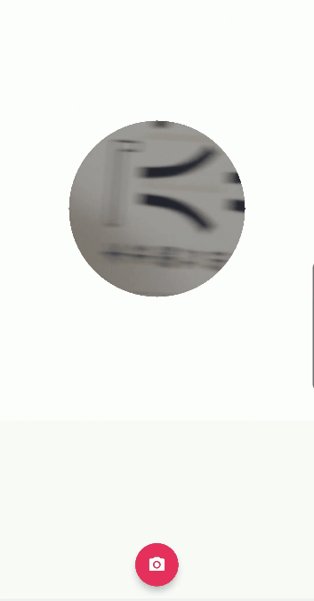

# NDK OpenGL ES 3.0 开发（十七）：相机基础滤镜

***\*OpenGL ES\** 相机基础滤镜**


上文中我们通过 ImageReader 获取到 Camera2 预览的 YUV 数据，然后利用 OpenGLES 渲染实现相机预览，这一节将利用 GLSL （OpenGL 着色器语言）基于不同的着色器实现多种基础滤镜。


| 内建函数                                | 函数说明                                           |
| --------------------------------------- | -------------------------------------------------- |
| float distance (genType p0, genType p1) | 计算向量 p0 ，p1 之间的距离                        |
| float length (genType x)                | 返回向量 x 的长度                                  |
| genType floor (genType x)               | 返回小于等于 x 的最大整数值                        |
| genType ceil (genType x)                | 返回大于等于 x 的最小整数值                        |
| genType mod (genType x, float y)        | 返回 x – y * floor (x / y) ，即求模计算 %          |
| float dot (genType x, genType y)        | 向量 x ，y 之间的点积                              |
| vec3 cross (vec3 x, vec3 y)             | 向量 x ，y 之间的叉积                              |
| genType normalize (genType x)           | 标准化向量，返回一个方向和 x 相同但长度为 1 的向量 |

GLSL 一些使用频率比较高的内建函数

## **动态网格**



动态网格

**动态网格滤镜主要是将纹理划分为多个网格，然后根据一个偏移量动态改变网格线的宽度。**mod 和 floor 为 GLSL 的内建函数，分别表示取模和取整。需要注意的是，计算之前需要将纹理坐标系转换为图片坐标系，保证网格没有被拉伸。

```
//dynimic mesh 动态网格着色器
#version 100
precision highp float;
varying vec2 v_texcoord;
uniform lowp sampler2D s_textureY;
uniform lowp sampler2D s_textureU;
uniform lowp sampler2D s_textureV;
uniform float u_offset;//偏移量
uniform vec2 texSize;//纹理尺寸
vec4 YuvToRgb(vec2 uv) {
    float y, u, v, r, g, b;
    y = texture2D(s_textureY, uv).r;
    u = texture2D(s_textureU, uv).r;
    v = texture2D(s_textureV, uv).r;
    u = u - 0.5;
    v = v - 0.5;
    r = y + 1.403 * v;
    g = y - 0.344 * u - 0.714 * v;
    b = y + 1.770 * u;
    return vec4(r, g, b, 1.0);
}
void main()
{
    vec2 imgTexCoord = v_texcoord * texSize;//将纹理坐标系转换为图片坐标系
    float sideLength = texSize.y / 6.0;//网格的边长
    float maxOffset = 0.15 * sideLength;//设置网格线宽度的最大值
    float x = mod(imgTexCoord.x, floor(sideLength));
    float y = mod(imgTexCoord.y, floor(sideLength));

    float offset = u_offset * maxOffset;

    if(offset <= x
    && x <= sideLength - offset
    && offset <= y
    && y <= sideLength - offset)
    {
        gl_FragColor = YuvToRgb(v_texcoord);
    }
    else
    {
        gl_FragColor = vec4(1.0, 1.0, 1.0, 1.0);
    }
}
```

## **分屏**


四分屏

**分屏滤镜的原理是在多个指定区域内对整个纹理进行下采样（缩小），从而实现整个图像在多个区域内多次显示。**

```
//分屏（四分屏）
#version 100
precision highp float;
varying vec2 v_texcoord;
uniform lowp sampler2D s_textureY;
uniform lowp sampler2D s_textureU;
uniform lowp sampler2D s_textureV;
vec4 YuvToRgb(vec2 uv) {
    float y, u, v, r, g, b;
    y = texture2D(s_textureY, uv).r;
    u = texture2D(s_textureU, uv).r;
    v = texture2D(s_textureV, uv).r;
    u = u - 0.5;
    v = v - 0.5;
    r = y + 1.403 * v;
    g = y - 0.344 * u - 0.714 * v;
    b = y + 1.770 * u;
    return vec4(r, g, b, 1.0);
}
void main()
{
    vec2 newTexCoord = v_texcoord;
    if(newTexCoord.x < 0.5)
    {
        newTexCoord.x = newTexCoord.x * 2.0;
    }
    else
    {
        newTexCoord.x = (newTexCoord.x - 0.5) * 2.0;
    }

    if(newTexCoord.y < 0.5)
    {
        newTexCoord.y = newTexCoord.y * 2.0;
    }
    else
    {
        newTexCoord.y = (newTexCoord.y - 0.5) * 2.0;
    }

    gl_FragColor = YuvToRgb(newTexCoord);
}
```

## **缩放的圆**



缩放的圆


缩放的圆效果实现主要依赖偏移量来动态改变圆半径的大小，在半径区域内对纹理采样显示图像，在半径区域外返回一个固定颜色（如白色）。distance 也是 GLSL 的内建函数，用于计算两点之间的距离。**另外需要注意是，在计算之前首先要将纹理坐标系转换为图片坐标系，否则绘制的将会是一个椭圆形图像（图像宽高不同的情况下），想一想为什么会这样？**

```
//scale circle 缩放的圆
#version 100
precision highp float;
varying vec2 v_texcoord;
uniform lowp sampler2D s_textureY;
uniform lowp sampler2D s_textureU;
uniform lowp sampler2D s_textureV;
uniform float u_offset;
uniform vec2 texSize;
vec4 YuvToRgb(vec2 uv) {
    float y, u, v, r, g, b;
    y = texture2D(s_textureY, uv).r;
    u = texture2D(s_textureU, uv).r;
    v = texture2D(s_textureV, uv).r;
    u = u - 0.5;
    v = v - 0.5;
    r = y + 1.403 * v;
    g = y - 0.344 * u - 0.714 * v;
    b = y + 1.770 * u;
    return vec4(r, g, b, 1.0);
}
void main()
{
    vec2 imgTex = v_texcoord * texSize;//将纹理坐标系转换为图片坐标系
    float r = (u_offset + 0.208 ) * texSize.x;
    if(distance(imgTex, vec2(texSize.x / 2.0, texSize.y / 2.0)) < r)
    {
        gl_FragColor = YuvToRgb(v_texcoord);
    }
    else
    {
        gl_FragColor = vec4(1.0, 1.0, 1.0, 1.0);
    }
}
```

**在计算之前首先要将纹理坐标系转换为图片坐标系，其原因在于纹理纵横坐标的取值范围均为 [0, 1] ，从数值上看纹理的纵横方向长度相同，但是在 OpenGL 采样时，图像的宽高比往往不是 1 ，这就导致了数值相同的纵横坐标，对应不同的采样权重，出现了预期绘制圆形而实际上却绘制出椭圆的情况。**


**实现代码路径见阅读原文。**