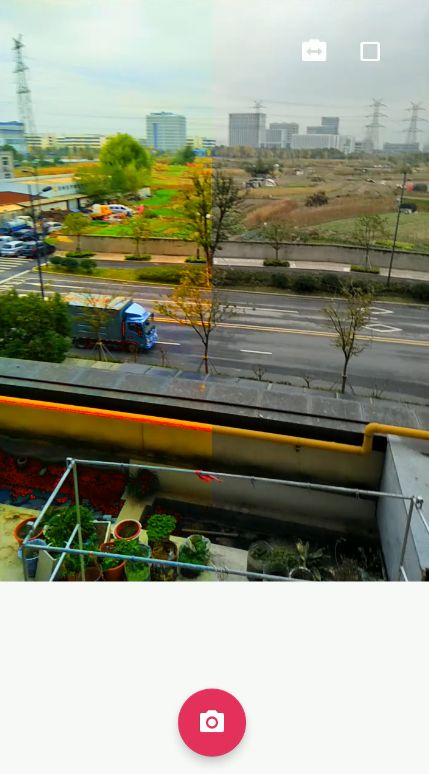
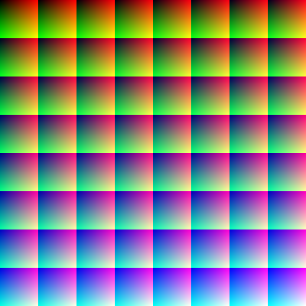
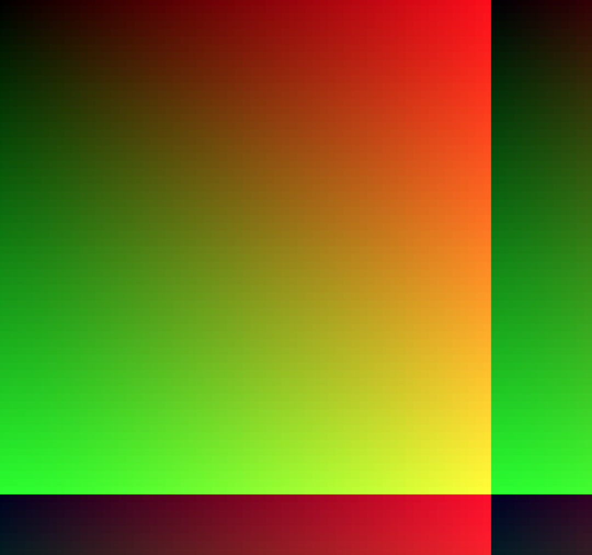

# NDK OpenGL ES 3.0 开发（十八）：相机 LUT 滤镜

**OpenGLES 相机 LUT 滤镜**




左侧为 LUT 滤镜效果，右侧为原图


**什么是 LUT ？** **LUT 是 Look Up Table 的简称，称作颜色查找表，是一种针对色彩空间的管理和转换技术。**

**它可以分为一维 LUT（1D LUT） 和 三维 LUT（3D LUT），其中三维 LUT 比较常用。****简单来讲，LUT 就是一个 RGB 组合到另一个 RGB 组合的映射关系表。**

```
LUT(R, G, B) = (R1, G1, B1)
```

**LUT 滤镜是一种比较经典的滤镜，本质上属于独立像素点替换，即根据 OpenGL 采样器对纹理进行采样得到的像素点，再基于像素点的（R，G，B）分量查表，获得 LUT 映射的（R1，G1，B1），替换原来的输出。**

一般 RGB 像素占用 3 个字节，包含 3 个分量，每个分量有 256 种取值，那么三维 LUT 模板就可以包含 256 X 256 X 256 种情况，占用 48MB 内存空间。

这样一个 LUT 模板内存占用过大同时也降低了查找的效率，通常会采取下采样方式来降低数据量。

例如可以对三维 LUT 模板每个分量分别进行 64 次采样，这样就获得一个 64 X 64 X 64 大小的映射关系表，对于不在表内的颜色值可以进行插值获得其相似结果。

三维 LUT 模板，即64 X 64 X 64 大小的映射关系表，通常是用一张分辨率为 512 X 512 的二维图片表示，称为 LUT 图（模板图）。

三维 LUT 模板

**LUT 图在横竖方向上被分成了 8 X 8 一共 64 个小方格，每一个小方格内的 B（Blue）分量为一个定值，64 个小方格一共表示了 B 分量的 64 种取值。**

**对于每一个小方格，横竖方向又各自分为 64 个小格，以左下角为原点，横向小格的 R（Red）分量依次增加，纵向小格的 G（Green）分量依次增加。**

Lut 图中的一个小方格

至此，我们可以根据原始采样像素 RGB 中的 B 分量值，确定我们要选用 LUT 图中的第几个小格，然后再根据（R，G）分量值为纵横坐标，确定映射的 RGB 组合。

OpenGLES 实现 LUT 滤镜的 GLSL 脚本。

```
// Lut 滤镜
#version 100
precision highp float;
varying vec2 v_texcoord;

//Lut 纹理
uniform sampler2D s_LutTexture;
uniform lowp sampler2D s_textureY;
uniform lowp sampler2D s_textureU;
uniform lowp sampler2D s_textureV;

vec4 YuvToRgb(vec2 uv) {
    float y, u, v, r, g, b;
    y = texture2D(s_textureY, uv).r;
    u = texture2D(s_textureU, uv).r;
    v = texture2D(s_textureV, uv).r;
    u = u - 0.5;
    v = v - 0.5;
    r = y + 1.403 * v;
    g = y - 0.344 * u - 0.714 * v;
    b = y + 1.770 * u;
    return vec4(r, g, b, 1.0);
}

void main()
{
    //原始采样像素的 RGBA 值
    vec4 textureColor = YuvToRgb(v_texcoord);

    //获取 B 分量值，确定 LUT 小方格的 index, 取值范围转为 0～63
    float blueColor = textureColor.b * 63.0;

    //取与 B 分量值最接近的 2 个小方格的坐标
    vec2 quad1;
    quad1.y = floor(floor(blueColor) / 8.0);
    quad1.x = floor(blueColor) - (quad1.y * 8.0);

    vec2 quad2;
    quad2.y = floor(ceil(blueColor) / 7.9999);
    quad2.x = ceil(blueColor) - (quad2.y * 8.0);

    //通过 R 和 G 分量的值确定小方格内目标映射的 RGB 组合的坐标，然后归一化，转化为纹理坐标。
    vec2 texPos1;
    texPos1.x = (quad1.x * 0.125) + 0.5/512.0 + ((0.125 - 1.0/512.0) * textureColor.r);
    texPos1.y = (quad1.y * 0.125) + 0.5/512.0 + ((0.125 - 1.0/512.0) * textureColor.g);

    vec2 texPos2;
    texPos2.x = (quad2.x * 0.125) + 0.5/512.0 + ((0.125 - 1.0/512.0) * textureColor.r);
    texPos2.y = (quad2.y * 0.125) + 0.5/512.0 + ((0.125 - 1.0/512.0) * textureColor.g);

    //取目标映射对应的像素值
    vec4 newColor1 = texture2D(s_LutTexture, texPos1);
    vec4 newColor2 = texture2D(s_LutTexture, texPos2);

    //使用 Mix 方法对 2 个边界像素值进行混合
    vec4 newColor = mix(newColor1, newColor2, fract(blueColor));
    gl_FragColor = mix(textureColor, vec4(newColor.rgb, textureColor.w), 1.0);
}
```

LUT 滤镜对比图

LUT 滤镜对比图

***\*实现代码路径见阅读原文。\****