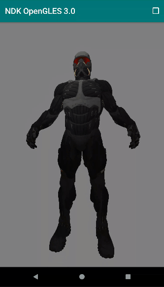
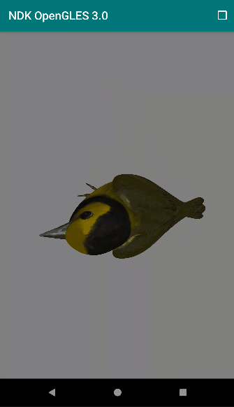
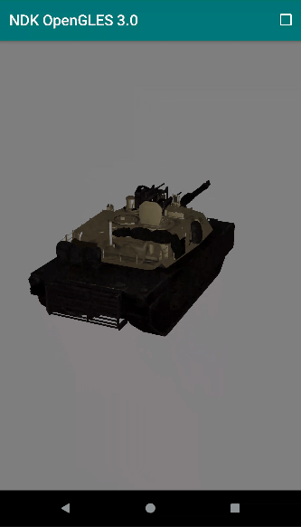

# NDK OpenGL ES 3.0 开发（二十一）：3D 模型加载和渲染

**OpenGL ES 3D 模型加载和渲染**

**
**



3D 模型渲染


上一节简单介绍了[常用的 3D 模型文件 Obj 的数据结构和模型加载库 Assimp 的编译](http://mp.weixin.qq.com/s?__biz=MzIwNTIwMzAzNg==&mid=2654161745&idx=1&sn=0164a39fb001e42eb6bdc298840292e5&chksm=8cf39862bb841174fc1bf04dc9c63d951f31130a20b2d8c83af1d454273354e635c01a6a7080&scene=21#wechat_redirect)，本节主要介绍如何使用 Assimp 加载 3D 模型文件和渲染 3D 模型。


**3D 模型的设计一般是由许多小模型拼接组合成一个完整的大模型，一个小模型作为一个独立的渲染单元，我们称这些小模型为网格（Mesh）。**

**
**

**网格作为独立的渲染单元至少需要包含一组顶点数据，每个顶点数据包含一个位置向量，一个法向量和一个纹理坐标，有了纹理坐标也需要为网格指定纹理对应的材质，还有绘制时顶点的索引。**


这样我们可以为 Mesh 定义一个顶点：


```
struct Vertex {
    // 位置向量 
    glm::vec3 Position;
    // 法向量
    glm::vec3 Normal;
    // 纹理坐标
    glm::vec2 TexCoords;
};
```


还需要一个描述纹理信息的结构体：


```
struct Texture
{
    GLuint id;//纹理 id ，OpenGL 环境下创建
    String type; //纹理类型（diffuse纹理或者specular纹理）
};
```


网格作为独立的渲染单元至少需要包含一组顶点数据以及顶点的索引和纹理，可以定义如下：


```
class Mesh
{
Public:
    vector<Vertex> vertices;//一组顶点
    vector<GLuint> indices;//顶点对应的索引
    vector<Texture> textures;//纹理
    Mesh(vector<Vertex> vertices, vector<GLuint> indices, vector<Texture> texture);
    Void Draw(Shader shader);

private:
    GLuint VAO, VBO, EBO;
    void initMesh();
    void Destroy();
}
```

**
**

我们通过 initMesh 方法创建相应的 [VAO、VBO、EBO](http://mp.weixin.qq.com/s?__biz=MzIwNTIwMzAzNg==&mid=2654161568&idx=1&sn=845783cfc2554aa5319c5ae94f8475b6&chksm=8cf39993bb8410859cd4e92349952d0cdef4c1799221e20d767d6c604513bd4ea89fa7b9a375&scene=21#wechat_redirect)，初始化缓冲，设置着色器程序的 uniform 变量。

**
**

```
Mesh(vector<Vertex> vertices, vector<GLuint> indices, vector<Texture> textures)
{
    this->vertices = vertices;
    this->indices = indices;
    this->textures = textures;

    this->initMesh();
}

void initMesh()
{
    //生成 VAO、VBO、EBO
    glGenVertexArrays(1, &this->VAO);
    glGenBuffers(1, &this->VBO);
    glGenBuffers(1, &this->EBO);

    //初始化缓冲区
    glBindVertexArray(this->VAO);
    glBindBuffer(GL_ARRAY_BUFFER, this->VBO);

    glBufferData(GL_ARRAY_BUFFER, this->vertices.size() * sizeof(Vertex), 
                 &this->vertices[0], GL_STATIC_DRAW);  

    glBindBuffer(GL_ELEMENT_ARRAY_BUFFER, this->EBO);
    glBufferData(GL_ELEMENT_ARRAY_BUFFER, this->indices.size() * sizeof(GLuint), 
                 &this->indices[0], GL_STATIC_DRAW);

    // 设置顶点坐标指针
    glEnableVertexAttribArray(0); 
    glVertexAttribPointer(0, 3, GL_FLOAT, GL_FALSE, sizeof(Vertex), 
                         (GLvoid*)0);
    // 设置法线指针
    glEnableVertexAttribArray(1); 
    glVertexAttribPointer(1, 3, GL_FLOAT, GL_FALSE, sizeof(Vertex), 
                         (GLvoid*)offsetof(Vertex, Normal));
    // 设置顶点的纹理坐标
    glEnableVertexAttribArray(2); 
    glVertexAttribPointer(2, 2, GL_FLOAT, GL_FALSE, sizeof(Vertex), 
                         (GLvoid*)offsetof(Vertex, TexCoords));

    glBindVertexArray(0);
}

//销毁纹理和缓冲区对象
void Destroy()
{
    for (int i = 0; i < textures.size(); ++i) {
        glDeleteTextures(1, &textures[i].id);
    }
    glDeleteBuffers(1, &EBO);
    glDeleteBuffers(1, &VBO);
    glDeleteVertexArrays(1, &VAO);
    VAO = EBO = VBO = GL_NONE;
}
```


预处理指令 offsetof 用于计算结构体属性的偏移量，把结构体作为它的第一个参数，第二个参数是这个结构体名字的变量，函数返回这个变量从结构体开始的字节偏移量（offset）。如：offsetof(Vertex, Normal) 返回 12 个字节，即 3 * sizeof(float) 。

我们用到的顶点着色器（简化后）：


```
#version 300 es
layout (location = 0) in vec3 a_position;
layout (location = 1) in vec3 a_normal;
layout (location = 2) in vec2 a_texCoord;
out vec2 v_texCoord;
uniform mat4 u_MVPMatrix;
void main()
{
    v_texCoord = a_texCoord;
    vec4 position = vec4(a_position, 1.0);
    gl_Position = u_MVPMatrix * position;
}
```


**而使用的片段着色器需要根据使用到的纹理数量和类型的不同做不同的调整。**如只有一个 diffuse 纹理的片段着色器如下：


```
#version 300 es
out vec4 outColor;
in vec2 v_texCoord;
uniform sampler2D texture_diffuse1;
void main()
{
    outColor = texture(texture_diffuse1, v_texCoord);
}
```


假如在一个网格中我们有 3 个 diffuse 纹理和 3 个 specular 纹理，那么对应的片段着色器中采样器的声明如下：


```
uniform sampler2D texture_diffuse1;
uniform sampler2D texture_diffuse2;
uniform sampler2D texture_diffuse3;
uniform sampler2D texture_specular1;
uniform sampler2D texture_specular2;
uniform sampler2D texture_specular3;
```


总结起来就是我们需要根据 Mesh 中纹理的数量和类型以及模型光照需求来使用不同的片段着色器和顶点着色器。


Mesh 的渲染的逻辑：


```
//渲染网格
void Draw(Shader shader) 
{
    unsigned int diffuseNr  = 1;
    unsigned int specularNr = 1;

    //遍历各个纹理，根据纹理的数量和类型确定采样器变量名
    for(unsigned int i = 0; i < textures.size(); i++)
    {
        glActiveTexture(GL_TEXTURE0 + i); // active proper texture unit before binding
        string number;
        string name = textures[i].type;
        if(name == "texture_diffuse")
            number = std::to_string(diffuseNr++);
        else if(name == "texture_specular")
            number = std::to_string(specularNr++); // transfer unsigned int to stream
        glUniform1i(glGetUniformLocation(shader.ID, (name + number).c_str()), i);
        // and finally bind the texture
        glBindTexture(GL_TEXTURE_2D, textures[i].id);
    }
    //绘制网格
    glBindVertexArray(VAO);
    glDrawElements(GL_TRIANGLES, indices.size(), GL_UNSIGNED_INT, 0);
    glBindVertexArray(0);
    glActiveTexture(GL_TEXTURE0);
}
```


Shader 类的逻辑简单包含了着色器程序的创建销毁和 uniform 类型变量的设置。


```
class Shader
{
public:
    unsigned int ID;//着色器程序的 ID 

    Shader(const char* vertexStr, const char* fragmentStr)
    {
        //创建着色器程序
        ID = GLUtils::CreateProgram(vertexStr, fragmentStr);
    }

    void Destroy()
    {
        //销毁着色器程序
        GLUtils::DeleteProgram(ID);
    }

    void use() 
    { 
        glUseProgram(ID); 
    }

    void setFloat(const std::string &name, float value) const
    { 
        glUniform1f(glGetUniformLocation(ID, name.c_str()), value); 
    }

    void setVec3(const std::string &name, float x, float y, float z) const
    { 
        glUniform3f(glGetUniformLocation(ID, name.c_str()), x, y, z); 
    }

    void setMat4(const std::string &name, const glm::mat4 &mat) const
    {
        glUniformMatrix4fv(glGetUniformLocation(ID, name.c_str()), 1, GL_FALSE, &mat[0][0]);
    }

};
```




3D 模型渲染


前面我们知道了一个模型（Model）包含许多个网格（Mesh），各个 Mesh 独立渲染共同组成整个 Model。Model 类可定义如下：


```
class Model 
{
    public:
        Model(GLchar* path)
        {
            loadModel(path);
        }
        //渲染模型，即依次渲染各个网格
        void Draw(Shader shader); 
        //销毁模型的所有网格
        void Destroy()；
    private:
        //模型所包含的网格
        vector<Mesh> meshes;
        //模型文件所在目录
        string directory;
        //加载模型
        void loadModel(string path);
        //处理 aiScene 对象包含的节点和子节点
        void processNode(aiNode* node, const aiScene* scene);
        //生成网格
        Mesh processMesh(aiMesh* mesh, const aiScene* scene);
        //创建纹理并加载图像数据
        vector<Texture> loadMaterialTextures(aiMaterial* mat, aiTextureType type, string typeName);
};
```


使用 Assimp 加载 3D 模型比较简单，最终模型被加载到一个 Assimp 中定义的 aiScene 对象中，aiScene 对象除了包含一些网格和材质，还包含一个 aiNode 对象（根节点），然后我们还需要遍历各个子节点的网格。


```
#include "assimp/Importer.hpp"
#include "assimp/scene.h"
#include "assimp/postprocess.h"

Assimp::Importer importer;
const aiScene* scene = importer.ReadFile(path, aiProcess_Triangulate | aiProcess_FlipUVs);
```


参数 aiProcess_Triangulate 表示如果模型不是（全部）由三角形组成，应该转换所有的模型的原始几何形状为三角形；aiProcess_FlipUVs 表示基于 y 轴翻转纹理坐标。


Model 类中加载模型的函数：


```
void loadModel(string const &path)
{

    Assimp::Importer importer;
    const aiScene* scene = importer.ReadFile(path, aiProcess_Triangulate | aiProcess_FlipUVs);

    if(!scene || scene->mFlags & AI_SCENE_FLAGS_INCOMPLETE || !scene->mRootNode) // if is Not Zero
    {
        LOGCATE("Model::loadModel path=%s, assimpError=%s", path, importer.GetErrorString());
        return;
    }
    directory = path.substr(0, path.find_last_of('/'));
    //处理节点
    processNode(scene->mRootNode, scene);
}

//递归处理所有节点
void processNode(aiNode *node, const aiScene *scene)
{

    for(unsigned int i = 0; i < node->mNumMeshes; i++)
    {
        aiMesh* mesh = scene->mMeshes[node->mMeshes[i]];
        if(mesh != nullptr)
            meshes.push_back(processMesh(mesh, scene));
    }

    for(unsigned int i = 0; i < node->mNumChildren; i++)
    {
        processNode(node->mChildren[i], scene);
    }
}

//生成网格 Mesh
Mesh processMesh(aiMesh* mesh, const aiScene* scene)
{
    vector<Vertex> vertices;
    vector<unsigned int> indices;
    vector<Texture> textures;

    for(GLuint i = 0; i < mesh->mNumVertices; i++)
    {
        Vertex vertex;
        // 处理顶点坐标、法线和纹理坐标
        ...
        vertices.push_back(vertex);
    }
    // 处理顶点索引
    for(unsigned int i = 0; i < mesh->mNumFaces; i++)
    {
        aiFace face = mesh->mFaces[i];
        for(unsigned int j = 0; j < face.mNumIndices; j++)
            indices.push_back(face.mIndices[j]);
    }
    // 处理材质
    if(mesh->mMaterialIndex >= 0)
    {
        aiMaterial* material = scene->mMaterials[mesh->mMaterialIndex]; 
        vector<Texture> diffuseMaps = loadMaterialTextures(material, aiTextureType_DIFFUSE, "texture_diffuse");
        textures.insert(textures.end(), diffuseMaps.begin(), diffuseMaps.end());
        ...
    }

    return Mesh(vertices, indices, textures);
}
```


在 Native 层加载纹理的时候，我们使用 OpenCV 对图片进行解码，然后生成纹理对象：


```
unsigned int TextureFromFile(const char *path, const string &directory)
{
    string filename = string(path);
    filename = directory + '/' + filename;
    unsigned int textureID;
    glGenTextures(1, &textureID);
    unsigned char *data = nullptr;

    LOGCATE("TextureFromFile Loading texture %s", filename.c_str());

    //使用 OpenCV 对图片进行解码
    cv::Mat textureImage = cv::imread(filename);
    if (!textureImage.empty())
    {
        // OpenCV 默认解码成 BGR 格式，这里转换为 RGB
        cv::cvtColor(textureImage, textureImage, CV_BGR2RGB);

        glBindTexture(GL_TEXTURE_2D, textureID);
        glTexImage2D(GL_TEXTURE_2D, 0, GL_RGB, textureImage.cols,
                     textureImage.rows, 0, GL_RGB, GL_UNSIGNED_BYTE,
                     textureImage.data);
        glGenerateMipmap(GL_TEXTURE_2D);
        glTexParameteri(GL_TEXTURE_2D, GL_TEXTURE_WRAP_S, GL_REPEAT);
        glTexParameteri(GL_TEXTURE_2D, GL_TEXTURE_WRAP_T, GL_REPEAT);
        glTexParameteri(GL_TEXTURE_2D, GL_TEXTURE_MIN_FILTER, GL_LINEAR_MIPMAP_LINEAR);
        glTexParameteri(GL_TEXTURE_2D, GL_TEXTURE_MAG_FILTER, GL_LINEAR);
        GO_CHECK_GL_ERROR();
    } else {
        LOGCATE("TextureFromFile Texture failed to load at path: %s", path);
    }
    return textureID;
}
```


绘制模型就是遍历每个 Mesh 进行绘制：


```
void Draw(Shader shader)
{
    for(unsigned int i = 0; i < meshes.size(); i++)
        meshes[i].Draw(shader);
}
```


最后就是这个 Model 类的使用示例：


```
//初始化，加载模型
m_pModel = new Model("/sdcard/model/poly/Apricot_02_hi_poly.obj");
m_pShader = new Shader(vShaderStr, fShaderStr);

//绘制模型
glClearColor(0.5f, 0.5f, 0.5f, 1.0f);
glClear(GL_COLOR_BUFFER_BIT | GL_DEPTH_BUFFER_BIT);
glEnable(GL_DEPTH_TEST);

UpdateMVPMatrix(m_MVPMatrix, m_AngleX, m_AngleY, (float)screenW / screenH);

m_pShader->use();
m_pShader->setMat4("u_MVPMatrix", m_MVPMatrix);
m_pModel->Draw((*m_pShader));

//销毁对象
if (m_pModel != nullptr) {
    m_pModel->Destroy();
    delete m_pModel;
    m_pModel = nullptr;
}
if (m_pShader != nullptr) {
    m_pShader->Destroy();
    delete m_pShader;
    m_pShader = nullptr;
}
```


效果展示：




3D 模型渲染