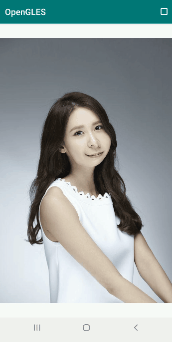

# OpenGL ES 实现动态（水波纹）涟漪效果


动态（水波纹）涟漪效果


*1*

水波纹效果原理


最近一个做视频滤镜的朋友，让我给他做一个动态水波纹效果，具体就是：**点击屏幕上的某一位置，然后波纹以该位置为中心向周围扩散。**


接到这个需求，一开始就尝试着在 3D 坐标系（x,y,z）中利用正弦或余弦函数去修改 z 分量的值，但是这样出来的效果太假了，压根就没有水波纹的真实感。


然后，**我就乖乖地去研究下物理世界中的水波纹是怎样形成的**。你别说，我还真接了一盆水，坐在旁边观察了半天。

模拟物理世界中的水波纹

最后观察出，物理世界中水波纹的特点如上图所示，**从水面的正上方往下看，在凹面上方观察到的是缩小效果，而在凸面上方观察到的是放大效果，然后整个水波纹效果就是放大和缩小效果的交叉排列。**


因此，我们得出结论，水波纹（涟漪）效果实际上就是一组组相互交替、幅度向外部逐渐减小的缩小放大效果组合。


本文将水波纹模型简化成一组放大和缩小效果随时间逐步向外部偏移。


水波纹效果原理如下图所示，我们以点击位置为中心，发生形变的区域是内圆和外圆之间的区域，以归一化时间变量 u_Time 大小为半径构建的圆（蓝色虚线）为边界，设定内侧是实现缩小效果的区域，外侧为实现放大效果的区域，也可以反之设定。

水波纹模型原理

发生形变区域的宽度为固定值 2*u_Boundary ，然后这个形变区域随着 u_Time 的变大逐步向外侧移动，最后就形成了动态的水波纹效果。


我们设采样点到中心点的距离为 Distance ，然后计算 Distance-u_Time=diff 的值来判定，采样点是位于缩小区域（diff < 0）还是放大区域（diff > 0）。


最后我们只需要构建一个平滑的函数，以 diff 作为输入，diff < 0 的时候函数输出正值，diff > 0 的时候函数输出负值。


另外，**为了防止形变效果的跳变，我们还需要平滑函数满足在边界处输出值为 0 （或者接近于 0 ），表示此边界为是否发生形变的临界线**。


# 

*2*

水波纹效果实现


基于上节的原理分析，实现水波纹效果的主要原理就是实现一定区域内的缩小和放大效果**，我们以平滑函数的输出值作为纹理采样坐标的偏移程度。**


**当平滑函数输出正值时，采样坐标向圆外侧偏移，呈现缩小效果，而平滑函数输出负值时，采样坐标向圆内侧偏移，呈现放大效果。**


基于上节的原理分析，我们接下来需要找一个合适的平滑函数，根据以上特征首先我想到的函数是 -x^3 ，它满足了平滑和输出值（左正右负）的条件。


-8x^3函数曲线


在构建我们想要的平滑函数时，http://fooplot.com 网站提供了在线函数绘图功能，可以很方便看出一个函数的生成曲线。


fooplot

我们根据类似 *-x^3* 函数，构建如下的片段着色器，试验下效果是否符合预期。


```
#version 300 es
precision highp float;
in vec2 v_texCoord;
layout(location = 0) out vec4 outColor;
uniform sampler2D s_TextureMap;//采样器
uniform vec2 u_TouchXY;//点击的位置（归一化）
uniform vec2 u_TexSize;//纹理尺寸
uniform float u_Time;//归一化的时间
uniform float u_Boundary;//边界 0.1
void main()
{
    float ratio = u_TexSize.y / u_TexSize.x;
    vec2 texCoord = v_texCoord * vec2(1.0, ratio);//根据纹理尺寸，对采用坐标进行转换
    vec2 touchXY = u_TouchXY * vec2(1.0, ratio);//根据纹理尺寸，对中心点坐标进行转换
    float distance = distance(texCoord, touchXY);//采样点坐标与中心点的距离

    if ((u_Time - u_Boundary) > 0.0
    && (distance <= (u_Time + u_Boundary))
    && (distance >= (u_Time - u_Boundary))) {
        float diff = (distance - u_Time); //输入 diff
        float moveDis =  - pow(8 * diff, 3.0);//平滑函数 -(8x)^3 采样坐标移动距离
        vec2 unitDirectionVec = normalize(texCoord - touchXY);//单位方向向量
        texCoord = texCoord + (unitDirectionVec * moveDis);//采样坐标偏移（实现放大和缩小效果）
    }

    texCoord = texCoord / vec2(1.0, ratio);//转换回来
    outColor = texture(s_TextureMap, texCoord);
}
```


绘制部分的逻辑：


```
void ShockWaveSample::Draw(int screenW, int screenH)
{
    LOGCATE("ShockWaveSample::Draw()");
    m_SurfaceWidth = screenW;
    m_SurfaceHeight = screenH;
    if(m_ProgramObj == GL_NONE || m_TextureId == GL_NONE) return;

    m_FrameIndex ++;

    UpdateMVPMatrix(m_MVPMatrix, m_AngleX, m_AngleY, (float)screenW / screenH);

    glUseProgram (m_ProgramObj);
    glBindVertexArray(m_VaoId);

    GLUtils::setMat4(m_ProgramObj, "u_MVPMatrix", m_MVPMatrix);

    glActiveTexture(GL_TEXTURE0);
    glBindTexture(GL_TEXTURE_2D, m_TextureId);
    GLUtils::setFloat(m_ProgramObj, "s_TextureMap", 0);

    //float time = static_cast<float>(fmod(GetSysCurrentTime(), 2000) / 2000);
    float time = static_cast<float>(fmod(m_FrameIndex, 150) / 120);
    GLUtils::setFloat(m_ProgramObj, "u_Time", time);

    //设置点击位置
    GLUtils::setVec2(m_ProgramObj, "u_TouchXY", m_touchXY);
     //设置纹理尺寸
    GLUtils::setVec2(m_ProgramObj, "u_TexSize", vec2(m_RenderImage.width, m_RenderImage.height));
     //设置边界值
    GLUtils::setFloat(m_ProgramObj, "u_Boundary", 0.1f);

    glDrawElements(GL_TRIANGLES, 6, GL_UNSIGNED_SHORT, (const void *)0);

}
```


我们使用 *y=-(8\*x)^3* 作为平滑函数得出来的效果图如下所示，虽然有水波纹效果，但是形变边界跳变严重，原来是该平滑函数没有满足，在边界处输出值为 0 的条件。


使用-8x^3平滑函数绘制效果


为了满足平滑函数的输出值在边界处为 0 的条件，我们利用 fooplot 构建的一个函数 *y=20x(x-0.1)(x+0.1)* ，函数曲线如下图所示，由于边界值 u_Boundary 为 0.1 ，该函数满足我们的需求。


y=20x*(x-0.1)*(x+0.1)函数曲线


在上述片段着色器中，我们替换下平滑函数：


```
float x = (distance - u_Time); //输入 diff = x
float moveDis = 20.0 * x * (x - 0.1)*(x + 0.1);//平滑函数 y=20.0 * x * (x - 0.1)*(x + 0.1)  采样坐标移动距离
```


我们替换平滑函数后，绘制结果如下图所示，结果符合预期，没有了形变在边界处的跳变。


动态（水波纹）涟漪效果


另外，我们在网上找到一个古怪的函数，y= (1-Math.pow(Math.abs(20x), 4.8))x ，绘制出来的效果如下图所示，看起来比较有意思。


古该函数对应的效果


当然，**我们也可以在形变区域内构建具有多个零点的平滑函数，来制造多个波动效果**，更多有意思的效果留给你去探索吧。