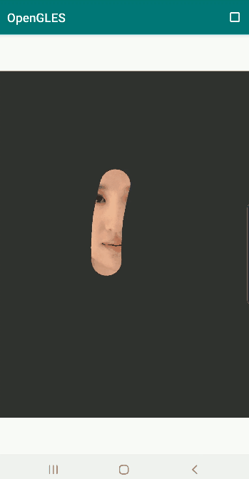
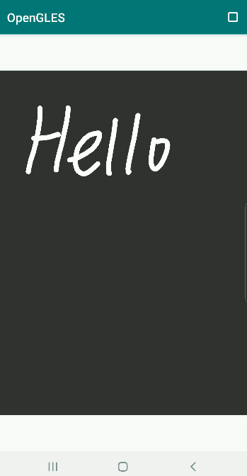
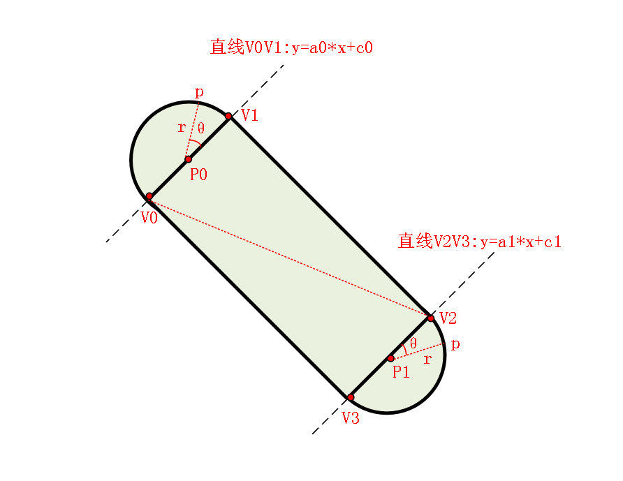

# OpenGL ES 实现刮刮卡和手写板功能


刮刮卡效果
手写板效果


# 

*1*

刮刮卡效果实现原理


**其实利用 Android Canvas 实现类似刮刮卡或者手写板功能比较方便，通过自定义 View 绘制 2 个图层，位于上层的图层在手指划过的位置将透明度置为 0 ，这样下层图层的颜色便可以显示出来。**

不过话又说回来，Android Canvas 实现类似刮刮卡功能虽然方便，但是性能一言难尽，通常在复杂的应用界面不宜采用此类方法，此时就不得不考虑使用 OpenGL 进行优化。

**本文尝试使用 OpenGL 来实现类似刮刮卡的功能，简而言之就是利用 OpenGL 根据手指滑动的坐标去构建一条一条的带状网格，然后基于此网格[实现纹理映射](http://mp.weixin.qq.com/s?__biz=MzIwNTIwMzAzNg==&mid=2654161543&idx=1&sn=bb69fdacc5d9e85e4dea8e87e29abd66&chksm=8cf399b4bb8410a249167518e518798a7bc29b0e9c5d1343876928ff0cf5cd794f0878c73789&scene=21#wechat_redirect)。**

为了使带状图形（网格）看起来平滑自然，我们还需要在起点和终点位置构建 2 个半圆，使滑动轨迹看起来平滑自然。

实现原理图

我们基于 2 点之间滑动轨迹构建的形状如上图所示，形状由一个矩形和 2 个半圆组成。

设 P0、P1 为手指在屏幕上滑动时前后相邻的 2 个点（注意屏幕坐标需要进行归一化转换为纹理坐标），r 为圆的半径，同时也用于控制矩形的宽度。

上述原理图中，点 P1、P2 和半径 r 为已知信息，我们需要求出矩形的四个点 V0、V1、V2、V3 的坐标，便于去构建矩形网格，而两个圆的圆心和半径信息已知，只需要以圆心为顶点构建三角形即可。

**这里我们选择直接绘制 2 个圆而不是 2 个半圆，因为绘制半圆的话需要去计算直线 V0V1 或 V2V3 斜率的反正切角，这个时候有几种特殊情况需要考虑，反而变得比较麻烦。**

**而无脑去绘制 2 个圆的话，后续可以利用模板测试来防止重复绘制，实现起来更为方便。**

为求得直线 V0V1 的方程，可以利用 2 个直线 P0P1 和 V0V1 相交的关系，即向量 V0P0 和向量 P0P1 的点乘值为 0 。

**求出直线 V0V1 的方程后，直线 V0V1 与以 P0 为圆心 r 为半径圆的 2 个交点，就是点 V0 和 V1 的坐标，在数学上就是求解二元二次方程。同样，使用相同的方法，也可以求出点 V2、V3 的坐标。**


# 

*2*

OpenGL 实现刮刮卡


OpenGL 实现刮刮卡效果的关键在于利用滑动轨迹构建网格，我们在 GLSurfaceView 类的 onTouchEvent 回调方法中获得滑动轨迹传入 Native 层用于构建网格。

```
    public void consumeTouchEvent(MotionEvent e) {
        float touchX = -1, touchY = -1;
        switch (e.getAction()) {
            case MotionEvent.ACTION_MOVE:
                touchX = e.getX();
                touchY = e.getY();
                break;
            case MotionEvent.ACTION_UP:
            case MotionEvent.ACTION_CANCEL://取消或停止滑动时进行标记
                touchX = -1;
                touchY = -1;
                break;
        }

        //滑动、触摸
        switch (mGLRender.getSampleType()) {
            case SAMPLE_TYPE_KEY_SCRATCH_CARD:
                mGLRender.setTouchLoc(touchX, touchY);
                requestRender();
                break;
            default:
                break;
        }

    }
```

在 Native 层构建网格，其中点 pre 和 cur 为滑动轨迹中相邻的 2 个点。

```
void ScratchCardSample::CalculateMesh(vec2 pre, vec2 cur) {
    vec2 imgSize(m_RenderImage.width, m_RenderImage.height);
    vec2 p0 = pre * imgSize, p1 = cur * imgSize;
    vec2 v0, v1, v2, v3;
    float r = static_cast<float>(EFFECT_RADIUS * imgSize.x);
    float x0 = p0.x, y0 = p0.y;
    float x1 = p1.x, y1 = p1.y;
    if (p0.y == p1.y) //1. 平行于 x 轴的
    {
        v0 = vec2(p0.x, p0.y - r) / imgSize;
        v1 = vec2(p0.x, p0.y + r) / imgSize;
        v2 = vec2(p1.x, p1.y - r) / imgSize;
        v3 = vec2(p1.x, p1.y + r) / imgSize;

    } else if (p0.x == p1.x) { //2. 平行于 y 轴的
        v0 = vec2(p0.x - r, p0.y) / imgSize;
        v1 = vec2(p0.x + r, p0.y) / imgSize;
        v2 = vec2(p1.x - r, p1.y) / imgSize;
        v3 = vec2(p1.x + r, p1.y) / imgSize;

    } else { //3. 其他 case
        float A0 = (y1 - y0) * y0 + (x1 - x0) * x0;
        float A1 = (y0 - y1) * y1 + (x0 - x1) * x1;
        // y = a0 * x + c0,  y = a1 * x + c1
        float a0 = -(x1 - x0) / (y1 - y0);
        float c0 = A0 / (y1 - y0);

        float a1 = -(x0 - x1) / (y0 - y1);
        float c1 = A1 / (y0 - y1);

        float x0_i = 0;
        float y0_i = a0 * x0_i + c0;

        float x1_i = 0;
        float y1_i = a1 * x1_i + c1;

        //计算直线与圆的交点
        vec4 v0_v1 = getInsertPointBetweenCircleAndLine(x0, y0, x0_i, y0_i, x0, y0, r);

        v0 = vec2(v0_v1.x, v0_v1.y) / imgSize;
        v1 = vec2(v0_v1.z, v0_v1.w) / imgSize;

        vec4 v2_v3 = getInsertPointBetweenCircleAndLine(x1, y1, x1_i, y1_i, x1, y1, r);

        v2 = vec2(v2_v3.x, v2_v3.y) / imgSize;
        v3 = vec2(v2_v3.z, v2_v3.w) / imgSize;

    }

    // 矩形 3 个三角形（一个矩形为什么要绘制 3 个三角形？）
    m_pTexCoords[0] = v0;
    m_pTexCoords[1] = v1;
    m_pTexCoords[2] = v2;
    m_pTexCoords[3] = v0;
    m_pTexCoords[4] = v2;
    m_pTexCoords[5] = v3;
    m_pTexCoords[6] = v1;
    m_pTexCoords[7] = v2;
    m_pTexCoords[8] = v3;

    int index = 9;
    float step = MATH_PI / 10;
    // 2 个圆，一共 40 个三角形，360 度角平分 20 份 
    for (int i = 0; i < 20; ++i) {
        float x = r * cos(i * step);
        float y = r * sin(i * step);

        float x_ = r * cos((i + 1) * step);
        float y_ = r * sin((i + 1) * step);

        x += x0;
        y += y0;
        x_ += x0;
        y_ += y0;

        m_pTexCoords[index + 6 * i + 0] = vec2(x, y) / imgSize;
        m_pTexCoords[index + 6 * i + 1] = vec2(x_, y_) / imgSize;
        m_pTexCoords[index + 6 * i + 2] = vec2(x0, y0) / imgSize;

        x = r * cos(i * step);
        y = r * sin(i * step);

        x_ = r * cos((i + 1) * step);
        y_ = r * sin((i + 1) * step);

        x += x1;
        y += y1;
        x_ += x1;
        y_ += y1;

        m_pTexCoords[index + 6 * i + 3] = vec2(x, y) / imgSize;
        m_pTexCoords[index + 6 * i + 4] = vec2(x_, y_) / imgSize;
        m_pTexCoords[index + 6 * i + 5] = vec2(x1, y1) / imgSize;
    }

    for (int i = 0; i < TRIANGLE_NUM * 3; ++i) {
        m_pVtxCoords[i] = GLUtils::texCoordToVertexCoord(m_pTexCoords[i]);
    }

}
```

看到上面的代码，你或许会感到疑惑，一个矩形为什么要绘制 3 个三角形？

这是因为点 V0、V1 的相对位置（谁在左边、谁在右边）我们并不知道，为了确保能绘制完整的矩形，这里直接绘制了 3 个三角形，这个后面还有优化。

**下面是绘制部分的逻辑，其中为了防止重复绘制，[我们开启模板测试](http://mp.weixin.qq.com/s?__biz=MzIwNTIwMzAzNg==&mid=2654161627&idx=1&sn=a032fdda0b5e54063b48b7153454e8d9&chksm=8cf399e8bb8410fe42c5435ba74b022370a3fb668bdf6a5253bebf9d904b3a6b9f2fdcab85a1&scene=21#wechat_redirect)，下面代码设置的意思是：我们之前已经绘制过的位置，后面就不再进行重复绘制了。**

```
    glUseProgram(m_ProgramObj);
    glEnable(GL_STENCIL_TEST);
    glStencilFunc(GL_NOTEQUAL, 1, 0xFF);//当片段的模板值不为 1 时，片段通过测试进行渲染
    glStencilOp(GL_KEEP, GL_KEEP, GL_REPLACE);//若模板测试和深度测试都通过了，将片段对应的模板值替换为1
    glStencilMask(0xFF);

    glBindVertexArray(m_VaoId);
    glUniformMatrix4fv(m_MVPMatLoc, 1, GL_FALSE, &m_MVPMatrix[0][0]);

    glActiveTexture(GL_TEXTURE0);
    glBindTexture(GL_TEXTURE_2D, m_TextureId);
    glUniform1i(m_SamplerLoc, 0);

    for (int i = 0; i < m_PointVector.size(); ++i) {
        vec4 pre_cur_point = m_PointVector[i];
        CalculateMesh(vec2(pre_cur_point.x, pre_cur_point.y), vec2(pre_cur_point.z, pre_cur_point.w));
        glBindBuffer(GL_ARRAY_BUFFER, m_VboIds[0]);
        glBufferSubData(GL_ARRAY_BUFFER, 0, sizeof(m_pVtxCoords), m_pVtxCoords);
        glBindBuffer(GL_ARRAY_BUFFER, m_VboIds[1]);
        glBufferSubData(GL_ARRAY_BUFFER, 0, sizeof(m_pTexCoords), m_pTexCoords);
        glDrawArrays(GL_TRIANGLES, 0, TRIANGLE_NUM * 3);
    }
    glDisable(GL_STENCIL_TEST);
```

当我们绘制一张图的时候，滑动屏幕呈现出来的就是刮刮卡效果：

刮刮卡效果

当我们绘制单一的某种颜色（纯色），滑动屏幕呈现出来的就是手写板效果：

手写板效果

实现代码路径见阅读原文末。