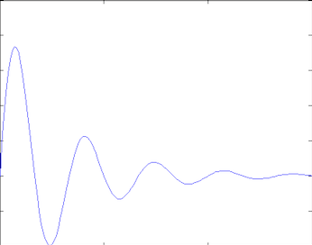

# 实现心动特效

**跳动的心**

跳动的心

浏览博客时，偶然间发现这个"跳动的心"特效，瞬间被感动了，当得知这个特效是用纯代码实现（ GLSL 实现）的，确实又被惊到了。


追溯该特效最初的来源，最终在 ShaderToy 网站看到它的原始实现，另外在 ShaderToy 上还发现了无数类似惊人的特效，并且这些特效的实现代码完全公开。


ShaderToy

> ShaderToy 是一个跨浏览器的在线社区，并且是用于通过 WebGL 创建和共享着色器的工具，用于在 Web 浏览器中学习和教授 3D 计算机图形学。

在 SahderToy 网站上浏览了一番，感觉仿佛发现了新大陆，该网站支持在线编写并运行 GLSL 脚本，堪称 GL 界的 Github 。


我们把网站上"跳动的心"特效的脚本转换为 OpenGLES 对应的 GLSL 脚本在手机上运行，并对整个脚本进行一一解析，完整的代码如下：


```
#version 300 es
precision highp float;
layout(location = 0) out vec4 outColor;//输出
uniform float u_time;//时间偏移量
uniform vec2 u_screenSize;//屏幕尺寸
const float PI = 3.141592653;
void main()
{
// move to center
vec2 fragCoord = gl_FragCoord.xy;
vec2 p = (2.0*fragCoord-u_screenSize.xy)/min(u_screenSize.y,u_screenSize.x);

// background color
vec3 bcol = vec3(1.0,0.8,0.8)*(1.0-0.38*length(p));

// animate
float tt = u_time;
float ss = pow(tt,.2)*0.5 + 0.5;
ss = 1.0 + ss*0.5*sin(tt*6.2831*3.0 + p.y*0.5)*exp(-tt*4.0);
p *= vec2(0.5,1.5) + ss*vec2(0.5,-0.5);

// shape
p.y -= 0.25;
float a = atan(p.x,p.y) / PI;
float r = length(p);
float h = abs(a);
float d = (13.0*h - 22.0*h*h + 10.0*h*h*h)/(6.0-5.0*h);

// color
float s = 0.75 + 0.75*p.x;
s *= 1.0-0.4*r;
s = 0.3 + 0.7*s;
s *= 0.5+0.5*pow( 1.0-clamp(r/d, 0.0, 1.0 ), 0.1 );
vec3 hcol = vec3(1.0,0.5*r,0.3)*s;

vec3 col = mix( bcol, hcol, smoothstep( -0.06, 0.06, d-r) );

outColor = vec4(col,1.0);
}
```


关于内建变量 gl_FragCoord ，从[旧文](http://mp.weixin.qq.com/s?__biz=MzIwNTIwMzAzNg==&mid=2654161619&idx=1&sn=ff5570d54e7bc7e25f03403fa3dc72f6&chksm=8cf399e0bb8410f60c37613370adb2e67a8f0dbeea273f42306e6a2f995981646208493dff4e&scene=21#wechat_redirect)中我们知道：**与屏幕空间坐标相关的视区是由视口设置函数 glViewport 函数给定，并且可以通过片段着色器中内置的 gl_FragCoord 变量访问。**

**
**

**gl_FragCoord 的 x 和 y 表示该片段的屏幕空间坐标 ((0，0) 在左下角)，其取值范围由 glViewport 函数决定，屏幕空间坐标原点位于左下角。**


下面一段代码主要作用是调整坐标系，将原点从左下角移至屏幕坐标系中央，这样所有片元的向量 gl_FragCoord.xy 均以屏幕中心为起点，则向量 p 就是屏幕中心与屏幕像素点坐标之间的方向向量。


```
// move to center
vec2 fragCoord = gl_FragCoord.xy;
vec2 p = (2.0 * fragCoord - u_screenSize.xy) / min(u_screenSize.y,u_screenSize.x);
```


屏幕中心与屏幕像素点坐标之间的方向向量（网图，侵删）


接下来计算背景颜色，length(p) 表示计算当前片元（像素）与屏幕中心点的距离，背景颜色以 vec3(1.0,0.8,0.8) 该颜色为基础，距离屏幕越远颜色越暗。


```
// background color
vec3 bcol = vec3(1.0,0.8,0.8)*(1.0-0.38*length(p));
```


这时，我们把背景颜色渲染出来看看：


背景颜色渲染


接着绘制心形，主要利用反正切函数值和当前片元（像素）与屏幕中心点的距离相比较，来确定心形状的边界。GLES 中的反正切函数 atan(p.x,p.y) 取值范围是[-π, π]，然后除以 PI 后，取值范围变成了 [-1, 1] 。


```
// shape
p.y -= 0.25;//向屏幕下方偏移 0.25 个单位
float a = atan(p.x,p.y) / PI;
float r = length(p);
float h = abs(a);//取绝对值
//float d = (13.0*h - 22.0*h*h + 10.0*h*h*h)/(6.0-5.0*h);//这个函数主要使心的形状更加扁平化，暂时先忽略
```


绘制心形


我们通过上图来理解心形的绘制过程，每条直线上像素点得到的 a 值都是相同的，我们用黄点表示距离屏幕中心的远近，然后通过 d-r 的值来确定心形的边界。


```
vec3 col = mix(bcol, hcol, smoothstep( -0.06, 0.06, d-r) );
```


以上是绘制心形的关键函数，hcol 是心的颜色，bcol 是背景色。


smoothstep


smoothstep 是一个很常用的平滑过渡函数，当第三个参数比 -0.06 小时，返回 0，比0.06 大时返回 1 ，如果在 -0.06 和 0.06 之间，则返回 0 到 1 之间的值，其作用是用于平缓 d-r 的值在正负交界处的突变。


opengl mix


mix 函数用于加权混合心的颜色和背景色，根据 smoothstep 函数特性，在心形内用心的颜色，在心形外用背景色，而边界则是两种颜色之间的模糊过渡。


再说说心形扁平化函数的作用，当我们不使用扁平化函数，而是直接用 h-r 来控制心的形状，得到的图像是一个又胖又肥的心形，这样你大概可以得知这个函数的作用。


```
//float d = (13.0*h - 22.0*h*h + 10.0*h*h*h)/(6.0-5.0*h);//这个函数主要使心的形状更加扁平化，暂时先忽略
vec3 col = mix(bcol, hcol, smoothstep( -0.06, 0.06, h-r) );
```


不使用扁平化函数时得到的心形


然后看看心的颜色生成，由表达式 vec3(1.0,0.5*r,0.3) 可以看出心的颜色是红色，且由屏幕中心向四周红色逐渐减弱，然后产生一系列渐变，最后分出心形内外的区域颜色。


```
// color
float s = 0.75 + 0.75*p.x;//在 x 轴方向有一个渐变
s *= 1.0-0.4*r;//根据距离产生渐变
s = 0.3 + 0.7*s;//增亮了左侧暗部区域
s *= 0.5+0.5*pow( 1.0-clamp(r/d, 0.0, 1.0 ), 0.1 );//借助变量 r/d 分出了心形内外的区域颜色
vec3 hcol = vec3(1.0,0.5*r,0.3)*s;
```

我们直接输出心的颜色 hcol ，看看是什么效果：

输出心的颜色 hcol

最后是跳动效果的实现，其原理就是对屏幕像素在 x、y 方向进行周期性偏移，偏移幅度由特殊的函数来控制。

```
// animate
float tt = u_time;//u_time 为周期性输入的时间
float ss = pow(tt,.2)*0.5 + 0.5;
ss = 1.0 + ss*0.5*sin(tt*6.2831*3.0 + p.y*0.5)*exp(-tt*4.0);//控制幅度的函数
p *= vec2(0.5,1.5) + ss*vec2(0.5,-0.5);
```

我们通过下面的代码控制输入时间周期为 2000ms 。

```
float time = static_cast<float>(fmod(GetSysCurrentTime(), 2000) / 2000);
glUniform1f(m_TimeLoc, time);
```

振幅控制函数的模拟曲线如下图所示，大致可以看出心跳动时幅度变化情况。

振幅控制函数的模拟曲线（网图，侵删）

最后还有一点需要注意的是 GLSL 脚本中精度的声明，文中代码我们使用的是 highp 精度，但是当使用 mediump 精度时，会出现由于精度不够导致的毛刺现象，如下图所示：

精度不够导致的毛刺现象

# **参考**

https://www.shadertoy.com/view/XsfGRn
https://blog.csdn.net/candycat1992/article/details/44040273