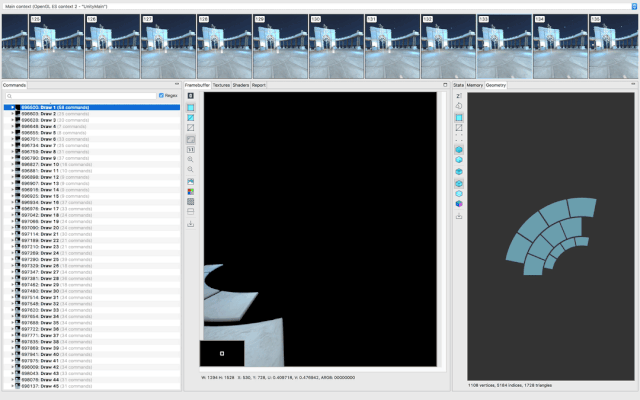
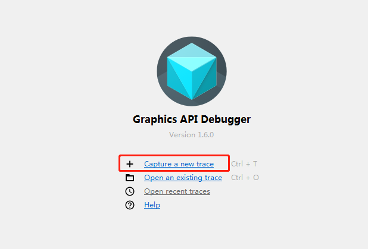
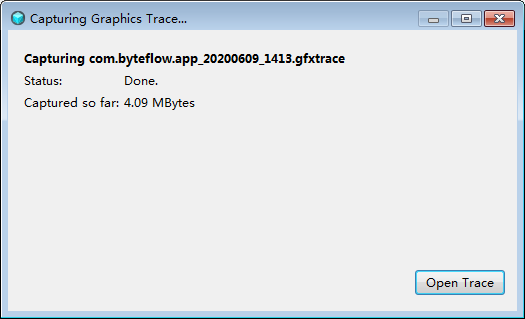
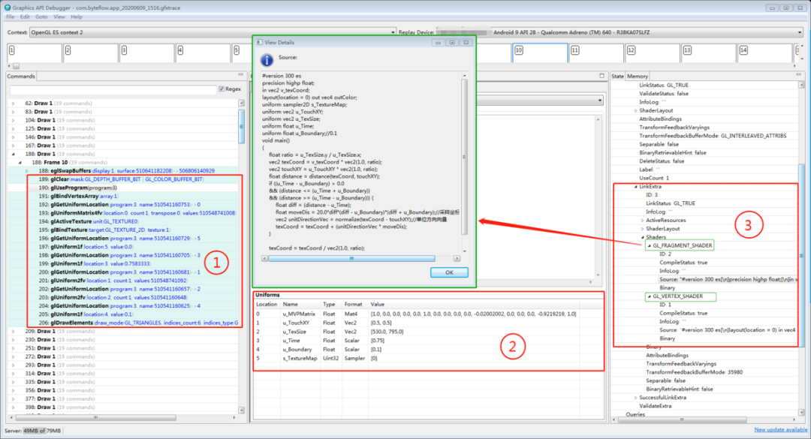

# 强大的 Android OpenGL ES 调试工具

*1* **GAPID 是什么**

GAPID **(Graphics API Debugger)是 Google 的一款开源且跨平台的图形开发调试工具，用于记录和检查应用程序对图形驱动程序的调用，支持 OpenGL ES 和 Vulkan 调试。**


工具下载地址：https://github.com/google/gapid/releases


GAPID 的主要功能：


- 查看 OpenGL ES 或 Vulkan 绘图接口的调用情况（调用顺序、流程）；
- 查看传入着色器程序的参数；
- 查看纹理，导出模型、贴图等资源；
- 查看、修改以及导出 shader 脚本。


一个 3D 场景的整个渲染过程

上图来自 GAPID 官网，我们可以看到一个 3D 场景的整个渲染过程，以及每次渲染用到的纹理图。


很多朋友看到这里，心里可能会有疑问：假如我看上了别人的一个 OpenGL 实现的效果，那我能不能用 GAPID 抓取到它的 shader 脚本源码来学习？答案是肯定的。


**编译完 shader 脚本生成的二进制代码，可以通过 GAPID 抓取到并反编译成原来的 shader 源码。总而言之就是，你的 shader 脚本实际上是在 GPU 上裸奔，尤其是对手机厂商来说。**


据俺所知，**shader 脚本在 GPU 层面上目前并没有有效的加密或混淆方法，比较通用的做法是将 shader 中的变量无意义化，比如用 var1、var2 等表示。**

**
**

**或者将一个 shader 拆分成多个小 shader ，以达到降低可读性的目的。**

**
**

**
**

**
**

*2*

**GAPID 怎么用**


下载、安装好 GAPID 程序后，将 Android 手机通过 USB 与电脑连接（同时需要关闭 AndroidStudio ），手机处于开发者选项中的 Debug 调试模式。


注意， **GAPID 支持 Android 5.0 及以上版本手机，待调试的 App 要求是 Debug 版本或者手机被 Root 掉了。**


Capture a new trace

打开 GAPID 程序，点击 Capture a new trace 准备调试我们的程序。

选择要调试的程序

选择要调试的程序，选中接口类型为 OpenGL ES类型，然后启动抓取 Graphics Trace 信息。

抓取完成

抓取完成后，打开 trace 文件，然后 GAPID 程序的界面如下图所示。

GAPID 程序的界面

左侧区域为抓取到的每一帧的绘制过程，**区域 1 中展示的是其中一帧绘制过程，由于我们用的是旧文中绘制水波纹的例子作为调试程序，可以对比出区域 1 中展示的绘制流程与下面绘制水波纹的代码基本一致。**

```
void ShockWaveSample::Draw(int screenW, int screenH)
{
    glUseProgram (m_ProgramObj);
    glBindVertexArray(m_VaoId);

    GLUtils::setMat4(m_ProgramObj, "u_MVPMatrix", m_MVPMatrix);

    glActiveTexture(GL_TEXTURE0);
    glBindTexture(GL_TEXTURE_2D, m_TextureId);
    GLUtils::setFloat(m_ProgramObj, "s_TextureMap", 0);

    //float time = static_cast<float>(fmod(GetSysCurrentTime(), 2000) / 2000);
    float time = static_cast<float>(fmod(m_FrameIndex, 150) / 120);
    GLUtils::setFloat(m_ProgramObj, "u_Time", time);

    GLUtils::setVec2(m_ProgramObj, "u_TouchXY", m_touchXY);
    GLUtils::setVec2(m_ProgramObj, "u_TexSize", vec2(m_RenderImage.width, m_RenderImage.height));
    GLUtils::setFloat(m_ProgramObj, "u_Boundary", 0.1f);

    glDrawElements(GL_TRIANGLES, 6, GL_UNSIGNED_SHORT, (const void *)0);

}
```

区域 2 中展示的是绘制当前帧时，传递给着色器程序中各个变量的值，可以清楚看到各个变量和矩阵对应的值。

**区域 3 中展示的是着色器程序的状态信息，我们根据着色器程序的 id ，找到对应的 LinkExtra ，然后便可以拿到当前着色器程序所对应的 shader 脚本源码，与代码中的程序一致。**

本文主要介绍了 GAPID 的一些常用功能，还有更多高端功能等你探索。

