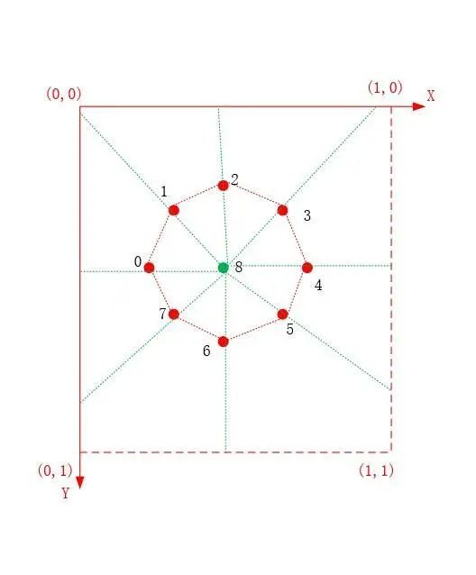
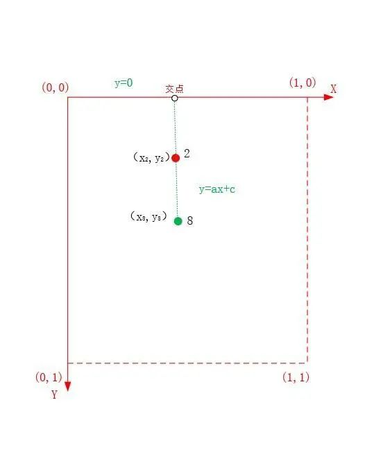
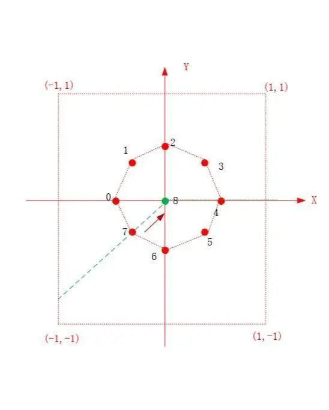

# 大头小头效果


旧文中我们利用 OpenGL 给小姐姐实现了[瘦身、大长腿效果](http://mp.weixin.qq.com/s?__biz=MzIwNTIwMzAzNg==&mid=2654161784&idx=1&sn=e603a953f60d3f48207be1258a88cd25&chksm=8cf3984bbb84115d4021eeac4179d12f2727d07a7d32b3e6ce70b33c4f749cf907a111e7f072&scene=21#wechat_redirect)以及[瘦脸大眼效果](http://mp.weixin.qq.com/s?__biz=MzIwNTIwMzAzNg==&mid=2654161796&idx=1&sn=f0384fd40f5529604c68ff51b989daec&chksm=8cf398b7bb8411a1211fcc4dde6f090a63c4bbdf01c1204cb126a4cd8f405fdbdf5fb9232909&scene=21#wechat_redirect)，小姐姐苦笑道：我头都被你气大了，怎么办？


怎么办？对于一个直男癌晚期的码农来说，这都不是事儿。


*1*

大头小头效果


大头小头效果


旧文中我们知道，利用[ OpenGL 纹理映射](http://mp.weixin.qq.com/s?__biz=MzIwNTIwMzAzNg==&mid=2654161543&idx=1&sn=bb69fdacc5d9e85e4dea8e87e29abd66&chksm=8cf399b4bb8410a249167518e518798a7bc29b0e9c5d1343876928ff0cf5cd794f0878c73789&scene=21#wechat_redirect)（纹理贴图）的基本原理，可以很轻易的实现对图像指定的区域进行拉伸和缩放。


典型的纹理映射着色器。


```
//顶点着色器
#version 300 es
layout(location = 0) in vec4 a_position;
layout(location = 1) in vec2 a_texCoord;
uniform mat4 u_MVPMatrix;
out vec2 v_texCoord;
void main()
{
    gl_Position = u_MVPMatrix * a_position;
    v_texCoord = a_texCoord;
}

//片段着色器
#version 300 es
precision highp float;
layout(location = 0) out vec4 outColor;
in vec2 v_texCoord;
uniform sampler2D s_TextureMap;
void main() {
    outColor = texture(s_TextureMap, v_texCoord);
}
```


旧文中，纹理映射都是发生在规则的矩形区域，如瘦身大长腿效果，而本文的大头小头效果实际上是对不规则的脸部区域进行缩放。


**这时就不能按照规则的矩形来划分网格，原因有两个：**

**（1）因为我们只想形变发生在头部区域，而规则的矩形网格会导致图像背景发生畸变；**

**（2）通过规则的矩形网格难以控制对头部（不规则）区域的形变程度。**


纹理坐标系，辐射状的网格结构


为了防止背景发生严重的畸变，我们设计如上图所示辐射状的网格结构。对头部区域进行形变就需要知道头部区域的关键点，头部区域的关键点可以通过 AI 算法来获得。

**
**

**这里为了展示方便，将头部区域的关键点简化为 9 个，其中 8 个点位于头部边缘，一个点位于头部中心位置**。


**直线 x=1、y=1 和纹理坐标轴连成了一个矩形，每个头部边缘的关键点和头部中心点确定一条直线，该直线会与矩形的边存在交点，我们用这些交点和头部关键点来构建这个呈辐射状的网格。**

纹理坐标系中计算交点

如上图所示，每个头部边缘关键点和头部中心点确定一条直线，**这条直线可以用二元一次方程来表示，它与上述矩形边的交点，可以通过求解二元一次方程得出**。


通过关键点计算出交点的函数如下（**inputPoint 表示头部边缘关键点，centerPoint 表示头部中心点，DotProduct 函数表示计算两个向量的点积**）：


```
vec2 BigHeadSample::CalculateIntersection(vec2 inputPoint, vec2 centerPoint) {
    vec2 outputPoint;
    if(inputPoint.x == centerPoint.x) //直线与 y 轴平行
    {
        vec2 pointA(inputPoint.x, 0);
        vec2 pointB(inputPoint.x, 1);

        float dA = distance(inputPoint, pointA);
        float dB = distance(inputPoint, pointB);
        outputPoint = dA > dB ? pointB : pointA;
        return outputPoint;
    }

    if(inputPoint.y == centerPoint.y) //直线与 x 轴平行
    {
        vec2 pointA(0, inputPoint.y);
        vec2 pointB(1, inputPoint.y);

        float dA = distance(inputPoint, pointA);
        float dB = distance(inputPoint, pointB);
        outputPoint = dA > dB ? pointB : pointA;
        return outputPoint;
    }

    // y = a*x + c
    float a=0, c=0;

    a = (inputPoint.y - centerPoint.y) / (inputPoint.x - centerPoint.x);

    c = inputPoint.y - a * inputPoint.x;

    //x=0, x=1, y=0, y=1 四条线交点

    //x=0
    vec2 point_0(0, c);
    float d0 = DotProduct((centerPoint - inputPoint),(centerPoint - point_0));

    if(c >= 0 && c <= 1 && d0 > 0)
        outputPoint = point_0;

    //x=1
    vec2 point_1(1, a + c);
    float d1 = DotProduct((centerPoint - inputPoint),(centerPoint - point_1));

    if((a + c) >= 0 && (a + c) <= 1 && d1 > 0)
        outputPoint = point_1;

    //y=0
    vec2 point_2(-c / a, 0);
    float d2 = DotProduct((centerPoint - inputPoint),(centerPoint - point_2));

    if((-c / a) >= 0 && (-c / a) <= 1 && d2 > 0)
        outputPoint = point_2;

    //y=1
    vec2 point_3((1-c) / a, 1);
    float d3 = DotProduct((centerPoint - inputPoint),(centerPoint - point_3));

    if(((1-c) / a) >= 0 && ((1-c) / a) <= 1 && d3 > 0)
        outputPoint = point_3;

    return outputPoint;
}
```


在纹理坐标系上构建好辐射状的网格之后，需要进行坐标系变换，即将纹理坐标系转换为渲染坐标系（屏幕坐标系），得到纹理坐标所对应的顶点坐标。


```
纹理将坐标系转换为渲染坐标系（屏幕坐标系）的对应关系
（x,y）->(2*x-1, 1-2*y)
```


另外，控制头部变大和变小实际上是，通过控制头部边缘关键点对应顶点坐标的相对位置来实现的，当头部边缘关键点对应的顶点坐标靠近头部中心点时，头部变小，远离头部中心点时，反之变大。


顶点坐标靠近头部中心点

如上图所示，头部边缘关键点对应的顶点坐标靠近头部中心点，在计算上可以通过点与向量相加来实现。


**点与向量相加的几何意义是点按照向量的方向移动一定的距离，该向量可以通过头部中心点坐标减去边缘关键点坐标得出。**


移动边缘关键点的函数。


```
//input 为边缘关键点，centerPoint 为头部中心点，level 控制移动的距离 
vec2 BigHeadSample::WarpKeyPoint(vec2 input, vec2 centerPoint, float level) {
    vec2 output;
    vec2 direct_vec = centerPoint - input;
    output = input + level * direct_vec * 0.3f;
    return output;
}
```


更新移动后的关键点坐标，绘制图像。


```
//设置视口
glViewport(0, 0, screenW, screenH);

m_FrameIndex ++;

//变换矩阵
UpdateMVPMatrix(m_MVPMatrix, m_AngleX, m_AngleY, (float)screenW / screenH);

//强度
float ratio = (m_FrameIndex % 100) * 1.0f / 100;
ratio = (m_FrameIndex / 100) % 2 == 1 ? (1 - ratio) : ratio;

//计算新的网格
CalculateMesh(ratio - 0.5f);

//更新顶点数组
glBindBuffer(GL_ARRAY_BUFFER, m_VboIds[0]);
glBufferSubData(GL_ARRAY_BUFFER, 0, sizeof(m_Vertices), m_Vertices);

//绘制图像
glUseProgram (m_ProgramObj);
glBindVertexArray(m_VaoId);
glUniformMatrix4fv(m_MVPMatLoc, 1, GL_FALSE, &m_MVPMatrix[0][0]);
glActiveTexture(GL_TEXTURE0);
glBindTexture(GL_TEXTURE_2D, m_TextureId);
glUniform1i(m_SamplerLoc, 0);
glDrawArrays(GL_TRIANGLES, 0, TRIANGLE_COUNT * 3);


```

*2*

头部晃动效果


带网格的头部晃动效果


那么如何实现头部晃动的效果呢？答案还是控制头部关键点的位置。

**
**

**简而言之就是，控制头部所有关键点统一按照某一圆的轨迹进行移动，我们这里指的头部关键点是在屏幕坐标系中纹理坐标所对应的点。**


实现关键点按照某一圆的轨迹进行移动的函数（input 为头部关键点，rotaryAngle 为转动角度）。


```
vec2 RotaryHeadSample::RotaryKeyPoint(vec2 input, float rotaryAngle) {
    return input + vec2(cos(rotaryAngle), sin(rotaryAngle)) * 0.02f; // 0.02f 表示圆的半径
}
```


更新移动后的关键点坐标，绘制图像。


```
//设置视口
glViewport(0, 0, screenW, screenH);

m_FrameIndex ++;

//变换矩阵
UpdateMVPMatrix(m_MVPMatrix, m_AngleX, m_AngleY, (float)screenW / screenH);

float ratio = (m_FrameIndex % 100) * 1.0f / 100;

//计算新的网格
CalculateMesh(static_cast<float>(ratio * 2 * MATH_PI));

//更新顶点数组
glBindBuffer(GL_ARRAY_BUFFER, m_VboIds[0]);
glBufferSubData(GL_ARRAY_BUFFER, 0, sizeof(m_Vertices), m_Vertices);

//绘制图像
glUseProgram (m_ProgramObj);
glBindVertexArray(m_VaoId);
glUniformMatrix4fv(m_MVPMatLoc, 1, GL_FALSE, &m_MVPMatrix[0][0]);
glActiveTexture(GL_TEXTURE0);
glBindTexture(GL_TEXTURE_2D, m_TextureId);
glUniform1i(m_SamplerLoc, 0);
glDrawArrays(GL_TRIANGLES, 0, TRIANGLE_COUNT * 3);
```


去掉网格后的效果。


头部晃动效果

实现代码路径见阅读原文末。