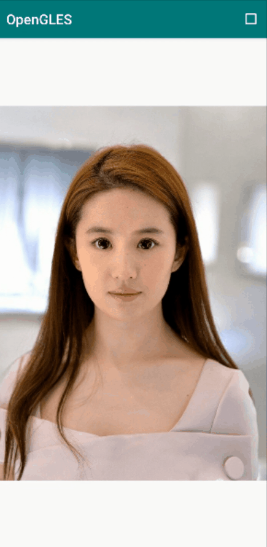
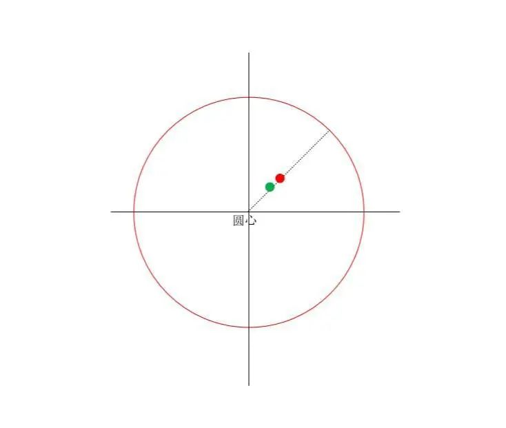
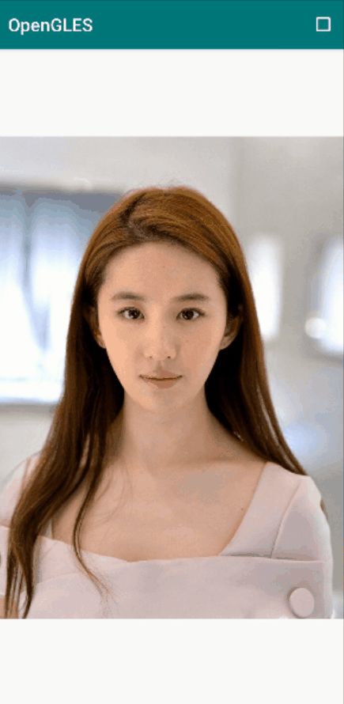
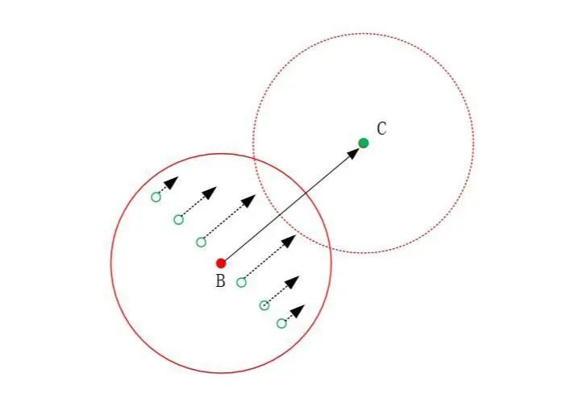
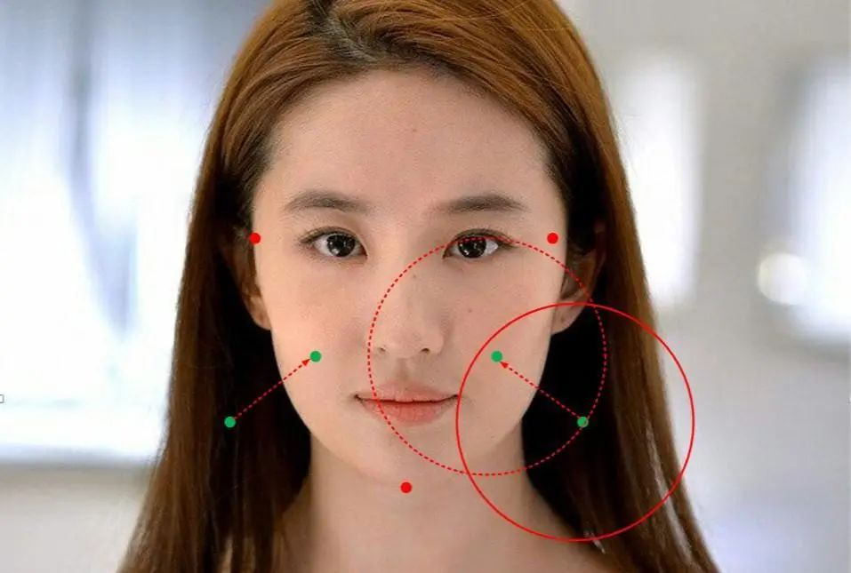

# 瘦脸大眼效果

旧文中我们用[ OpenGL 给小姐姐实现了瘦身和大长腿效果](http://mp.weixin.qq.com/s?__biz=MzIwNTIwMzAzNg==&mid=2654161784&idx=1&sn=e603a953f60d3f48207be1258a88cd25&chksm=8cf3984bbb84115d4021eeac4179d12f2727d07a7d32b3e6ce70b33c4f749cf907a111e7f072&scene=21#wechat_redirect)，结果小姐姐眯着眼睛、嘟着嘴说，我需要瘦身和大长腿效果吗？


笔者若有所思地看着她的眼睛和脸庞，终于弄明白了她需要的是什么效果。


言归正传，无论是实现瘦身大长腿效果，还是实现瘦脸大眼效果，其**本质上都是对图像中某些区域的像素按照我们设定的规则进行移动**，而 OpenGL 的片段着色器天然适合处理像素（纹素）层面的操作。


**OpenGL ES 实现大眼效果**

**
**


大眼效果

为了更好的展示大眼效果，动图中形变参数设置较大，所以看起来比较夸张。


OpenGL 实现大眼效果，可以参照放大镜的实现原理，即将纹理上一块区域采样后映射到一块相对较大的区域。


本文所实现的大眼效果进行了简化，是在以人眼为中心的圆形区域内进行放大，距离圆心越远，放大的强度越大。

大眼效果原理

如上图所示，圆内部为发生形变（放大）的区域，红点为不发生形变时的采样点（原始纹理坐标），绿点为发生形变时对应的采样点（纹理坐标发生偏移）。


实现眼睛放大效果的着色器脚本（代码中指定了图片人眼中心坐标和人眼半径）：


```
#version 300 es
precision highp float;
layout(location = 0) out vec4 outColor;
uniform sampler2D s_TextureMap;
in vec2 v_texCoord;
uniform highp vec2 u_LeftEyeCenterPos;// 左眼中心点
uniform highp vec2 u_RightEyeCenterPos;// 右眼中心点
uniform highp float u_ScaleRatio;//放大系数
uniform highp float u_Radius;// 影响半径
uniform vec2 u_ImgSize;//图片分辨率

vec2 warpEyes(vec2 centerPos, vec2 curPos, float radius, float scaleRatio)
{
    vec2 result = curPos;
    vec2 imgCurPos = curPos * u_ImgSize;
    float d = distance(imgCurPos, centerPos);

    if (d < radius)
    {
        float gamma = 1.0 - scaleRatio * pow(smoothstep(0.0, 1.0, d / radius) - 1.0, 2.0);
        result = centerPos + gamma * (imgCurPos - centerPos);
        result = result / u_ImgSize;

    }
    return result;

}

void main()
{
    vec2 newTexCoord = warpEyes(u_LeftEyeCenterPos, v_texCoord, u_Radius, u_ScaleRatio);
    newTexCoord = warpEyes(u_RightEyeCenterPos, newTexCoord, u_Radius, u_ScaleRatio);
    outColor = texture(s_TextureMap, newTexCoord);
}
```

#  

# **OpenGL ES 实现瘦脸效果**

**
**

瘦脸效果

**瘦脸效果的实现，是将指定区域内的像素按照一定的规则进行整体偏移，从而形成一种对脸部挤压的效果。**

瘦脸效果原理图

如上图所示，BC表示偏移方向和偏移程度的向量，将圆内的所有像素按照向量BC的方向进行一定程度的偏移，像素偏移的强度，和像素与圆心的距离相关，越靠近圆心强度越大。


瘦脸关键点

为了简化计算流程，只做原理性展示，**我们选取 了3 个人脸部位的关键点（如上图，左右太阳穴和下巴），再由关键点计算出来控制点（太阳穴和下巴的连线的中心点），控制点组成上述的 BC 向量。**当然你若想快速验证瘦脸效果，可以直接手动指定。


瘦脸效果的着色器脚本：


```
#version 300 es
precision highp float;
layout(location = 0) out vec4 outColor;
in vec2 v_texCoord;
uniform sampler2D s_TextureMap;
uniform vec2 u_texSize;//图像分辨率
uniform vec4 u_preCtrlPoints;//pre控制点
uniform vec4 u_curCtrlPoints;//cur控制点
uniform float u_reshapeRadius;//影响半径
uniform float u_reshapeRatio;//强度

vec2 face_slender_1(vec2 prePoint, vec2 curPoint, vec2 texCoord, float radius, vec2 texSize)
{
    vec2 pos = texCoord;

    vec2 newSrc = prePoint * texSize;
    vec2 newDst = curPoint * texSize;
    vec2 newTex = texCoord * texSize;
    float newRadius = radius;
    float r = distance(newSrc, newTex);

    if (r < newRadius)
    {
        float alpha = 1.0 -  r / newRadius;
        vec2 displacementVec = (newDst - newSrc) * pow(alpha, 2.0) * 0.002 * u_reshapeRatio;
        pos = (newTex - displacementVec) / texSize;

    }
    return pos;
}

void main() {
    vec2 leftPreCtrl = u_preCtrlPoints.xy;
    vec2 rightPreCtrl = u_preCtrlPoints.zw;

    vec2 leftCurCtrl = u_curCtrlPoints.xy;
    vec2 rightCurCtrl = u_curCtrlPoints.zw;

    vec2 newTexCoord = face_slender_1(leftPreCtrl, leftCurCtrl, v_texCoord, u_reshapeRadius, u_texSize);
    newTexCoord = face_slender_1(rightPreCtrl, rightCurCtrl, newTexCoord, u_reshapeRadius, u_texSize);

    outColor = texture(s_TextureMap, newTexCoord);
}
```


实现代码见阅读原文末尾。