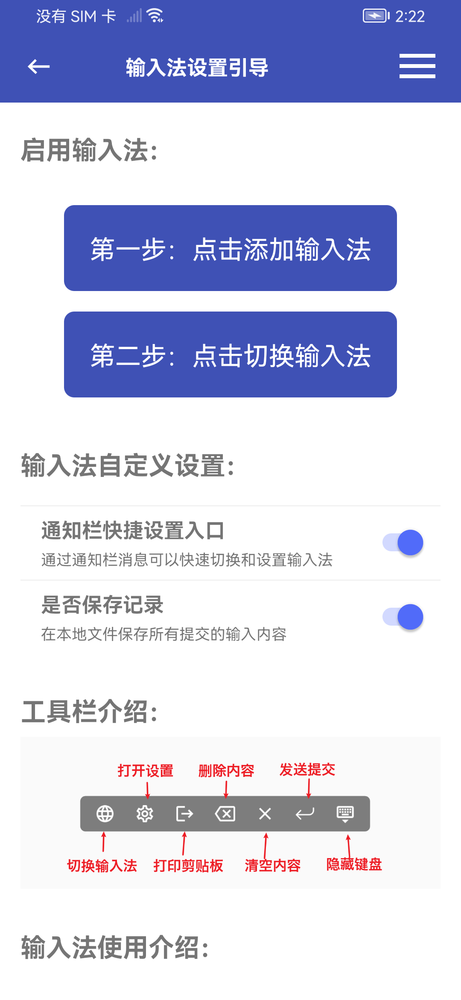

# ADB命令


## Base Command

### 设备类


### adb devices

```
    说明：列出所有连接的设备
    命令： adb devices
            device：此实例正与adb服务器连接。
            no device：如果当前没有模拟器/设备运行，adb则返回   
    事例：` adb devices `
```

## ***adb start-server & adb kill-server\***

```
    说明：start-server：检查是否启动，没有就启动 ； kill-server：如果有运行server，杀掉
    命令：
            adb start-server
            adb kill-server
```

adb kill-server 一般在键入adb shell命令显示device offline或有多个设备的情况下使用 事例：

```
adb start-server` `adb kill-server
```

## ***adb install\***

```
    说明：从本地安装应用到手机
    命令：adb install <apk文件路径>
    事例：` adb install D:/MSDKSample.apk `
```

## ***adb uninstall\***

```
    说明：卸载应用
    命令：
            adb uninstall <包名> ：彻底卸载
            adb shell pm uninstall -k <包名> ：卸载应用但是保留配置和缓存文件，一般本地调试使用。例如构造了数据库等
    事例：
            ` adb uninstall com.example.wegame `
            ` adb shell pm uninstall -k com.example.wegame `
```

## ***adb push\***

```
    说明：从电脑上发送文件到设备
    命令：adb push <本地路径> <设备路径>
           例如： 发送配置文件，例如push
    事例：` adb push D:/a.txt /sdcard/ `
```

## ***adb pull\***

```
    说明：从设备上下载文件到电脑
    命令：adb pull <设备路径> <本地路径>
           例如：本地日志，测试连接adb，不停测试
    事例：` adb pull /sdcard/MSDK/log.dat D:/  `
```

------


# 调试类

## ***adb bugreport\***

```
    说明：会有从开机之后详细的dumpsys,dumpstate和logcat信息，是一份完整的日志记录。
    命令：adb bugreport
           例如：对分析用户行为，异常信息，系统状态有很大的参考作用。时间长，速度慢，要耐心！
    事例：` adb bugreport > D:/bugreport.log `
```

## ***adb logcat\***

```
    说明：日志记录。https://blog.csdn.net/xyz_lmn/article/details/7004710
    命令：adb logcat
        - 过滤日志输出
           ` I/ActivityManager( 585): Starting activity: Intent { action=android.intent.action...} `
            观察列表的前两列，给出的格式是<priority>/<tag>。优先级是“I”，标记是“ActivityManager”：
        - 控制日志格式。只能选一个
            brief — 显示优先级/标记和原始进程的PID (默认格式)
            process — 仅显示进程PID
            tag — 仅显示优先级/标记
            thread — 仅显示进程：线程和优先级/标记
            raw — 显示原始的日志信息，没有其他的元数据字段
            time — 显示日期，调用时间，优先级/标记，PID
            long —显示所有的元数据字段并且用空行分隔消息内容
        - Viewing Alternative Log Buffers
         Android日志系统为日志消息保持了多个循环缓冲区，而且不是所有的消息都被发送到默认缓冲区，可以使用-b 选项指定缓冲区
            radio — 查看包含在无线/电话相关的缓冲区消息
            events — 查看事件相关的消息
            main — 查看主缓冲区 (默认缓冲区)
    事例：` adb logcat WEGAME:E `：不可用
          ` adb logcat *:E `：可用
          ` adb logcat -v time`：可用
          ` adb logcat -d -f /sdcard/log.log`：保存到SDcard
          ` adb logcat > D:/log.log`：保存本地
```


# 命令介绍


## adb shell screencap

说明：

screencap主要是用来进行截屏的操作。截屏结果可以放在指定的位置。

命令：

```
screencap [-hp] [-d display-id] [FILENAME]
  			-h: this message
   			-p: save the file as a png.
   			-d: specify the display id to capture, default 0.
```

事例：

```
adb shell screencap -p /sdcard/screen.png
```

其余说明

目前这种方法比较麻烦，需要3步：

截图保存到sdcard : adb shell screencap -p /sdcard/screen.png

将图片导出 : adb pull /sdcard/screen.png

删除sdcard中的图片: adb shell rm /sdcard/screen.png

可以简单封装一下：

```
adb shell screencap -p /sdcard/screen.png && adb pull /sdcard/screen.png ~/temp/ && adb shell rm /sdcard/screen.png
```

可以使用下面的命令代替

```
adb -s 192.168.0.103:5555 exec-out screencap -p > H:\001.png
```


## adb shell monkey

- **说明：**

  Monkey是Android中的一个命令行工具，可以运行在模拟器里或实际设备中。它向系统发送伪随机的用户事件流(如按键输入、触摸屏输入、手势输入等)，实现对正在开发的应用程序进行压力测试。Monkey测试是一种为了测试软件的稳定性、健壮性的快速有效的方法

- **命令：**

  ```
  adb shell monkey  [options]
      -p 表示对象包，多个包重复使用-p
      –v 表示反馈信息级别（信息级别就是日志的详细程度），总共分3个级别
           –v :日志级别 Level0 缺省值，仅提供启动提示、测试完成和最终结果等少量信息
           –v -v ：日志级别 Level1，提供较为详细的日志，包括每个发送到Activity的事件信息
           –v -v –v ：日志级别 Level 2，最详细的日志，包括了测试中选中/未选中的Activity信息
      –s 表示指定伪随机数生成器的seed值，如果seed相同，则两次Monkey测试所产生的事件序列也相同的。
      具体参照：https://developer.android.com/tools/help/monkey.html
  ```

- **事例：**

  ```
  adb shell monkey -p com.example.wegame 100
  adb shell monkey -p com.example.wegame -p com.example.Mydemo 100 -v
  adb shell monkey -p com.example.wegame 100 -s500 -v
  ```

- **其余说明：**

  ```
  测试的对象仅为应用程序包，有一定的局限性。
  Monky测试使用的事件流数据流是随机的，不能进行自定义。
  可对MonkeyTest的对象，事件数量，类型，频率等进行设置。
  ```

## adb shell getprop

- **说明：**

  getprop就是将配置文件里的信息读取出来并经过整理后，并以字典的形式展示给用户的。

- **命令：**

  ```
  adb shell getprop [key] 
      [key] ：取得对应的key的属性值，不填返回所有配置
      属性分类：
          gsm开头的是移动电话的一些版本信息（软硬件，基带版本等）、所在国家、漫游状态、序列号等一系列与sim相关的信息
          ro开头的是只读属性，一旦赋值不能修改
          sys开头的是系统信息
          persist和ril开头的不知道啥意思
          init.svc手机当前进程的状态（启动的显示running未启动的显示stopped）。进程是否启动是有init.rc文件中定义的
          net开头的是与网络相关的信息，比如dns、主机名、为各功能预留的缓冲区大小
          dhcp.wlan 是网关、IP地址等无线网络相关信息；
          external_sd_path 是外部存储SD卡的路径
          fmradio.driver 是FMradio相关属性
          具体的内容可以参照：https://baike.baidu.com/view/9775823.htm?fr=aladdin
  ```

- **事例：**

  ```
  adb shell getprop qemu.sf.lcd_density
  adb shell getprop
  ```

- **其余说明：**

  ```
  getprop上述属性分类不是手机每项必有，不同的手机命名方式不同。
  ```

## adb shell setprop

- **说明：**

  Dalvik虚拟机支持一系列的命令行参数（使用adbshell dalvikvm –help获取列表），但是不可能通过android应用运行时来传递任意参数，但是可以通过特定的系统参数来影响虚拟机行为。

- **命令：**

  ```
  adb shell setprop [key] [value]
      [key] ：计划设置的属性对应的key值
      [value] ：计划设置的key对应的属性值
  ```

- **事例：**

  ```
  adb shell setprop qemu.sf.lcd_density 320
  ```

- **其余说明：**

  ```
  必须重启android运行时从而使得改变生效（adb shell stop：adb shell start）。这是因为，这些设定在zygote进程中处理，而zygote最早启动并且永远存活。
  如果你不想在设备重启之后特性消失，在/data/local.prop上加一行：
  <name>= <value>（adb shell “echo name =value >> /data/local.prop”）
  重启之后这样的改变也会一直存在，但是如果data分区被擦除了就消失了。
  ```

## adb shell pm

- **说明：**

  pm命令则主要用于管理应用package的管理，有点像控制面板的添加和删除程序。

- **命令：**

  ```
  adb shell pm [list|path|install|uninstall]
      list packages [-f] [-d] [-e] [-u] [FILTER]
      list permission-groups
      list permissions [-g] [-f] [-d] [-u] [GROUP]
      list instrumentation [-f] [TARGET-PACKAGE]
      list features
      list libraries
      path PACKAGE
      install [-l] [-r] [-t] [-i INSTALLER_PACKAGE_NAME] [-s] [-f] PATH
      uninstall [-k] PACKAGE
      clear PACKAGE
  pm enable PACKAGE_OR_COMPONENT
  pm disable PACKAGE_OR_COMPONENT
  pm setInstallLocation [0/auto] [1/internal] [2/external]。
      具体参照：https://developer.android.com/tools/help/adb.html#pm
  ```

- **事例：**

  ```
  adb shell pm uninstall -k com.bihe0832.mydemo
  adb shell pm list packages
  ```

- **其余说明：**

  ```
  暂无
  ```

## adb shell am

- **说明：**

  am命令主要用于管理Activity，例如启动，停止Activity（eclipse在运行Activity就使用了这个命令），发送intent。

- **命令：**

  ```
  adb shell am start [options] <INTENT>
      作用：启动一个activity
      
  adb shell am startservice [options] <INTENT>
      作用：启动一个service
      
  adb shell am force-stop <PACKAGE>
      作用：强制关闭一个应用程序
      
  adb shell am broadcast [options] <INTENT>
      作用：发送一个广播
      
  [options]与<INTENT>具体参照：https://developer.android.com/tools/help/adb.html#am
  ```

- **事例：**

  ```
  adb shell am start -n com.example.wegame/com.example.wegame.MainActivity
  Camera（照相机）的启动方法为：
      adb shell am start -n com.android.camera/com.android.camera.Camera
  Browser（浏览器）的启动方法为：
      adb shell am start -n com.android.browser/com.android.browser.BrowserActivity
  启动浏览器 :
      adb shell am start -a android.intent.action.VIEW -d  https://www.google.cn/
  拨打电话 :
      adb shell am start -a android.intent.action.CALL -d tel:10086
  ```

- **其余说明：**

  ```
  暂无
  ```

## adb shell dumpsys

- **说明：**

  dumpsys命令可以显示手机中所有应用程序的信息，并且也会给出现在手机的状态。该命令用户打印出当前系统信息，默认打印出所有service信息，可以在命令后面加入activity参数，只打印出activity相关的信息。 可跟参数有：SurfaceFlinger, accessibility, account, activity, alarm, appwidget, audio, backup, battery, batteryinfo, bluetooth, bluetooth_a2dp, clipboard, connectivity, content, cpuinfo, device_policy, devicestoragemonitor, diskstats, dropbox, entropy, hardware, hdmi, input_method, iphonesubinfo, isms, location, media.audio_flinger, media.audio_policy, media.camera, media.player, meminfo, mount, netstat, network_management, notification, package, permission, phone, power, search, sensor, simphonebook, statusbar, telephony.registry, throttle, uimode, usagestats, vibrator, wallpaper, wifi, window

- **命令：**

  ```
  adb shell dumpsys activity 显示activity相关的信息，这个是最常用的，可以分析当前栈上的内存信息
  adb shell dumpsys statusbar 显示状态栏相关的信息
  adb shell dumpsys meminfo $package_name or $pid 使用程序的包名或者进程id显示内存信息
  ```

- **事例：**

  ```
  adb shell dumpsys activity activities
  ```

- **其余说明：**

  ```
  这个命令相关的内容，通过这个命令实现很多有用的小应用和很多功能的测试，可以在使用中不断积累一些特殊的用法
  ```


## ADB命令系列之 adb shell input（Android模拟输入）简单总结

##### 「 终端开发 」 ——  2015年06月02日

### [[本文结构\]](javascript:;)

------

最近开发一个新的接口，在调试的时候要手动输入蛮多参数，关键是参数又都太长，就专门看了下 adb 有木有模拟输入，果然adb shell里是有的。这样以后开发调试、自动化测试等就更加方便了。专门简单总结下：

## 相关文章

- ADB命令系列之 Base Command：https://blog.bihe0832.com/adb-base.html

  ```
  重点介绍一些基本的adb命令，例如devices，start-server，kill-server，install，uninstall，push，pull，bugreport，logcat等。
  ```

- ADB命令系列之 Advanced Command：https://blog.bihe0832.com/adb-advanced.html

  ```
  重点介绍一些相对比较复杂的adb命令，主要是adb shell 相关的。例如screencap，monkey，getprop，setprop，pm，am，dumpsys等。
  ```

- ADB命令系列之 adb shell input：https://blog.bihe0832.com/adb-shell-input.html

  ```
  重点介绍adb shell input的用法，包括怎么输入内容，怎么模拟按键，模拟屏幕滑动等各种输入模拟。
  ```

- ADB命令系列之 再说ADB：https://blog.bihe0832.com/review_adb.html

  ```
  重点结合使用场景介绍ADB 的使用，例如解锁手机、截屏、Monkey点击、获取厂商机型等
  ```

- ADB命令系列之 ADB快捷输入法：https://blog.bihe0832.com/input.html

  ```
  主要解决 ADB hell input 无法输入中文的问题
  ```

## 简介

input可以用来模拟各种输入设备的输入操作。

### 命令说明

```
  Usage: input [<source>] <command> [<arg>...]

  The sources are:
        trackball
        joystick
        touchnavigation
        mouse
        keyboard
        gamepad
        touchpad
        dpad
        stylus
        touchscreen

  The commands and default sources are:
        text <string> (Default: touchscreen)
        keyevent [--longpress] <key code number or name> ... (Default: keyboard)
        tap <x> <y> (Default: touchscreen)
        swipe <x1> <y1> <x2> <y2> [duration(ms)] (Default: touchscreen)
        press (Default: trackball)
        roll <dx> <dy> (Default: trackball)
```

### 部分参数说明

1. source对应各种输入源。一般开发中都是用默认值即可。也就是说一般使用中我们的参数中并没有source。
2. `输入命令中text 和 keyevent是通用的；tap和swipe适用于触摸屏；而press和roll用于有触摸球的设备，由于使用的很少，因此不做说明。`

## 模拟输入文本（text）

### 用法与事例

主要用于在输入框中输入内容。命令很简单。例如：

```
adb shell input text "hello,world"
```

### 注意事项

1. **使用的前提是当前要输入的位置已经获得了焦点。**
2. 特殊字符的输入：adb shell input text中空格、’'、&都是有特殊含义的特殊字符，无法直接输入，要想输入只能使用keyevent。
3. 输入过程中左移右移、删除等都需要使用keyevent。

## 模拟按键(keyevent)

### 用法与事例

主要用于模拟键盘的输入，因此是在用键盘的地方才用得到。例如：

```
adb shell input keyevent 67
```

### 常用按键：

| 按键键码 | 功能       | 对应Android定义KeyEvent |
| :------: | ---------- | ----------------------- |
|    1     | 按menu键   | KEYCODE_MENU            |
|    3     | 按home键   | KEYCODE_HOME            |
|    4     | 按back键   | KEYCODE_BACK            |
|    21    | 光标左移   | KEYCODE_DPAD_LEFT       |
|    22    | 光标右移   | KEYCODE_DPAD_RIGHT      |
|    67    | 按删除按钮 | KEYCODE_DEL             |

### 完整按键键码查询

http://developer.android.com/reference/android/view/KeyEvent.html

## 模拟屏幕滑动（swipe）

### 用法与事例

主要用于模拟手指在屏幕的滑动。例如：

```
adb shell input swipe 0 20 300 500 #意思从屏幕(0,20)滑动到(300,500)
```

### 参数含义

1. 四个参数，分别是其实位置的横竖坐标和结束位置的横竖坐标
2. 参数的意思是模拟在屏幕上的直线滑动
3. 参数可以正值，可以负值

## 模拟屏幕轻触（tap）

### 用法与事例

主要用于模拟手指在屏幕的轻触点击。例如：

```
adb shell input tap 100 400
```

### 参数含义

1. 两个参数，先横后竖
2. 参数的意思是模拟在屏幕上点击的位置。


## ADB命令系列之再说ADB

##### 「 终端开发 」 ——  2015年07月10日

### [[本文结构\]](javascript:;)

------

之前其实已经写过好几篇过于adb的文档了，而且基本上说的已经比较全了。奈何adb就是这么好用，而且就是这么强大，因此今天再对一些开发者使用很频繁但是之前说的并不详细的内容进一步说明下。（其实主要是把一些常用的命令列一下）

### 相关文章

之前已经写过三篇关于ADB的文章了，也在这里汇总一下。算作大纲吧。

- ADB命令系列之 Base Command：https://blog.bihe0832.com/adb-base.html

  ```
  重点介绍一些基本的adb命令，例如devices，start-server，kill-server，install，uninstall，push，pull，bugreport，logcat等。
  ```

- ADB命令系列之 Advanced Command：https://blog.bihe0832.com/adb-advanced.html

  ```
  重点介绍一些相对比较复杂的adb命令，主要是adb shell 相关的。例如screencap，monkey，getprop，setprop，pm，am，dumpsys等。
  ```

- ADB命令系列之 adb shell input：https://blog.bihe0832.com/adb-shell-input.html

  ```
  重点介绍adb shell input的用法，包括怎么输入内容，怎么模拟按键，模拟屏幕滑动等各种输入模拟。
  ```

- ADB命令系列之 再说ADB：https://blog.bihe0832.com/review_adb.html

  ```
  重点结合使用场景介绍ADB 的使用，例如解锁手机、截屏、Monkey点击、获取厂商机型等
  ```

- ADB命令系列之 ADB快捷输入法：https://blog.bihe0832.com/input.html

  ```
  主要解决 ADB hell input 无法输入中文的问题
  ```

### 常用命令

这里是根据我的开发环境使用的一些常用命令，具体使用根据自己的环境修改路径或者包名即可。

#### 解锁手机：

```
adb shell input keyevent 26 && adb shell input swipe 250 250 800 800
```

#### 截屏：

```
adb shell screencap -p /sdcard/screen.png && adb pull /sdcard/screen.png /tmp/ && adb shell rm /sdcard/screen.png && open file:/tmp/screen.png
```

#### Monkey点击

```
adb shell monkey -p com.example.agsdkdemo 10000 -s500 -v
```

#### 自动化测试

```
adb shell am instrument -w com.example.agsdkdemo.test/android.test.InstrumentationTestRunner
```

#### 获取厂商机型等

```
adb shell getprop | grep product
```

#### 根据APK获取应用包名、权限配置等信息(配合grep)

```
$ANDROID_HOME/build-tools/android-4.4/aapt d badging
```

#### 直接拉起应用

```
adb shell am start -n com.example.wegame/com.example.wegame.MainActivity
```

#### 退出应用

```
adb shell am force-stop com.example.wegame
```

#### 模拟输入

- 空格：adb shell input keyevent 62
- 删除：adb shell input keyevent 67
- MENU：adb shell input keyevent 1
- HOME：adb shell input keyevent 2
- back：adb shell input keyevent 3
- 字符：adb shell input text ‘hello,world’


## ADB快捷输入法 - AAF

##### 「 玩一玩 」 ——  2023年02月27日

### [[本文结构\]](javascript:;)

------

## ADB快捷输入法

关于 ADB 快捷输入法的详细使用方法及下载方法等，可以前往[https://android.bihe0832.com/doc/summary/samples.html#adb-%E5%BF%AB%E6%8D%B7%E8%BE%93%E5%85%A5](https://android.bihe0832.com/doc/summary/samples.html#adb-快捷输入)

### 应用简介

一款基于ADB的，可以通过电脑快速输入中文等信息的快捷输入法，主要解决ADB命令无法输入中文的问题

更多信息可以点击链接：https://android.bihe0832.com/doc/summary/samples.html

### 应用截图



### 应用下载

[点击下载到本地](https://android.bihe0832.com/app/release/ZINPUT_official.apk)


### 输入方法

详细快捷输入命令事例可以参考：https://github.com/bihe0832/Settings-Tools/blob/master/config/mac/.zshrc

- 简单文本输入：主要用于简单的中文输入，一次即可完成输入

  `adb shell am broadcast -a ZIXIE_ADB_INPUT_TEXT --es msg DATA`

  其中DATA就是你要输入的内容

- 复杂文本输入：主要对于有特殊符号等的文本输入，要先输入命令，再输入内容

  `echo "请输入你要通过 ADB 输入内容的原文" && read input && content=$( base64 <<< $input ) && adb shell am broadcast -a ZIXIE_ADB_INPUT_BASE64 --es msg $content`

  命令结束后输入原文，自动完成转码和输入

- 自动发送：

  `adb shell input keyevent 66`

- shell 切换到当前输入法

  ```
    fun zixieadbinputchangetozixieinput(){
        # 获取当前输入法包名
        current_ime=$(adb shell settings get secure default_input_method | tr -d '\r')
        echo "$current_ime"
  	
        # 判断输入法是否为指定的包名
        if [[ "$current_ime" != "com.bihe0832.adb.input/com.bihe0832.android.base.adb.input.ZixieIME" ]]; then
            echo "$current_ime"
            adb shell ime set com.bihe0832.adb.input/com.bihe0832.android.base.adb.input.ZixieIME && sleep 2
        fi
    }
  ```

### 相关文章

- ADB命令系列之 Base Command：https://blog.bihe0832.com/adb-base.html

重点介绍一些基本的adb命令，例如devices，start-server，kill-server，install，uninstall，push，pull，bugreport，logcat等。

- ADB命令系列之 Advanced Command：https://blog.bihe0832.com/adb-advanced.html

重点介绍一些相对比较复杂的adb命令，主要是adb shell 相关的。例如screencap，monkey，getprop，setprop，pm，am，dumpsys等。

- ADB命令系列之 adb shell input：https://blog.bihe0832.com/adb-shell-input.html

重点介绍adb shell input的用法，包括怎么输入内容，怎么模拟按键，模拟屏幕滑动等各种输入模拟。

- ADB命令系列之 再说ADB：https://blog.bihe0832.com/review_adb.html

重点结合使用场景介绍ADB 的使用，例如解锁手机、截屏、Monkey点击、获取厂商机型等

- ADB命令系列之 ADB快捷输入法：https://blog.bihe0832.com/input.html

主要解决 ADB hell input 无法输入中文的问题

------