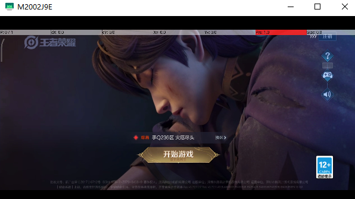
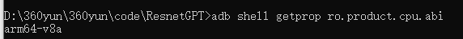
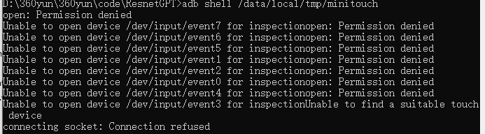
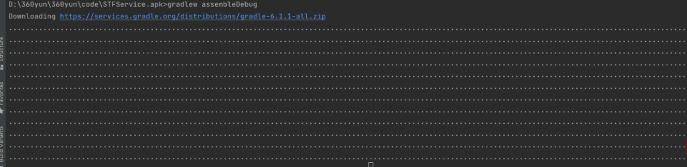
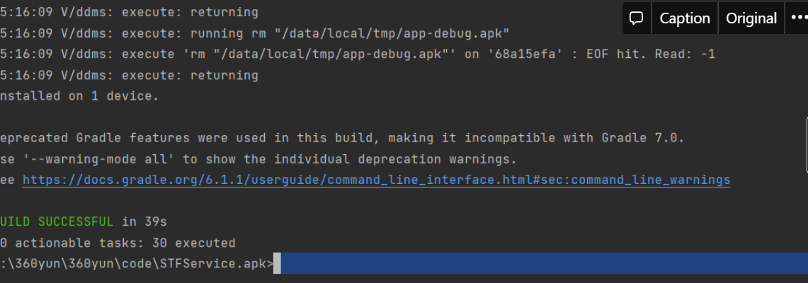
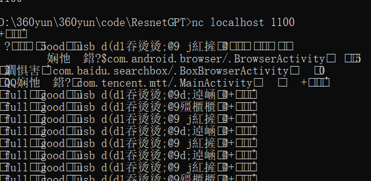
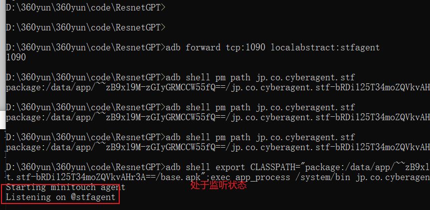
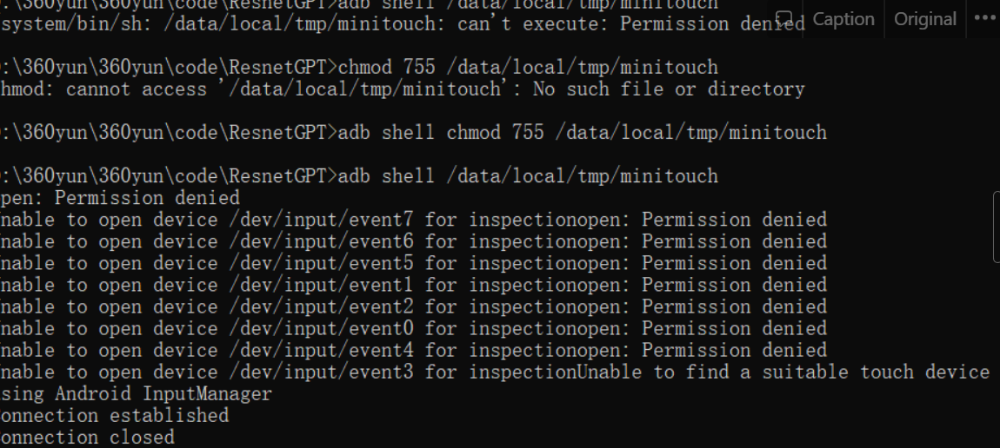
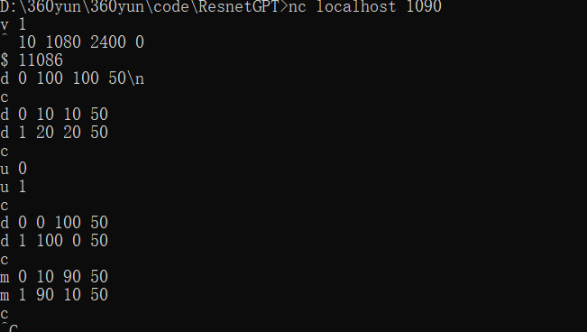
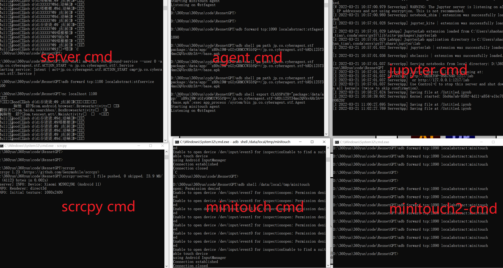

# 安卓11平台搭建minitouch环境

关于minitouch在安卓11上的环境搭建！

## 安装环境

### 安装前准备

- 下载 Android studio 软件，点击[这里下载](https://developer.android.com/studio/?gclid=CjwKCAjwoduRBhA4EiwACL5RP5qYHxLP4VZk5Z0b-GOupalpEN7kt6tX0K9fitiLQwM8bOoo0141MxoCba0QAvD_BwE&gclsrc=aw.ds#downloads)
- 下载 STFService.apk，下载 [github 项目](https://github.com/openstf/STFService.apk#running-the-service)
- 下载 [NDK](https://developer.android.com/ndk/downloads) ，进行环境变量配置
- 下载 [netcat](https://eternallybored.org/misc/netcat/) ，进行环境变量配置（建议下载 1.11）

### 设备参数

- 操作系统：Windows10
- Android 版本：11
- 手机型号：小米 10 青春版
- MIUI 版本：MIUI 12.5.9
- 手机分辨率：2400*1080
- JVAV 版本：java 11.0.13 2021-10-19 LTS

## 安装 scrcpy

- 具体可以阅读 [scrcpy 文档](https://github.com/Genymobile/scrcpy) ，这里我直接下载`zip包`并解压进入`cmd`窗口

- 使得手机进入调试状态

  - 小米手机进入我的设备——>全部参数——>连续点击 MIUI 版本直至出现**您已处于开发者模式无，无需进行此操作**
  - 进入设置——>更多设置——>开发者选项——>打开：
    - USB 调试
    - USB 安装
    - USB 调试（安全设置）
    - 指针位置
  - 关闭 MIUI 优化

- 输入

  ```fallback
  adb devices
  ```

  查看你的设备是否连接成功，如果未连接成功，大概有一下几点原因及解决方法：

  - 数据线有问题（能充电不代表就可以连接 usb 调试）
  - USB 接口不匹配
  - 安装更新驱动

- 输入`scrcpy`就可以将手机投屏到电脑



## 安装 pyminitouch

```python
## 关于conda
conda create -n game python=3.8
conda activate game

## 安装第三库方
torch # 我使用conda安装的1.8.0
torchvision
pynput
pyminitouch
```

## adb 安装 minitouch

- 将 minitouch 的 [github 项目](https://github.com/DeviceFarmer/minitouch) clone 到本地

- 进入项目根目录，运行以下命令，你将得到一个`libs`文件，我这里将 libs 文件压缩，上传到我的阿里云，需要的[**点击这里**](https://cdn.jsdelivr.net/gh/ShaohanTian/MyBlog/img/blog_file/libs.zip) 自取，解压到包含 adb.exe 文件同一个路径

  - git submodule init
  - git submodule update
  - ndk-build

- 通过运行`adb shell getprop ro.product.cpu.abi`查找你的设备支持的 ABI，我的是 arm64-v8a

  

- 使用`adb push libs/arm64-v8a/minitouch /data/local/tmp/`将 minitouch 推送到手机

- 最后使用`adb shell /data/local/tmp/minitouch`进行验证，显示下图则表示正常

  

## Android studio (简称 AS) 安装 apk

- 用 AS 打开 github 下载文件，让其自动下载，速度很慢，解决方法可以参考[这里](https://blog.csdn.net/weixin_38858037/article/details/114907925)

- 打开命令行，windows 运行`gradlew assembleDebug`,下载很慢，需要耐心的等待（我下载开了加速）

  

- AS 运行`gradlew installDebug`显示安装成功，进入手机设置查看应用管理

  

## 启动相关服务

### 启动 server

- 参考这个 [issue](https://github.com/openstf/stf/issues/1040) 运行`adb shell am start -n jp.co.cyberagent.stf/.IdentityActivity`以及 `adb shell am startservice -n jp.co.cyberagent.stf/.Service`先启动 apk

  

- 接着运行`adb shell am start-foreground-service --user 0 -a jp.co.cyberagent.stf.ACTION_START -n jp.co.cyberagent.stf/.Service`

- 接着运行`adb forward tcp:1100 localabstract:stfservice`和`nc localhost 1100`,可能会出现乱码，但是不影响后续进行

  

### 启动 agent

- adb forward tcp:1090 localabstract:stfagent
- 将`adb shell pm path jp.co.cyberagent.stf`命令输出替换到下一行命名黄色字体
- adb shell export CLASSPATH="package:/data/app/~~zB9xl9M-zGIyGRMCCW55fQ==/jp.co.cyberagent.stf-bRDi125T34moZQVkvAHr3A==/base.apk";exec app_process /system/bin jp.co.cyberagent.stf.Agent



### 启动 minitouch

- 我在输入`adb shell /data/local/tmp/minitouch`时候，权限无法获取，输入`adb shell chmod 755 /data/local/tmp/minitouch`解决

  

- 接着运行`adb shell /data/local/tmp/minitouch`出现 **using Android InputManager**

### 启动 minitouch-2

- adb forward tcp:1090 localabstract:minitouch

- nc localhost 1090

- 输入 socket 相关指令就可以，下图为输入指令以及对应界面相应

  

  

## 📖 参考文献

1. [GitHub - DeviceFarmer/minitouch: Minimal multitouch event producer for Android.](https://github.com/DeviceFarmer/minitouch)
2. [GitHub - williamfzc/pyminitouch: python wrapper of minitouch, for better experience](https://github.com/williamfzc/pyminitouch)
3. [MIUI 12 折腾 minitouch，windows10 环境_CrazyU 的博客-CSDN 博客_minitouch](https://blog.csdn.net/CrazyU/article/details/121188232)
4. [GitHub - openstf/STFService.apk: Monitor and perform various actions on your Android device. Not meant for actual user devices.](https://github.com/openstf/STFService.apk#running-the-service)
5. [Android 开发文档](https://developer.android.com/studio/build/building-cmdline)

## 编写 python 用 socket 传递信息

💡 现在存在的问题是，我如何自动化地将 socket 信息传递到 tcp:1090。当我直接调用 pyminitouch 时，一直报错，在这里我手动先编写了传递 socket 字节的 python 代码：

```python
import socket
import time
import sys
from pyminitouch.utils import str2byte

content = "d 0 500 500 50\\nc\\nd 1 500 600 50\\nw 5000\\nc\\nu 0\\nu 1\\nc\\n"
HOST = '127.0.0.1'
PORT = 1090

sock = socket.socket(socket.AF_INET, socket.SOCK_STREAM)
sock.connect((HOST, PORT))
sock.sendall(str2byte(content))
time.sleep(0.5)
sock.shutdown(socket.SHUT_WR)

res = ''

while True:
    data = sock.recv(1024)
    if (not data):
        break
    res += data.decode()

print(res)
print('closed')
sock.close()
```

- 在运行这个程序之前我们需要查看 minitouch cmd 是否为下图所示，如果是需要`ctrl+c`停止程序运行，继续输入`adb shell /data/local/tmp/minitouch`直到尾行出现**using Android InputManager**

  

- 在此进入 minitouch2 cmd，输入`adb forward tcp:1090 localabstract:minitouch`，**不要输入**`nc localhost 1090`

- 程序运行结果如下图

  

  

## 总结一下（需启动 6 个 cmd 窗口）



- server cmd
  - `adb shell am start-foreground-service --user 0 -a jp.co.cyberagent.stf.ACTION_START -n jp.co.cyberagent.stf/.Service`
  - `adb forward tcp:1100 localabstract:stfservice`
  - `nc localhost 1100`
- agent cmd
  - `adb forward tcp:1090 localabstract:stfagent`
  - 将`adb shell pm path jp.co.cyberagent.stf`命令输出替换到下一行标记字体
  - `adb shell export CLASSPATH="`package:/data/app/~~zB9xl9M-zGIyGRMCCW55fQ==/jp.co.cyberagent.stf-bRDi125T34moZQVkvAHr3A==/base.apk`";exec app_process /system/bin jp.co.cyberagent.stf.Agent`
- minitouch cmd
  - 输入`adb shell /data/local/tmp/minitouch`时候，权限若无法获取，输入`adb shell chmod 755 /data/local/tmp/minitouch`解决
  - 接着运行`adb shell /data/local/tmp/minitouch`出现 using Android InputManager
- minitouch-2 cmd
  - `adb forward tcp:1090 localabstract:minitouch`
  - `nc localhost 1090`*(cmd 框直接输入指令的时候需要执行，使用 python 代码传递不需要输入)*
  - cmd 窗口直接输入 socket 相关指令
- scrcpy cmd
  - 输入`scrcpy`即可
- jupyter cmd
  - 输入`jupyter lab`即可


