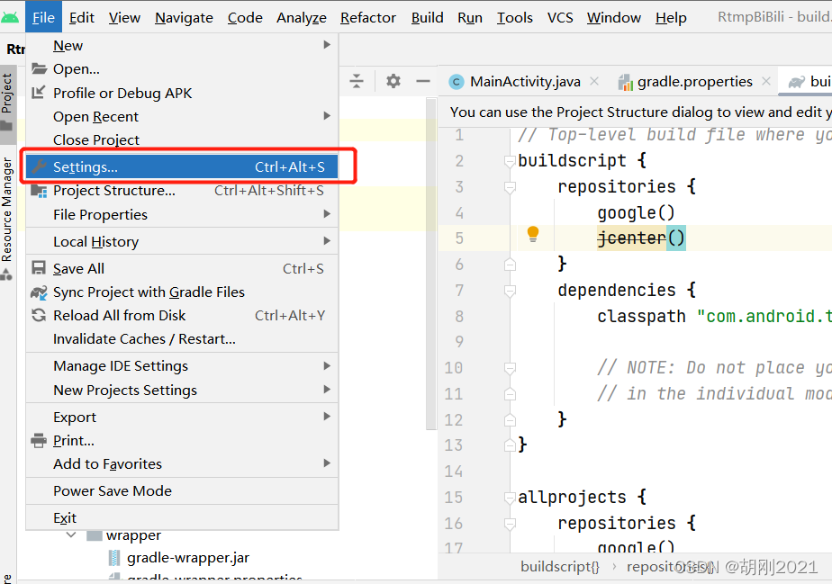
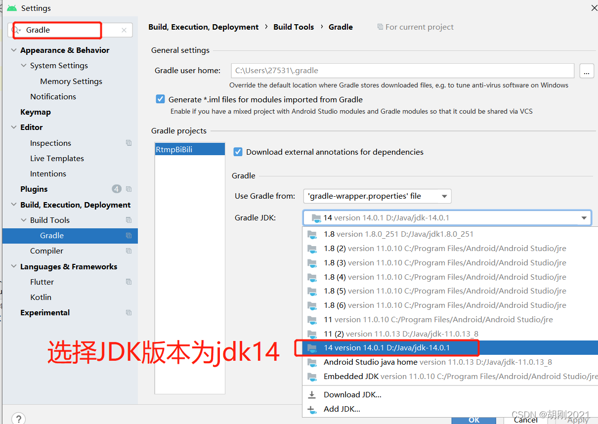
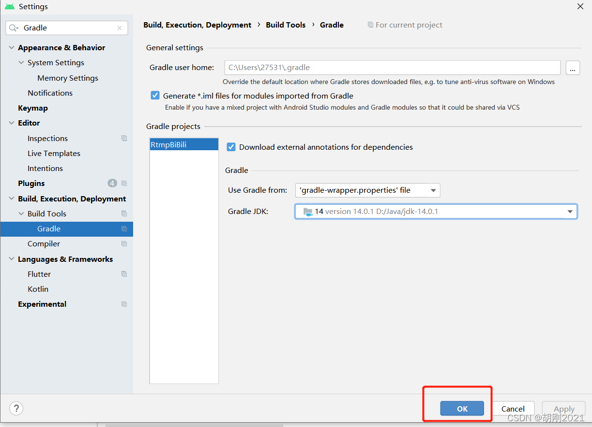
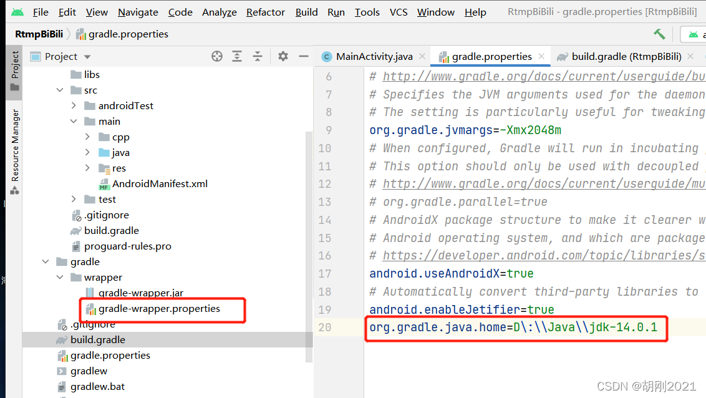
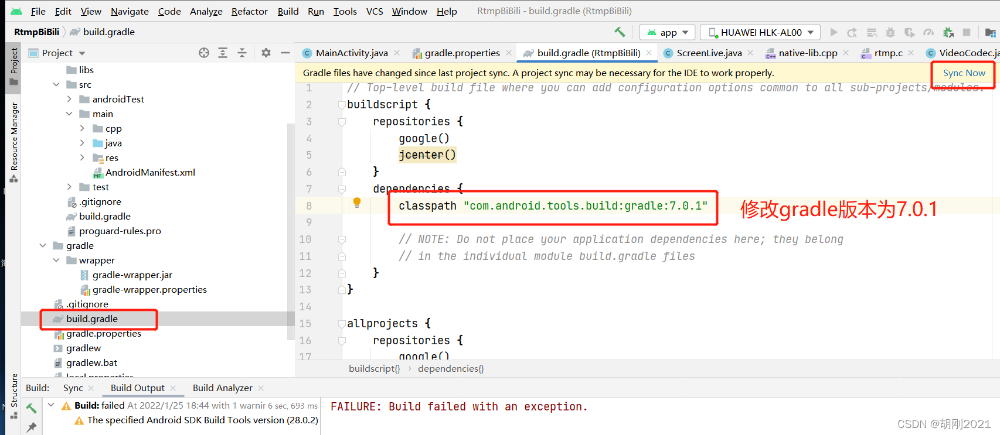

Android 报错：Execution failed for task ‘:app:compileDebugJavaWithJavac‘

```
FAILURE: Build failed with an exception.

* What went wrong:
Execution failed for task ':app:compileDebugJavaWithJavac'.
> Failed to query the value of task ':app:compileDebugJavaWithJavac' property 'options.generatedSourceOutputDirectory'.
   > Querying the mapped value of map(java.io.File property(org.gradle.api.file.Directory, fixed(class org.gradle.api.internal.file.DefaultFilePropertyFactory$FixedDirectory, D:\RtmpBiBili\app\build\generated\ap_generated_sources\debug\out)) org.gradle.api.internal.file.DefaultFilePropertyFactory$ToFileTransformer@7ae973c8) before task ':app:compileDebugJavaWithJavac' has completed is not supported

* Try:
Run with --stacktrace option to get the stack trace. Run with --info or --debug option to get more log output. Run with --scan to get full insights.
```


原因是 android studio配置的 jdk版本 和 gradle版本不对导致的
1.修改jdk版本








2.配置jdk的路径
此路径下面要有jdk的bin文件夹




3.修改gradle版本为7.0.1



4.将项目clean 重新build即可