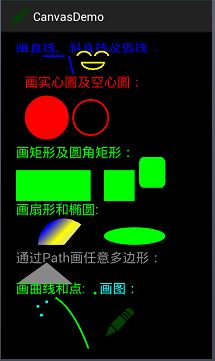

# Canvas绘制2D图形

Canvas绘制点、圆、直线、路径、椭圆、多边形等2D图形
一个成功的APP离不开优秀的UI，像墨迹天气等其他APP的一些精彩特效，仅仅依靠系统自带的UI组件是绝不可能实现。所以Android提供了另一种构造UI组件的方式——通过画布Canvas自己绘画，不夸张地说“只有想不到，没有做不到”配以各种动画效果就能实现。

## 一 Canvas的概述

Android的2D绘图引擎是通过SKia（Skia源码现在可以到Googlecode里下载）实现的，通过Canvas可以绘制基本几何图形点、直线、弧、圆、椭圆、文字、矩形、多边形、曲线、圆角矩形、图等。所谓画布就相当于绘画时的画纸，而画笔在Android中则是Paint对象。我们在Android中使用Canvas也很简单，构造Canvas对象就得到了“画纸”，构造Paint对象就得到了“画笔”，然后drawXxxx系列方法中的参数就是确定大小、边界等等。


## 二 Canvas对象和Paint对象

1 Canvas对象
1.1 Canvas的构造方法
1.1.1 默认的构造方法：Canvas()
1.1.2 通过Bitmap 构造Canvas(Bitmap bitmap)
1.1.3 通过GL接口构造Canvas(GL gl)
1.2 Canvas的一些常用的成员方法
1.2.1 绘制DrawXxxx系列（Xxxx代表Arc、Line、Text、RoundRect、Bitmap、Points等）

绘制弧形drawArc(RectF oval, float startAngle, float sweepAngle, boolean useCenter, Paint paint) 其中RectF(float left, float top, float right, float bottom) 定义边界，参数二起始角度即起点和水平线连成的角度大小，参数三ture画扇形，false话弧形，参数四画刷对象

绘制位图 drawBitmap(Bitmap bitmap, float left, float top, Paint paint) 、绘制并变换的位图 drawBitmap(Bitmap bitmap, Matrix matrix, Paint paint)主要是通过矩阵对象Matrix来实现大小、旋转变化等

绘制 圆形drawCircle(float cx, float cy, float radius, Paint paint),参数里定义里的是圆心的坐标(cx,cy)和半径radius

绘制直线drawLine(float startX, float startY, float stopX, float stopY, Paint paint) 、绘制多条直线 drawLines(float[] pts, int offset, int count, Paint paint)

绘制点 drawPoint(float x, float y, Paint paint) 、绘制多点drawPoints(float[] pts, int offset, int count, Paint paint)

绘制文本 drawText(String text, float x, float y, Paint paint)，参数里定义的是绘制的起点坐标(x,y)

绘制矩形drawRect(float left, float top, float right, float bottom, Paint paint)和圆角矩形drawRoundRect(RectF rect, float rx, float ry, Paint paint) ,参数里定义的是左上顶点坐标为（left，top），右下顶点为(right,bottom)的矩形，比如(150, 10, 200, 60)表示一个左上顶点坐标为(150,10),右下顶点为(200,60)的矩形。


1.2.2 得到画布中的各种对象getXxxx系列
得到画布对应的矩阵副本Matrix getMatrix() 、void getMatrix(Matrix ctm)
得到当前图层的宽度、高度getHeight()、getWidth()
得到裁剪的边界Rect getClipBounds() 、void getClipBounds(Rect bounds)
1.2.3 保存和恢复画布
保存当前的矩阵和裁剪边界到栈中int save()、int save(int saveFlags)
恢复画布 void restore()、void restoreToCount(int saveCount)
2 Paint对象
2.1 Paint的构造方法
2.1.1 默认的构造方法：Paint()
1.1.2 构造带flag的Paint(int flags)
1.1.3 通过另一个Paint对象构造Paint(Paint paint)
2.2 设置笔刷的属性
设置抗锯齿功能paint.setAntiAlias(boolean b)
设置颜色paint.setColor(int color)
设置填充样式paint.setStyle(Paint.Style style)，其中Paint.Style是Paint中的一个枚举，Paint.Style.FILL :填充内部
Paint.Style.FILL_AND_STROKE ：填充内部和描边
Paint.Style.STROKE ：仅描边
设置宽度setStrokeWidth(float width)
设置阴影setShadowLayer(float radius, float dx, float dy, int color) radius:阴影的倾斜度，dx:水平位移，dy:垂直位移
设置下划线 setUnderlineText(booleanunderlineText)
设置文本缩放倍数，1.0f为原始 setTextScaleX(float scaleX)
设置字体大小setTextSize(float textSize)
三 一些绘图的辅助类
1 矩形区域Rect和RectF
Rect(int left, int top, int right, int bottom) ，可以看成以屏幕的左上角（0,0）处为原点，左上角的坐标是(left,top),右下角的坐标(right,bottom)，通过上下左右的坐标来表示一个矩形。这些坐标值属性可以被直接访问，用width()和 height()方法可以获取矩形的宽和高。注意：大多数方法不会检查这些坐标分类是否错误（也就是left<=right和top<=bottom）

```
/**
*@parm left:矩形左边的X坐标
*@parm top:矩形顶部的Y坐标
*@parm right:矩形右边的X坐标
*@parm bottom:矩形的顶部的Y坐标
*/
Rect(int left, int top, int right, int bottom) 
```

1. Rect(Rect r)
2. RectF(int left, int top, int right, int bottom)和 RectF(RectF f)


2 矩阵Matrix
Matrix是一个3 x 3的矩阵，他对图片的处理分为四个基本类型：
平移变换Translate、缩放变换Scale、旋转变换Rotate、错切变换Skew。在Android的API里对于每一种变换都提供了三种操作方式：set（用于设置Matrix中的值）、post（后乘，根据矩阵的原理，相当于左乘）、pre（先乘，相当于矩阵中的右乘）。默认时，这四种变换都是围绕（0，0）点变换的，当然可以自定义围绕的中心点，通常围绕中心点。

首先说说平移，在对图片处理的过程中，最常用的就是对图片进行平移操作，该方法为setTranslate()，平移意味着在x轴和y轴上简单地移动图像。setTranslate方法采用两个浮点数作为参数，表示在每个轴上移动的数量。第一个参数是图像将在x轴上移动的数量，而第二个参数是图像将在y轴上移动的数量。在x轴上使用正数进行平移将向右移动图像，而使用负数将向左移动图像。在y轴上使用正数进行平移将向下移动图像，而使用负数将向上移动图像。

再看缩放，Matrix类中另一个有用的方法是setScale方法。它采用两个浮点数作为参数，分别表示在每个轴上所产生的缩放量。第一个参数是x轴的缩放比例，而第二个参数是y轴的缩放比例。如：1.0表示原来的大小，matrix.setScale(1.5f,1);

比较复杂的就是图片的旋转了，内置的方法之一是setRotate方法。它采用一个浮点数表示旋转的角度。围绕默认点(0,0)，正数将顺时针旋转图像，而负数将逆时针旋转图像，其中默认点是图像的左上角，如：
Matrix matrix = new Matrix();
matrix.setRotate(15);

另外，也可以使用旋转的角度及围绕的旋转点作为参数调用setRotate方法。选择图像的中心点作为旋转点，如：
matrix.setRotate(15,bmp.getWidth()/2,bmp.getHeight()/2);

一个特别有用的方法对是setScale和postTranslate，它们允许跨单个轴(或者两个轴)翻转图像。如果以一个负数缩放，那么会将该图像绘制到坐标系统的负值空间。由于(0,0)点位于左上角，使用x轴上的负数会导致向左绘制图像。因此我们需要使用postTranslate方法，将图像向右移动，如：matrix.setScale(-1, 1);
matrix.postTranslate(bmp.getWidth(),0);
可以在y轴上做同样的事情，翻转图像以使其倒置。通过将图像围绕两个轴上的中心点旋转180°，可以实现相同的效果，如
matrix.setScale(1, -1);
matrix.postTranslate(0, bmp.getHeight());
四Canvas的应用
1 使用Canvas的步骤
新建一个类继承View，（因为我们要自由的显示任意绘制东西，而View的界面效果是由OnDraw方法决定，onDraw返回什么，这个视图就显示什么效果）
重写onDraw，在OnDraw中完成Paint对象的初始化，调用对应的drawXxx系列方法
把我们自定义的View添加到Activity中，显示出来。
2 实例中使用Canvas

```
package cmo.learn.ui;

import android.content.Context;
import android.graphics.Bitmap;
import android.graphics.BitmapFactory;
import android.graphics.Canvas;
import android.graphics.Color;
import android.graphics.LinearGradient;
import android.graphics.Paint;
import android.graphics.Path;
import android.graphics.RectF;
import android.graphics.Shader;
import android.view.View;

public class DrawGeometryView extends View {

    public DrawGeometryView(Context context) {
        super(context);
    }

    @Override
    protected void onDraw(Canvas canvas) {
        super.onDraw(canvas);
        /**
         * 方法 说明 drawRect 绘制矩形 drawCircle 绘制圆形 drawOval 绘制椭圆 drawPath 绘制任意多边形
         * drawLine 绘制直线 drawPoin 绘制点
         */
        // 创建笔刷
        Paint p = new Paint();
        p.setColor(Color.BLUE);
        p.setStrokeWidth(4.0f);
        p.setTextSize(30f);

        canvas.drawText("画直线、斜直线及弧线：", 10, 20, p);// 画文本
        canvas.drawLine(70, 30, 120, 30, p);// 画线
        canvas.drawLine(130, 30, 140, 70, p);// 斜线

        p.setColor(Color.RED);
        canvas.drawText("画实心圆及空心圆：", 30, 100, p);//参数里定义是绘制文字的起点坐标
        canvas.drawCircle(80, 170, 50, p);// 画圆，圆心的坐标(cx,cy)和半径radius
        p.setStyle(Paint.Style.STROKE);//设置空心
        canvas.drawCircle(180, 170, 40, p);// 画圆

        //画弧线
        p.setColor(Color.YELLOW);
        p.setStyle(Paint.Style.STROKE);//设置空心
        RectF rectf=new RectF(150,20,180,40);
        canvas.drawArc(rectf, 180, 180, false, p);
        rectf.set(190, 20, 220, 40);
        canvas.drawArc(rectf, 180, 180, false, p);
        rectf.set(160, 30, 210, 60);
        canvas.drawArc(rectf, 0, 180, true, p);

        p.setColor(Color.GREEN);
        p.setStyle(Paint.Style.FILL);//设置填满
        canvas.drawText("画矩形及圆角矩形：", 10, 260, p);

        canvas.drawRect(10, 360, 180, 290, p);// 长方形，长是right-left，宽是bottom-top
        canvas.drawRect(210, 360, 280, 290, p);// 正方形，长是right-left，宽是bottom-top

        canvas.drawRoundRect(new RectF(290, 260, 350, 330), 10, 15, p);//第一个参数是RectF rect:要画的矩形，第二个参数是x半径，第三个参数是y半径

        //设置红色阴影  
        //p.setShadowLayer(10, 15, 15, Color.RED);
        canvas.drawText("画扇形和椭圆:", 10, 390, p);
        // 设置渐变色 这个正方形的颜色是改变的 
        Shader mShader = new LinearGradient(0, 0, 100, 100,
                new int[] { Color.RED, Color.GREEN, Color.BLUE, Color.YELLOW,
                        Color.LTGRAY }, null, Shader.TileMode.REPEAT); // 一个材质,打造出一个线性梯度沿著一条线。
        Paint p2=new Paint();
        p2.setShader(mShader);
        RectF oval2 = new RectF(60, 400, 180, 520);// 设置个新的长方形，扫描测量
        canvas.drawArc(oval2, 180, 130, true, p2);
        // 画弧，第一个参数是RectF：该类是第二个参数是角度的开始，第三个参数是多少度，第四个参数是真的时候画扇形，是假的时候画弧线
        //画椭圆，把oval改一下
        oval2.set(210,420,350,460);
        canvas.drawOval(oval2, p);

        /** Path类封装复合(多轮廓几何图形的路径
         * 由直线段*、二次曲线,和三次方曲线，也可画以油画。drawPath(路径、油漆),要么已填充的或抚摸
         * (基于油漆的风格),或者可以用于剪断或画画的文本在路径。
         */
        // 绘制这个三角形,你可以绘制任意多边形
        p.setColor(Color.GRAY);
        canvas.drawText("通过Path画任意多边形：", 10, 500, p);
        Path path = new Path();

        path.moveTo(80, 500);// 此点为多边形的起点
        path.lineTo(10, 550);
        path.lineTo(140, 550);
        path.close(); // 使这些点构成封闭的路径记得到多边形
        canvas.drawPath(path, p);

        //画曲线
        p.reset();
        p.setColor(Color.GREEN);
        p.setStrokeWidth(4.0f);
        p.setTextSize(30f);
        canvas.drawText("画曲线和点:", 10, 570, p);
        Path path2=new Path();
        p.setStyle(Paint.Style.STROKE);
        path2.moveTo(100, 580);//设置Path的起点
        path2.quadTo(150, 610, 190, 740); //设置曲线的控制点坐标和终点坐标
        canvas.drawPath(path2, p);//画出曲线

        //画点
        p.setStyle(Paint.Style.FILL);
        p.setStrokeWidth(6.0f);
        canvas.drawPoint(190, 570, p);//画一个点
        p.setColor(Color.CYAN);
        canvas.drawPoints(new float[]{60,600,68,620,80,590}, p);//画多个点

        //画图片，就是贴图
        canvas.drawText("画图：", 200, 570, p);
        Bitmap bitmap = BitmapFactory.decodeResource(getResources(), R.drawable.ic_launcher);
        canvas.drawBitmap(bitmap, 210,600, p);
    }
}
```


在MainActivity中使用

```
    @Override
    protected void onCreate(Bundle savedInstanceState) {
        super.onCreate(savedInstanceState);
        setContentView(R.layout.activity_main);

        RelativeLayout layout=(RelativeLayout) findViewById(R.id.main);
        layout.addView(new DrawGeometryView(this));
    }
```


2.1 绘制简单几何图形
运行结果：




2.2 绘制闪烁变色的信号灯
定义显示闪烁的信号灯View

```
public class SignalLightView extends View {
    private int count=0;
    public SignalLightView(Context context) {
        super(context);
        setFocusable(true);
        setFocusableInTouchMode(true);
    }

    @Override
    protected void onDraw(Canvas canvas) {

        if(count<100){
            count++;
        }else{
            count=0;
        }
        Paint paint=new Paint();
        paint.setStrokeWidth(3.0f);
        switch(count%4){
        case 0:
            paint.setColor(Color.GREEN);
            break;
        case 1:
            paint.setColor(Color.RED);
            break;
        case 2:
            paint.setColor(Color.BLUE);
            break;
        case 3:
            paint.setColor(Color.YELLOW);
            break;
        default:
            paint.setColor(Color.WHITE);
            break;
        }
        canvas.drawCircle(80, 160, 50, paint);// 画圆，圆心的坐标(cx,cy)和半径radius
    }
}
```


在MainActivity中使用信号灯

```
package cmo.learn.ui;

import android.app.Activity;
import android.os.Bundle;
import android.widget.RelativeLayout;

public class MainActivity extends Activity {
    private SignalLightView signalView;
    @Override
    protected void onCreate(Bundle savedInstanceState) {
        super.onCreate(savedInstanceState);
        signalView=new SignalLightView(this);
        setContentView(R.layout.activity_main);
        RelativeLayout layout=(RelativeLayout) findViewById(R.id.main);
        //layout.addView(new DrawGeometryView(this));
        layout.addView(signalView);
        new Thread(new SignalLightThread()).start();
    }

    class SignalLightThread implements Runnable{

        @Override
        public void run() {
            while(!Thread.currentThread().isInterrupted()){
                try {
                    Thread.sleep(150);
                } catch (InterruptedException e) {
                    e.printStackTrace();
                }
                signalView.postInvalidate();//使得原来的View重绘即重新调用onDraw方法
            }
        }
    }
}
```

举第二个例子只是为了简单演示View的绘制即显示机制，正如前面所说的View的效果是在onDraw中完成的，那么onDraw除了系统自动调用执行以外，我们是否能自主去触发呢？答案是肯定的，其中一种方式就是通过调用invalidate方法（主线程中是通过invalidate方法；子线程里则是调用postInvalidate），只要我们主动去通过自定义View去调用invalidate方法致使Canvas失效，Android就会自动再去触发onDraw方法。

小结
深究下去，我们可以把这个Canvas看成Android系统提供给我们的一块内存区域(但其实质上只是一套绘图的API，真正的内存里保存的是Bitmap)，而且它还提供了一整套对该内存区域进行操作的方法。这种方式根据环境还分为两种：一种就是使用普通View的Canvas画图，还有一种就是使用专门的SurfaceView的Canvas来画图。两者的区别在于可以在SurfaceView中定义一个专门的线程来完成画图工作，应用程序不需要等待View的刷图，提高性能。前面一种适合处理量比较小，帧率比较小的动画，比如说象棋游戏之类的；而后一种主要用在游戏、播放视频等，高品质动画方面的绘图