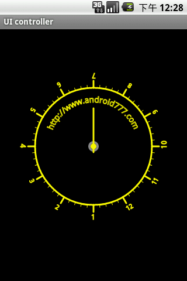

# Android Canvas绘图描述Android Canvas 方法总结

## Canvas绘制描述

Android中使用图形处理引擎，2D部分是android SDK内部自己提供，3D部分是用Open GL ES 1.0。今天我们主要要了解的是2D相关的，如果你想看3D的话那么可以跳过这篇文章。

大部分2D使用的api都在android.graphics和android.graphics.drawable包中。他们提供了图形处理相关的： Canvas、ColorFilter、Point(点)和RetcF(矩形)等，还有一些动画相关的：AnimationDrawable、 BitmapDrawable和TransitionDrawable等。以图形处理来说，我们最常用到的就是在一个View上画一些图片、形状或者自定义的文本内容，这里我们都是使用Canvas来实现的。你可以获取View中的Canvas对象，绘制一些自定义形状，然后调用View. invalidate方法让View重新刷新，然后绘制一个新的形状，这样达到2D动画效果。下面我们就主要来了解下Canvas的使用方法。

Canvas对象的获取方式有两种：一种我们通过重写View.onDraw方法，View中的Canvas对象会被当做参数传递过来，我们操作这个Canvas，效果会直接反应在View中。另一种就是当你想创建一个Canvas对象时使用的方法：

```plain
Bitmap b = Bitmap.createBitmap(100, 100, Bitmap.Config.ARGB_8888);
Canvas c = new Canvas(b);
```

上面代码创建了一个尺寸是100*100的Bitmap，使用它作为Canvas操作的对象，这时候的Canvas就是使用创建的方式。当你使用创建的Canvas在bitmap上执行绘制方法后，你还可以将绘制的结果提交给另外一个Canvas，这样就可以达到两个Canvas协作完成的效果，简化逻辑。但是android SDK建议使用View.onDraw参数里提供的Canvas就好，没必要自己创建一个新的Canvas对象。接下来我们看看Canvas提供我们哪些绘制图形的方法。我们创建一个自定义View对象，使用onDraw方法提供的Canvas进行绘制图形。

CanvasDemoActivity.java：

```plain
package com.android777.demo.uicontroller.graphics;
import android.app.Activity;
import android.content.Context;
import android.graphics.Canvas;
import android.graphics.Color;
import android.graphics.Paint;
import android.os.Bundle;
import android.view.View;

public class CanvasDemoActivity extends Activity {
    @Override
    protected void onCreate(Bundle savedInstanceState) {
        super.onCreate(savedInstanceState);
        setContentView(new CustomView1(this));
    }
    /**
    * 使用内部类 自定义一个简单的View
    * @author Administrator
    *
    */
    class CustomView1 extends View{
        Paint paint;

        public CustomView1(Context context) {
            super(context);
            paint = new Paint(); //设置一个笔刷大小是3的黄色的画笔
            paint.setColor(Color.YELLOW);
            paint.setStrokeJoin(Paint.Join.ROUND);
            paint.setStrokeCap(Paint.Cap.ROUND);
            paint.setStrokeWidth(3);
        }

        //在这里我们将测试canvas提供的绘制图形方法
        @Override
        protected void onDraw(Canvas canvas) {

        }
    }
}
```

执行结果是一片黑色的区域，因为在自定义的CustomView1中，我们没有做任何的绘制操作。canvas提供的绘制图形的方法都是以draw开头的，我们可以查看api：


从上面方法的名字看来我们可以知道Canvas可以绘制的对象有：弧线(arcs)、填充颜色(argb和color)、 Bitmap、圆(circle和oval)、点(point)、线(line)、矩形(Rect)、图片(Picture)、圆角矩形 (RoundRect)、文本(text)、顶点(Vertices)、路径(path)。通过组合这些对象我们可以画出一些简单有趣的界面出来，但是光有这些功能还是不够的，如果我要画一个仪表盘(数字围绕显示在一个圆圈中)呢？ 幸好Android还提供了一些对Canvas位置转换的方法：rorate、scale、translate、skew(扭曲)等，而且它允许你通过获得它的转换矩阵对象(getMatrix方法，不知道什么是转换矩阵？[看这里](http://www.android777.com/index.php/tutorial/use-of-2d-animation-tweening.html)) 直接操作它。这些操作就像是虽然你的笔还是原来的地方画，但是画纸旋转或者移动了，所以你画的东西的方位就产生变化。为了方便一些转换操作，Canvas 还提供了保存和回滚属性的方法(save和restore)，比如你可以先保存目前画纸的位置(save)，然后旋转90度，向下移动100像素后画一些图形，画完后调用restore方法返回到刚才保存的位置。下面我们就演示下canvas的一些简单用法：

 

```plain
protected void onDraw(Canvas canvas) {
    canvas.drawCircle(100, 100, 90, paint);
}
```

效果是：

```plain
@Override
protected void onDraw(Canvas canvas) {
    //绘制弧线区域
    RectF rect = new RectF(0, 0, 100, 100);
    canvas.drawArc(rect, //弧线所使用的矩形区域大小
    0, //开始角度
    90, //扫过的角度
    false, //是否使用中心
    paint);
}
```


使用下面的代码：

```plain
protected void onDraw(Canvas canvas) {
    //绘制弧线区域
    RectF rect = new RectF(0, 0, 100, 100);
    canvas.drawArc(rect, //弧线所使用的矩形区域大小
    0, //开始角度
    90, //扫过的角度
    true, //是否使用中心
    paint);
}
```


两图对比我们可以发现，当 drawArcs(rect,startAngel,sweepAngel,useCenter,paint)中的useCenter为false时，弧线区域是用弧线开始角度和结束角度直接连接起来的，当useCenter为true时，是弧线开始角度和结束角度都与中心点连接，形成一个扇形。

```plain
protected void onDraw(Canvas canvas) {
    canvas.drawColor(Color.BLUE);
}
```

canvas.drawColor是直接将View显示区域用某个颜色填充满。

```plain
@Override
protected void onDraw(Canvas canvas) {
    //画一条线
    canvas.drawLine(10, 10, 100, 100, paint);
}
```


Canvas.drawOval：

```plain
@Override
protected void onDraw(Canvas canvas) {
    //定义一个矩形区域
    RectF oval = new RectF(0,0,200,300);
    //矩形区域内切椭圆
    canvas.drawOval(oval, paint);
}
```


canvas.drawPosText：

```plain
@Override
protected void onDraw(Canvas canvas) {
    //按照既定点 绘制文本内容
    canvas.drawPosText("Android777", new float[]{
    10,10, //第一个字母在坐标10,10
    20,20, //第二个字母在坐标20,20
    30,30, //....
    40,40,
    50,50,
    60,60,
    70,70,
    80,80,
    90,90,
    100,100
    }, paint);
}
```


canvas.drawRect：

```plain
@Override
protected void onDraw(Canvas canvas) {
    RectF rect = new RectF(50, 50, 200, 200);
    canvas.drawRect(rect, paint);
}
```


**canvas.drawRoundRect：**

```plain
@Override
protected void onDraw(Canvas canvas) {
    RectF rect = new RectF(50, 50, 200, 200);
    canvas.drawRoundRect(rect,
    30, //x轴的半径
    30, //y轴的半径
    paint);
}
```


canvas.drawPath：

```plain
@Override
protected void onDraw(Canvas canvas) {
    Path path = new Path(); //定义一条路径
    path.moveTo(10, 10); //移动到 坐标10,10
    path.lineTo(50, 60);
    path.lineTo(200,80);
    path.lineTo(10, 10);
    canvas.drawPath(path, paint);
}
```


canvas.drawTextOnPath：

```plain
@Override
protected void onDraw(Canvas canvas) {
    Path path = new Path(); //定义一条路径
    path.moveTo(10, 10); //移动到 坐标10,10
    path.lineTo(50, 60);
    path.lineTo(200,80);
    path.lineTo(10, 10);
    // canvas.drawPath(path, paint);
    canvas.drawTextOnPath("Android777开发者博客", path, 10, 10, paint);
}
```


位置转换方法，canvas.rorate和canvas.translate：

```plain
@Override
protected void onDraw(Canvas canvas) {
    paint.setAntiAlias(true);
    paint.setStyle(Style.STROKE);
    canvas.translate(canvas.getWidth()/2, 200); //将位置移动画纸的坐标点:150,150
    canvas.drawCircle(0, 0, 100, paint); //画圆圈
    //使用path绘制路径文字
    canvas.save();
    canvas.translate(-75, -75);
    Path path = new Path();
    path.addArc(new RectF(0,0,150,150), -180, 180);
    Paint citePaint = new Paint(paint);
    citePaint.setTextSize(14);
    citePaint.setStrokeWidth(1);
    canvas.drawTextOnPath("http://www.android777.com", path, 28, 0, citePaint);
    canvas.restore();
    Paint tmpPaint = new Paint(paint); //小刻度画笔对象
    tmpPaint.setStrokeWidth(1);
    float y=100;
    int count = 60; //总刻度数
    for(int i=0 ; i <count ; i++){
        if(i%5 == 0){
            canvas.drawLine(0f, y, 0, y+12f, paint);
            canvas.drawText(String.valueOf(i/5+1), -4f, y+25f, tmpPaint);
        }else{
            canvas.drawLine(0f, y, 0f, y +5f, tmpPaint);
        }
        canvas.rotate(360/count,0f,0f); //旋转画纸
    }
    //绘制指针
    tmpPaint.setColor(Color.GRAY);
    tmpPaint.setStrokeWidth(4);
    canvas.drawCircle(0, 0, 7, tmpPaint);
    tmpPaint.setStyle(Style.FILL);
    tmpPaint.setColor(Color.YELLOW);
    canvas.drawCircle(0, 0, 5, tmpPaint);
    canvas.drawLine(0, 10, 0, -65, paint);
}
```



上面几个例子基本已经将常用的canvas.draw*方法测试过了，我们结合一些事件，做一些有用户交互的应用：

```plain
package com.android777.demo.uicontroller.graphics;
import java.util.ArrayList;
import android.app.Activity;
import android.content.Context;
import android.graphics.Canvas;
import android.graphics.Color;
import android.graphics.Paint;
import android.graphics.PointF;
import android.os.Bundle;
import android.view.MotionEvent;
import android.view.View;
public class CanvasDemoActivity extends Activity {
    @Override
    protected void onCreate(Bundle savedInstanceState) {
    super.onCreate(savedInstanceState);
    setContentView(new CustomView1(this));
}
/**
* 使用内部类 自定义一个简单的View
* @author Administrator
*
*/
class CustomView1 extends View{
    Paint paint;
    private ArrayList<PointF> graphics = new ArrayList<PointF>();
    PointF point;

    public CustomView1(Context context) {
        super(context);
        paint = new Paint(); //设置一个笔刷大小是3的黄色的画笔
        paint.setColor(Color.YELLOW);
        paint.setStrokeJoin(Paint.Join.ROUND);
        paint.setStrokeCap(Paint.Cap.ROUND);
        paint.setStrokeWidth(3);
    }
    @Override
    public boolean onTouchEvent(MotionEvent event) {
        graphics.add(new PointF(event.getX(),event.getY()));
        invalidate(); //重新绘制区域
        return true;
    }
    //在这里我们将测试canvas提供的绘制图形方法
    @Override
    protected void onDraw(Canvas canvas) {
        for (PointF point : graphics) {
            canvas.drawPoint(point.x, point.y, paint);
        }
        // super.onDraw(canvas);
    }
}
}
```

当用户点击时将出现一个小点，拖动时将画出一条用细点组成的虚线：


canvas的应用

canva还可以制作很多自定义控件，比如google日历的monthview就是用canvas绘制出来的，github上有很多使用canva的项目，所有的图表库都是用canvas绘制的。

## Android Canvas 方法总结

## 简介

在自定义 View的时候，我们经常需要绘制一些自己想要的效果。这里就需要使用Canvas对象。下面将Canvas对象常用方法做个笔记，方便记忆。

------

## 对Canvas进行操作

对Canvas的一系列操作，是指对Canvas进行旋转、平移、缩放等操作。这些操作可以让Canvas对象使用起来更加便捷。

Canvas平移

```plain
/** 
 * 画布向（100，50）方向平移 
 *  
 * 参数1: 向X轴方向移动100距离 
 * 参数2: 向Y轴方向移动50距离   
 */
 canvas.translate(100, 50);

/** 
 * 画布向（100，50）方向平移 
 *  
 * 参数1: 向X轴方向移动100距离 
 * 参数2: 向Y轴方向移动50距离   
 */
 canvas.translate(100, 50);
```

Canvas缩放

```plain
/** 
 * 在X轴方向放大为原来2倍，Y轴方向方大为原来的4倍 
 * 参数1: X轴的放大倍数 
 * 参数2: Y轴的放大倍数 
 */
canvas.scale(2, 4);

/** 
 * 在X轴方向放大为原来2倍，Y轴方向方大为原来的4倍 
 * 参数1: X轴的放大倍数 
 * 参数2: Y轴的放大倍数 
 * 参数3: 原点X坐标
 * 参数4: 原点Y坐标
 */
canvas.scale(2, 4，100,100);
/** 
 * 在X轴方向放大为原来2倍，Y轴方向方大为原来的4倍 
 * 参数1: X轴的放大倍数 
 * 参数2: Y轴的放大倍数 
 */
canvas.scale(2, 4);

/** 
 * 在X轴方向放大为原来2倍，Y轴方向方大为原来的4倍 
 * 参数1: X轴的放大倍数 
 * 参数2: Y轴的放大倍数 
 * 参数3: 原点X坐标
 * 参数4: 原点Y坐标
 */
canvas.scale(2, 4，100,100);
```

1. Bitmap b = Bitmap.createBitmap(100, 100, Bitmap.Config.ARGB_8888);
2. Canvas c = new Canvas

Canvas缩放图示

Canvas旋转

```plain
/** 
 * 原点为中心，旋转30度（顺时针方向为正方向 ）
 * 参数: 旋转角度 
 */
canvas.rotate(30);

/** 
 * 以（100,100）为中心，旋转30度，顺时针方向为正方向 
 * 参数: 旋转角度 
 */
canvas.rotate(30,100,100);

/** 
 * 原点为中心，旋转30度（顺时针方向为正方向 ）
 * 参数: 旋转角度 
 */
canvas.rotate(30);

/** 
 * 以（100,100）为中心，旋转30度，顺时针方向为正方向 
 * 参数: 旋转角度 
 */
canvas.rotate(30,100,100);
```

Canvas旋转图示

## Canvas操作例子

```plain
Paint p = new Paint();
 p.setColor(Color.argb(50,255,100,100));
 canvas.drawRect(0,0,200,200,p); // 以原始Canvas画出一个矩形1
 canvas.translate(300,300); // 将Canvas平移  (100,100)
 p.setColor(Color.argb(50,100,255,100));
 canvas.drawRect(0,0,200,200,p); //  矩形2
 canvas.rotate(30); //将Canvas旋转30
 p.setColor(Color.argb(50,100,0,255));
 canvas.drawRect(0,0,200,200,p); // 矩形3
 canvas.scale(2, 2); // 将Canvas以原点为中心，放大两倍
 p.setColor(Color.argb(50,255,255,0));
 canvas.drawRect(0,0,200,200,p); // 矩形4

 Paint p = new Paint();
 p.setColor(Color.argb(50,255,100,100));
 canvas.drawRect(0,0,200,200,p); // 以原始Canvas画出一个矩形1
 canvas.translate(300,300); // 将Canvas平移  (100,100)
 p.setColor(Color.argb(50,100,255,100));
 canvas.drawRect(0,0,200,200,p); //  矩形2
 canvas.rotate(30); //将Canvas旋转30
 p.setColor(Color.argb(50,100,0,255));
 canvas.drawRect(0,0,200,200,p); // 矩形3
 canvas.scale(2, 2); // 将Canvas以原点为中心，放大两倍
 p.setColor(Color.argb(50,255,255,0));
 canvas.drawRect(0,0,200,200,p); // 矩形4
```


Canvas示例

## Canvas保存和还原

Canvas提供了几个方法，让我们可以方便的对Canvas的状态进行更改和还原。
这些方法是：`save()`、`restore()`、`restoreToCount(int saveCount)`。

我们在对Canvas进行平移、旋转、放大等操作时候，可以调用`save()`方法，将当前修改过的Canvas状态进行保存，调用`restore()` 方法后，会将Canvas还原成最近的一个`save()` 的状态。

`save()`方法还会有一个返回值，我们也可以调用`restoreToCount(int saveCount)`方法，将这个返回值作为参数传递进去，就可以将Canvas还原成某一个特定的`save()`状态。

```plain
canvas.translate(100,100); // 平移（100,100）
 int save1 = canvas.save(); // 保存Canvas状态（状态1）
 canvas.scale(2, 2); // 放大2倍
 int save2 = canvas.save(); // 保存Canvas状态（状态2）
 canvas.restore(); // 返回最新的save状态，即状态2
 canvas.restoreToCount(save1);// 手动指定的返回到 状态1

 canvas.translate(100,100); // 平移（100,100）
 int save1 = canvas.save(); // 保存Canvas状态（状态1）
 canvas.scale(2, 2); // 放大2倍
 int save2 = canvas.save(); // 保存Canvas状态（状态2）
 canvas.restore(); // 返回最新的save状态，即状态2
 canvas.restoreToCount(save1);// 手动指定的返回到 状态1
```

## 画文字

```plain
/** 
 * 参数2：文本的x轴的开始位置 
 * 参数2：文本Y轴的结束位置 
 * 参数3：画笔对象 
 */  
canvas.drawText("开始写字了！",50, 50, p);// 画文本  

/** 
 * 参数2：要从第几个字开始绘制 
 * 参数3：要绘制到第几个文字 
 * 参数4：文本的x轴的开始位置 
 * 参数5：文本Y轴的结束位置 
 * 参数6：画笔对象 
 */  
canvas.drawText("开始写字了！",2,5, 50, 50, p);// 画文本，结果为：“写字了”  
/** 
 * 参数2：路径 
 * 参数3：距离路径开始位置的偏移量 
 * 参数4：距离路径上下的偏移量（可以为负数） 
 * 参数5：画笔对象 
 */  
canvas.drawTextOnPath("1234567890101123123", path, 0, -50, p);  

/** 
 * 参数2：文本的x轴的开始位置 
 * 参数2：文本Y轴的结束位置 
 * 参数3：画笔对象 
 */  
canvas.drawText("开始写字了！",50, 50, p);// 画文本  

/** 
 * 参数2：要从第几个字开始绘制 
 * 参数3：要绘制到第几个文字 
 * 参数4：文本的x轴的开始位置 
 * 参数5：文本Y轴的结束位置 
 * 参数6：画笔对象 
 */  
canvas.drawText("开始写字了！",2,5, 50, 50, p);// 画文本，结果为：“写字了”  
/** 
 * 参数2：路径 
 * 参数3：距离路径开始位置的偏移量 
 * 参数4：距离路径上下的偏移量（可以为负数） 
 * 参数5：画笔对象 
 */  
canvas.drawTextOnPath("1234567890101123123", path, 0, -50, p);
```

## 画圆

```plain
/**
 * 参数1：圆心X 
 * 参数2：圆心Y 
 * 参数3：半径R 
 * 参数4：画笔对象 
 */           
canvas.drawCircle(200, 200, 100, p);  

/**
 * 参数1：圆心X 
 * 参数2：圆心Y 
 * 参数3：半径R 
 * 参数4：画笔对象 
 */           
canvas.drawCircle(200, 200, 100, p);
```

## 画线

```plain
/* 
 * 参数1：startX 
 * 参数2：startY 
 * 参数3：stopX 
 * 参数4：stopY 
 * 参数5：画笔对象 
 */   
canvas.drawLine(100, 100, 300, 300, p);// 画线  
/* 
 * 同时绘制多条线。 
 * 参数1：float数组：每四个一组为一条线。最后不足四个，就忽略那些值。 
 * 参数2：画笔对象 
 */  
canvas.drawLines(new float[]{100,100,200,200,200,100,300,100}, p);  

/* 
 * 参数1：startX 
 * 参数2：startY 
 * 参数3：stopX 
 * 参数4：stopY 
 * 参数5：画笔对象 
 */   
canvas.drawLine(100, 100, 300, 300, p);// 画线  
/* 
 * 同时绘制多条线。 
 * 参数1：float数组：每四个一组为一条线。最后不足四个，就忽略那些值。 
 * 参数2：画笔对象 
 */  
canvas.drawLines(new float[]{100,100,200,200,200,100,300,100}, p);
```

## 画椭圆

```plain
/* 
 *  参数1：float left 
 *  参数2：float top 
 *  参数3：float right 
 *  参数4：float bottom 
 */  
RectF oval = new RectF(150, 200, 500, 400);// 画一个椭圆  
canvas.drawOval(oval, p);
```

## 画弧度

```plain
/**
 *  画圆弧
 *  参数1：RectF对象。 
 *  参数2：开始的角度。（水平向右为0度顺时针反向为正方向） 
 *  参数3：扫过的角度 
 *  参数4：是否和中心连线 
 *  参数5：画笔对象 
 */  
canvas.drawArc(oval, 20, 180, false, p);  

/**
 *  画圆弧
 *  参数1：RectF对象。 
 *  参数2：开始的角度。（水平向右为0度顺时针反向为正方向） 
 *  参数3：扫过的角度 
 *  参数4：是否和中心连线 
 *  参数5：画笔对象 
 */  
canvas.drawArc(oval, 20, 180, false, p);
```

## 矩形

```plain
/** 
 *  矩形 
 *  参数1：float left 
 *  参数2：float top 
 *  参数3：float right 
 *  参数4：float bottom 
 */  
canvas.drawRect(100,100, 200, 200, p);  
    
//画圆角矩形    
RectF oval3 = new RectF(80, 260, 200, 300);// 设置个新的长方形    
canvas.drawRoundRect(oval3, 20, 5, p);//第二个参数是x半径，第三个参数是y半径    

/** 
 *  矩形 
 *  参数1：float left 
 *  参数2：float top 
 *  参数3：float right 
 *  参数4：float bottom 
 */  
canvas.drawRect(100,100, 200, 200, p);  
    
//画圆角矩形    
RectF oval3 = new RectF(80, 260, 200, 300);// 设置个新的长方形    
canvas.drawRoundRect(oval3, 20, 5, p);//第二个参数是x半径，第三个参数是y半径
```

## 多边形

```plain
/**  
 * Path类封装复合(多轮廓几何图形的路径  
 * 由直线段*、二次曲线,和三次方曲线，也可画以油画。drawPath(路径、油漆),要么已填充的或抚摸  
 * (基于油漆的风格),或者可以用于剪断或画画的文本在路径。  
 */   
Path path = new Path();  // 路径对象  
path.moveTo(80, 200);// 此点为多边形的起点    
path.lineTo(120, 250);    
path.lineTo(80, 250);    
//....  可以添加多个点。构成多边形  
path.close(); // 使终点和起点链接，构成封闭图形   
        canvas.drawPath(path, p);    

/**  
 * Path类封装复合(多轮廓几何图形的路径  
 * 由直线段*、二次曲线,和三次方曲线，也可画以油画。drawPath(路径、油漆),要么已填充的或抚摸  
 * (基于油漆的风格),或者可以用于剪断或画画的文本在路径。  
 */   
Path path = new Path();  // 路径对象  
path.moveTo(80, 200);// 此点为多边形的起点    
path.lineTo(120, 250);    
path.lineTo(80, 250);    
//....  可以添加多个点。构成多边形  
path.close(); // 使终点和起点链接，构成封闭图形   
        canvas.drawPath(path, p);
```

## 画贝塞尔曲线

```plain
p.setStyle(Style.STROKE);  
Path path2=new Path();    
path2.moveTo(100, 100);//设置Path的起点   
/** 
 * 参数1、2：x1，y1为控制点的坐标值 
 * 参数3、4：x2，y2为终点的坐标值 
 */  
path2.quadTo(300, 100, 400, 400); //设置贝塞尔曲线的控制点坐标和终点坐标    
path2.quadTo(500, 700, 800, 800);  
canvas.drawPath(path2, p);//画出贝塞尔曲线    

p.setStyle(Style.STROKE);  
Path path2=new Path();    
path2.moveTo(100, 100);//设置Path的起点   
/** 
 * 参数1、2：x1，y1为控制点的坐标值 
 * 参数3、4：x2，y2为终点的坐标值 
 */  
path2.quadTo(300, 100, 400, 400); //设置贝塞尔曲线的控制点坐标和终点坐标    
path2.quadTo(500, 700, 800, 800);  
canvas.drawPath(path2, p);//画出贝塞尔曲线
```

## 画点

```plain
/** 
 * 参数1、2：点的x、y坐标 
 */  
canvas.drawPoint(60, 390, p);//画一个点    
/** 
 * 参数1：多个点，每两个值为一个点。最后个数不够两个的值，忽略。 
 */  
canvas.drawPoints(new float[]{60,400,65,400,70,400}, p);//画多个点    

/** 
 * 参数1、2：点的x、y坐标 
 */  
canvas.drawPoint(60, 390, p);//画一个点    
/** 
 * 参数1：多个点，每两个值为一个点。最后个数不够两个的值，忽略。 
 */  
canvas.drawPoints(new float[]{60,400,65,400,70,400}, p);//画多个点
```

## 画图片

```plain
Bitmap bitmap = BitmapFactory.decodeResource(getResources(), R.drawable.ic_launcher);   
/** 
 * 参数1：bitmap对象 
 * 参数2：图像左边坐标点 
 * 参数3：图像上边坐标点 
 */  
canvas.drawBitmap(bitmap, 200,300, p);  
Bitmap bitmap = BitmapFactory.decodeResource(getResources(), R.drawable.ic_launcher);   
/** 
 * 参数1：bitmap对象 
 * 参数2：图像左边坐标点 
 * 参数3：图像上边坐标点 
 */  
canvas.drawBitmap(bitmap, 200,300, p);
```

## Paint类

要绘图，首先得调整画笔，待画笔调整好之后，再将图像绘制到画布上，这样才可以显示在手机屏幕上。Android 中的画笔是 Paint类，Paint 中包含了很多方法对其属性进行设置，主要方法如下： 

  setAntiAlias: 设置画笔的锯齿效果。 

  setColor: 设置画笔颜色 

  setARGB: 设置画笔的a,r,p,g值。 

  setAlpha: 设置Alpha值 

  setTextSize: 设置字体尺寸。 

  setStyle: 设置画笔风格，空心或者实心。 

  setStrokeWidth: 设置空心的边框宽度。 

  getColor: 得到画笔的颜色 

  getAlpha: 得到画笔的Alpha值。 

​    下面是一个简单的示例 来说明这些方法的使用。先来看看运行效果吧。 


```plain
package eoe.Demo;
  
   import android.content.Context;
   import android.graphics.Canvas;
   import android.graphics.Color;
   import android.graphics.Paint;
   import android.util.Log;
   import android.view.KeyEvent;
   import android.view.MotionEvent;
   import android.view.View;
  
   public class GameView extends View implements Runnable {
  
   public final static String TAG = "Example_05_03_GameView";
   // 声明Paint对象
   private Paint mPaint = null;
  
   public GameView(Context context) {
       super(context);
       // 构建对象
       mPaint = new Paint();
  
       // 开启线程
       new Thread(this).start();
   }
  
   @Override
   protected void onDraw(Canvas canvas) {
   super.onDraw(canvas);
  
   // 设置Paint为无锯齿
   mPaint.setAntiAlias(true);
  
   // 设置Paint的颜色
   mPaint.setColor(Color.RED);
   mPaint.setColor(Color.BLUE);
   mPaint.setColor(Color.YELLOW);
   mPaint.setColor(Color.GREEN);
   // 同样是设置颜色
   mPaint.setColor(Color.rgb(255, 0, 0));
  
   // 提取颜色
   Color.red(0xcccccc);
   Color.green(0xcccccc);
  
   // 设置paint的颜色和Alpha值(a,r,g,b)
   mPaint.setAlpha(220);
  
   // 这里可以设置为另外一个paint对象
   // mPaint.set(new Paint());
   // 设置字体的尺寸
   mPaint.setTextSize(14);
  
   // 设置paint的风格为“空心”
   // 当然也可以设置为"实心"(Paint.Style.FILL)
   mPaint.setStyle(Paint.Style.STROKE);
  
   // 设置“空心”的外框的宽度
   mPaint.setStrokeWidth(5);
  
   // 得到Paint的一些属性 颜色、Alpha值、外框的宽度、字体尺寸
   Log.i("TAG", "paint Color------>" + mPaint.getColor());
   Log.i(TAG, "paint Alpha------->" + mPaint.getAlpha());
   Log.i("TAG", "paint StrokeWidth--------->" + mPaint.getStrokeWidth());
   Log.i("TAG", "paint TextSize----------->" + mPaint.getTextSize());
  
   // 绘制一空心个矩形
   canvas.drawRect((320 - 80), 20, (320 - 80) / 2 + 80, 20 + 40, mPaint);
  
   // 设置风格为实心
   mPaint.setStyle(Paint.Style.FILL);
  
   mPaint.setColor(Color.GREEN);
 
   // 绘制绿色实心矩形
   canvas.drawRect(0, 20, 40, 20 + 40, mPaint);
   }
  
  // 触笔事件
  public boolean onTouchEvent(MotionEvent event) {
      return true;
  }
  
  // 按键按下事件
  public boolean onKeyDown(int keyCode, KeyEvent event) {
      return true;
  }
  
  // 按键弹起事件
  public boolean onKeyUp(int keyCode, KeyEvent event) {
      return true;
  }
  
  public boolean onKeyMultiple(int KeyCode, int repeatCount, KeyEvent event) {
      return true;
  }
  
  @Override
  public void run() {
      while (!Thread.currentThread().isInterrupted()) {
      try {
          Thread.sleep(100);
      } catch (Exception e) {
          Thread.currentThread().interrupt();
      }
     // 更新界面
     postInvalidate();
     }
 }
 }
 
 
 package eoe.Demo;
 
 import android.app.Activity;
 import android.os.Bundle;
 
 public class Activity01 extends Activity {
     /** Called when the activity is first created. */
     private GameView mGameView;
 
     @Override
     public void onCreate(Bundle savedInstanceState) {
         super.onCreate(savedInstanceState);
 
         setContentView(R.layout.main);
 
         mGameView = new GameView(this);
 
         setContentView(mGameView);
 }
 }
```

   /** 
   \* Paint类介绍 
   \*  
   \* Paint即画笔，在绘图过程中起到了极其重要的作用，画笔主要保存了颜色， 
   \* 样式等绘制信息，指定了如何绘制文本和图形，画笔对象有很多设置方法， 
   \* 大体上可以分为两类，一类与图形绘制相关，一类与文本绘制相关。     
   \*  
   \* 1.图形绘制 
   \* setARGB(int a,int r,int g,int b); 
   \* 设置绘制的颜色，a代表透明度，r，g，b代表颜色值。 
   \*  
   \* setAlpha(int a); 
   \* 设置绘制图形的透明度。 
   \*  
   \* setColor(int color); 
   \* 设置绘制的颜色，使用颜色值来表示，该颜色值包括透明度和RGB颜色。 
   \*  
   \* setAntiAlias(boolean aa); 
   \* 设置是否使用抗锯齿功能，会消耗较大资源，绘制图形速度会变慢。 
   \*  
   \* setDither(boolean dither); 
   \* 设定是否使用图像抖动处理，会使绘制出来的图片颜色更加平滑和饱满，图像更加清晰 
   \*  
   \* setFilterBitmap(boolean filter); 
   \* 如果该项设置为true，则图像在动画进行中会滤掉对Bitmap图像的优化操作，加快显示 
   \* 速度，本设置项依赖于dither和xfermode的设置 
   \*  
   \* setMaskFilter(MaskFilter maskfilter); 
   \* 设置MaskFilter，可以用不同的MaskFilter实现滤镜的效果，如滤化，立体等    *  
   \* setColorFilter(ColorFilter colorfilter); 
   \* 设置颜色过滤器，可以在绘制颜色时实现不用颜色的变换效果 
   \*  
   \* setPathEffect(PathEffect effect); 
   \* 设置绘制路径的效果，如点画线等 
   \*  
   \* setShader(Shader shader); 
   \* 设置图像效果，使用Shader可以绘制出各种渐变效果 
   \* 
   \* setShadowLayer(float radius ,float dx,float dy,int color); 
   \* 在图形下面设置阴影层，产生阴影效果，radius为阴影的角度，dx和dy为阴影在x轴和y轴上的距离，color为阴影的颜色 
   \*  
   \* setStyle(Paint.Style style); 
   \* 设置画笔的样式，为FILL，FILL_OR_STROKE，或STROKE 
   \*  
   \* setStrokeCap(Paint.Cap cap); 
   \* 当画笔样式为STROKE或FILL_OR_STROKE时，设置笔刷的图形样式，如圆形样式 
   \* Cap.ROUND,或方形样式Cap.SQUARE 
   \*  
   \* setSrokeJoin(Paint.Join join); 
   \* 设置绘制时各图形的结合方式，如平滑效果等 
   \*  
   \* setStrokeWidth(float width); 
   \* 当画笔样式为STROKE或FILL_OR_STROKE时，设置笔刷的粗细度 
   \*  
   \* setXfermode(Xfermode xfermode); 
   \* 设置图形重叠时的处理方式，如合并，取交集或并集，经常用来制作橡皮的擦除效果 
   \*  
   \* 2.文本绘制 
   \* setFakeBoldText(boolean fakeBoldText); 
   \* 模拟实现粗体文字，设置在小字体上效果会非常差 
   \*  
   \* setSubpixelText(boolean subpixelText); 
   \* 设置该项为true，将有助于文本在LCD屏幕上的显示效果 
   \*  
   \* setTextAlign(Paint.Align align); 
   \* 设置绘制文字的对齐方向 
   \*  
   \* setTextScaleX(float scaleX); 
   \* 设置绘制文字x轴的缩放比例，可以实现文字的拉伸的效果 
   \*  
   \* setTextSize(float textSize); 
   \* 设置绘制文字的字号大小 
   \*  
   \* setTextSkewX(float skewX); 
   \* 设置斜体文字，skewX为倾斜弧度 
   \*  
   \* setTypeface(Typeface typeface); 
   \* 设置Typeface对象，即字体风格，包括粗体，斜体以及衬线体，非衬线体等 
   \*  
   \* setUnderlineText(boolean underlineText); 
   \* 设置带有下划线的文字效果 
   \*  
   \* setStrikeThruText(boolean strikeThruText); 
   \* 设置带有删除线的效果 
   \*  
   */ 

## 在Android中需要通过graphics类来显示2D图形。

　　graphics中包括了Canvas（画布）、Paint（画笔）、Color（颜色）、Bitmap（图像）等常用的类。graphics具有绘制点、线、颜色、2D几何图形、图像处理等功能。

## 1.Color（颜色）类

　　Android系统中颜色的常用表示方法有以下3种：

　　（1）int color = Color.BLUE;
　　（2）int color = Color.argb(150,200,0,100);
　　（3）在xml文件中定义颜色；

　　在实际应用当中，我们常用的颜色有以下一些，其颜色常量及其表示的颜色如下所示：

　　Color.BLACK     黑色                Color.GREEN         绿色
　　Color.BLUE     蓝色                Color.LTGRAY        浅灰色
　　Color.CYAN     青绿色               Color.MAGENTA        红紫色
　　Color.DKGRAY    灰黑色               Color.RED          红色
　　Color.YELLOW    黄色                Color.TRANSPARENT      透明
　　Color.GRAY     灰色                Color.WHITE         白色

## 2.Paint（画笔）类

 　要绘制图形，首先得调整画笔，按照自己的开发需要设置画笔的相关属性。Pain类的常用属性设置方法如下：

　　setAntiAlias();      //设置画笔的锯齿效果
　　setColor();        //设置画笔的颜色
　　setARGB();         //设置画笔的A、R、G、B值
　　setAlpha();        //设置画笔的Alpha值
　　setTextSize();       //设置字体的尺寸
　　setStyle();        //设置画笔的风格（空心或实心）
　　setStrokeWidth();      //设置空心边框的宽度
　　getColor();        //获取画笔的颜色

## 3.Canvas（画布）类

　　画笔属性设置好之后，还需要将图像绘制到画布上。Canvas类可以用来实现各种图形的绘制工作，如绘制直线、矩形、圆等等。Canvas绘制常用图形的方法如下：

　　绘制直线：canvas.drawLine(float startX, float startY, float stopX, float stopY, Paint paint);
　　绘制矩形：canvas.drawRect(float left, float top, float right, float bottom, Paint paint);
　　绘制圆形：canvas.drawCircle(float cx, float cy, float radius, Paint paint);
　　绘制字符：canvas.drawText(String text, float x, float y, Paint paint);
　　绘制图形：canvas.drawBirmap(Bitmap bitmap, float left, float top, Paint paint);

## 4.自定义View的基本实现方法

　　首先，我们需要自定义一个类，比如MyView，继承于View类。然后，复写View类的onDraw()函数。最后，在onDraw()函数中使用Paint和Canvas对象绘制我们需要的图形。

## 5.动手实践

　　在这里，我使用上面提到的一些方法，绘制了一幅简单的北京奥运宣传画，包括奥运五环，“北京欢迎您”的宣传标语以及福娃。做成后的效果图如图1所示。 


图1 Android_OlympicLogo效果图

　　其中，使用了自定义的MyView类，在MyView类中，重写了onDraw()函数，并定义几种不同的画笔，分别用来绘制各种颜色的奥运五环以及绘制字符串“北京欢迎您”等。具体的MyView.java源代码如下。

```plain
package com.example.android_olympiclogo;
  
  import android.view.View;
  import android.content.Context;
  import android.graphics.BitmapFactory;
  import android.graphics.Canvas;
  import android.graphics.Color;
  import android.graphics.Paint;
  import android.graphics.Paint.Style;
 
  public class MyView extends View {
 
     public MyView(Context context) {
         super(context);
     }
     
     public void onDraw(Canvas canvas) {
         
         Paint paint_blue = new Paint();                        //绘制蓝色的环
         paint_blue.setColor(Color.BLUE);
         paint_blue.setStyle(Style.STROKE);
         paint_blue.setStrokeWidth(10);        
         canvas.drawCircle(110,150,60,paint_blue);
         
         Paint paint_yellow = new Paint();                //绘制黄色的环
         paint_yellow.setColor(Color.YELLOW);
         paint_yellow.setStyle(Style.STROKE);
         paint_yellow.setStrokeWidth(10);
         canvas.drawCircle((float)175.5, 210, 60, paint_yellow);
         
         Paint paint_black = new Paint();                   //绘制黑色的环
         paint_black.setColor(Color.BLACK);
         paint_black.setStyle(Style.STROKE);
         paint_black.setStrokeWidth(10);
         canvas.drawCircle(245, 150, 60, paint_black);
         
         Paint paint_green = new Paint();                  //绘制绿色的环
         paint_green.setColor(Color.GREEN);
         paint_green.setStyle(Style.STROKE);
         paint_green.setStrokeWidth(10);
         canvas.drawCircle(311, 210, 60, paint_green);
         
         Paint paint_red = new Paint();                       //绘制红色的环
         paint_red.setColor(Color.RED);
         paint_red.setStyle(Style.STROKE);
         paint_red.setStrokeWidth(10);
         canvas.drawCircle(380, 150, 60, paint_red);
         
         Paint paint_string = new Paint();                   //绘制字符串
         paint_string.setColor(Color.BLUE);
         paint_string.setTextSize(20);
         canvas.drawText("Welcome to Beijing", 245, 310, paint_string);
         
         Paint paint_line = new Paint();                       //绘制直线
         paint_line.setColor(Color.BLUE);
         canvas.drawLine(240, 310, 425, 310, paint_line);
         
         Paint paint_text = new Paint();                      //绘制字符串
         paint_text.setColor(Color.BLUE);
         paint_text.setTextSize(20);
         canvas.drawText("北京欢迎您", 275, 330, paint_text);
         
         //绘制福娃图片
         canvas.drawBitmap(BitmapFactory.decodeResource(getResources(),R.drawable.fuwa), 35, 340, paint_line);
     }
 }
```

　　此外，还需要将自定义的MyView视图显示到手机屏幕上，所以需要在MainAcitivity.java中加载MyView视图，可以使用setContentView()方法，具体的MainAcitivity.java源代码如下。

```plain
package com.example.android_olympiclogo;
 
 import android.os.Bundle;
 import android.app.Activity;
 import android.view.Menu;
 import android.view.MenuItem;
 import android.support.v4.app.NavUtils;
 
 public class MainActivity extends Activity {
 
     @Override
     public void onCreate(Bundle savedInstanceState) {
         super.onCreate(savedInstanceState);
         //setContentView(R.layout.activity_main);
         setContentView(new MyView(this));                              //加载MyView
     }
 
     @Override
     public boolean onCreateOptionsMenu(Menu menu) {
         getMenuInflater().inflate(R.menu.activity_main, menu);
         return true;
     }
     
 }
```

当然了，还需要将福娃的图片放在res下的drawable-hdpi目录下。这样才可以使用BitmapFactory.decodeResource(getResources(),R.drawable.fuwa)方法加载该图片。

标签: [android](http://681314.com/tags-android.html)


# 一键清空Canvas画布的三种方式

```
// 清空画布的方法：
public void clear() {
    
    //  方法一：
    canvas.drawColor(0,PorterDuff.Mode.CLEAR);

    //  方法二： 
    canvas.drawColor(Color.TRANSPARENT,PorterDuff.Mode.CLEAR);

    //  方法三： 
    Paint paint =new Paint();
    paint.setXfermode(new PorterDuffXfermode(PorterDuff.Mode.CLEAR));
    canvas.drawPaint(paint);
    paint.setXfermode(new PorterDuffXfermode(PorterDuff.Mode.SRC));
    imageview.invalidate();  // imageview: 布局文件中的ImageView控件
}
```

