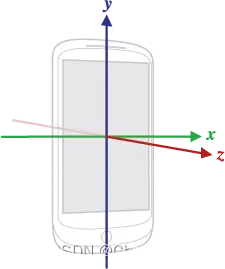
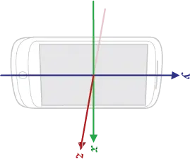
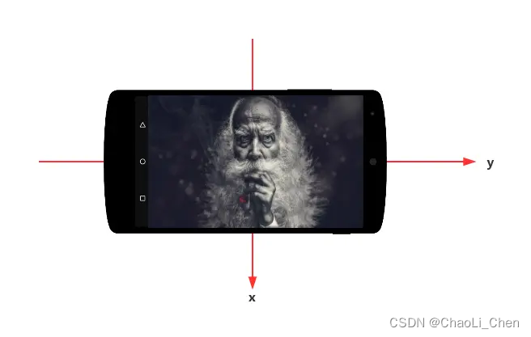
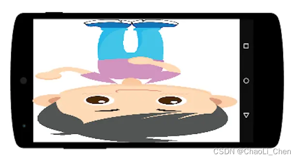

# Camera API1 使用说明


## 一、开启相机

### 1.1创建项目

​        开发一个具有完整相机功能的应用程序，所以第一步要做的就是创建一个相机项目，并且有一个 Activity 叫 MainActivity。为了降低源码的阅读难度，不打算引入任何的第三方库，不去关注性能问题，也不进行任何模式上的设计，大部分的代码我都会写在这个 MainActivity 里面，所有的功能的实现都尽可能简化。


### 1.2注册权限

​       在使用相机 Camera API1 之前，必须在 AndroidManifest.xml 注册相机权限android.permission.CAMERA，声明我们开发的应用程序需要相机权限，另外如果你有保存照片的操作，那么读写 SD 卡的权限也是必须的：

    <?xml version="1.0" encoding="utf-8"?>
    <manifest xmlns:android="http://schemas.android.com/apk/res/android">
     
        <uses-permission android:name="android.permission.CAMERA" />
        <uses-permission android:name="android.permission.WRITE_EXTERNAL_STORAGE" />
     
    </manifest>

​         需要注意的是 6.0 以上的系统需要我们在程序运行的时候进行动态权限申请，所以我们需要在程序启动的时候去检查权限，有任何一个必要的权限被用户拒绝时，我们就弹窗提示用户程序因为权限被拒绝而无法正常工作：

    public class MainActivity extends AppCompatActivity {
     
        private static final int REQUEST_PERMISSIONS_CODE = 1;
        private static final String[] REQUIRED_PERMISSIONS = {"android.permission.CAMERA","android.permission.WRITE_EXTERNAL_STORAGE"};
     
        @Override
        protected void onCreate(Bundle savedInstanceState) {
            super.onCreate(savedInstanceState);
            setContentView(R.layout.activity_main);
        }
     
        @Override
        protected void onResume() {
            super.onResume();
            // 动态权限检查
            if (!isRequiredPermissionsGranted() && Build.VERSION.SDK_INT >= Build.VERSION_CODES.M) {
                requestPermissions(REQUIRED_PERMISSIONS, REQUEST_PERMISSIONS_CODE);
            }
        }
     
        /**
         * 判断我们需要的权限是否被授予，只要有一个没有授权，我们都会返回 false。
         *
         * @return true 权限都被授权
         */
        private boolean isRequiredPermissionsGranted() {
            for (String permission : REQUIRED_PERMISSIONS) {
                if (ContextCompat.checkSelfPermission(this, permission) == PackageManager.PERMISSION_DENIED) {
                    return false;
                }
            }
            return true;
        }
    }


### 1.3配置相机特性要求

​         所以接下来要做的就是在 AndroidManifest.xml 中配置一些程序运行时必要的相机特性，如果这些特性不支持，那么用户在安装 apk 的时候就会因为条件不符合而无法安装。

    <?xml version="1.0" encoding="utf-8"?>
    <manifest xmlns:android="http://schemas.android.com/apk/res/android"
        package="com.darylgo.camera.sample">
     
        <uses-permission android:name="android.permission.CAMERA" />
        <uses-permission android:name="android.permission.WRITE_EXTERNAL_STORAGE" />
     
        <uses-feature
            android:name="android.hardware.camera"
            android:required="true" />
     
    </manifest>


​         我们通过 `<uses-feature>` 标签声明了我们的应用程序必须在具有摄像头的手机上才能运行。另外你还可以配置更多的特性要求，例如必须支持自动对焦的摄像头才能运行你的应用程序，更多的特性可以在 官方文档 上查询。


### 1.4 获取摄像头的个数

​        并不是所有的手机都支持前后置摄像头，甚至有手机一个摄像头都没有，所以我们首先要确定当前的设备支持多少个摄像头。我们可以通过 Camera.getNumberOfCameras() 获取设备支持的摄像头个数，它是一个静态方法，返回一个 int 值代表摄像头个数。


### 1.5 根据 ID 获取 CameraInfo

  Camera.CameraInfo 正如其名，里面存储了几个相机相关的信息，信息并不多：

facing
      摄像头的方向，可选值有 Camera.CameraInfo.CAMERA_FACING_BACK 和Camera.CameraInfo.CAMERA_FACING_FRONT。

orientation

​	 摄像头的画面经过顺时针旋转多少度之后是正常画面，这个属性比较难以理解，我们在后面会专门解释。

canDisableShutterSound
        是否支持静音拍照，也就是说在用户拍照的时候是否会“咔嚓”一声，例如在日本由于隐私政策，所有手机都是不允许静音拍照的，那么该字段就会返回 false。该字段一般配合 Camera.enableShutterSound(boolean) 使用，当它返回 false 的时候，即使你调用 Camera.enableShutterSound(false)，相机在拍照的时候也会发出声音。

Camera.CameraInfo 其实就这么几个字段，最重要的就是 facing 和 orientation 了，我们可以通过 facing 判断摄像头是前置还是后置，通过 orientation 值取校正摄像头的画面。

看下如何获取 Camera.CameraInfo 实例：

```
@Nullable
private Camera.CameraInfo mFrontCameraInfo = null;
private int mFrontCameraId = -1;
 
@Nullable
private Camera.CameraInfo mBackCameraInfo = null;
private int mBackCameraId = -1;
 
/**
 * 初始化摄像头信息。
 */
private void initCameraInfo() {
    int numberOfCameras = Camera.getNumberOfCameras();// 获取摄像头个数
    for (int cameraId = 0; cameraId < numberOfCameras; cameraId++) {
        Camera.CameraInfo cameraInfo = new Camera.CameraInfo();
        Camera.getCameraInfo(cameraId, cameraInfo);
        if (cameraInfo.facing == Camera.CameraInfo.CAMERA_FACING_BACK) {
            // 后置摄像头信息
            mBackCameraId = cameraId;
            mBackCameraInfo = cameraInfo;
        } else if (cameraInfo.facing == Camera.CameraInfo.CAMERA_FACING_FRONT){
            // 前置摄像头信息
            mFrontCameraId = cameraId;
            mFrontCameraInfo = cameraInfo;
        }
    }
}
```


​     从上面的代码可以看出 Camera.CameraInfo 的获取非常简单，只需要你创建一个 Camera.CameraInfo 实例，然后通过 Camera.getCameraInfo(int, Camera.CameraInfo) 方法就可以将相机信息填充到你创建的实例中。另外值得注意的一点是，相机的 ID 实际上就是从 0 到 numberOfCameras 递增，大部分手机的后置摄像头的 ID 是 0，前置摄像头的 ID 是 1，但是我们最好还是通过 facing 字段去判断比较靠谱。

Camera.getNumberOfCameras() 和 Camera.getCameraInfo(int, Camera.CameraInfo) 都不需要相机权限。


### 1.6 开启相机

​        接下来我们要做的就是调用 Camera.open(int) 方法开启相机了，需要注意的是你必须确保在开启相机之前已经被授予了相机权限，否则会抛权限异常。一个比较稳妥的做法就是每次开启相机之前检查相机权限。下面是主要代码前段：

```
/**
 * 开启指定摄像头
 */
private void openCamera() {
    if (mCamera != null) {
        throw new RuntimeException("相机已经被开启，无法同时开启多个相机实例！");
    }
 
    if (ContextCompat.checkSelfPermission(this, Manifest.permission.CAMERA) == PackageManager.PERMISSION_GRANTED) {
        if (hasFrontCamera()) {
            // 优先开启前置摄像头
            mCamera = Camera.open(mFrontCameraId);
        } else if (hasBackCamera()) {
            // 没有前置，就尝试开启后置摄像头
            mCamera = Camera.open(mBackCameraId);
        } else {
            throw new RuntimeException("没有任何相机可以开启！");
        }
    }
}
```


### 1.7 关闭相机

   和其他硬件资源的使用一样，当我们不再需要使用相机时记得调用 Camera.release() 方法及时关闭相机回收资源。关闭相机的操作至关重要，因为如果你一直占用相机资源，其他基于相机开发的功能都会无法正常使用，严重情况下直接导致其他相机相关的 APP 无法正常使用。那么在什么时候关闭相机最合适呢？我个人的建议是在 onPause() 的时候就一定要关闭相机，因为在这个时候相机页面已经不是用户关注的焦点，大部分情况下已经可以关闭相机了

```
@Override
protected void onPause() {
    super.onPause();
    closeCamera();
}
 
/**
 * 关闭相机。
 */
private void closeCamera() {
    if (mCamera != null) {
        mCamera.release();
        mCamera = null;
    }
}
```


## 二、预览

### 2.1认识 Parameters

​    相机功能的强大与否完全取决于各手机厂商的底层实现，在基于相机开发任何功能之前，你都需要通过某些手段判断当前设备相机的能力是否足以支撑你要开发的功能，而 Camera.Parameters 就是我们判断相机能力大小的手段，在 Camera.Parameters 里提供了大量形如 getSupportedXXX 的方法，通过这些方法你就可以判断相机某方面的功能是否达到你的要求，例如通过 getSupportedPreviewSizes() 可以获取相机支持的预览尺寸列表，进而从这个列表中查询是否有满足你需求的尺寸。

 除了通过 Camera.Parameters 判断相机功能的支持情况之外，我们还通过 Camera.Parameters 设置绝大部分相机参数，并且通过 Camera.setParameters() 方法将设置好的参数传给底层，让这些参数生效。


所以相机参数的配置流程基本就是以下三个步骤：

通过 Camera.getParameters() 获取 Camera.Parameters 实例。

通过 Camera.Parameters.getSupportedXXX 获取某个参数的支持情况。

通过 Camera.Parameters.set() 方法设置参数。

通过 Camera.setParameters() 方法将参数应用到底层。

注意：

  Camera.getParameters() 是一个比较耗时的操作，实测 20ms 到 100ms不等，所以尽可能地一次性设置所有必要的参数，然后通过 Camera.setParameters() 一次性应用到底层。


### 2.2 设置预览尺寸

​           上面我们简单介绍了 Camera.Parameters，这一节我们就要通过它来配置相机的预览尺寸。所谓的预览尺寸，指的就是相机把画面输出到手机屏幕上供用户预览的尺寸，通常来说我们希望预览尺寸在不超过手机屏幕分辨率的情况下，越大越好。另外，出于业务需求，我们的相机可能需要支持多种不同的预览比例供用户选择，例如 4:3 和 16:9 的比例。由于不同厂商对相机的实现都会有差异，所以很多参数在不同的手机上支持的情况也不一样，相机的预览尺寸也是。所以在设置相机预览尺寸之前，我们先通过 Camera.Parameters.getSupportedPreviewSizes() 获取该设备支持的所有预览尺寸：

```
Camera.Parameters parameters = mCamera.getParameters();
List<Camera.Size> supportedPreviewSizes = parameters.getSupportedPreviewSizes();
```

​         如果我们把所有的预览尺寸都打印出来看时，会发现一个比较特别的情况，就是预览尺寸的宽是长边，高是短边，例如 1920x1080，而不是 1080x1920，这一点大家需要特别注意。

​      在获取到预览尺寸列表之后，我们要根据自己的实际需求过滤出其中一个最符合要求的尺寸，并且把它设置给相机，在我们的 Demo 里，只有当预览尺寸的比例和大小都满足要求时才能被设置给相机，如下所示：

```
/**
 * 根据指定的尺寸要求设置预览尺寸，我们会同时考虑指定尺寸的比例和大小。
 *
 * @param shortSide 短边长度
 * @param longSide  长边长度
 */
@WorkerThread
private void setPreviewSize(int shortSide, int longSide) {
    if (mCamera != null && shortSide != 0 && longSide != 0) {
        float aspectRatio = (float) longSide / shortSide;
        Camera.Parameters parameters = mCamera.getParameters();
        List<Camera.Size> supportedPreviewSizes = parameters.getSupportedPreviewSizes();
        for (Camera.Size previewSize : supportedPreviewSizes) {
            if ((float) previewSize.width / previewSize.height == aspectRatio && previewSize.height <= shortSide && previewSize.width <= longSide) {
                parameters.setPreviewSize(previewSize.width, previewSize.height);
                mCamera.setParameters(parameters);
                break;
            }
        }
    }
}
```


### 2.3添加预览 Surface

​    相机输出的预览画面最终都是绘制到指定的 Surface 上，这个 Surface 可以来自 SurfaceHolder 或者 SurfaceTexture，至于什么是 Surface 这里就不过多解释，大家可以自行了解。所以在开启预览之前，我们还要告诉相机把画面输出到哪个 Surface 上，Camera 支持两种方式设置预览的 Surface： 

通过 Camera.setPreviewDisplay() 方法设置 SurfaceHolder 给相机，通常是在你使用 SurfaceView 作为预览控件时会使用该方法。

通过 Camera.setPreviewTexture() 方法设置 SurfaceTexture 给相机，通常是在你使用 SurfaceTexture 作为预览控件或者自己创建 SurfaceTexture 时使用该方法。

在我们的 Demo 里，使用的 SurfaceView，所以会通过 Camera.setPreviewDisplay() 方法设置预览的 Surface，代码片段如下所示：

```
/**
 * 设置预览 Surface。
 */
@WorkerThread
private void setPreviewSurface(SurfaceHolder previewSurface) {
    if (mCamera != null && previewSurface != null) {
        try {
            mCamera.setPreviewDisplay(previewSurface);
        } catch (IOException e) {
            e.printStackTrace();
        }
    }
}
```


### 2.4 开启和关闭预览

 接下来，我们就要正式开启相机预览了，相关的方法就下面两个：

Camera.startPreview()：开启预览

Camera.stopPreview()：关闭预览

在 Demo 的代码中，我们做了一些逻辑处理，代码如下：

```
/**
 * 开始预览。
 */
@WorkerThread
private void startPreview() {
    if (mCamera != null) {
        mCamera.startPreview();
        Log.d(TAG, "startPreview() called");
    }
}
 
/**
 * 停止预览。
 */
@WorkerThread
private void stopPreview() {
    if (mCamera != null) {
        mCamera.stopPreview();
        Log.d(TAG, "stopPreview() called");
    }
}
```


### 2.5 校正预览画面方向

   如果没有做任何画面方向的校正，我们看到的画面很可能是横向的，这是因为手机上的摄像头传感器方向不一定是垂直的。在做预览画面方向的校正之前我们先来了解五个概念，分别是自然方向、设备方向、局部坐标系、屏幕方向和摄像头传感器方向。

**自然方向**
       当我们谈论方向的时候，实际上都是相对于某一个 0° 方向的角度，这个 0° 方向被称作自然方向，例如人站立的时候就是自然方向。

**设备方向**
       设备方向指的是硬件设备在空间中的方向与其自然方向的顺时针夹角。这里提到的自然方向指的就是我们手持一个设备的时候最习惯的方向，比如手机我们习惯竖着拿，而平板我们则习惯横着拿，所以通常情况下手机的自然方向就是竖着的时候，平板的自然方向就是横着的时候。


以手机为例，我们可以有以下四个比较常见的设备方向：

当我们把手机垂直放置且屏幕朝向我们的时候，设备方向为 0°，即设备自然方向

当我们把手机向右横放且屏幕朝向我们的时候，设备方向为 90°

当我们把手机倒着放置且屏幕朝向我们的时候，设备方向为 180°

当我们把手机向左横放且屏幕朝向我们的时候，设备方向为 270°


了解了设备方向的概念之后，我们可以通过 OrientationEventListener 监听设备的方向，进而判断设备当前是否处于自然方向，当设备的方向发生变化的时候会回调OrientationEventListener.onOrientationChanged(int) 方法，传给我们一个 0° 到 359° 的方向值，其中 0° 就代表设备处于自然方向。


**局部坐标系**
     所谓的局部坐标系指的是当设备处于自然方向时，相对于设备屏幕的坐标系，该坐标系是固定不变的，不会因为设备方向的变化而改变，下图是基于手机的局部坐标系示意图：



x 轴是当手机处于自然方向时，和手机屏幕平行且指向右边的坐标轴。

y 轴是当手机处于自然方向时，和手机屏幕平行且指向上方的坐标轴。

z 轴是当手机处于自然方向时，和手机屏幕垂直且指向屏幕外面的坐标轴。


  为了进一步解释【坐标系是固定不变的，不会因为设备方向的变化而改变】的概念，这里举个例子，当我们把手机向右横放且屏幕朝向我们的时候，此时设备方向为 90°，局部坐标系相对于手机屏幕是保持不变的，所以 y 轴正方向指向右边，x 轴正方向指向下方，z 轴正方向还是指向屏幕外面，如下图所示：



**屏幕方向**
      屏幕方向指的是屏幕上显示画面与局部坐标系 y 轴的顺时针夹角，注意这里实际上指的是显示的画面，而不是物理硬件上的屏幕，只是我们习惯上称作屏幕方向而已。

   为了更清楚的说明这个概念，我们举一个例子，假设我们将手机向右横放看电影，此时画面是朝上的，如下图所示：



从上图来看，手机向右横放会导致设备方向变成了 90°，但是屏幕方向却是 270°，因为它是相对局部坐标系 y 轴的顺时针夹角，所以跟设备方向没有任何关系。如果把图中的设备换成是平板，结果就不一样了，因为平板横放的时候就是它的设备自然方向，y 轴朝上，屏幕画面显示的方向和 y 轴的夹角是 0°，设备方向也是 0°。

总结: 设备方向和屏幕方向之间没有任何关系，设备方向是相对于其现实空间中自然方向的角度，而屏幕方向是相对局部坐标系的角度。


**摄像头传感器方向**
摄像头传感器方向指的是传感器采集到的画面方向经过顺时针旋转多少度之后才能和局部坐标系的 y 轴正方向一致也就是我们提到的 Camera.CameraInfo.orientation 属性。

例如 orientation 为 90° 时，意味我们将摄像头采集到的画面顺时针旋转 90° 之后，画面的方向就和局部坐标系的 y 轴正方向一致，换个说法就是原始画面的方向和 y 轴的夹角是逆时针 90°。

最后我们要考虑一个特殊情况，就是前置摄像头的画面是做了镜像处理的，也就是所谓的前置镜像操作，这个情况下， orientation 的值并不是实际我们要旋转的角度，我们需要取它的镜像值才是我们真正要旋转的角度，例如 orientation 为 270°，实际我们要旋转的角度是 90°。


注意：摄像头传感器方向在不同的手机上可能不一样，大部分手机都是 90°，也有小部分是 0° 的，所以我们要通过 Camera.CameraInfo.orientation 去判断方向，而不是假设所有设备的摄像头传感器方向都是 90°。


**画面方向校正**
        介绍完几个方向的概念之后，我们就来说下如何校正相机的预览画面。我们会举几个例子，逐步说明预览画面校正过程中要注意的事项。

​    首先我们要知道的是摄像头传感器方向只有 0°、90°、180°、270° 四个可选值，并且这些值是相对于局部坐标系 的 y 轴定义出来的，现在假设一个相机 APP 的画面在手机上是竖屏显示，也就是屏幕方向是 0° ，并且假设摄像头传感器的方向是 90°，如果我们没有校正画面的话，则显示的画面如下图所示（忽略画面变形）：


​    很明显，上面显示的画面内容方向是错误的，里面的人物应该是垂直向上显示才对，所以我们应该把摄像头采集到的画面顺时针旋转 90°，才能得到正确的显示结果，如下图所示：


​    上面的例子是建立在我们的屏幕方向是 0° 的时候，如果我们要求屏幕方向是 90°，也就是手机向左横放的时候画面才是正的，并且假设摄像头传感器的方向还是 90°，如果我们没有校正画面的话，则显示的画面如下图所示（忽略画面变形）：



​    此时，我们知道传感器的方向是 90°，如果我们将传感器采集到的画面顺时针旋转 90° 显然是无法得到正确的画面，因为它是相对于局部坐标系 y 轴的角度，而不是实际屏幕方向，所以在做画面校正的时候我们还要把实际屏幕方向也考虑进去，这里实际屏幕方向是 90°，所以我们应该把传感器采集到的画面顺时针旋转 180°（摄像头传感器方向 + 实际屏幕方向） 才能得到正确的画面，显示的画面如下图所示（忽略画面变形）：


总结：在校正画面方向的时候要同时考虑两个因素，即摄像头传感器方向和屏幕方向。接下来我们要回到我们的相机应用里，看看通过代码是如何实现预览画面方向校正的。

​    如果你有自己看过 Camera 的官方 API 文档，你会发现官方已经给我们写好了一个同时考虑屏幕方向和摄像头传感器方向的方法：

```
private int getCameraDisplayOrientation(Camera.CameraInfo cameraInfo) {
    int rotation = getWindowManager().getDefaultDisplay().getRotation();
    int degrees = 0;
    switch (rotation) {
        case Surface.ROTATION_0:
            degrees = 0;
            break;
        case Surface.ROTATION_90:
            degrees = 90;
            break;
        case Surface.ROTATION_180:
            degrees = 180;
            break;
        case Surface.ROTATION_270:
            degrees = 270;
            break;
    }
    int result;
    if (cameraInfo.facing == Camera.CameraInfo.CAMERA_FACING_FRONT) {
        result = (cameraInfo.orientation + degrees) % 360;
        result = (360 - result) % 360;  // compensate the mirror
    } else {  // back-facing
        result = (cameraInfo.orientation - degrees + 360) % 360;
    }
    return result;
}
```

​        如果你已经完全理解前面介绍的那些角度的概念，那你应该很容易就能理解上面这段代码，实际上就是通过 WindowManager 获取当前的屏幕方向，然后再参照摄像头传感器方向以及是否是前后置，最后计算出我们实际要旋转的角度。

​    计算出要矫正的角度之后，我们要通过 Camera.setDisplayOrientation() 方法设置画面的矫正方向，下面是 Demo 中开启相机之后，马上配置画面矫正方向的代码：

```
private void openCamera(int cameraId) {
    if (mCamera != null) {
        throw new RuntimeException("You must close previous camera before open a new one.");
    }
    if (ContextCompat.checkSelfPermission(this, Manifest.permission.CAMERA) == PackageManager.PERMISSION_GRANTED) {
        mCamera = Camera.open(cameraId);
        mCameraId = cameraId;
        mCameraInfo = cameraId == mFrontCameraId ? mFrontCameraInfo : mBackCameraInfo;
        Log.d(TAG, "Camera[" + cameraId + "] has been opened.");
        assert mCamera != null;
        mCamera.setDisplayOrientation(getCameraDisplayOrientation(mCameraInfo));
    }
}
```


### 2.6 适配预览比例

​        前面介绍矫正预览画面方向的时候，我们看到了画面变形的情况，这因为展示预览画面的 Surface 和预览尺寸的比例不一致导致的，所以接下来我们要学习的是如何适配不同的预览比例。实际上预览比例的适配有两种方式：

根据预览比例修改 Surface 的比例，这个是我们实际业务中经常用的方式，比如用户选择了 4:3 的预览比例，这个时候我们会选取 4:3 的预览尺寸并且把 Surface 修改成 4:3 的比例，从而让画面不会变形。

根据 Surface 的比例修改预览比例，这种情况适用于 Surface 的比例是固定的，然后根据 Surface 的比例去选取适合的预览尺寸。

​    在 Demo 中，出于简化的目的，我们选择了第二种方式适配比例，因为这种方式实现起来比较简单，所以我们会写一个自定义的 SurfaceView，让它的比例固定是 4:3，它的宽度固定填满父布局，高度根据比例动态计算：

    public class SurfaceView43 extends SurfaceView {
     
        public SurfaceView43(Context context, AttributeSet attrs, int defStyleAttr) {
            super(context, attrs, defStyleAttr);
        }
     
        @Override
        protected void onMeasure(int widthMeasureSpec, int heightMeasureSpec) {
            int width = MeasureSpec.getSize(widthMeasureSpec);
            int height = width / 3 * 4;
            setMeasuredDimension(width, height);
        }
     
    }


​        上面的 SurfaceView43 使我们自定义的 SurfaceView，它的比例固定为 4:3，所以在它的 surfaceChanged() 回调中拿到的宽高的比例固定是 4:3，我们根据这个宽高比去调用前面定义好的设置预览尺寸方法就可以设置正确比例的预览尺寸：

```
@WorkerThread
private void setPreviewSize(int shortSide, int longSide) {
    if (mCamera != null && shortSide != 0 && longSide != 0) {
        float aspectRatio = (float) longSide / shortSide;
        Camera.Parameters parameters = mCamera.getParameters();
        List<Camera.Size> supportedPreviewSizes = parameters.getSupportedPreviewSizes();
        for (Camera.Size previewSize : supportedPreviewSizes) {
            if ((float) previewSize.width / previewSize.height == aspectRatio && previewSize.height <= shortSide && previewSize.width <= longSide) {
                parameters.setPreviewSize(previewSize.width, previewSize.height);
                mCamera.setParameters(parameters);
                Log.d(TAG, "setPreviewSize() called with: width = " + previewSize.width + "; height = " + previewSize.height);
            }
        }
    }
}
```


​        经过上面的比例适配之后，相机的预览画面就应该固定是 4:3 的比例并且不会变形了。

2.7获取预览数据
        开启相机预览的时候我们可以通过回调方法获取相机的预览数据，并且可以配置预览数据的数据格式，拿到预览数据之后进而做一些算法处理什么的。首先我们要通过 Parameters.getSupportedPreviewFormats() 方法获取相机支持哪些预览数据格式，所以我们定义了下面的方法：

```
/**
 * 判断指定的预览格式是否支持。
 */
private boolean isPreviewFormatSupported(Camera.Parameters parameters, int format) {
    List<Integer> supportedPreviewFormats = parameters.getSupportedPreviewFormats();
    return supportedPreviewFormats != null && supportedPreviewFormats.contains(format);
}
```

​    确定了你要的数据格式是支持的之后，就可以通过 Parameters.setPreviewFormat() 放配置预览数据的格式了，代码片段如下所示：

```
private static final int PREVIEW_FORMAT = ImageFormat.NV21;
 
if (isPreviewFormatSupported(parameters, PREVIEW_FORMAT)) {
    parameters.setPreviewFormat(PREVIEW_FORMAT);
}
```

​        上面说到我们是通过回调的方式获取相机预览数据的，所以相机为我们提供了一个回调接口叫 Camera.PreviewCallback，我们只需实现该接口并且注册给相机就可以在预览的时候接收到数据了，注册回调接口的方式有两种：

setPreviewCallback()：注册预览回调

setPreviewCallbackWithBuffer()：注册预览回调，并且使用已经配置好的缓冲池

​    使用 setPreviewCallback() 注册预览回调获取预览数据是最简单的，因为你不需要其他配置流程，直接注册即可，但是出于性能考虑，官方推荐我们使用 setPreviewCallbackWithBuffer()，因为它会使用我们配置好的缓冲对象回调预览数据，避免重复创建内存占用很大的对象。所以接下来我们重点介绍如何根据预览尺寸配置对象池并注册回调，整个步骤如下：


根据需求确定预览尺寸

根据需求确定预览数据格式

根据预览尺寸和数据格式计算出每一帧画面要占用的内存大小

通过 addCallbackBuffer() 方法提前添加若干个创建好的 byte 数组对象作为缓冲对象供回调预览数据使用

通过 setPreviewCallbackWithBuffer() 注册预览回调

使用完缓冲对象之后，通过 addCallbackBuffer() 方法回收缓冲对象

​    根据上述步骤，我们修改原来设置预览尺寸的方法，在配置预览尺寸的同时根据预览尺寸和数据格式配置缓冲对象，代码如下：

    @WorkerThread
    private void setPreviewSize(int shortSide, int longSide) {
        Camera camera = mCamera;
        if (camera != null && shortSide != 0 && longSide != 0) {
            float aspectRatio = (float) longSide / shortSide;
            Camera.Parameters parameters = camera.getParameters();
            List<Camera.Size> supportedPreviewSizes = parameters.getSupportedPreviewSizes();
            for (Camera.Size previewSize : supportedPreviewSizes) {
                if ((float) previewSize.width / previewSize.height == aspectRatio && previewSize.height <= shortSide && previewSize.width <= longSide) {
                    parameters.setPreviewSize(previewSize.width, previewSize.height);
                    Log.d(TAG, "setPreviewSize() called with: width = " + previewSize.width + "; height = " + previewSize.height);
     
                    if (isPreviewFormatSupported(parameters, PREVIEW_FORMAT)) {
                        parameters.setPreviewFormat(PREVIEW_FORMAT);
                        int frameWidth = previewSize.width;
                        int frameHeight = previewSize.height;
                        int previewFormat = parameters.getPreviewFormat();
                        PixelFormat pixelFormat = new PixelFormat();
                        PixelFormat.getPixelFormatInfo(previewFormat, pixelFormat);
                        int bufferSize = (frameWidth * frameHeight * pixelFormat.bitsPerPixel) / 8;
                        camera.addCallbackBuffer(new byte[bufferSize]);
                        camera.addCallbackBuffer(new byte[bufferSize]);
                        camera.addCallbackBuffer(new byte[bufferSize]);
                        Log.d(TAG, "Add three callback buffers with size: " + bufferSize);
                    }
     
                    camera.setParameters(parameters);
                    break;
                }
            }
        }
    }
​        上面代码中，我们使用 PixelFormat 工具类根据当前的预览尺寸和格式计算出每一个像素占用多少 Bit，进而算出一帧画面需要占用的内存大小，最后创建三个 Buffer 通过 addCallbackBuffer() 添加给相机供相机循环使用。

​    当面我们开启预览的时候，相机就会通过 Camera.PreviewCallback 将每一帧画面的数据填充到 Buffer 里传递给我们，我们在使用完 Buffer 之后，必须通过 addCallbackBuffer() 将用完的 Buffer 重新设置回去一遍相机继续重复利用该缓冲，代码如下：

```
private class PreviewCallback implements Camera.PreviewCallback {
    @Override
    public void onPreviewFrame(byte[] data, Camera camera) {
        // 在使用完 Buffer 之后记得回收复用。
        camera.addCallbackBuffer(data);
    }
}
```

注意：在预览回调方法里使用完 Buffer 之后，记得一定要调用 addCallbackBuffer() 将 Buffer 重新添加到缓冲池里供相机使用。


### 2.8 切换前后置摄像头

​        实际需求经常要求 APP 能够支持前后置摄像头的切换，所以这里我们也介绍下如何实现前后置摄像头的切换。大部分情况下我们在切换前后置摄像头的时候，都会直接复用同一个 Surface，所以我们会在 surfaceChanged() 的时候把 Surface 保存下来，如下所示：

    private class PreviewSurfaceCallback implements SurfaceHolder.Callback {
        @Override
        public void surfaceCreated(SurfaceHolder holder) {
     
        }
     
        @Override
        public void surfaceChanged(SurfaceHolder holder, int format, int width, int height) {
            mPreviewSurface = holder;
            mPreviewSurfaceWidth = width;
            mPreviewSurfaceHeight = height;
            setupPreview(holder, width, height);
        }
     
        @Override
        public void surfaceDestroyed(SurfaceHolder holder) {
            mPreviewSurface = null;
            mPreviewSurfaceWidth = 0;
            mPreviewSurfaceHeight = 0;
        }
    }
​        然后就是添加一个切换前后置的按钮，当点击按钮的时候回去获取和当前摄像头 ID 相反方向的 ID，所以我们定义了一个 switchCameraId() 方法，如下所示：

```
/**
 * 切换前后置时切换ID
 */
private int switchCameraId() {
    if (mCameraId == mFrontCameraId && hasBackCamera()) {
        return mBackCameraId;
    } else if (mCameraId == mBackCameraId && hasFrontCamera()) {
        return mFrontCameraId;
    } else {
        throw new RuntimeException("No available camera id to switch.");
    }
}
```

​    最后就是走一个标准的切换前后置摄像头流程了：

停止预览

关闭当前摄像头

开启新的摄像头

配置预览尺寸

配置预览 Surface

开启预览

​    因为我们的 Demo 中使用 HandlerThread 控制了相机的操作流程，所以你可以看到如下代码，具体的实现请看 Demo：

```
private class OnSwitchCameraButtonClickListener implements View.OnClickListener {
    @Override
    public void onClick(View v) {
        Handler cameraHandler = mCameraHandler;
        SurfaceHolder previewSurface = mPreviewSurface;
        int previewSurfaceWidth = mPreviewSurfaceWidth;
        int previewSurfaceHeight = mPreviewSurfaceHeight;
        if (cameraHandler != null && previewSurface != null) {
            int cameraId = switchCameraId();// 切换摄像头 ID
            cameraHandler.sendEmptyMessage(MSG_STOP_PREVIEW);// 停止预览
            cameraHandler.sendEmptyMessage(MSG_CLOSE_CAMERA);// 关闭当前的摄像头
            cameraHandler.obtainMessage(MSG_OPEN_CAMERA, cameraId, 0).sendToTarget();// 开启新的摄像头
            cameraHandler.obtainMessage(MSG_SET_PREVIEW_SIZE, previewSurfaceWidth, previewSurfaceHeight).sendToTarget();// 配置预览尺寸
            cameraHandler.obtainMessage(MSG_SET_PREVIEW_SURFACE, previewSurface).sendToTarget();// 配置预览 Surface
            cameraHandler.sendEmptyMessage(MSG_START_PREVIEW);// 开启预览
        }
    }
}
```

