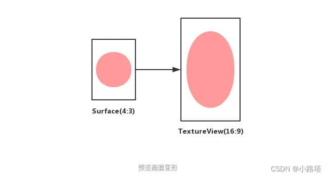

# Camera API2 使用说明

​    从 Android 5.0 开始，Google 引入了一套全新的相机框架 Camera2（android.hardware.camera2）并且废弃了旧的相机框架 Camera1（android.hardware.Camera）。Camera2 的出现给相机应用程序带来了巨大的变革，因为它的目的是为了给应用层提供更多的相机控制权限，从而构建出更高质量的相机应用程序。本文是 Camera2 教程的开篇作，本章将介绍以下几个内容：


一些 Camera2 的重要概念

一些只有 Camera2 才支持的高级特性

一些从 Camera1 迁移到 Camera2 的建议

本章涉及的代码很少，因为我们会在接下来的教程中深入介绍 Camera2 的 API。

## 一、 概览

### 1.1 Pipeline

​        Camera2 的 API 模型被设计成一个 Pipeline（管道），它按顺序处理每一帧的请求并返回请求结果给客户端。下面这张来自官方的图展示了 Pipeline 的工作流程，我们会通过一个简单的例子详细解释这张图。

Pipeline 示意图


为了解释上面的示意图，假设我们想要同时拍摄两张不同尺寸的图片，并且在拍摄的过程中闪光灯必须亮起来。整个拍摄流程如下：

创建一个用于从 Pipeline 获取图片的 CaptureRequest。

修改 CaptureRequest 的闪光灯配置，让闪光灯在拍照过程中亮起来。

创建两个不同尺寸的 Surface 用于接收图片数据，并且将它们添加到 CaptureRequest 中。

发送配置好的 CaptureRequest 到 Pipeline 中等待它返回拍照结果。

​    一个新的 CaptureRequest 会被放入一个被称作 Pending Request Queue 的队列中等待被执行，当 In-Flight Capture Queue 队列空闲的时候就会从 Pending Request Queue 获取若干个待处理的 CaptureRequest，并且根据每一个 CaptureRequest 的配置进行 Capture 操作。最后我们从不同尺寸的 Surface 中获取图片数据并且还会得到一个包含了很多与本次拍照相关的信息的 CaptureResult，流程结束。


### 1.2 Supported Hardware Level

​        相机功能的强大与否和硬件息息相关，不同厂商对 Camera2 的支持程度也不同，所以 Camera2 定义了一个叫做 Supported Hardware Level 的重要概念，其作用是将不同设备上的 Camera2 根据功能的支持情况划分成多个不同级别以便开发者能够大概了解当前设备上 Camera2 的支持情况。截止到 Android P 为止，从低到高一共有 LEGACY、LIMITED、FULL 和 LEVEL_3 四个级别：

LEGACY：向后兼容的级别，处于该级别的设备意味着它只支持 Camera1 的功能，不具备任何 Camera2 高级特性。

LIMITED：除了支持 Camera1 的基础功能之外，还支持部分 Camera2 高级特性的级别。

FULL：支持所有 Camera2 的高级特性。

LEVEL_3：新增更多 Camera2 高级特性，例如 YUV 数据的后处理等。


### 1.3 Capture

​        相机的所有操作和参数配置最终都是服务于图像捕获，例如对焦是为了让某一个区域的图像更加清晰，调节曝光补偿是为了调节图像的亮度。因此，在 Camera2 里面所有的相机操作和参数配置都被抽象成 Capture（捕获），所以不要简单的把 Capture 直接理解成是拍照，因为 Capture 操作可能仅仅是为了让预览画面更清晰而进行对焦而已。如果你熟悉 Camera1，那你可能会问 setFlashMode() 在哪？setFocusMode() 在哪？takePicture() 在哪？告诉你，它们都是通过 Capture 来实现的。

Capture 从执行方式上又被细分为【单次模式】、【多次模式】和【重复模式】三种，我们来一一解释下：

单次模式（One-shot）：指的是只执行一次的 Capture 操作，例如设置闪光灯模式、对焦模式和拍一张照片等。多个一次性模式的 Capture 会进入队列按顺序执行。

多次模式（Burst）：指的是连续多次执行指定的 Capture 操作，该模式和多次执行单次模式的最大区别是连续多次 Capture 期间不允许插入其他任何 Capture 操作，例如连续拍摄 100 张照片，在拍摄这 100 张照片期间任何新的 Capture 请求都会排队等待，直到拍完 100 张照片。多组多次模式的 Capture 会进入队列按顺序执行。

重复模式（Repeating）：指的是不断重复执行指定的 Capture 操作，当有其他模式的 Capture 提交时会暂停该模式，转而执行其他被模式的 Capture，当其他模式的 Capture 执行完毕后又会自动恢复继续执行该模式的 Capture，例如显示预览画面就是不断 Capture 获取每一帧画面。该模式的 Capture 是全局唯一的，也就是新提交的重复模式 Capture 会覆盖旧的重复模式 Capture。


### 1.4 CameraManager

​        CameraManager 是一个负责查询和建立相机连接的系统服务，它的功能不多，这里列出几个 CameraManager 的关键功能：

将相机信息封装到 CameraCharacteristics 中，并提获取 CameraCharacteristics 实例的方式。

根据指定的相机 ID 连接相机设备。

提供将闪光灯设置成手电筒模式的快捷方式。


### 1.5 CameraCharacteristics

​                CameraCharacteristics 是一个只读的相机信息提供者，其内部携带大量的相机信息，包括代表相机朝向的 LENS_FACING；判断闪光灯是否可用的 FLASH_INFO_AVAILABLE；获取所有可用 AE 模式的 CONTROL_AE_AVAILABLE_MODES 等等。如果你对 Camera1 比较熟悉，那么 CameraCharacteristics 有点像 Camera1 的 Camera.CameraInfo 或者 Camera.Parameters。


### 1.6 CameraDevice

CameraDevice 代表当前连接的相机设备，它的职责有以下四个：

根据指定的参数创建 CameraCaptureSession。

根据指定的模板创建 CaptureRequest。

关闭相机设备。

监听相机设备的状态，例如断开连接、开启成功和开启失败等。

        熟悉 Camera1 的人可能会说 CameraDevice 就是 Camera1 的 Camera 类，实则不是，Camera 类几乎负责了所有相机的操作，而 CameraDevice 的功能则十分的单一，就是只负责建立相机连接的事务，而更加细化的相机操作则交给了稍后会介绍的 CameraCaptureSession。


### 1.7 Surface

​        Surface 是一块用于填充图像数据的内存空间，例如你可以使用 SurfaceView 的 Surface 接收每一帧预览数据用于显示预览画面，也可以使用 ImageReader 的 Surface 接收 JPEG 或 YUV 数据。每一个 Surface 都可以有自己的尺寸和数据格式，你可以从 CameraCharacteristics 获取某一个数据格式支持的尺寸列表。


### 1.8 CameraCaptureSession

​        CameraCaptureSession 实际上就是配置了目标 Surface 的 Pipeline 实例，我们在使用相机功能之前必须先创建 CameraCaptureSession 实例。一个 CameraDevice 一次只能开启一个 CameraCaptureSession，绝大部分的相机操作都是通过向 CameraCaptureSession 提交一个 Capture 请求实现的，例如拍照、连拍、设置闪光灯模式、触摸对焦、显示预览画面等等。


### 1.9 CaptureRequest

​        CaptureRequest 是向 CameraCaptureSession 提交 Capture 请求时的信息载体，其内部包括了本次 Capture 的参数配置和接收图像数据的 Surface。CaptureRequest 可以配置的信息非常多，包括图像格式、图像分辨率、传感器控制、闪光灯控制、3A 控制等等，可以说绝大部分的相机参数都是通过 CaptureRequest 配置的。值得注意的是每一个 CaptureRequest 表示一帧画面的操作，这意味着你可以精确控制每一帧的 Capture 操作。


### 1.10 CaptureResult

​        CaptureResult 是每一次 Capture 操作的结果，里面包括了很多状态信息，包括闪光灯状态、对焦状态、时间戳等等。例如你可以在拍照完成的时候，通过 CaptureResult 获取本次拍照时的对焦状态和时间戳。需要注意的是，CaptureResult 并不包含任何图像数据，前面我们在介绍 Surface 的时候说了，图像数据都是从 Surface 获取的。


### 1.11 一些只有 Camera2 才支持的高级特性

​        如果要我给出强有力的理由解释为什么要使用 Camera2，那么通过 Camera2 提供的高级特性可以构建出更加高质量的相机应用程序应该是最佳理由了。

在开启相机之前检查相机信息 出于某些原因，你可能需要先检查相机信息再决定是否开启相机，例如检查闪光灯是否可用。在 Camera1 上，你无法在开机相机之前检查详细的相机信息，因为这些信息都是通过一个已经开启的相机实例提供的。在 Camera2 上，我们有了和相机实例完全剥离的 CameraCharacteristics 实例专门提供相机信息，所以我们可以在不开启相机的前提下检查几乎所有的相机信息。

在不开启预览的情况下拍照 在 Camera1 上，开启预览是一个很重要的环节，因为只有在开启预览之后才能进行拍照，因此即使显示预览画面与实际业务需求相违背的时候，你也不得不开启预览。而 Camera2 则不强制要求你必须先开启预览才能拍照。

一次拍摄多张不同格式和尺寸的图片 在 Camera1 上，一次只能拍摄一张图片，更不同谈多张不同格式和尺寸的图片了。而 Camera2 则支持一次拍摄多张图片，甚至是多张格式和尺寸都不同的图片。例如你可以同时拍摄一张 1440x1080 的 JPEG 图片和一张全尺寸的 RAW 图片。

控制曝光时间 在暗环境下拍照的时候，如果能够适当延长曝光时间，就可以让图像画面的亮度得到提高。在 Camera2 上，你可以在规定的曝光时长范围内配置拍照的曝光时间，从而实现拍摄长曝光图片，你甚至可以延长每一帧预览画面的曝光时间让整个预览画面在暗环境下也能保证一定的亮度。

连拍 连拍 30 张图片这样的功能在 Camera2 出现之前恐怕只有系统相机才能做到了（通过 OpenGL 截取预览画面的做法除外），也可能是出于这个原因，市面上的第三方相机无一例外都不支持连拍。有了 Camera2，你完全可以让你的相机应用程序支持连拍功能，甚至是连续拍 30 张使用不同曝光时间的图片。

灵活的 3A 控制 3A（AF、AE、AWB）的控制在 Camera2 上得到了最大化的放权，应用层可以根据业务需求灵活配置 3A 流程并且实时获取 3A 状态，而 Camera1 在 3A 的控制和监控方面提供的接口则要少了很多。例如你可以在拍照前进行 AE 操作，并且监听本这次拍照是否点亮闪光灯。


### 1.12 一些从 Camera1 迁移到 Camera2 的建议

​        如果你熟悉 Camera1，并且打算从 Camera1 迁移到 Camera2 的话，希望以下几个建议可以对你起到帮助：

Camera1 严格区分了预览和拍照两个流程，而 Camera2 则把这两个流程都抽象成了 Capture 行为，只不过一个是不断重复的 Capture，一个是一次性的 Capture 而已，所以建议你不要带着过多的 Camera1 思维使用 Camera2，避免因为思维上的束缚而无法充分利用 Camera2 灵活的 API。

如同 Camera1 一样，Camera2 的一些 API 调用也会耗时，所以建议你使用独立的线程执行所有的相机操作，尽量避免直接在主线程调用 Camera2 的 API，HandlerThread 是一个不错的选择。

Camera2 所有的相机操作都可以注册相关的回调接口，然后在不同的回调方法里写业务逻辑，这可能会让你的代码因为不够线性而错综复杂，建议你可以尝试使用子线程的阻塞方式来尽可能地保证代码的线性执行。例如在子线程阻塞等待 CaptureResult，然后继续执行后续的操作，而不是将代码拆分到到 CaptureCallback.onCaptureCompleted() 方法里。

你可以认为 Camera1 是 Camera2 的一个子集，也就是说 Camera1 能做的事情 Camera2 一定能做，反过来则不一定行得通。

如果你的应用程序需要同时兼容 Camera1 和 Camera2，个人建议分开维护，因为 Camera1 蹩脚的 API 设计很可能让 Camera2 灵活的 API 无法得到充分的发挥，另外将两个设计上完全不兼容的东西搅和在一起带来的痛苦可能远大于其带来便利性，多写一些冗余的代码也许还更开心。

官方说 Camera2 的性能会更好，这句话听听就好，起码在较早期的一些机器上运行 Camera2 的性能并没有比 Camera1 好。

当设备的 Supported Hardware Level 低于 FULL 的时候，建议还是使用 Camera1，因为 FULL 级别以下的 Camera2 能提供的功能几乎和 Camera1 一样，所以倒不如选择更加稳定的 Camera1。


## 二、 开关相机

### 2.1 创建相机项目

​        第一步要做的就是创建一个相机项目，这里我用 AS 创建了一个叫 Camera2Demo 的项目，并且有一个 Activity 叫 MainActivity。用的开发语言是 Kotlin。为了降低源码的阅读难度，不引入任何的第三方库，不去关注性能问题，也不进行任何模式上的设计，大部分的代码我都会写在这个 MainActivity 里面，所有的功能的实现都尽可能简化。

### 2.2 注册相关权限

​        在使用相机 API 之前，必须在 AndroidManifest.xml 注册相机权限 android.permission.CAMERA，声明我们开发的应用程序需要相机权限，另外如果你有保存照片的操作，那么读写 SD 卡的权限也是必须的：

```
<?xml version="1.0" encoding="utf-8"?>
<manifest xmlns:android="http://schemas.android.com/apk/res/android">
 
    <uses-permission android:name="android.permission.CAMERA" />
    <uses-permission android:name="android.permission.WRITE_EXTERNAL_STORAGE" />
 
</manifest>
```

​        需要注意的是 6.0 以上的系统需要我们在程序运行的时候进行动态权限申请，所以我们需要在程序启动的时候去检查权限，有任何一个必要的权限被用户拒绝时，我们就弹窗提示用户程序因为权限被拒绝而无法正常工作：

```
class MainActivity : AppCompatActivity() {
 
    companion object {
        private const val REQUEST_PERMISSION_CODE: Int = 1
        private val REQUIRED_PERMISSIONS: Array<String> = arrayOf(
                android.Manifest.permission.CAMERA,
                android.Manifest.permission.WRITE_EXTERNAL_STORAGE
        )
    }
 
    /**
     * 判断我们需要的权限是否被授予，只要有一个没有授权，我们都会返回 false，并且进行权限申请操作。
     *
     * @return true 权限都被授权
     */
    private fun checkRequiredPermissions(): Boolean {
        val deniedPermissions = mutableListOf<String>()
        for (permission in REQUIRED_PERMISSIONS) {
            if (ContextCompat.checkSelfPermission(this, permission) == PackageManager.PERMISSION_DENIED) {
                deniedPermissions.add(permission)
            }
        }
        if (deniedPermissions.isEmpty().not()) {
            requestPermissions(deniedPermissions.toTypedArray(), REQUEST_PERMISSION_CODE)
        }
        return deniedPermissions.isEmpty()
    }
}
```


### 2.3 配置相机特性要求

​        你一定不希望用户在一台没有任何相机的手机上安装你的相机应用程序吧，因为那样做是没有意义的。所以接下来要做的就是在 AndroidManifest.xml 中配置一些程序运行时必要的相机特性，如果这些特性不支持，那么用户在安装 apk 的时候就会因为条件不符合而无法安装。

```
<?xml version="1.0" encoding="utf-8"?>
<manifest xmlns:android="http://schemas.android.com/apk/res/android"
    package="com.darylgo.camera.sample">
 
    <uses-permission android:name="android.permission.CAMERA" />
    <uses-permission android:name="android.permission.WRITE_EXTERNAL_STORAGE" />
 
    <uses-feature
        android:name="android.hardware.camera"
        android:required="true" />
 
</manifest>
```

​        我们通过 `<uses-feature>` 标签声明了我们的应用程序必须在具有相机的手机上才能运行。另外你还可以配置更多的特性要求，例如必须支持自动对焦的相机才能运行你的应用程序，更多的特性可以在 官方文档 上查询。


### 2.4 获取 CameraManager 实例

​        CameraManager 是一个负责查询和建立相机连接的系统服务，可以说 CameraManager 是 Camera2 使用流程的起点，所以首先我们要通过 getSystemService() 获取 CameraManager 实例：

```
private val cameraManager: CameraManager by lazy { getSystemService(CameraManager::class.java) }
```


### 2.5 获取相机 ID 列表

​        接下来我们要获取所有可用的相机 ID 列表，这个 ID 列表的长度也代表有多少个相机可以使用。使用的 API 是 CameraManager.getCameraIdList()，它会返回一个包含所有可用相机 ID 的字符串数组：

```
val cameraIdList = cameraManager.cameraIdList
```

注意：Kotlin 会将很多 Java API 的 getter 直接转换成 Kotlin 的 property 语法，所以你会看到 getCameraIdList() 被转换成了 cameraIdList，后续会有很多类似的转换，这里提前说明下，避免误解。


### 2.6 根据相机 ID 获取 CameraCharacteristics

​        CameraCharacteristics 是相机信息的提供者，通过它我们可以获取所有相机信息，这里我们需要根据摄像头的方向筛选出前置和后置摄像头，并且要求相机的 Hardware Level 必须是 FULL 及以上，所以首先我们要获取所有相机的 CameraCharacteristics 实例，涉及的 API 是 CameraManager.getCameraCharacteristics()，它会根据你指定的相机 ID 返回对应的相机信息：

```
/**
 * 判断相机的 Hardware Level 是否大于等于指定的 Level。
 */
fun CameraCharacteristics.isHardwareLevelSupported(requiredLevel: Int): Boolean {
    val sortedLevels = intArrayOf(
            CameraCharacteristics.INFO_SUPPORTED_HARDWARE_LEVEL_LEGACY,
            CameraCharacteristics.INFO_SUPPORTED_HARDWARE_LEVEL_LIMITED,
            CameraCharacteristics.INFO_SUPPORTED_HARDWARE_LEVEL_FULL,
            CameraCharacteristics.INFO_SUPPORTED_HARDWARE_LEVEL_3
    )
    val deviceLevel = this[CameraCharacteristics.INFO_SUPPORTED_HARDWARE_LEVEL]
    if (requiredLevel == deviceLevel) {
        return true
    }
    for (sortedLevel in sortedLevels) {
        if (requiredLevel == sortedLevel) {
            return true
        } else if (deviceLevel == sortedLevel) {
            return false
        }
    }
    return false
}
```


```
// 遍历所有可用的摄像头 ID，只取出其中的前置和后置摄像头信息。
val cameraIdList = cameraManager.cameraIdList
cameraIdList.forEach { cameraId ->
    val cameraCharacteristics = cameraManager.getCameraCharacteristics(cameraId)
    if (cameraCharacteristics.isHardwareLevelSupported(REQUIRED_SUPPORTED_HARDWARE_LEVEL)) {
        if (cameraCharacteristics[CameraCharacteristics.LENS_FACING] == CameraCharacteristics.LENS_FACING_FRONT) {
            frontCameraId = cameraId
            frontCameraCharacteristics = cameraCharacteristics
        } else if (cameraCharacteristics[CameraCharacteristics.LENS_FACING] == CameraCharacteristics.LENS_FACING_BACK) {
            backCameraId = cameraId
            backCameraCharacteristics = cameraCharacteristics
        }
    }
}
```


### 2.7 开启相机

​    调用 CameraManager.openCamera() 方法开启相机，该方法要求我们传递两个参数，一个是相机 ID，一个是监听相机状态的 CameraStateCallback。当相机被成功开启的时候会通过 CameraStateCallback.onOpened() 方法回调一个 CameraDevice 实例给你，否则的话会通过 CameraStateCallback.onError() 方法回调一个 CameraDevice 实例和一个错误码给你。onOpened() 和 onError() 其实都意味着相机已经被开启了，唯一的区别是 onError() 表示开启过程中出了问题，你必须把传递给你的 CameraDevice 关闭，而不是继续使用它，具体的 API 介绍可以自行查看文档。另外，你必须确保在开启相机之前已经被授予了相机权限，否则会抛权限异常。一个比较稳妥的做法就是每次开启相机之前检查相机权限。下面是主要代码片段：

```
private data class OpenCameraMessage(val cameraId: String, val cameraStateCallback: CameraStateCallback)
 
@SuppressLint("MissingPermission")
override fun handleMessage(msg: Message): Boolean {
    when (msg.what) {
        MSG_OPEN_CAMERA -> {
            val openCameraMessage = msg.obj as OpenCameraMessage
            val cameraId = openCameraMessage.cameraId
            val cameraStateCallback = openCameraMessage.cameraStateCallback
            cameraManager.openCamera(cameraId, cameraStateCallback, cameraHandler)
            Log.d(TAG, "Handle message: MSG_OPEN_CAMERA")
        }
    }
    return false
}
 
private fun openCamera() {
    // 有限选择后置摄像头，其次才是前置摄像头。
    val cameraId = backCameraId ?: frontCameraId
    if (cameraId != null) {
        val openCameraMessage = OpenCameraMessage(cameraId, CameraStateCallback())
        cameraHandler?.obtainMessage(MSG_OPEN_CAMERA, openCameraMessage)?.sendToTarget()
    } else {
        throw RuntimeException("Camera id must not be null.")
    }
}
```


    private inner class CameraStateCallback : CameraDevice.StateCallback() {
        @WorkerThread
        override fun onOpened(camera: CameraDevice) {
            cameraDevice = camera
            runOnUiThread { Toast.makeText(this@MainActivity, "相机已开启", Toast.LENGTH_SHORT).show() }
        }
     
        @WorkerThread
        override fun onError(camera: CameraDevice, error: Int) {
            camera.close()
            cameraDevice = null
        }
    }


### 2.8 关闭相机

​        和其他硬件资源的使用一样，当我们不再需要使用相机时记得调用 CameraDevice.close() 方法及时关闭相机回收资源。关闭相机的操作至关重要，因为如果你一直占用相机资源，其他基于相机开发的功能都会无法正常使用，严重情况下直接导致其他相机相关的 APP 无法正常使用，当相机被完全关闭的时候会通过 CameraStateCallback.onCllosed() 方法通知你相机已经被关闭。那么在什么时候关闭相机最合适呢？我个人的建议是在 onPause() 的时候就一定要关闭相机，因为在这个时候相机页面已经不是用户关注的焦点，大部分情况下已经可以关闭相机了。

```
@SuppressLint("MissingPermission")
override fun handleMessage(msg: Message): Boolean {
    when (msg.what) {
        MSG_CLOSE_CAMERA -> {
            cameraDevice?.close()
            Log.d(TAG, "Handle message: MSG_CLOSE_CAMERA")
        }
    }
    return false
}
 
override fun onPause() {
    super.onPause()
    closeCamera()
}
 
private fun closeCamera() {
    cameraHandler?.sendEmptyMessage(MSG_CLOSE_CAMERA)
}
```


```
private inner class CameraStateCallback : CameraDevice.StateCallback() {
    @WorkerThread
    override fun onClosed(camera: CameraDevice) {
        cameraDevice = null
        runOnUiThread { Toast.makeText(this@MainActivity, "相机已关闭", Toast.LENGTH_SHORT).show() }
    }
}
```


## 三、预览

### 3.1 获取预览尺寸

​        在第二节提到了 CameraCharacteristics 是一个只读的相机信息提供者，其内部携带大量的相机信息，包括代表相机朝向的 LENS_FACING；判断闪光灯是否可用的 FLASH_INFO_AVAILABLE；获取所有可用 AE 模式的 CONTROL_AE_AVAILABLE_MODES 等等。如果你对 Camera1 比较熟悉，那么 CameraCharacteristics 有点像 Camera1 的 Camera.CameraInfo 或者 Camera.Parameters。CameraCharacteristics 以键值对的方式提供相机信息，你可以通过 CameraCharacteristics.get() 方法获取相机信息，该方法要求你传递一个 Key 以确定你要获取哪方面的相机信息，例如下面的代码展示了如何获取摄像头方向信息：

```
val cameraCharacteristics = cameraManager.getCameraCharacteristics(cameraId)
val lensFacing = cameraCharacteristics[CameraCharacteristics.LENS_FACING]
when(lensFacing) {
    CameraCharacteristics.LENS_FACING_FRONT -> { // 前置摄像头 }
    CameraCharacteristics.LENS_FACING_BACK -> { // 后置摄像头 }
    CameraCharacteristics.LENS_FACING_EXTERNAL -> { // 外置摄像头 }
}
```

​        CameraCharacteristics 有大量的 Key 定义，当你在开发过程中需要获取某些相机信息的时候再去查阅 API文档即可。

 由于不同厂商对相机的实现都会有差异，所以很多参数在不同的手机上支持的情况也不一样，相机的预览尺寸也是，所以接下来我们就要通过 CameraCharacteristics 获取相机支持的预览尺寸列表。所谓的预览尺寸，指的就是相机把画面输出到手机屏幕上供用户预览的尺寸，通常来说我们希望预览尺寸在不超过手机屏幕分辨率的情况下，越大越好。另外，出于业务需求，我们的相机可能需要支持多种不同的预览比例供用户选择，例如 4:3 和 16:9 的比例。由于不同厂商对相机的实现都会有差异，所以很多参数在不同的手机上支持的情况也不一样，相机的预览尺寸也是。所以在设置相机预览尺寸之前，我们先通过 CameraCharacteristics 获取该设备支持的所有预览尺寸：

```
val streamConfigurationMap = cameraCharacteristics.get(CameraCharacteristics.SCALER_STREAM_CONFIGURATION_MAP)
val supportedSizes = streamConfigurationMap?.getOutputSizes(SurfaceTexture::class.java)
```


​        从上面的代码可以看出预览尺寸列表并不是直接从 CameraCharacteristics 获取的，而是先通过 SCALER_STREAM_CONFIGURATION_MAP 获取 StreamConfigurationMap 对象，然后通过 StreamConfigurationMap.getOutputSizes() 方法获取尺寸列表，该方法会要求你传递一个 Class 类型，然后根据这个类型返回对应的尺寸列表，如果给定的类型不支持，则返回 null，你可以通过 StreamConfigurationMap.isOutputSupportedFor() 方法判断某一个类型是否被支持，常见的类型有：

ImageReader：常用来拍照或接收 YUV 数据。

MediaRecorder：常用来录制视频。

MediaCodec：常用来录制视频。

SurfaceHolder：常用来显示预览画面。

SurfaceTexture：常用来显示预览画面。


 由于我们使用的是 SurfaceTexture，所以显然这里我们就要传递 SurfaceTexture.class 获取支持的尺寸列表。如果我们把所有的预览尺寸都打印出来看时，会发现一个比较特别的情况，就是预览尺寸的宽是长边，高是短边，例如 1920x1080，而不是 1080x1920，这是因为相机 Sensor 的宽是长边，而高是短边。

在获取到预览尺寸列表之后，我们要根据自己的实际需求过滤出其中一个最符合要求的尺寸，并且把它设置给相机，在我们的 Demo 里，只有当预览尺寸的比例和大小都满足要求时才能被设置给相机，如下所示：

```
@WorkerThread
private fun getOptimalSize(cameraCharacteristics: CameraCharacteristics, clazz: Class<*>, maxWidth: Int, maxHeight: Int): Size? {
    val aspectRatio = maxWidth.toFloat() / maxHeight
    val streamConfigurationMap = cameraCharacteristics.get(CameraCharacteristics.SCALER_STREAM_CONFIGURATION_MAP)
    val supportedSizes = streamConfigurationMap?.getOutputSizes(clazz)
    if (supportedSizes != null) {
        for (size in supportedSizes) {
            if (size.width.toFloat() / size.height == aspectRatio && size.height <= maxHeight && size.width <= maxWidth) {
                return size
            }
        }
    }
    return null
}
```


### 3.2 配置预览尺寸

​        在获取适合的预览尺寸之后，接下来就是配置预览尺寸使其生效了。在配置尺寸方面，Camera2 和 Camera1 有着很大的不同，Camera1 是将所有的尺寸信息都设置给相机，而 Camera2 则是把尺寸信息设置给 Surface，例如接收预览画面的 SurfaceTexture，或者是接收拍照图片的 ImageReader，相机在输出图像数据的时候会根据 Surface 配置的 Buffer 大小输出对应尺寸的画面。

获取 Surface 的方式有很多种，可以通过 TextureView、SurfaceView、ImageReader 甚至是通过 OpenGL 创建，这里我们要将预览画面显示在屏幕上，所以我们选择了 TextureView，并且通过 TextureView.SurfaceTextureListener 回调接口监听 SurfaceTexture 的状态，在获取可用的 SurfaceTexture 对象之后通过 SurfaceTexture.setDefaultBufferSize() 设置预览画面的尺寸，最后使用 Surface(SurfaceTexture) 构造方法创建出预览的 Surface 对象：

首先，我们在布局文件中添加一个 TextureView，并给它取个 ID 叫 camera_preview：

    <?xml version="1.0" encoding="utf-8"?>
    <androidx.constraintlayout.widget.ConstraintLayout xmlns:android="http://schemas.android.com/apk/res/android"
        xmlns:app="http://schemas.android.com/apk/res-auto"
        xmlns:tools="http://schemas.android.com/tools"
        android:layout_width="match_parent"
        android:layout_height="match_parent"
        tools:context=".MainActivity">
     
        <TextureView
            android:id="@+id/camera_preview"
            android:layout_width="0dp"
            android:layout_height="0dp"
            app:layout_constraintBottom_toBottomOf="parent"
            app:layout_constraintLeft_toLeftOf="parent"
            app:layout_constraintRight_toRightOf="parent"
            app:layout_constraintTop_toTopOf="parent" />
     
    </androidx.constraintlayout.widget.ConstraintLayout>


​        然后我们在 Activity 里获取 TextureView 对象，并且注册一个 TextureView.SurfaceTextureListener 用于监听 SurfaceTexture 的状态：

    private inner class PreviewSurfaceTextureListener : TextureView.SurfaceTextureListener {
        @MainThread
        override fun onSurfaceTextureSizeChanged(surfaceTexture: SurfaceTexture, width: Int, height: Int) = Unit
     
        @MainThread
        override fun onSurfaceTextureUpdated(surfaceTexture: SurfaceTexture) = Unit
     
        @MainThread
        override fun onSurfaceTextureDestroyed(surfaceTexture: SurfaceTexture): Boolean = false
     
        @MainThread
        override fun onSurfaceTextureAvailable(surfaceTexture: SurfaceTexture, width: Int, height: Int) {
            previewSurfaceTexture = surfaceTexture
        }
    }


```
cameraPreview = findViewById<CameraPreview>(R.id.camera_preview)
cameraPreview.surfaceTextureListener = PreviewSurfaceTextureListener()
```

​        当 SurfaceTexture 可用的时候会回调 onSurfaceTextureAvailable() 方法并且把 SurfaceTexture 对象和尺寸传递给我们，此时我们要做的就是通过 SurfaceTexture.setDefaultBufferSize() 设置预览画面的尺寸并且创建 Surface 对象：

```
val previewSize = getOptimalSize(cameraCharacteristics, SurfaceTexture::class.java, width, height)!!
previewSurfaceTexture.setDefaultBufferSize(previewSize.width, previewSize.height)
previewSurface = Surface(previewSurfaceTexture)
```

​        到这里，用于预览的 Surface 就准备好了，接下来我们来看下如何创建 CameraCaptureSession。


### 3.3 创建 CameraCaptureSession

​        用于接收预览画面的 Surface 准备就绪了，接下来我们要使用这个 Surface 创建一个 CameraCaptureSession 实例，涉及的方法是 CameraDevice.createCaptureSession()，该方法要求你传递以下三个参数：

outputs：所有用于接收图像数据的 Surface，例如本章用于接收预览画面的 Surface，后续还会有用于拍照的 Surface，这些 Surface 必须在创建 Session 之前就准备好，并且在创建 Session 的时候传递给底层用于配置 Pipeline。

callback：用于监听 Session 状态的 CameraCaptureSession.StateCallback 对象，就如同开关相机一样，创建和销毁 Session 也需要我们注册一个状态监听器。

handler：用于执行 CameraCaptureSession.StateCallback 的 Handler 对象，可以是异步线程的 Handler，也可以是主线程的 Handler，在我们的 Demo 里使用的是主线程 Handler。

```
private inner class SessionStateCallback : CameraCaptureSession.StateCallback() {
 
@MainThreadoverride 
fun onConfigureFailed(session: CameraCaptureSession) {
  }
@MainThreadoverride 
fun onConfigured(session: CameraCaptureSession) {
  }
@MainThreadoverride 
fun onClosed(session: CameraCaptureSession) {
  }
}
```


```
val sessionStateCallback = SessionStateCallback()
val outputs = listOf(previewSurface)
cameraDevice.createCaptureSession(outputs, sessionStateCallback, mainHandler)
```


### 3.4 创建 CaptureRequest

​        在介绍如何开启和关闭预览之前，我们有必要先介绍下 CaptureRequest，因为它是我们执行任何相机操作都绕不开的核心类，因为 CaptureRequest 是向 CameraCaptureSession 提交 Capture 请求时的信息载体，其内部包括了本次 Capture 的参数配置和接收图像数据的 Surface。CaptureRequest 可以配置的信息非常多，包括图像格式、图像分辨率、传感器控制、闪光灯控制、3A 控制等等，可以说绝大部分的相机参数都是通过 CaptureRequest 配置的。可以通过 CameraDevice.createCaptureRequest() 方法创建一个 CaptureRequest.Builder 对象，该方法只有一个参数 templateType 用于指定使用何种模板创建 CaptureRequest.Builder 对象。因为 CaptureRequest 可以配置的参数实在是太多了，如果每一个参数都要去配置，那真的是既复杂又费时，所以 Camera2 根据使用场景的不同，为我们事先配置好了一些常用的参数模板：

TEMPLATE_PREVIEW：适用于配置预览的模板。

TEMPLATE_RECORD：适用于视频录制的模板。

TEMPLATE_STILL_CAPTURE：适用于拍照的模板。

TEMPLATE_VIDEO_SNAPSHOT：适用于在录制视频过程中支持拍照的模板。

TEMPLATE_MANUAL：适用于希望自己手动配置大部分参数的模板。

​    这里我们要创建一个用于预览的 CaptureRequest，所以传递了 TEMPLATE_PREVIEW 作为参数：

```
val requestBuilder = cameraDevice.createCaptureRequest(CameraDevice.TEMPLATE_PREVIEW)
```

​        一个 CaptureRequest 除了需要配置很多参数之外，还要求至少配置一个 Surface（任何相机操作的本质都是为了捕获图像），并且配置的 Surface 必须属于创建 Session 时添加的那些 Surface，涉及的方法是 CaptureRequest.Builder.addTarget()，你可以多次调用该方法添加多个 Surface。

```
requestBuilder.addTarget(previewSurface)
```

​        最后，我们通过 CaptureRequest.Builder.build() 方法创建出一个只读的 CaptureRequest 实例：

```
val request = requestBuilder.build()
```


### 3.5 开启和停止预览

​        在 Camera2 里，预览本质上是不断重复执行的 Capture 操作，每一次 Capture 都会把预览画面输出到对应的 Surface 上，涉及的方法是 CameraCaptureSession.setRepeatingRequest()，该方法有三个参数：

request：在不断重复执行 Capture 时使用的 CaptureRequest 对象。

callback：监听每一次 Capture 状态的 CameraCaptureSession.CaptureCallback 对象，例如 onCaptureStarted() 意味着一次 Capture 的开始，而 onCaptureCompleted() 意味着一次 Capture 的结束。

hander：用于执行 CameraCaptureSession.CaptureCallback 的 Handler 对象，可以是异步线程的 Handler，也可以是主线程的 Handler，在我们的 Demo 里使用的是主线程 Handler。

了解了核心方法之后，开启预览的操作就很显而易见了：

```
val requestBuilder = cameraDevice.createCaptureRequest(CameraDevice.TEMPLATE_PREVIEW)
requestBuilder.addTarget(previewSurface)
val request = requestBuilder.build()
captureSession.setRepeatingRequest(request, RepeatingCaptureStateCallback(), mainHandler)
```

​        如果要关闭预览的话，可以通过 CameraCaptureSession.stopRepeating() 停止不断重复执行的 Capture 操作：

```
captureSession.stopRepeating()
```

​        到目前为止，如果一切正常的话，预览画面应该就已经显示出来了。


### 3.6 适配预览比例

​        前面我们使用了一个占满屏幕的 TextureView 来显示预览画面，并且预览尺寸我们选择了 4:3 的比例，你很可能会看到预览画面变形的情况，这因为 Surface 的比例和 TextureView 的比例不一致导致的，你可以想象 Surface 就是一张图片，TextureView 就是 ImageView，将 4:3 的图片显示在 16:9 的 ImageView 上必然会出现画面拉伸变形的情况：

预览画面变形



所以接下来我们要学习的是如何适配不同的预览比例。预览比例的适配有多种方式：

根据预览比例修改 TextureView 的宽高，比如用户选择了 4:3 的预览比例，这个时候我们会选取 4:3 的预览尺寸并且把 TextureView 修改成 4:3 的比例，从而让画面不会变形。

使用固定的预览比例，然后根据比例去选取适合的预览尺寸，例如固定 4:3 的比例，选择 1440x1080 的尺寸，并且把 TextureView 的宽高也设置成 4:3。

固定 TextureView 的宽高，然后根据预览比例使用 TextureView.setTransform() 方法修改预览画面绘制在 TextureView 上的方式，从而让预览画面不变形，这跟 ImageView.setImageMatrix() 如出一辙。

简单来说，解决预览画面变形的问题，本质上就是解决画面和画布比例不一致的问题。在我们的 Demo 中，出于简化的目的，我们选择了第二种方式适配比例，因为这种方式实现起来比较简单，所以我们会写一个自定义的 TextureView，让它的比例固定是 4:3，它的宽度固定填满父布局，高度根据比例动态计算：

```
class CameraPreview @JvmOverloads constructor(context: Context, attrs: AttributeSet, defStyleAttr: Int = 0) : TextureView(context, attrs, defStyleAttr) {
    override fun onMeasure(widthMeasureSpec: Int, heightMeasureSpec: Int) {
        val width = MeasureSpec.getSize(widthMeasureSpec)
        setMeasuredDimension(width, width / 3 * 4)
    }
}
```


### 3.7 认识 ImageReader

​        在 Camera2 里，ImageReader 是获取图像数据的一个重要途径，我们可以通过它获取各种各样格式的图像数据，例如 JPEG、YUV 和 RAW 等等。我们可以通过 ImageReader.newInstance() 方法创建一个 ImageReader 对象，该方法要求我们传递以下四个参数：

width：图像数据的宽度。

height：图像数据的高度。

format：图像数据的格式，定义在 ImageFormat 里，例如 ImageFormat.YUV_420_888。

maxImages：最大 Image 个数，可以理解成 Image 对象池的大小。


当有图像数据生成的时候，ImageReader 会通过通过 ImageReader.OnImageAvailableListener.onImageAvailable() 方法通知我们，然后我们可以调用 ImageReader.acquireNextImage() 方法获取存有最新数据的 Image 对象，而在 Image 对象里图像数据又根据不同格式被划分多个部分分别存储在单独的 Plane 对象里，我们可以通过调用 Image.getPlanes() 方法获取所有的 Plane 对象的数组，最后通过 Plane.getBuffer() 获取每一个 Plane 里存储的图像数据。以 YUV 数据为例，当有 YUV 数据生成的时候，数据会被分成 Y、U、V 三部分分别存储到 Plane 里，如下图所示：


```
override fun onImageAvailable(imageReader: ImageReader) {
    val image = imageReader.acquireNextImage()
    if (image != null) {
        val planes = image.planes
        val yPlane = planes[0]
        val uPlane = planes[1]
        val vPlane = planes[2]
        val yBuffer = yPlane.buffer // Data from Y channel
        val uBuffer = uPlane.buffer // Data from U channel
        val vBuffer = vPlane.buffer // Data from V channel
    }
    image?.close()
}
```


​        上面的代码是获取 YUV 数据的流程，特别要注意的是最后一步调用 Image.close() 方法十分重要，当我们不再需要使用某一个 Image 对象的时候记得通过该方法释放资源，因为 Image 对象实际上来自于一个创建 ImageReader 时就确定大小的对象池，如果我们不释放它的话就会导致对象池很快就被耗光，并且抛出一个异常。类似的的当我们不再需要使用 某一个 ImageReader 对象的时候，也要记得调用 ImageReader.close() 方法释放资源。


### 3.8 获取预览数据

​        介绍完 ImageReader 之后，接下来我们就来创建一个接收每一帧预览数据的 ImageReader，并且数据格式为 YUV_420_888。首先，我们要先判断 YUV_420_888 数据格式是否支持，所以会有如下的代码：

```
val imageFormat = ImageFormat.YUV_420_888
val streamConfigurationMap = cameraCharacteristics[CameraCharacteristics.SCALER_STREAM_CONFIGURATION_MAP]
if (streamConfigurationMap?.isOutputSupportedFor(imageFormat) == true) {
    // YUV_420_888 is supported
}
```

​        接着，我们使用前面已经确定好的预览尺寸创建一个 ImageReader，并且注册一个 ImageReader.OnImageAvailableListener 用于监听数据的更新，最后通过 ImageReader.getSurface() 方法获取接收预览数据的 Surface：

```
val imageFormat = ImageFormat.YUV_420_888
val streamConfigurationMap = cameraCharacteristics[CameraCharacteristics.SCALER_STREAM_CONFIGURATION_MAP]
if (streamConfigurationMap?.isOutputSupportedFor(imageFormat) == true) {
    previewDataImageReader = ImageReader.newInstance(previewSize.width, previewSize.height, imageFormat, 3)
    previewDataImageReader?.setOnImageAvailableListener(OnPreviewDataAvailableListener(), cameraHandler)
    previewDataSurface = previewDataImageReader?.surface
}
```

​        创建完 ImageReader，并且获取它的 Surface 之后，我们就可以在创建 Session 的时候添加这个 Surface 告诉 Pipeline 我们有一个专门接收 YUV_420_888 的 Surface：

```
val sessionStateCallback = SessionStateCallback()
val outputs = mutableListOf<Surface>()
val previewSurface = previewSurface
val previewDataSurface = previewDataSurface
outputs.add(previewSurface!!)
if (previewDataSurface != null) {
    outputs.add(previewDataSurface)
}
cameraDevice.createCaptureSession(outputs, sessionStateCallback, mainHandler)
```

​        获取预览数据和显示预览画面一样都是不断重复执行的 Capture 操作，所以我们只需要在开始预览的时候通过 CaptureRequest.Builder.addTarget() 方法添加接收预览数据的 Surface 即可，所以一个 CaptureRequest 会有两个 Surface，一个现实预览画面的 Surface，一个接收预览数据的 Surface：

```
val requestBuilder = cameraDevice.createCaptureRequest(CameraDevice.TEMPLATE_PREVIEW)
val previewSurface = previewSurface
val previewDataSurface = previewDataSurface
requestBuilder.addTarget(previewSurface!!)
if (previewDataSurface != null) {
    requestBuilder.addTarget(previewDataSurface)
}
val request = requestBuilder.build()
captureSession.setRepeatingRequest(request, RepeatingCaptureStateCallback(), mainHandler)
```

​        在开始预览之后，每一次刷新预览画面的时候，都会通过 ImageReader.OnImageAvailableListener.onImageAvailable() 方法通知我们：


         /**
         * Called every time the preview frame data is available.
         */
        override fun onImageAvailable(imageReader: ImageReader) {
            val image = imageReader.acquireNextImage()
            if (image != null) {
                val planes = image.planes
                val yPlane = planes[0]
                val uPlane = planes[1]
                val vPlane = planes[2]
                val yBuffer = yPlane.buffer // Data from Y channel
                val uBuffer = uPlane.buffer // Data from U channel
                val vBuffer = vPlane.buffer // Data from V channel
            }
            image?.close()
        }
    }


### 3.9 如何矫正图像数据的方向

​        如果你熟悉 Camera1 的话，也许已经发现了一个问题，就是 Camera2 不需要经过任何预览画面方向的矫正，就可以正确现实画面，而 Camera1 则需要根据摄像头传感器的方向进行预览画面的方向矫正。其实，Camera2 也需要进行预览画面的矫正，只不过系统帮我们做了而已，当我们使用 TextureView 或者 SurfaceView 进行画面预览的时候，系统会根据【设备自然方向】、【摄像传感器方向】和【显示方向】自动矫正预览画面的方向，并且该矫正规则只适用于显示方向和和设备自然方向一致的情况下，举个例子，当我们把手机横放并且允许自动旋转屏幕的时候，看到的预览画面的方向就是错误的。此外，当我们使用一个 GLSurfaceView 显示预览画面或者使用 ImageReader 接收图像数据的时候，系统都不会进行画面的自动矫正，因为它不知道我们要如何显示预览画面，所以我们还是有必要学习下如何矫正图像数据的方向，在介绍如何矫正图像数据方向之前，我们需要先了解几个概念，它们分别是【设备自然方向】、【局部坐标系】、【显示方向】和【摄像头传感器方向】。

**设备方向**
        当我们谈论方向的时候，实际上都是相对于某一个 0° 方向的角度，这个 0° 方向被称作自然方向，例如人站立的时候就是自然方向，你总不会认为一个人要倒立的时候才是自然方向吧，而接下来我们要谈论的设备方向就有的自然方向的定义。

  设备方向指的是硬件设备在空间中的方向与其自然方向的顺时针夹角。这里提到的自然方向指的就是我们手持一个设备的时候最习惯的方向，比如手机我们习惯竖着拿，而平板我们则习惯横着拿，所以通常情况下手机的自然方向就是竖着的时候，平板的自然方向就是横着的时候。


以手机为例，我们可以有以下四个比较常见的设备方向：

当我们把手机垂直放置且屏幕朝向我们的时候，设备方向为 0°，即设备自然方向

当我们把手机向右横放且屏幕朝向我们的时候，设备方向为 90°

当我们把手机倒着放置且屏幕朝向我们的时候，设备方向为 180°

当我们把手机向左横放且屏幕朝向我们的时候，设备方向为 270°


了解了设备方向的概念之后，我们可以通过 OrientationEventListener 监听设备的方向，进而判断设备当前是否处于自然方向，当设备的方向发生变化的时候会回调 OrientationEventListener.onOrientationChanged(int) 方法，传给我们一个 0° 到 359° 的方向值，其中 0° 就代表设备处于自然方向。


局部坐标系
        所谓的局部坐标系指的是当设备处于自然方向时，相对于设备屏幕的坐标系，该坐标系是固定不变的，不会因为设备方向的变化而改变，下图是基于手机的局部坐标系示意图：


x 轴是当手机处于自然方向时，和手机屏幕平行且指向右边的坐标轴。

y 轴是当手机处于自然方向时，和手机屏幕平行且指向上方的坐标轴。

z 轴是当手机处于自然方向时，和手机屏幕垂直且指向屏幕外面的坐标轴。


为了进一步解释【坐标系是固定不变的，不会因为设备方向的变化而改变】的概念，这里举个例子，当我们把手机向右横放且屏幕朝向我们的时候，此时设备方向为 90°，局部坐标系相对于手机屏幕是保持不变的，所以 y 轴正方向指向右边，x 轴正方向指向下方，z 轴正方向还是指向屏幕外面，如下图所示：


**显示方向**
          显示方向指的是屏幕上显示画面与局部坐标系 y 轴的顺时针夹角。为了更清楚的说明这个概念，我们举一个例子，假设我们将手机向右横放看电影，此时画面是朝上的，如下图所示：


**屏幕方向**
        从上图来看，手机向右横放会导致设备方向变成了 90°，但是显示方向却是 270°，因为它是相对局部坐标系 y 轴的顺时针夹角，所以跟设备方向没有任何关系。如果把图中的设备换成是平板，结果就不一样了，因为平板横放的时候就是它的设备自然方向，y 轴朝上，屏幕画面显示的方向和 y 轴的夹角是 0°，设备方向也是 0°。


总结一下，设备方向是相对于其现实空间中自然方向的角度，而显示方向是相对局部坐标系的角度。


**摄像头传感器方向**
        摄像头传感器方向指的是传感器采集到的画面方向经过顺时针旋转多少度之后才能和局部坐标系的 y 轴正方向一致，也就是通过 CameraCharacteristics.SENSOR_ORIENTATION 获取到的值。

例如 orientation 为 90° 时，意味将摄像头采集到的画面顺时针旋转 90° 之后，画面的方向就和局部坐标系的 y 轴正方向一致，换个说法就是原始画面的方向和 y 轴的夹角是逆时针 90°。

最后要考虑一个特殊情况，就是前置摄像头的画面是做了镜像处理的，也就是所谓的前置镜像操作，这个情况下， orientation 的值并不是实际要旋转的角度，需要取它的镜像值才是真正要旋转的角度，例如 orientation 为 270°，实际要旋转的角度是 90°。


注意：摄像头传感器方向在不同的手机上可能不一样，大部分手机都是 90°，也有小部分是 0° 的，所以我们要通过 CameraCharacteristics.SENSOR_ORIENTATION 去判断方向，而不是假设所有设备的摄像头传感器方向都是 90°。


**矫正图像数据的方向**
        介绍完几个方向的概念之后，就来说下如何校正相机的预览画面。我们会举几个例子，由简到繁逐步说明预览画面校正过程中要注意的事项。

​    首先我们要知道的是摄像头传感器方向只有 0°、90°、180°、270° 四个可选值，并且这些值是相对于局部坐标系 的 y 轴定义出来的，现在假设一个相机 APP 的画面在手机上是竖屏显示，也就是显示方向是 0° ，并且假设摄像头传感器的方向是 90°，如果我们没有校正画面的话，则显示的画面如下图所示（忽略画面变形）：


​    很明显，上面显示的画面内容方向是错误的，里面的人物应该是垂直向上显示才对，所以我们应该吧摄像头采集到的画面顺时针旋转 90°，才能得到正确的显示结果，如下图所示：


​    上面的例子是建立在我们的显示方向是 0° 的时候，如果我们要求显示方向是 90°，也就是手机向左横放的时候画面才是正的，并且假设摄像头传感器的方向还是 90°，如果我们没有校正画面的话，则显示的画面如下图所示（忽略画面变形）：


​    此时，我们知道传感器的方向是 90°，如果我们将传感器采集到的画面顺时针旋转 90° 显然是无法得到正确的画面，因为它是相对于局部坐标系 y 轴的角度，而不是实际显示方向，所以在做画面校正的时候我们还要把实际显示方向也考虑进去，这里实际显示方向是 90°，所以我们应该把传感器采集到的画面顺时针旋转 180°（摄像头传感器方向 + 实际显示方向） 才能得到正确的画面，显示的画面如下图所示（忽略画面变形）：


总结一下，在校正画面方向的时候要同时考虑两个因素，即摄像头传感器方向和显示方向。接下来我们要回到相机应用里，看看通过代码是如何实现预览画面方向校正的。

​    如果你有自己看过 Camera 的官方 API 文档，你会发现官方已经写好了一个同时考虑显示方向和摄像头传感器方向的方法，我把它翻译成 Kotlin 语法：

```
private fun getDisplayRotation(cameraCharacteristics: CameraCharacteristics): Int {
    val rotation = windowManager.defaultDisplay.rotation
    val degrees = when (rotation) {
        Surface.ROTATION_0 -> 0
        Surface.ROTATION_90 -> 90
        Surface.ROTATION_180 -> 180
        Surface.ROTATION_270 -> 270
        else -> 0
    }
    val sensorOrientation = cameraCharacteristics[CameraCharacteristics.SENSOR_ORIENTATION]!!
    return if (cameraCharacteristics[CameraCharacteristics.LENS_FACING] == CameraCharacteristics.LENS_FACING_FRONT) {
        (360 - (sensorOrientation + degrees) % 360) % 360
    } else {
        (sensorOrientation - degrees + 360) % 360
    }
}
```

​        如果你已经完全理解前面介绍的那些角度的概念，那你应该很容易就能理解上面这段代码，实际上就是通过 WindowManager 获取当前的显示方向，然后再参照摄像头传感器方向以及是否是前后置，最后计算出我们实际要旋转的角度。


## 四、 拍照

### 4.1 理解 Capture 工作流程

在正式介绍如何拍照之前，我们有必要深入理解几种不同模式的 Capture 的工作流程，只要理解它们的工作流程就很容易掌握各种拍照模式的实现原理，在第一章Camera API1 简叙述 里我们介绍了 Capture 有以下几种不同模式：

单次模式（One-shot）：指的是只执行一次的 Capture 操作，例如设置闪光灯模式、对焦模式和拍一张照片等。多个单次模式的 Capture 会进入队列按顺序执行。

多次模式（Burst）：指的是连续多次执行指定的 Capture 操作，该模式和多次执行单次模式的最大区别是连续多次 Capture 期间不允许插入其他任何 Capture 操作，例如连续拍摄 100 张照片，在拍摄这 100 张照片期间任何新的 Capture 请求都会排队等待，直到拍完 100 张照片。多组多次模式的 Capture 会进入队列按顺序执行。

重复模式（Repeating）：指的是不断重复执行指定的 Capture 操作，当有其他模式的 Capture 提交时会暂停该模式，转而执行其他被模式的 Capture，当其他模式的 Capture 执行完毕后又会自动恢复继续执行该模式的 Capture，例如显示预览画面就是不断 Capture 获取每一帧画面。该模式的 Capture 是全局唯一的，也就是新提交的重复模式 Capture 会覆盖旧的重复模式 Capture。

​    我们举个例子来进一步说明上面三种模式，假设我们的相机应用程序开启了预览，所以会提交一个重复模式的 Capture 用于不断获取预览画面，然后我们提交一个单次模式的 Capture，接着我们又提交了一组连续三次的多次模式的 Capture，这些不同模式的 Capture 会按照下图所示被执行：


Capture 工作原理


下面是几个重要的注意事项：

无论 Capture 以何种模式被提交，它们都是按顺序串行执行的，不存在并行执行的情况。

重复模式是一个比较特殊的模式，因为它会保留我们提交的 CaptureRequest 对象用于不断重复执行 Capture 操作，所以大多数情况下重复模式的 CaptureRequest 和其他模式的 CaptureRequest 是独立的，这就会导致重复模式的参数和其他模式的参数会有一定的差异，例如重复模式不会配置 CaptureRequest.AF_TRIGGER_START，因为这会导致相机不断触发对焦的操作。

如果某一次的 Capture 没有配置预览的 Surface，例如拍照的时候，就会导致本次 Capture 不会将画面输出到预览的 Surface 上，进而导致预览画面卡顿的情况，所以大部分情况下我们都会将预览的 Surface 添加到所有的 CaptureRequest 里。


### 4.2 如何拍摄单张照片

​        拍摄单张照片是最简单的拍照模式，它使用的就是单次模式的 Capture，我们会使用 ImageReader 创建一个接收照片的 Surface，并且把它添加到 CaptureRequest 里提交给相机进行拍照，最后通过 ImageReader 的回调获取 Image 对象，进而获取 JPEG 图像数据进行保存。


#### 4.2.1 定义回调接口

​        当拍照完成的时候我们会得到两个数据对象，一个是通过 onImageAvailable() 回调给我们的存储图像数据的 Image，一个是通过 onCaptureCompleted() 回调给我们的存储拍照信息的 CaptureResult，它们是一一对应的，所以我们定义了如下两个回调接口：

```
private val captureResults: BlockingQueue<CaptureResult> = LinkedBlockingDeque()
 
private inner class CaptureImageStateCallback : CameraCaptureSession.CaptureCallback() {
    @MainThread
    override fun onCaptureCompleted(session: CameraCaptureSession, request: CaptureRequest, result: TotalCaptureResult) {
        super.onCaptureCompleted(session, request, result)
        captureResults.put(result)
    }
}
```


```
private inner class OnJpegImageAvailableListener : ImageReader.OnImageAvailableListener {
    @WorkerThread
    override fun onImageAvailable(imageReader: ImageReader) {
        val image = imageReader.acquireNextImage()
        val captureResult = captureResults.take()
        if (image != null && captureResult != null) {
            // Save image into sdcard.
        }
    }
}
```


#### 4.2.2 创建 ImageReader

​        创建 ImageReader 需要我们指定照片的大小，所以首先我们要获取支持的照片尺寸列表，并且从中筛选出合适的尺寸，假设我们要求照片的尺寸最大不能超过 4032x3024，并且比例必须是 4:3，所以会有如下筛选尺寸的代码片段：

```
@WorkerThread
private fun getOptimalSize(cameraCharacteristics: CameraCharacteristics, clazz: Class<*>, maxWidth: Int, maxHeight: Int): Size? {
    val streamConfigurationMap = cameraCharacteristics.get(CameraCharacteristics.SCALER_STREAM_CONFIGURATION_MAP)
    val supportedSizes = streamConfigurationMap?.getOutputSizes(clazz)
    return getOptimalSize(supportedSizes, maxWidth, maxHeight)
}
 
@AnyThread
private fun getOptimalSize(supportedSizes: Array<Size>?, maxWidth: Int, maxHeight: Int): Size? {
    val aspectRatio = maxWidth.toFloat() / maxHeight
    if (supportedSizes != null) {
        for (size in supportedSizes) {
            if (size.width.toFloat() / size.height == aspectRatio && size.height <= maxHeight && size.width <= maxWidth) {
                return size
            }
        }
    }
    return null
}
```

​        接着我们就可以筛选出合适的尺寸，然后创建一个图像格式是 JPEG 的 ImageReader 对象，并且获取它的 Surface：

```
val imageSize = getOptimalSize(cameraCharacteristics, ImageReader::class.java, maxWidth, maxHeight)!!
jpegImageReader = ImageReader.newInstance(imageSize.width, imageSize.height, ImageFormat.JPEG, 5)
jpegImageReader?.setOnImageAvailableListener(OnJpegImageAvailableListener(), cameraHandler)
jpegSurface = jpegImageReader?.surface
```


#### 4.2.3 创建 CaptureRequest

​        接下来我们使用 TEMPLATE_STILL_CAPTURE 模板创建一个用于拍照的 CaptureRequest.Builder 对象，并且添加拍照的 Surface 和预览的 Surface 到其中：

```
captureImageRequestBuilder = cameraDevice.createCaptureRequest(CameraDevice.TEMPLATE_STILL_CAPTURE)
captureImageRequestBuilder.addTarget(previewDataSurface)
captureImageRequestBuilder.addTarget(jpegSurface)
```

注意:你可能会疑问为什么拍照用的 CaptureRequest 对象需要添加预览的 Surface，这一点我们在前面有解释过了，如果某一次的 Capture 没有配置预览的 Surface，例如拍照的时候，就会导致本次 Capture 不会将画面输出到预览的 Surface 上，进而导致预览画面卡顿的情况，所以大部分情况下我们都会将预览的 Surface 添加到所有的 CaptureRequest 里。


#### 4.2.4 矫正 JPEG 图片方向

​        在 前面预览章节里我们介绍了一些方向的概念，也提到了摄像头传感器的方向很多时候都不是 0°，这就会导致我们拍出来的照片方向是错误的，例如手机摄像头传感器方向是 90° 的时候，垂直拿着手机拍出来的照片很可能是横着的：


​    在进行图片方向矫正的时候，我们的目的是做到**所见即所得**，也就是用户在预览画面里看到的是什么样，输出的图片就是什么样。为了做到图片所见即所得，我们要同时考虑设备方向和摄像头传感器方向，下面是一段来自官方的图片矫正代码：

    private fun getJpegOrientation(cameraCharacteristics: CameraCharacteristics, deviceOrientation: Int): Int {
        var myDeviceOrientation = deviceOrientation
        if (myDeviceOrientation == android.view.OrientationEventListener.ORIENTATION_UNKNOWN) {
            return 0
        }
        val sensorOrientation = cameraCharacteristics.get(CameraCharacteristics.SENSOR_ORIENTATION)!!
     
        // Round device orientation to a multiple of 90
        myDeviceOrientation = (myDeviceOrientation + 45) / 90 * 90
     
        // Reverse device orientation for front-facing cameras
        val facingFront = cameraCharacteristics.get(CameraCharacteristics.LENS_FACING) == CameraCharacteristics.LENS_FACING_FRONT
        if (facingFront) {
            myDeviceOrientation = -myDeviceOrientation
        }
     
        // Calculate desired JPEG orientation relative to camera orientation to make
        // the image upright relative to the device orientation
        return (sensorOrientation + myDeviceOrientation + 360) % 360
    }
​        这里介绍的一些方向概念，那么上面这段代码其实就很容易理解，唯一特别的地方是前置摄像头输出的画面底层默认做了镜像的翻转才能保证我们在预览的时候看到的画面就想照镜子一样，所以前置摄像头给的 SENSOR_ORIENTATION 值也是经过镜像的，但是相机在输出 JPEG 的时候并没有进行镜像操作，所以在计算 JPEG 矫正角度的时候要对这个默认镜像的操作进行逆向镜像。

​    计算出图片的矫正角度后，我们要通过 CaptureRequest.JPEG_ORIENTATION 配置这个角度，相机在拍照输出 JPEG 图像的时候会参考这个角度值从以下两种方式选一种进行图像方向矫正：


直接对图像进行旋转，并且将 Exif 的 ORIENTATION 标签赋值为 0。

不对图像进行旋转，而是将旋转信息写入 Exif 的 ORIENTATION 标签里。


   客户端在显示图片的时候一定要去检查 Exif 的ORIENTATION 标签的值，并且根据这个值对图片进行对应角度的旋转才能保证图片显示方向是正确的。

```
val deviceOrientation = deviceOrientationListener.orientation
val jpegOrientation = getJpegOrientation(cameraCharacteristics, deviceOrientation)
captureImageRequestBuilder[CaptureRequest.JPEG_ORIENTATION] = jpegOrientation
```


#### 4.2.5 设置缩略图尺寸

​        相机在输出 JPEG 图片的时候，同时会根据我们通过 CaptureRequest.JPEG_THUMBNAIL_SZIE 配置的缩略图尺寸生成一张缩略图写入图片的 Exif 信息里。在设置缩略图尺寸之前，我们首先要获取相机支持哪些缩略图尺寸，与获取预览尺寸或照片尺寸列表方式不一样的是，缩略图尺寸列表是直接通过 CameraCharacteristics.JPEG_AVAILABLE_THUMBNAIL_SIZES 获取的。配置缩略图尺寸的代码如下所示：

```
val availableThumbnailSizes = cameraCharacteristics[CameraCharacteristics.JPEG_AVAILABLE_THUMBNAIL_SIZES]
val thumbnailSize = getOptimalSize(availableThumbnailSizes, maxWidth, maxHeight)
```

​        在获取图片缩略图的时候，不能总是假设图片一定会在 Exif 写入缩略图，当 Exif 里面没有缩略图数据的时候，要转而直接 Decode 原图获取缩略图，另外无论是原图还是缩略图，都要根据 Exif 的 ORIENTATION 角度进行角度矫正才能正确显示，下面是 Demo 中获取图片缩略图的代码：

    @WorkerThread
    private fun getThumbnail(jpegPath: String): Bitmap? {
        val exifInterface = ExifInterface(jpegPath)
        val orientationFlag = exifInterface.getAttributeInt(ExifInterface.TAG_ORIENTATION, ExifInterface.ORIENTATION_NORMAL)
        val orientation = when (orientationFlag) {
            ExifInterface.ORIENTATION_NORMAL -> 0.0F
            ExifInterface.ORIENTATION_ROTATE_90 -> 90.0F
            ExifInterface.ORIENTATION_ROTATE_180 -> 180.0F
            ExifInterface.ORIENTATION_ROTATE_270 -> 270.0F
            else -> 0.0F
        }
     
        var thumbnail = if (exifInterface.hasThumbnail()) {
            exifInterface.thumbnailBitmap
        } else {
            val options = BitmapFactory.Options()
            options.inSampleSize = 16
            BitmapFactory.decodeFile(jpegPath, options)
        }
     
        if (orientation != 0.0F && thumbnail != null) {
            val matrix = Matrix()
            matrix.setRotate(orientation)
            thumbnail = Bitmap.createBitmap(thumbnail, 0, 0, thumbnail.width, thumbnail.height, matrix, true)
        }
     
        return thumbnail
    }


#### 4.2.6 设置定位信息

​        拍照的时候，通常都会在图片的 Exif 写入定位信息，我们可以通过 CaptureRequest.JPEG_GPS_LOCATION 配置定位信息，代码如下：

```
@WorkerThread
private fun getLocation(): Location? {
    val locationManager = getSystemService(LocationManager::class.java)
    if (locationManager != null && ContextCompat.checkSelfPermission(this, android.Manifest.permission.ACCESS_FINE_LOCATION) == PackageManager.PERMISSION_GRANTED) {
        return locationManager.getLastKnownLocation(LocationManager.PASSIVE_PROVIDER)
    }
    return null
}
```


```
val location = getLocation()
captureImageRequestBuilder[CaptureRequest.JPEG_GPS_LOCATION] = location
```


#### 4.2.7 播放快门音效

​        在进行拍照之前，我们还需要配置拍照时播放的快门音效，因为 Camera2 和 Camera1 不一样，拍照时不会有任何声音，需要我们在适当的时候通过 MediaSoundPlayer 播放快门音效，通常情况我们是在 CaptureStateCallback.onCaptureStarted() 回调的时候播放快门音效：

    private val mediaActionSound: MediaActionSound = MediaActionSound()
     
    private inner class CaptureImageStateCallback : CameraCaptureSession.CaptureCallback() {
     
        @MainThread
        override fun onCaptureStarted(session: CameraCaptureSession, request: CaptureRequest, timestamp: Long, frameNumber: Long) {
            super.onCaptureStarted(session, request, timestamp, frameNumber)
            // Play the shutter click sound.
            cameraHandler?.post { mediaActionSound.play(MediaActionSound.SHUTTER_CLICK) }
        }
     
        @MainThread
        override fun onCaptureCompleted(session: CameraCaptureSession, request: CaptureRequest, result: TotalCaptureResult) {
            super.onCaptureCompleted(session, request, result)
            captureResults.put(result)
        }
    }


### 4.2.8 拍照并保存图片

​        经过一连串的配置之后，我们终于可以开拍照了，直接调用 CameraCaptureSession.capture() 方法把 CaptureRequest 对象提交给相机就可以等待相机输出图片了，该方法要求我们设置三个参数：

request：本次 Capture 操作使用的 CaptureRequest 对象。

listener：监听 Capture 状态的回调接口。

handler：回调 Capture 状态监听接口的 Handler 对象。

```
captureSession.capture(captureImageRequest, CaptureImageStateCallback(), mainHandler)
```

​        如果一切顺利，相机在拍照完成的时候会通过 CaptureStateCallback.onCaptureCompleted() 回调一个 CaptureResult 对象，里面包含了本次拍照的所有信息，另外还会通过 OnImageAvailableListener.onImageAvailable() 回调一个代表图像数据的 Image 对象。在Demo 中，将获取到的 CaptureResult 对象保存到一个阻塞队列中，在 OnImageAvailableListener.onImageAvailable() 回调的时候就从这个阻塞队列获取 CaptureResult 对象，结合 Image 对象对图片进行保存操作，并且还会在图片保存完毕的时候获取图片的缩略图用于刷新 UI，代码如下所示：

```
private inner class OnJpegImageAvailableListener : ImageReader.OnImageAvailableListener {
 
    private val dateFormat: DateFormat = SimpleDateFormat("yyyyMMddHHmmssSSS", Locale.getDefault())
    private val cameraDir: String = "${Environment.getExternalStoragePublicDirectory(Environment.DIRECTORY_DCIM)}/Camera"
 
    @WorkerThread
    override fun onImageAvailable(imageReader: ImageReader) {
        val image = imageReader.acquireNextImage()
        val captureResult = captureResults.take()
        if (image != null && captureResult != null) {
            image.use {
                val jpegByteBuffer = it.planes[0].buffer// Jpeg image data only occupy the planes[0].
                val jpegByteArray = ByteArray(jpegByteBuffer.remaining())
                jpegByteBuffer.get(jpegByteArray)
                val width = it.width
                val height = it.height
                saveImageExecutor.execute {
                    val date = System.currentTimeMillis()
                    val title = "IMG_${dateFormat.format(date)}"// e.g. IMG_20190211100833786
                    val displayName = "$title.jpeg"// e.g. IMG_20190211100833786.jpeg
                    val path = "$cameraDir/$displayName"// e.g. /sdcard/DCIM/Camera/IMG_20190211100833786.jpeg
                    val orientation = captureResult[CaptureResult.JPEG_ORIENTATION]
                    val location = captureResult[CaptureResult.JPEG_GPS_LOCATION]
                    val longitude = location?.longitude ?: 0.0
                    val latitude = location?.latitude ?: 0.0
 
                    // Write the jpeg data into the specified file.
                    File(path).writeBytes(jpegByteArray)
 
                    // Insert the image information into the media store.
                    val values = ContentValues()
                    values.put(MediaStore.Images.ImageColumns.TITLE, title)
                    values.put(MediaStore.Images.ImageColumns.DISPLAY_NAME, displayName)
                    values.put(MediaStore.Images.ImageColumns.DATA, path)
                    values.put(MediaStore.Images.ImageColumns.DATE_TAKEN, date)
                    values.put(MediaStore.Images.ImageColumns.WIDTH, width)
                    values.put(MediaStore.Images.ImageColumns.HEIGHT, height)
                    values.put(MediaStore.Images.ImageColumns.ORIENTATION, orientation)
                    values.put(MediaStore.Images.ImageColumns.LONGITUDE, longitude)
                    values.put(MediaStore.Images.ImageColumns.LATITUDE, latitude)
                    contentResolver.insert(MediaStore.Images.Media.EXTERNAL_CONTENT_URI, values)
 
                    // Refresh the thumbnail of image.
                    val thumbnail = getThumbnail(path)
                    if (thumbnail != null) {
                        runOnUiThread {
                            thumbnailView.setImageBitmap(thumbnail)
                            thumbnailView.scaleX = 0.8F
                            thumbnailView.scaleY = 0.8F
                            thumbnailView.animate().setDuration(50).scaleX(1.0F).scaleY(1.0F).start()
                        }
                    }
                }
            }
        }
    }
}
```


#### 4.2.9 前置摄像头拍照的镜像问题

​        如果你使用前置摄像头进行拍照，虽然照片的方向已经被我们矫正了，但是你会发现画面却是相反的，例如你在预览的时候人脸在左边，拍出来的照片人脸却是在右边。出现这个问题的原因是默认情况下相机不会对 JPEG 图像进行镜像操作，导致输出的原始画面是非镜像的。解决这个问题的一个办法是拿到 JPEG 数据之后再次对图像进行镜像操作，然后才保存图片。


### 4.3 如何连续拍摄多张图片

​        在Demo 中有一个特殊的拍照功能，就是当用户双击快门按钮的时候会连续拍摄 10 张照片，其实现原理就是采用了多次模式的 Capture，所有的配置流程和拍摄单张照片一样，唯一的区别是我们使用 CameraCaptureSession.captureBurst() 进行拍照，该方法要求我们传递一下三个参数：

requests：按顺序连续执行的 CaptureRequest 对象列表，每一个 CaptureRequest 对象都可以有自己的配置，在我们的 Demo 里出于简化的目的，10 个 CaptureRequest 对象实际上的都是同一个。

listener：监听 Capture 状态的回调接口，需要注意的是有多少个 CaptureRequest 对象就会回调该接口多少次。

handler：回调 Capture 状态监听接口的 Handler 对象。

```
val captureImageRequest = captureImageRequestBuilder.build()
val captureImageRequests = mutableListOf<CaptureRequest>()
for (i in 1..burstNumber) {
    captureImageRequests.add(captureImageRequest)
}
captureSession.captureBurst(captureImageRequests, CaptureImageStateCallback(), mainHandler)
```

​        接下来所有的流程就和拍摄单招照片一样了，每输出一张图片我们就将其保存到 SD 卡并且刷新媒体库和缩略图。


### 4.4 如何连拍

​        连拍这个功能在 Camera2 出现之前是不可能实现的，现在我们只需要使用重复模式的 Capture 就可以轻松实现连拍功能。在前面里我们使用了重复模式的 Capture 来实现预览功能，而这一次我们不仅要用该模式进行预览，还要在预览的同时也输出照片，所以我们会使用 CameraCaptureSession.setRepeatingRequest() 方法开始进行连拍：

```
val captureImageRequest = captureImageRequestBuilder.build()
captureSession.setRepeatingRequest(captureImageRequest, CaptureImageStateCallback(), mainHandler)
```

停止连拍有以下两种方式：

调用 CameraCaptueSession.stopRepeating() 方法停止重复模式的 Capture，但是这会导致预览也停止。

调用 CameraCaptueSession.setRepeatingRequest() 方法并且使用预览的 CaptureRequest 对象，停止输出照片。

在 Demo 里使用了第二种方式：

```
@MainThread
private fun stopCaptureImageContinuously() {// Restart preview to stop the continuous image capture.startPreview()
}
```

4.5 如何切换前后置摄像头
切换前后置摄像头是一个很常见的功能，虽然和本章的主要内容不相关，但是在 Demo 中已经实现，所以这里也顺便提一下。我们只要按照以下顺序进行操作就可以轻松实现前后置摄像头的切换：

关闭当前摄像头

开启新的摄像头

创建新的 Session

开启预览

下面是代码片段，详细代码大家可以自行查看 Demo 源码：

```
@MainThread
private fun switchCamera() {
    val cameraDevice = cameraDeviceFuture?.get()
    val oldCameraId = cameraDevice?.id
    val newCameraId = if (oldCameraId == frontCameraId) backCameraId else frontCameraId
    if (newCameraId != null) {
        closeCamera()
        openCamera(newCameraId)
        createCaptureRequestBuilders()
        setPreviewSize(MAX_PREVIEW_WIDTH, MAX_PREVIEW_HEIGHT)
        setImageSize(MAX_IMAGE_WIDTH, MAX_IMAGE_HEIGHT)
        createSession()
        startPreview()
    }
}
```

4.6 总结
重复模式和多次模式都可以实现连拍功能，其中重复模式适合没有连拍上限的情况，而多次模式适合有连拍上限的情况。

一个 CaptureRequest 可以添加多个 Surface，这就意味着你可以同时拍摄多张照片。

拍照获取 CaptureResult 和 Image 对象走的是两个不同的回调接口，灵活运用子线程的阻塞操作可以简化你的代码逻辑。