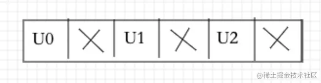
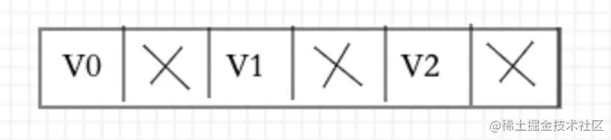

# Camera2录制视频（音视频合成）及其YUV数据提取（二）- YUV提取及图像转化

2021-10-222,528阅读5分钟

### 系列

- [Camera2录制视频（音视频合成）及其YUV数据提取（一）- 相机预览](https://juejin.cn/post/7021736151522213919)
- [***Camera2录制视频（音视频合成）及其YUV数据提取（二）- YUV提取及图像转化***](https://juejin.cn/post/7021793249278820359)
- [Camera2录制视频（音视频合成）及其YUV数据提取（二）- MediaCodec与MediaMuxe联合使用](https://juejin.cn/post/7022866113029472270)

# YUV提取及图像转化

------

# 介绍YUV格式

YUV是编译true-color颜色空间（color space）的种类，Y'UV, YUV, [YCbCr](https://link.juejin.cn/?target=https://baike.baidu.com/item/YCbCr)，[YPbPr](https://link.juejin.cn/?target=https://baike.baidu.com/item/YPbPr)等专有名词都可以称为YUV，彼此有重叠。“Y”表示明亮度（Luminance或Luma），也就是灰阶值，“U”和“V”表示的则是色度（Chrominance或Chroma），作用是描述影像色彩及饱和度，用于指定像素的颜色。

> 下面我只说用到的一些格式具体的更全的请移步 -> [YUV 格式详解-史上最全](https://juejin.cn/post/6920848468797816846)

### I420

```
I420`是标准的YUV420结构`Plannar`平面,YUV分量首先存放`w * h` 个`Y`,接着存放` w * h * 0.25` 个`U`最后存放 `w * h * 0.25` 个`V`，整体byte[] data.length = `w * h * 1.5
复制代码YYYY
YYYY
UU
VV
```

从字节流方向看即：

```
复制代码YYYYYYYYUUVV
```

### NV12

```
NV12`是标准的YUV420结构`Semi-Planar`平面,YUV分量首先存放`w * h` 个`Y`,接着`U`、`V`交叉排列存放。整体byte[] data.length = `w * h * 1.5
复制代码YYYY
YYYY
UV
UV
```

从字节流方向看即：

```
复制代码YYYYYYYYUVUV
```

### NV21

`NV21`与NV12结构基本类似，`Semi-Planar`平面，只是UV排列换成了VU交错排列，同样一共是data.length=`w * h * 1.5`的size

```
复制代码YYYY
YYYY
VU
VU
```

从字节流方向看即：

```
复制代码YYYYYYYYVUVU
```

# 回顾

在上一篇中我们定义了一个`ImageReader`类并`newInstence`一个实例，创建了一个`ImageReader.OnImageAvailableListener`监听器

```java
java复制代码//初始化ImageReader传入预览尺寸宽高，设置相机输出图像格式I420
this.mImageReader = ImageReader.newInstance(this.previewSize.getWidth(), this.previewSize.getHeight(), ImageFormat.YUV_420_888, 1);

private ImageReader.OnImageAvailableListener imageAvailableListener = new ImageReader.OnImageAvailableListener() {
        @Override
        public void onImageAvailable(ImageReader reader) {
            Image image = reader.acquireNextImage();
            int w = image.getWidth();
            int h = image.getHeight();
            if(isTakePic == true) {
                //拍照
                int I420size = w * h * 3 / 2;
                byte nv21 = new byte[I420size];
                //提取YUV填充nv21数据
                YUVToNV21_NV12(image,nv21,w,h,"NV21");
                Bitmap bitmap = nv21ToBitmap(nv21,w,h);
                //...图像反转 后面有说

                isTakePic = false;
            }
            if(isRecord) {
                //录制视频
                int I420size = w * h * 3 / 2;
                byte nv12 = new byte[I420size];
                //提取YUV填充nv21数据
                YUVToNV21_NV12(image,nv12,w,h,"NV12");
                //回调预览数据
                yuvCallback.getCamera2Data(nv12);

            }
            image.close();
        }
    };
```

`Image`对象通过一个或多个ByteBuffers直接访问Image的像素数据，数据存储在`Image.Plane`中存储的是一个ByteBuffer数组，包含了这些像素数据的配置信息。作为提供raw数据使用。

- `acquireNextImage`获取下一帧图像Image对象

- ```
  getPlanes()
  ```

  此方法获取的是一个

  ```
  Plane
  ```

  数组这里一般size = 3 在ImageReader设置的ImageFormat为

  ```
  YUV_420_888
  ```

  时

  - `getPlanes()[0]`存储当前帧图像的所有 **Y** 分量
  - `getPlanes()[1]`存储当前帧图像的所有 **U** 分量
  - `getPlanes()[2]`存储当前帧图像的所有 **V** 分量

- `plane.getPixelStride()` 具体有用像素步长 `1` 或 `2` 一般`Y`分量都为`1` 表示紧挨着紧凑的，`UV`可能为`2`表示此分量数据byteBuffer`每隔一个是一个有用数据`

> 在取U或者V分量数据时需要考虑pixelStride是否是间隔取然后交错排列 当pixelStride = 2的时候 UV bytebuffer中有用数据如图所示





# 提取排列YUV数据

提取`YUV`转换成`NV21`或者`NV12`格式data 上面提到 `NV21`或者`NV12`只是 UV 和VU交错不一样而已那么可以一个方法即可

```java
java复制代码private static void YUVToNV21_NV12(Image image, byte[] nv21, int w, int h,String type) {
    Image.Plane[] planes = image.getPlanes();
    int remaining0 = planes[0].getBuffer().remaining();
    int remaining1 = planes[1].getBuffer().remaining();
    int remaining2 = planes[2].getBuffer().remaining();
    //分别准备三个数组接收YUV分量。
    byte[] yRawSrcBytes = new byte[remaining0];
    byte[] uRawSrcBytes = new byte[remaining1];
    byte[] vRawSrcBytes = new byte[remaining2];
    planes[0].getBuffer().get(yRawSrcBytes);
    planes[1].getBuffer().get(uRawSrcBytes);
    planes[2].getBuffer().get(vRawSrcBytes);
    int j = 0, k = 0;
    boolean flag = type.equal("NV21");
    for (int i = 0; i < nv21.length; i++) {
        if (i < w * h) {
            //首先填充w*h个Y分量
            nv21[i] = yRawSrcBytes[i];
        } else {
            if (flag) {
                //若NV21类型 则Y分量分配完后第一个将是V分量
                nv21[i] = vRawSrcBytes[j];
                //PixelStride有用数据步长 = 1紧凑按顺序填充，=2每间隔一个填充数据
                j += planes[1].getPixelStride();
            } else {
                //若NV12类型 则Y分量分配完后第一个将是U分量
                nv21[i] = uRawSrcBytes[k];
                //PixelStride有用数据步长 = 1紧凑按顺序填充，=2每间隔一个填充数据
                k += planes[2].getPixelStride();
            }
            //紧接着可以交错UV或者VU排列不停的改变flag标志即可交错排列
            flag = !flag;
        }
    }
}
```

> 我这种简单的方式目前与网上那种一堆代码转换完之后最后最右下角只会相差一个像素。。。我也不知道为什么。一像素之差肉眼是看不出来的～

# YUV转换图像

在`ImageFormat.YUV_420_888`格式下如何拍照然后生成一张图片呢？ 其实在官方给出了一个类：`YuvImage`作用是专门以YUV数据生成一张JPEG图像，遗憾的是此类目前只支持`NV21`和`YUY2`格式，但幸运的是我们现在可以使用NV21格式

```java
java复制代码private static Bitmap nv21ToBitmap(byte[] nv21, int width, int height) {
    Bitmap bitmap = null;
    try {
        YuvImage image = new YuvImage(nv21, ImageFormat.NV21, width, height, null);
        ByteArrayOutputStream stream = new ByteArrayOutputStream();
        //输出到对应流
        image.compressToJpeg(new Rect(0, 0, width, height), 100, stream);
        //对应字节流生成bitmap
        bitmap = BitmapFactory.decodeByteArray(stream.toByteArray(), 0, stream.size());
        stream.close();
    } catch (IOException e) {
        e.printStackTrace();
    }
    return bitmap;
}
```

如果不是NV21格式 也是有办法的，曲线救国：

> YUV -> RGB -> Bitmap

YUV 转换 RGB公式 ->[YUV <——> RGB 转换算法](https://juejin.cn/post/6844903640377884679#heading-15)

# 图像旋转以及镜像

当你开心的拍完一张图像之后你会发现这张图像在你后置摄像头的情况下 角度不对，是倒过来的，`治好了我多年颈椎病～`
还有就是你前置摄像头拍摄完毕图像不仅倒过来了，还是一个镜像图像，这和内部原理处理方式有关，想知道的可以百度一下
此时你需要处理一下图像

```java
java复制代码if (mCurrentCameraId.equals(mRearCameraID)) {
    //后置
    matrix.postRotate(90);
} else if (mCurrentCameraId.equals(mFrontCameraID)) {
    //前置
    matrix.postRotate(270);
    matrix.postScale(-1, 1);
}
Bitmap resBitmap = Bitmap.createBitmap(oldBitmap, 0, 0, oldBitmap.getWidth(), oldBitmap.getHeight(), matrix, true);
```

`matrix`是一个矩阵类，其内部有旋转，放大缩小，平移等，可以让图片进行`等比缩放`等

- 后置摄像头：只需要旋转`90`度即可
- 前置摄像头：先旋转`270`度，然后在`镜面翻转`也就是`postScale(-1,1)` 最后在重新创建一个bitmap副本将其填充拷贝进去在设置matrix即可得到一张正确到图像！

# 结束

本文到这里结束了，下一篇将是对`视频以及音频MeidaCodec编码`操作 下一