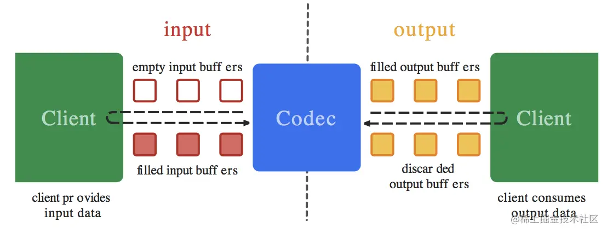
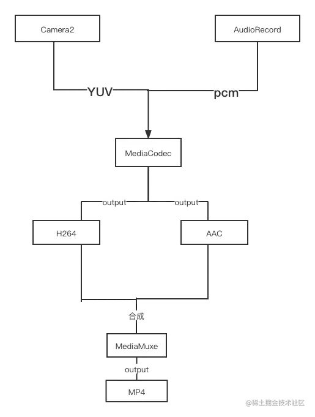

# Camera2录制视频（音视频合成）及其YUV数据提取（三）- MediaCodec与MediaMuxe联合使用

2021-10-253,351阅读6分钟

### 系列

- [Camera2录制视频（音视频合成）及其YUV数据提取（一）- 相机预览](https://juejin.cn/post/7021736151522213919)
- [Camera2录制视频（音视频合成）及其YUV数据提取（二）- YUV提取及图像转化](https://juejin.cn/post/7021793249278820359)
- [***Camera2录制视频（音视频合成）及其YUV数据提取（二）- MediaCodec与MediaMuxe联合使用***](https://juejin.cn/post/7022866113029472270)

# MediaCodec编码与MediaMuxe合成

------

## 简介

MediaCodec 类可用于访问低级媒体编解码器，即编码器/解码器组件。它是 Android 底层多媒体支持基础架构的一部分（通常与 MediaExtractor、MediaSync、MediaMuxer、MediaCrypto、MediaDrm、Image、Surface 和 AudioTrack 一起使用。）

## 流程图



## 方法

### MediaFormat

`MediaFormat.createVideoFormat(MIME类型,宽,高)`创建视频输出格式类，需要设置一些必须参数

- `MediaFormat.KEY_COLOR_FORMAT` 设置接收的YUV格式，NV12等。例如`setInteger(MediaFormat.KEY_COLOR_FORMAT, MediaCodecInfo.CodecCapabilities.COLOR_FormatYUV420SemiPlanar)`表示设置接收NV12格式
- `MediaFormat.KEY_FRAME_RATE` 帧数（Integer）
- `MediaFormat.KEY_BIT_RATE` 比特率 越高视频越清晰（Integer）
- `MediaFormat.KEY_I_FRAME_INTERVAL` 关键帧频率（Integer） 一般为1 若0意味着每一帧就都是关键帧 `MediaFormat.createAudioFormat(MIME类型,采样率,声道数)`创建音频输出类同样需要参数
- `MIMETYPE_AUDIO_AAC` 音频aac格式的MIME类型
- `MediaFormat.KEY_MAX_INPUT_SIZE` 缓冲区最大Size 建议设置为接收大小（Integer）
- `MediaFormat.KEY_BIT_RATE` 比特率 （Integer）

### MediaCodec

`MediaCodec.createEncoderByType(MIME类型)` 返回对应MIME类型的MediaCodec MIME类型与Format MIME类型相同

- `configure(format类, null, null, MediaCodec.CONFIGURE_FLAG_ENCODE)`配置声明编码器类型

- `start()` 开始编码

- `dequeueInputBuffer(等待时间ms)` 返回要填充有效数据的输入缓冲区的索引index

- `getInputBuffer(索引)` 根据返回的缓冲区索引，获取当前缓冲区并填入对应数据

- `queueInputBuffer(索引,开始位置(一般为0),数据长度,时间戳,标志(一般为0))` **发送到编码器进行编码** 时间戳要和音频录制设置的时间戳对其一样否则可能会造成音画不同步问题或者丢帧问题

- ```
  dequeueOutputBuffer(bufferInfo, 等待时间)
  ```

   

  获取数据区域索引 返回已成功输出缓冲区的索引 并填充bufferInfo数据

  - 返回值：已成功解码的输出buffer的索引或INFO_*常量之一(INFO_TRY_AGAIN_LATER, INFO_OUTPUT_FORMAT_CHANGED 或 INFO_OUTPUT_BUFFERS_CHANGED)。
  - 返回INFO_TRY_AGAIN_LATER而timeoutUs指定为了非负值，表示超时了。
  - 返回`INFO_OUTPUT_FORMAT_CHANGED`表示输出格式已更改，后续数据将遵循新格式。需要`mediaMuxe.addTrack`返回的输出格式后续内容遵循此格式
  - `BufferInfo info`：输出buffer的metadata。
  - `long timeoutUs`：含义同dequeueInputBuffer中的timeoutUs参数。

- `getOutputBuffer(索引)` 取出编码器数据 取出对应缓冲区bytebuffer数据

### MediaMuxe

MediaMuxer 有助于混合基本流。目前 MediaMuxer 支持 MP4、Webm 和 3GP 文件作为输出。自 Android Nougat 以来，它还支持在 MP4 中混合 B 帧。
构造方法 `new MediaMuxer(保存路径, 输出格式)` mp4格式：**MediaMuxer.OutputFormat.MUXER_OUTPUT_MPEG_4**

- `addTrack(format)` 添加具有指定格式的format 在`start()`方法之前必须要添加完整的音轨类型和视频类型的outputFormat否则将会出现问题
- `start()` 开始混合音视频aac和h264数据
- `writeSampleData(缓冲区索引,返回的编码后数据bytebuffer,bufferinfo填充)` 写入数据声音和视频同时可写

> **writeSampleData** 方法需要在start之后写入

## 准备

- 音频数据采集（PCM） 可以看这一篇[AudioRecord音频采集](https://juejin.cn/post/6980688400034562055)
- 视频数据采集（YUV） 前两篇都有说，文章链接在顶部自行查看 下面是录制pcm代码：

```java
java复制代码public class AudioHelper implements Runnable {
    private static final int SAMPLE_RATE = 44100;
    private AudioRecord mAudioRecord;
    private Thread mAudioThread;
    private int mAudioRecordBufferSize;
    private boolean isStartRecording = false;
    private AudioDataCallback mAudioDataCallback;

    public AudioHelper() {
        this.mAudioThread = new Thread(this, "AudioThread");
        initAudioRecord();
    }

    private void initAudioRecord() {
        this.mAudioRecordBufferSize = AudioRecord.getMinBufferSize(SAMPLE_RATE, AudioFormat.CHANNEL_IN_MONO, AudioFormat.ENCODING_PCM_16BIT);
        if (Build.VERSION.SDK_INT >= Build.VERSION_CODES.M) {
            this.mAudioRecord = new AudioRecord.Builder()
                    .setAudioSource(MediaRecorder.AudioSource.MIC)
                    .setAudioFormat(new AudioFormat.Builder()
                            .setSampleRate(SAMPLE_RATE)
                            .setChannelMask(AudioFormat.CHANNEL_IN_MONO)
                            .setEncoding(AudioFormat.ENCODING_PCM_16BIT)
                            .build())
                    .setBufferSizeInBytes(this.mAudioRecordBufferSize)
                    .build();
        } else {
            this.mAudioRecord = new AudioRecord(MediaRecorder.AudioSource.MIC, SAMPLE_RATE, AudioFormat.CHANNEL_IN_MONO, AudioFormat.ENCODING_PCM_16BIT, this.mAudioRecordBufferSize);
        }
    }

    public void start() {
        if (!this.isStartRecording) {
            this.mAudioThread = new Thread(this, "AudioThread");
            this.mAudioThread.start();
        }
    }

    public void stop() {
        this.isStartRecording = false;
        this.mAudioRecord.stop();
    }

    public void setAudioDataCallback(AudioDataCallback callback) {
        this.mAudioDataCallback = callback;
    }


    @Override
    public void run() {
        this.mAudioRecord.startRecording();
        this.isStartRecording = true;
        byte[] data = new byte[this.mAudioRecordBufferSize];
        while (this.isStartRecording) {
            int res = this.mAudioRecord.read(data, 0, this.mAudioRecordBufferSize);
            if (res != AudioRecord.ERROR_INVALID_OPERATION) {
                if (this.mAudioDataCallback != null) {
                    this.mAudioDataCallback.onData(data, res);
                }
            }
        }
    }

    public interface AudioDataCallback {
        void onData(byte[] data, int length);
    }
}
```

## 传入数据（video数据为例）

```java
java复制代码public void encodeVideo(byte[] nv12) {
    try {
        //获取索引
        int index = this.mVideoCodec.dequeueInputBuffer(WAIT_TIME);
        if (index >= 0) {
        //获取索引缓冲区
            ByteBuffer inputBuffer = this.mVideoCodec.getInputBuffer(index);
            inputBuffer.clear();
            //装载yuv数据
            inputBuffer.put(nv12);
            //发送到视频编码器中
            this.mVideoCodec.queueInputBuffer(index, 0, nv12.length, (System.nanoTime() - this.nonaTime) / 1000, 0);
        }
        encodeVideoH264();
    } catch (Exception e) {
        e.printStackTrace();
    }
}

private void encodeVideoH264() {
    //初始化buffer信息
    MediaCodec.BufferInfo bufferInfo = new MediaCodec.BufferInfo();
    //获取此时正确输出的缓冲区索引
    int outputBufferIndex = this.mVideoCodec.dequeueOutputBuffer(bufferInfo, WAIT_TIME);
    //首先判断idnex这个flag是否是输出改变标志
    //若是，则需要记录一下addTrack返回的index 
    //这里需要两个同时记录一个音频一个视频
    //必须两个都加入了addTrack之后 mediamuxer才能start开始混合
    if (outputBufferIndex == MediaCodec.INFO_OUTPUT_FORMAT_CHANGED) {
        //输出改变 将加入轨道中
        this.mVideoTrackIndex = mediaMuxer.addTrack(this.mVideoCodec.getOutputFormat());
        //判断音频和视频是否都同时可以进行写入之后
        if (this.mAudioTrackIndex != -1 && this.mVideoTrackIndex != -1) {
            this.mediaMuxer.start();
        }
    }
    //循环读取buffer中的内容并写入mediamuxer中
    while (outputBufferIndex >= 0) {
    //取出编码后索引对应的buffer缓冲区
        ByteBuffer outputBuffer = this.mVideoCodec.getOutputBuffer(outputBufferIndex);
        //判断是否已经加入addtrack轨道，若没有判断直接write会有一个异常
        if (this.mVideoTrackIndex != -1) {
        //写入输出视频数据，视频索引，编码后的buffer，以及bufferinfo信息
            mediaMuxer.writeSampleData(this.mVideoTrackIndex, outputBuffer, bufferInfo);
        }
        //释放对应缓冲区
        this.mVideoCodec.releaseOutputBuffer(outputBufferIndex, false);
        //重新读区数据，返回新的索引 循环往复直到没有数据可读表示第一次数据读取完毕
        outputBufferIndex = this.mVideoCodec.dequeueOutputBuffer(bufferInfo, WAIT_TIME);
        if ((bufferInfo.flags & MediaCodec.BUFFER_FLAG_END_OF_STREAM) != 0) {
            break;
        }
    }
}
```

详细说明注释都写上了比较详细

> 音频编码和合成也是一样的

## 完整代码

下面附上完整的代码：

```java
java复制代码public class MediaCodecHelper {
    private MediaCodec mAudioMediaCodec, mVideoCodec;
    private MediaFormat mAudioMediaFormat, mVideoMediaFormat;
    private AudioParameter mAudioParameter;
    private VideoParameter mVideoParameter;
    private int mAudioTrackIndex = -1;
    private int mVideoTrackIndex = -1;
    private MediaMuxer mediaMuxer;
    private long audioPts = 0;
    private long pts = 0;

    private static final int WAIT_TIME = 0;
    private long nonaTime;
    private boolean isStart;


    private String filePath;

    public MediaCodecHelper(String filePath, AudioParameter audioParameter, VideoParameter videoParameter) {
        this.filePath = filePath;
        this.mAudioParameter = audioParameter;
        this.mVideoParameter = videoParameter;
    }

    private void initVideoCodec(VideoParameter videoParameter) {
        this.mVideoParameter = videoParameter;
        this.mVideoMediaFormat = MediaFormat.createVideoFormat(MediaFormat.MIMETYPE_VIDEO_AVC, this.mVideoParameter.width, this.mVideoParameter.height);
        this.mVideoMediaFormat.setInteger(MediaFormat.KEY_COLOR_FORMAT, MediaCodecInfo.CodecCapabilities.COLOR_FormatYUV420SemiPlanar);
        this.mVideoMediaFormat.setInteger(MediaFormat.KEY_FRAME_RATE, 30);//30帧
        this.mVideoMediaFormat.setInteger(MediaFormat.KEY_BIT_RATE, this.mVideoParameter.width * this.mVideoParameter.height * 4);//RGBA
        this.mVideoMediaFormat.setInteger(MediaFormat.KEY_I_FRAME_INTERVAL, 1);
//        设置压缩等级  默认是baseline
        if (Build.VERSION.SDK_INT >= Build.VERSION_CODES.LOLLIPOP) {
            this.mVideoMediaFormat.setInteger(MediaFormat.KEY_PROFILE, MediaCodecInfo.CodecProfileLevel.AVCProfileMain);
            if (Build.VERSION.SDK_INT >= Build.VERSION_CODES.M) {
                this.mVideoMediaFormat.setInteger(MediaFormat.KEY_LEVEL, MediaCodecInfo.CodecProfileLevel.AVCLevel3);
            }
        }
        try {
            this.mVideoCodec = MediaCodec.createEncoderByType(this.mVideoMediaFormat.getString(MediaFormat.KEY_MIME));
            this.mVideoCodec.configure(this.mVideoMediaFormat, null, null, MediaCodec.CONFIGURE_FLAG_ENCODE);
        } catch (IOException e) {
            e.printStackTrace();
        }
    }

    private void initAudioCodec(AudioParameter audioParameter) {
        this.mAudioParameter = audioParameter;
        this.mAudioMediaFormat = new MediaFormat();
        this.mAudioMediaFormat.setString(MediaFormat.KEY_MIME, this.mAudioParameter.mediaMime);
        this.mAudioMediaFormat.setInteger(MediaFormat.KEY_CHANNEL_COUNT, this.mAudioParameter.channel);
        this.mAudioMediaFormat.setInteger(MediaFormat.KEY_SAMPLE_RATE, this.mAudioParameter.sampleRate);
        this.mAudioMediaFormat.setInteger(MediaFormat.KEY_BIT_RATE, this.mAudioParameter.bitrate);
        this.mAudioMediaFormat.setInteger(MediaFormat.KEY_AAC_PROFILE, this.mAudioParameter.profile);
        this.mAudioMediaFormat.setInteger(MediaFormat.KEY_MAX_INPUT_SIZE, Integer.MAX_VALUE);

        try {
            this.mAudioMediaCodec = MediaCodec.createEncoderByType(this.mAudioMediaFormat.getString(MediaFormat.KEY_MIME));
            this.mAudioMediaCodec.configure(this.mAudioMediaFormat, null, null, MediaCodec.CONFIGURE_FLAG_ENCODE);
        } catch (IOException e) {
            e.printStackTrace();
        }
    }

    public void encodeVideo(byte[] nv12, long nanoTime) {
        if (this.mVideoCodec == null) return;
        try {
            int index = this.mVideoCodec.dequeueInputBuffer(WAIT_TIME);
            if (index >= 0) {
                ByteBuffer inputBuffer = this.mVideoCodec.getInputBuffer(index);
                inputBuffer.clear();
                inputBuffer.put(nv12);
                this.mVideoCodec.queueInputBuffer(index, 0, nv12.length, (System.nanoTime() - this.nonaTime) / 1000, 0);
            }
            encodeVideoH264();
        } catch (Exception e) {
            e.printStackTrace();
        }
    }

    private void encodeVideoH264() {
        MediaCodec.BufferInfo bufferInfo = new MediaCodec.BufferInfo();
        int outputBufferIndex = this.mVideoCodec.dequeueOutputBuffer(bufferInfo, WAIT_TIME);
        if (outputBufferIndex == MediaCodec.INFO_OUTPUT_FORMAT_CHANGED) {
            this.mVideoTrackIndex = mediaMuxer.addTrack(this.mVideoCodec.getOutputFormat());
            if (this.mAudioTrackIndex != -1 && this.mVideoTrackIndex != -1) {
                this.mediaMuxer.start();
            }
        }
        while (outputBufferIndex >= 0) {
            ByteBuffer outputBuffer = this.mVideoCodec.getOutputBuffer(outputBufferIndex);
            if (this.mVideoTrackIndex != -1) {
                mediaMuxer.writeSampleData(this.mVideoTrackIndex, outputBuffer, bufferInfo);
            }
            this.mVideoCodec.releaseOutputBuffer(outputBufferIndex, false);
            outputBufferIndex = this.mVideoCodec.dequeueOutputBuffer(bufferInfo, WAIT_TIME);
            if ((bufferInfo.flags & MediaCodec.BUFFER_FLAG_END_OF_STREAM) != 0) {
                break;
            }
        }
    }

    public void encodeAudioToAAC(byte[] data, int len) {
        try {
            int index = this.mAudioMediaCodec.dequeueInputBuffer(WAIT_TIME);
            if (index >= 0) {
                ByteBuffer inputBuffer = this.mAudioMediaCodec.getInputBuffer(index);
                inputBuffer.clear();
                inputBuffer.put(data);
                long pts = getAudioPts(len, this.mAudioParameter.sampleRate, this.mAudioParameter.channel, this.mAudioParameter.bitrate);
                //数据缓冲送入解码器
                this.mAudioMediaCodec.queueInputBuffer(index, 0, data.length, (System.nanoTime() - this.nonaTime) / 1000, 0);
            }
            getEncodeData();
        } catch (Exception e) {
            e.printStackTrace();
        }
    }

    private void getEncodeData() {
        MediaCodec.BufferInfo outputBuffer = new MediaCodec.BufferInfo();
        int flag = this.mAudioMediaCodec.dequeueOutputBuffer(outputBuffer, WAIT_TIME);
        if (flag == MediaCodec.INFO_OUTPUT_FORMAT_CHANGED) {
            this.mAudioTrackIndex = this.mediaMuxer.addTrack(this.mAudioMediaCodec.getOutputFormat());
            if (this.mAudioTrackIndex != -1 && this.mVideoTrackIndex != -1) {
                this.mediaMuxer.start();
            }
        } else {
            while (flag >= 0) {
                ByteBuffer data = this.mAudioMediaCodec.getOutputBuffer(flag);
                if (data != null) {

                    if (this.mAudioTrackIndex != -1) {
                        this.mediaMuxer.writeSampleData(this.mAudioTrackIndex, data, outputBuffer);
                    }
                }
                this.mAudioMediaCodec.releaseOutputBuffer(flag, false);
                flag = this.mAudioMediaCodec.dequeueOutputBuffer(outputBuffer, WAIT_TIME);
            }
        }

    }

    public void stop() {
        this.mAudioMediaCodec.stop();
        this.mAudioMediaCodec.release();
        this.mVideoCodec.stop();
        this.mVideoCodec.release();
        this.mediaMuxer.stop();
        this.mediaMuxer.release();
        this.isStart = false;
    }

    public void start() {
        this.isStart = true;
        init();
        this.mAudioTrackIndex = -1;
        this.mVideoTrackIndex = -1;
        nonaTime = System.nanoTime();
        this.mVideoCodec.start();
        this.mAudioMediaCodec.start();
    }

    private void init() {
        initAudioCodec(this.mAudioParameter);
        initVideoCodec(this.mVideoParameter);
        initMediaEncoder(filePath);
    }


    private void initMediaEncoder(String savePath) {
        this.filePath = savePath;
        try {
            this.mediaMuxer = new MediaMuxer(savePath, MediaMuxer.OutputFormat.MUXER_OUTPUT_MPEG_4);
            this.mediaMuxer.setOrientationHint(90);
        } catch (IOException e) {
            e.printStackTrace();
        }
    }

    //176400
    private long getAudioPts(int size, int sampleRate, int channel, int sampleBit) {
        audioPts += (long) (1.0 * size / (sampleRate * channel * (sampleBit / 8)) * 1000000.0);
        return audioPts;
    }


    public static class VideoParameter {
        int width;
        int height;

        public VideoParameter(int width, int height) {
            this.width = width;
            this.height = height;
        }
    }

    public static class AudioParameter {
        String mediaMime;
        int channel;
        int sampleRate;
        int bitrate;
        int profile = MediaCodecInfo.CodecProfileLevel.AACObjectLC;


        public AudioParameter(String mediaMime, int channel, int sampleRate, int bitrate, int profile) {
            this.mediaMime = mediaMime;
            this.channel = channel;
            this.sampleRate = sampleRate;
            this.bitrate = bitrate;
            this.profile = profile;
        }

        public AudioParameter(String mediaMime, int channel, int sampleRate, int bitrate) {
            this.mediaMime = mediaMime;
            this.channel = channel;
            this.sampleRate = sampleRate;
            this.bitrate = bitrate;
        }

        public static class Builder {
            String mediaMime;
            int channel;
            int sampleRate;
            int bitrate;
            int profile = -1;

            static Builder instence = new Builder();

            public static Builder getInstence() {
                return instence;
            }

            public Builder setMediaMime(String mediaMime) {
                this.mediaMime = mediaMime;
                return this;
            }

            public Builder setChannel(int channel) {
                this.channel = channel;
                return this;
            }

            public Builder setSampleRate(int sampleRate) {
                this.sampleRate = sampleRate;
                return this;
            }

            public Builder setBitrate(int bitrate) {
                this.bitrate = bitrate;
                return this;
            }

            public Builder setProfile(int profile) {
                this.profile = profile;
                return this;
            }

            public AudioParameter build() {
                if (profile == -1) {
                    return new AudioParameter(this.mediaMime, this.channel, this.sampleRate, this.bitrate);
                } else {
                    return new AudioParameter(this.mediaMime, this.channel, this.sampleRate, this.bitrate, this.profile);
                }
            }
        }
    }
}
```

> 格外注意**时间戳**要对齐，否则生成的会是只有一帧或者黑屏只有声音 也就是发送编码器方法**queueInputBuffer**中第四个参数要注意


标签：

[Android](https://juejin.cn/tag/Android)