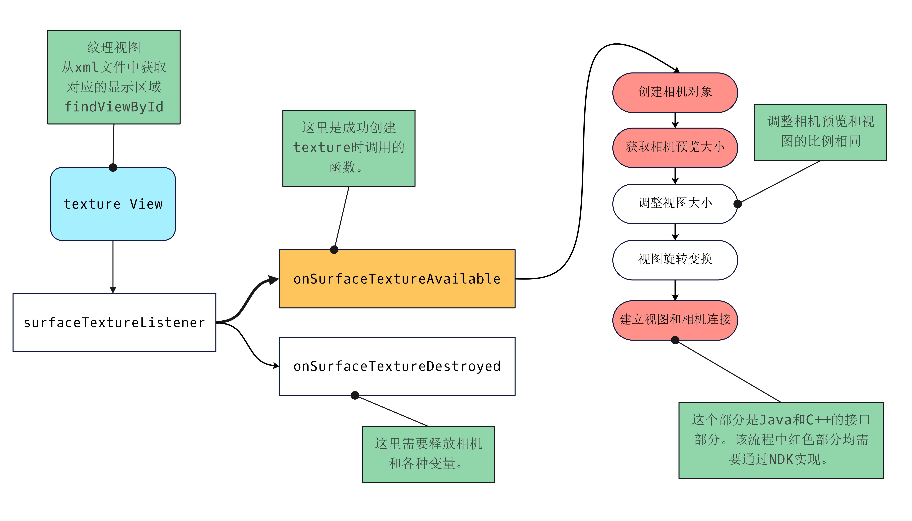
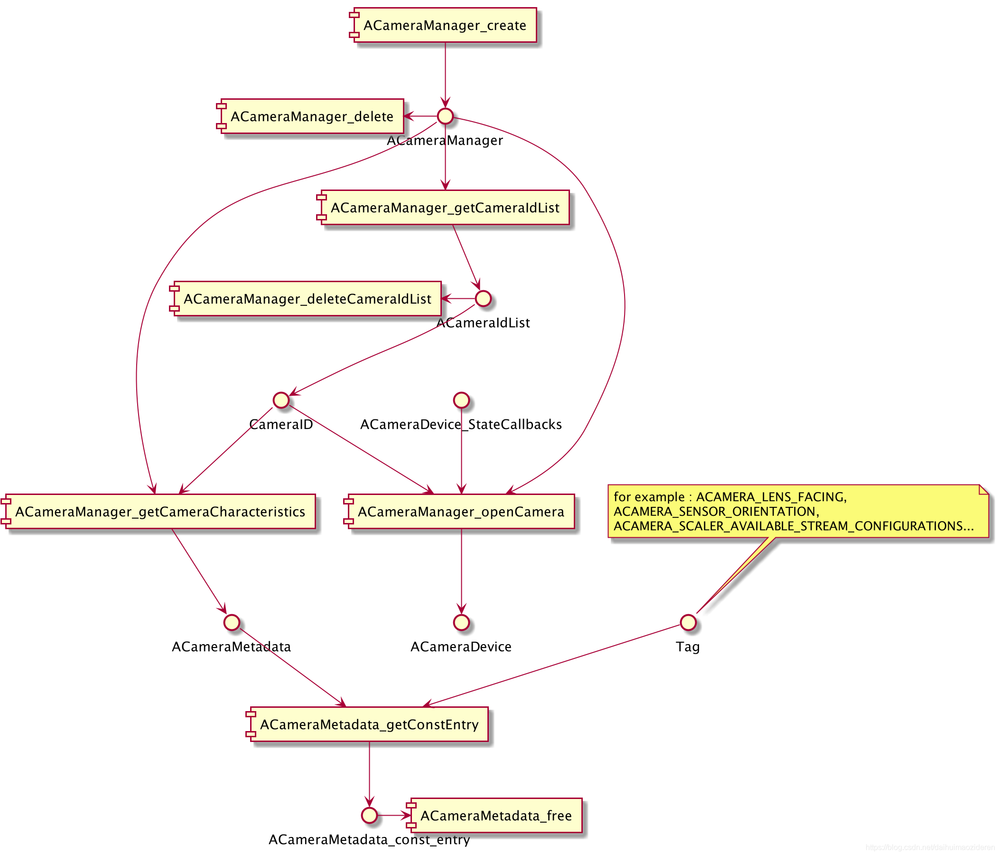
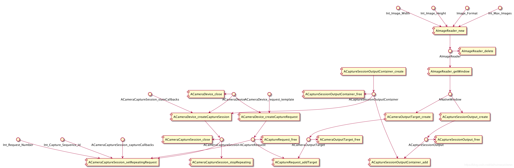
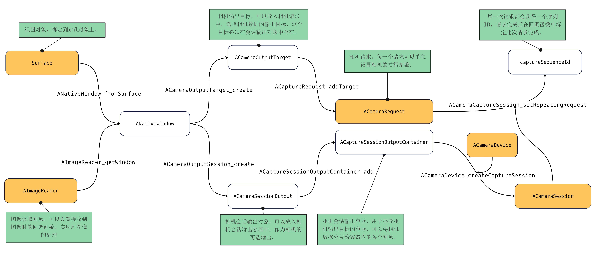
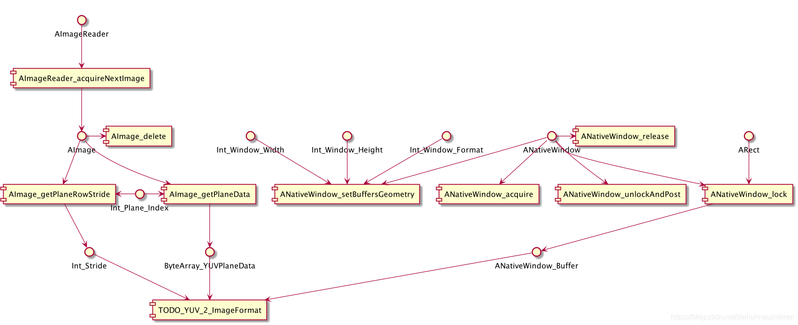

# Android NDK Camera2小结


# 第一部分 程序入口逻辑

首先需要做相机权限检查和相机的类型检查，这里使用的相机必须满足Camera2的最低要求。

然后程序的启动流程如下：

[](https://img2023.cnblogs.com/blog/2820663/202304/2820663-20230404205847163-118072081.jpg)

红色部分需要通过NDK实现对应的功能。

------

# 第二部分 获取相机设置信息

[](https://img2023.cnblogs.com/blog/2820663/202304/2820663-20230404210048262-1237747362.png)

以上图像中存在几个重要的变量：

- `ACameraManager`：使用`ACameraManager_create`构建，使用完成需要`ACameraManager_delete`删除释放内存。
- `ACameraList`：通过`ACameraManage_getCameraIdList`使用`ACameraManager`获取手机所有的相机设备（包括前置镜头，后置镜头，外置镜头）使用完成之后需要`ACameraManager_deleteCameraList`释放内存。
- `CameraID`：`ACameraIdList`类型中存在`cameraIds`，作为相机的唯一标识符。
- `ACameraMetadata`：通过`ACameraManager_getCameraCharacteristics`使用`CameraID`和`ACameraManager`获取相机的元数据。使用完成之后需要通过`ACameraMetadata_free`释放内存。
- 通过`ACameraMetadata_getAllTags`可以获取所有的相机的标签数量和标签值。这个Tags是一个键值对系统，可以根据标签获取相应的数据，也可以通过设置标签纸去更改相机的参数。
- 通过`ACameraMetadata_getConstEntry`使用`ACameraMetadata`和标签名可以获取对应的标签值。
- 通过`ACaptureRequest_setEntry_xx`使用`request`和标签名可以设置对应的标签值。

# 第三部分 启动相机会话

[](https://img2023.cnblogs.com/blog/2820663/202304/2820663-20230404210101407-1557345778.png)

各个对象之间的关系：

[](https://img2023.cnblogs.com/blog/2820663/202304/2820663-20230404205735012-42760870.jpg)

最终得到的是`ACameraRequest`和`ACaptureSessionOutputContainer`两个对象，通过`ACameraCaptureSession_setRepeatingRequest`可以实现不断地相同地相机请求，达到相机预览的效果。使用`ACameraCaptureSession_stopRepeating`函数停止预览。

> 以上所有变量地申请都需要最后通过`xxx_delete`方法释放内存。防止内存泄露造成错误。

# 第四部分 获取图像数据

[](https://img2023.cnblogs.com/blog/2820663/202304/2820663-20230404210113110-2121574087.png)

> 图像读取思路
>
> 设置图像格式和图像回调的`AImageReader_new`获取一个`AImageReader`对象。该对象再通过第三部分的内容设置为相机的数据输出。

成功获取图像数据之后，数据处理代码示例如下：

```c++
void onImageAvailable(void *context, AImageReader *reader) {
    media_status_t res;
    // 获取图像的格式
    int32_t img_fmt;
    int32_t width, height;
    res = AImageReader_getFormat(reader, &img_fmt);
    if (res) LOG_ERR("AImageReader_getFormat error");
    res = AImageReader_getWidth(reader, &width);
    if (res) LOG_ERR("AImageReader_getFormat error");
    res = AImageReader_getHeight(reader, &height);
    if (res) LOG_ERR("AImageReader_getWidth error");

    AImage *image;
    res = AImageReader_acquireNextImage(reader, &image);
    if (res) LOG_ERR("AImageReader_acquireNextImage  error");

    // 获取图像的时间戳
    int64_t image_timestamp;
    AImage_getTimestamp(image, &image_timestamp);
    uint8_t *y_data, *u_data, *v_data;
    int32_t y_len = 0, u_len = 0, v_len = 0;
    if (AIMAGE_FORMAT_YUV_420_888 == img_fmt) {
        // 获取各个分量的指针，这个地方存在一个问题，这里的数据结构如下
        // YY ... YYYY (repeat width * height) U V U V ..... (total width * height /2);
        // 数据总长度为 width * height * 3 / 2
        res = AImage_getPlaneData(image, 0, &y_data, &y_len);
        if (res) LOG_ERR("AImage_getPlaneData 0 error");
        res = AImage_getPlaneData(image, 1, &u_data, &u_len);
        if (res) LOG_ERR("AImage_getPlaneData 1 error");
        res = AImage_getPlaneData(image, 2, &v_data, &v_len);
        if (res) LOG_ERR("AImage_getPlaneData 2 error");
//        LOG_WARN("0bit %x %x %x %x", y_data[0], y_data[1], y_data[2], y_data[3]);
    } else {
        // 其他格式
        int32_t image_buffer_len = 0;
        uint8_t *image_raw_buffer;
        res = AImage_getPlaneData(image, 0, &image_raw_buffer, &image_buffer_len);
        if (res) LOG_ERR("AImage_getPlaneData 0 error");
    }

    // 获取一行的像素长度 >= width （内存对齐的原因）
    int32_t rowStride;
    AImage_getPlaneRowStride(image, 0, &rowStride);

    // 这里传入的上下文 为 CameraEngine对象
    auto *cam_eng = reinterpret_cast<CameraEngine *>(context);
    //  获取 surface 生成的 NativeWindow对象 用于前端显示
    ANativeWindow *window = cam_eng->GetSurfaceNativeWindow();

    // 获取图像图像的格式
    ANativeWindow_setBuffersGeometry(window, width, height, img_fmt);


    ANativeWindow_Buffer aw_buffer;
    ANativeWindow_acquire(window);
    ANativeWindow_lock(window, &aw_buffer, nullptr);
    auto *bits = reinterpret_cast<uint8_t *>(aw_buffer.bits);
    if (AIMAGE_FORMAT_YUV_420_888 == img_fmt) {
        memcpy(bits, y_data, y_len + u_len + 1);
    } else if (AIMAGE_FORMAT_JPEG == img_fmt) {
//        memcpy(bits, image_raw_buffer, image_buffer_len);
        LOG_WARN("Can not directly show jpeg.");
    } else if (AIMAGE_FORMAT_RGBA_8888 == img_fmt) {

    }

    ANativeWindow_unlockAndPost(window);
    ANativeWindow_release(window);
    AImage_delete(image);
}
```


Android自带camera API有两种，Camera1和Camera2。其中，

Camera1始于Android最初版本，仅为java层实现。

Camera2则有两种实现。

Java层Camera2始于andorid 5.0。

Native Camera2则开始于android7.0（API level24）。

本文将对Native Camera2的使用（仅预览功能）进行总结。总结将针对于如何使用和逻辑流程，不纠结于代码，示例可参照google ndk samples（可从github查找）。

2.使用流程
通过Camera2实现预览，需要三步。

第一步，开启设备。

第二步，发送请求。

第三步，接收视频数据，并转换为图像格式显示。

本文的讲解基于UML Component图，描述Camera2核心对象及API的调用生成关系。受版面所限，拆为三图。如缩略图不清晰，可点击放大。

Component图中，模块为函数，节点为对象。横向（左或右）箭头为资源释放操作调用。调用过程与顺序/时机无关。

2.1开启设备
该阶段目的，在于获取设备指针，以及获取设备相应的信息，例如分别率，旋转角度等。


通过系统所提供的ACameraManager_create方法，可获得ACameraManager指针。

进而通过ACameraManager_getCameraIdList方法，可从ACameraManager中获取所有Camera的ID。

获取ID后，辅助以属性TAG，可以通过ACameraMetadata_getConstEntry方法获取对应Camera的属性。

例如，传入ACAMERA_SENSOR_ORIENTATION的TAG，可以获取Camera的旋转角度；ACAMERA_LENS_FACING，可以判断是前置（ACAMERA_LENS_FACING_FRONT）或后置（ACAMERA_LENS_FACING_BACK）摄像头；而ACAMERA_SCALER_AVAILABLE_STREAM_CONFIGURATIONS，可以获得摄像头的分辨率。

其它TAG，可参照NdkCameraMetadataTags.h。

此处需要注意的是，

（1）ACameraMetadata_getConstEntry方法返回的是一个ACameraMetadata_const_entry结构体，需根据type的值读取data。

```c++
typedef struct ACameraMetadata_const_entry {
    /**
      * The tag identifying the entry. See {@link NdkCameraMetadataTags.h} for more details. </p>
      */
	uint32_t tag;
    /**
	  * The data type of this metadata entry.
	  */
	uint8_t  type;
 
    /**
     * Count of elements (NOT count of bytes) in this metadata entry.
     */
    uint32_t count;
 
    /**
     * Pointer to the data held in this metadata entry.
     */
    union {
        const uint8_t *u8;
        const int32_t *i32;
        const float   *f;
        const int64_t *i64;
        const double  *d;
        const ACameraMetadata_rational* r;
    } data;
} ACameraMetadata_const_entry;
```


（2）不是所有API LEVEL>=24的android os都支持Camera2，所以有时通过ACameraManager_getCameraIdList方法获取都ID数量可能为0。

在获取到Camera ID之后，通过ACameraManager_openCamera方法，可以开启Camera，获得一个ACameraDevice对象指针。

该指针将在发送请求阶段使用。在调用ACameraManager_openCamera方法时，ACameraDevice_StateCallbacks可以为null。

2.2发送请求
在获取设备（指针）后，需要通过不断的发送请求（ACaptureRequest），以得到图像信息。没有请求，便没有数据。没有数据，便无法生成之后的预览图像。因此，该步骤是最关键的一步，也是最为复杂的一步。

对于整个发送请求（ACaptureRequest）过程，可以理解为，

（1）生成一个向ACameraDevice发送的，类型为ACameraDevice_request_template的ACaptureRequest。

（2）该ACaptureRequest被不断重复发送。

（3）ACaptureRequest所返回的响应数据，由ACaptureSessionOutputContainer中的ACaptureSessionOutput接收。

（4）ACaptureRequest通过ACameraOutputTarget，将ACaptureSessionOutput与AImageReader绑定。

在预览阶段，AImageReader将用于数据的读取。


不断的发送请求，是如何完成的？

只需要调用ACameraCaptureSession_setRepeatingRequest方法即可。

```c++
camera_status_t ACameraCaptureSession_setRepeatingRequest(
        ACameraCaptureSession* session,
        /*optional*/ACameraCaptureSession_captureCallbacks* callbacks,
        int numRequests, ACaptureRequest** requests,
        /*optional*/int* captureSequenceId);
```

而当需要停止发送请求时，调用ACameraCaptureSession_stopRepeating方法即可。

```c++
camera_status_t ACameraCaptureSession_stopRepeating(ACameraCaptureSession* session);
```

题外话：预览需要不断的发送请求，获取实时画面。而拍照就不同了，仅需要发送单个（一次）请求即可。

ACameraCaptureSession_setRepeatingRequest方法中核心的传参有三个，ACameraCaptureSession，ACaptureRequest和numRequests。接下来，开始详细讲述发送请求的过程。


2.2.1创建请求
requests，是一个ACaptureRequest列表，numRequests当然指的是ACaptureRequest的数量了。可见，可以同时发送多个请求。但对于单一的预览，一个请求足已。

那么，ACaptureRequest是向谁发出的请求？

```c++
camera_status_t ACameraDevice_createCaptureRequest(
        const ACameraDevice* device, ACameraDevice_request_template templateId,
        /*out*/ACaptureRequest** request);
```

ACaptureRequest由ACameraDevice生成，因此，是向ACameraDevice发送的请求。ACameraDevice在开启设备阶段已被获取。

请求的类型，由枚举ACameraDevice_request_template决定。参见NdkCameraDevice.h。对于预览，需选择TEMPLATE_PREVIEW。

因此，创建请求的过程，可以理解为：

生成一个向ACameraDevice发送的，类型为ACameraDevice_request_template的请求。

2.2.2建立会话
ACameraCaptureSession是一个会话。它也是由ACameraDevice生成，同时还绑定来一个ACaptureSessionOutputContainer。

```c++
camera_status_t ACameraDevice_createCaptureSession(
        ACameraDevice* device,
        const ACaptureSessionOutputContainer*       outputs,
        const ACameraCaptureSession_stateCallbacks* callbacks,
        /*out*/ACameraCaptureSession** session);
```

ACaptureSessionOutputContainer，通过ACaptureSessionOutputContainer_create方法创建。

```c++
camera_status_t ACaptureSessionOutputContainer_create(
        /*out*/ACaptureSessionOutputContainer** container);
```

ACaptureSessionOutputContainer是一个可以容纳多个ACaptureSessionOutput的集合。

ACaptureSessionOutput是一个输出流，用于接收预览所用的图像数据。该对象由AImageReader间接创建。关于AImageReader，见图片读取章节。间接创建步骤如下

（1）AImageReader通过AImageReader_getWindow方法，获得一个ANativeWindow对象（注意，该ANativeWindow对象与此后预览图像章节所述的ANativeWindow对象，并非同一对象）。

（2）ANativeWindow对象通过ACaptureSessionOutput_create方法，获得一个ACaptureSessionOutput对象。

因此，一个ACameraCaptureSession包含了以下信息：

（1）与哪个ACameraDevice进行会话。

（2）用哪些ACaptureSessionOutput来接收数据。

而ACameraCaptureSession又通过ACameraCaptureSession_setRepeatingRequest方法，与ACaptureRequest建立关联。

因此，ACaptureRequest与ACaptureSessionOutput，ACameraDevice都是有关联的。

那么ACaptureRequest如何确定数据格式，大小？AImageReader即为关键。

ACaptureRequest需要与AImageReader建立关联。

2.2.3接收图片数据
在创建AImageReader时，需要提供四个参数：图像宽度，高度，图像格式，最大图片存储量。

```c++
media_status_t AImageReader_new(
        int32_t width, int32_t height, int32_t format, int32_t maxImages,
        /*out*/AImageReader** reader);
```

其中，图像宽度和高度的单位为像素。

图像格式，可参见枚举类型AIMAGE_FORMATS（NdkImage.h）。由于预览时，前端为视频格式，此处应使用AIMAGE_FORMAT_YUV_420_888。

最大图片存储量maxImages，需要特别注意。若数量少（例如1，2），则会在预览时，产生卡顿。而数量多，则会引起延时。例如 数量40，宽高为640*480时，将引起3至4秒的延时。

AImageReader如何与ACaptureRequest建立关联呢？也是通过间接的途径。

（1）AImageReader通过AImageReader_getWindow方法，获得一个ANativeWindow对象（注意，该ANativeWindow对象与此后预览图像章节所述的ANativeWindow对象，并非同一对象）。

（2）ANativeWindow对象通过ACameraOutputTarget_create方法，创建一个ACameraOutputTarget对象。

（3）通过ACaptureRequest_addTarget方法，将ACameraOutputTarget与AImageReader建立关联。

至此，ACaptureRequest可以通过AImageReader确定数据格式，高宽，及最大数量，并将图像数据写入AImageReader所对应的ACaptureSessionOutput中。

接下来，只剩下如何显示的问题了。

2.3预览图像
2.3.1关键因素
AImageReader，ANativeWindow和ANativeWindow_Buffer是预览阶段的关键因素。

其中AImageReader起到一个承上启下的作用。

在发送请求阶段，绑定请求（ACaptureRequest）和输出（ACaptureSessionOutput），以获取实时视频数据。

在预览阶段，作为数据源，用于数据转换（YUV数据转ARGB等图像数据类型）。

ANativeWindow做为画布（由外部传入，并非由AImageReader，与发送请求阶段的ANativeWindow对象不同），用于显示预览图像。

ANativeWindow_Buffer则可以看作是画布（ANativeWindow）的显存。当数据以某一图片格式写入ANativeWindow_Buffer时，图像便呈现在画布（ANativeWindow）上。


2.3.2获取图片
在ACaptureRequest被发出后，将会有AImage不断的存入AImageReader对应的缓冲区。缓冲区内存储的图片数量上限，在创建AImageReader时已被设定。

题外话：

对于性能较低的设备，当缓冲区内的图片上限过大，则会出现预览延时。因为有太多的旧图片在排队等待处理。

而缓冲区内图片上限过小，不论设备的性能好坏，则都会出现预览卡顿，因为没有连续的图片可以被连续的画到画布上。

AImageReader通过AImageReader_acquireNextImage方法，获得最早进入缓冲区的AImage。

在获取到AImage后，可以通过AImage_getPlaneRowStride和AImage_getPlaneData方法，获取YUV格式的视频数据。

关于YUV格式可参照之前的博文：YUV简介，这里不在详述。

2.3.3初始化ANativeWindow_Buffer
在获取ANativeWindow_Buffer前，需要通过ANativeWindow_setBuffersGeometry方法，对其属性进行初始化。

```c++
int32_t ANativeWindow_setBuffersGeometry(ANativeWindow* window,
        int32_t width, int32_t height, int32_t format);
```

其中，width和height为ANativeWindow_Buffer的宽高。

ANativeWindow_Buffer的宽高不同于画布View的宽高。例如画布View宽高为1080*2018，ANativeWindow_Buffer宽高为480*640，ANativeWindow_Buffer会自动被映射到画布View上，由硬件或底层完成，无需干预。

ANativeWindow_Buffer的宽高也不同于AImage的宽高。AImage带有ACameraDevice的偏转角度，需要调整为自然0度（会造成宽高的数值交换）后，再做格式转换。

format为YUV转换后的图片格式（例如WINDOW_FORMAT_RGBA_8888等，可参见Native_Window.h）。

2.3.4获取ANativeWindow_Buffer
获取过程相对程序化。需要依次调用ANativeWindow_acquire和ANativeWindow_lock方法。ANativeWindow_acquire及其对应的ANativeWindow_release方法，可以理解为安全策略，为技术层次，无业务逻辑解释。可参见其官方注解。

```c++
/**
 * Acquire a reference on the given {@link ANativeWindow} object. This prevents the object
 * from being deleted until the reference is removed.
 */
void ANativeWindow_acquire(ANativeWindow* window);

/**
 * Remove a reference that was previously acquired with {@link ANativeWindow_acquire()}.
 */
void ANativeWindow_release(ANativeWindow* window);
```

而ANativeWindow_lock方法将返回一个ANativeWindow_Buffer。

该ANativeWindow_Buffer，即为ANativeWindow需要显示的下一个画面所对应的显存。


2.3.5写入ANativeWindow_Buffer
通过实现自定义方法TODO_YUV_2_ImageFormat，将数据进行转换，并映射到上一步所获得的ANativeWindow_Buffer中。

TODO_YUV_2_ImageFormat方法，至少应包含三个功能，

（1）角度的修正。将图像由翻转角度，矫正为自然0度。

（2）格式转换。YUV转ImageFormat。其中ImageFormat为ANativeWindow_Buffer初始化时，所设置的格式。例如ARGB_8888。

（3）坐标映射。将宽高为A*B的AImage，映射到宽高为C*D的ANativeWindow_Buffer中。


2.3.6释放ANativeWindow_Buffer
在每次写入完成后，需要释放ANativeWindow_Buffer。步骤十分简单，与获取时相反，依次调用

（1）ANativeWindow_unlockAndPost

（2）ANativeWindow_release

在释放完ANativeWindow_Buffer后，一定要通过AImage_delete方法，将AImage移除缓冲区。

至此，整个预览完成。

2.4关闭Camera
关闭Camera，有一点需要强调。

ACameraDevice_close较为耗时，在MI 8和Samsung SM G9500上测试，需要约200ms左右。而Activity onPause/onStop/onDestory的单个超时上限为500ms。若有其它耗时操作与ACameraDevice_close一起进行，将有可能引起Timeout。

其它不再详细描述，只需要调用相关的free,delete,close方法即可。

3.结束语
相对于Camera1而言，NDK Camera2的逻辑较为复杂。但随着API Level的提升，Camera1终将被替换。Google最新提出的CameraX其实也是对Camera2的封装。因此，Camera2在未来还会存在一段很长的时间。


# 如何使用ndk打开camera

写在之前
因业务需求需要使用c++代码打开camera，之前没怎么接触过c++的应用，也算是一种全新的挑战吧。其实代码很简单，但是这中间有很多的坑，记录一下避免大家出现同样的问题。此方法打开camera的代码全是c++的，不需要使用到java，这样可以提高响应速度提升性能，优化用户体验。如果想要在打开camera后集成一些别的库实现一些接口，这样会比java更好。

但是这中间的坑就在这里，如果不在AndroidManifest.xml申请权限，camera是一定打不开的，而且它还不会报错，真是晕了。。。

附上代码

```c++
ACameraManager* cameraManager = nullptr;
ACameraDevice* cameraDevice = nullptr;
ACaptureRequest* captureRequest = nullptr;
ACameraOutputTarget* cameraOutputTarget = nullptr;
ACameraCaptureSession* captureSession = nullptr;
AImageReader* imageReader = nullptr;
ANativeWindow* nativeWindow = nullptr;
AImage* image = nullptr;

// Callback functions
void onCameraDeviceError(void* context, ACameraDevice* device, int error) {
    // Handle camera device error
}
void onCameraDeviceDisconnected(void* context, ACameraDevice* device) {
    // Handle camera device disconnected
}
void onCaptureSessionClosed(void* context, ACameraCaptureSession* session) {
    // Handle capture session closed
}
void onCaptureSessionActive(void* context, ACameraCaptureSession* session) {
    // Handle capture session active
}

void eventCallback(void* context ,func_getHandEvent event){
    cont = context;
    getHandEvent = event;
}

void onImageAvailable(void* context, AImageReader* reader) {
    media_status_t mStatus = AImageReader_acquireLatestImage(reader, &image);
    if (mStatus != AMEDIA_OK) {
        return;
    }else{
    	//一般打开摄像头后最重要的就在这里
    	//如果想要做什么事一定是在这个回调处获取得到的image进行处理
        //handleHandData(image);
    }
    //得到image处理完后记得删除，不然缓冲区溢出了你打开的camera就寄了
    AImage_delete(image);
}

bool openCamera(const char* cameraId) {
    // 根据cameraID打开摄像头
    ACameraDevice_StateCallbacks deviceStateCallbacks {
            .context = nullptr,
            .onDisconnected = onCameraDeviceDisconnected,
            .onError = onCameraDeviceError
    };
    camera_status_t status = ACameraManager_openCamera(cameraManager, cameraId, &deviceStateCallbacks, &cameraDevice);
    return status == ACAMERA_OK;
}

bool createCaptureRequest(ACameraDevice_request_template templateId) {
    camera_status_t status = ACameraDevice_createCaptureRequest(cameraDevice, templateId, &captureRequest);
    if (status != ACAMERA_OK) return false;
    status = ACaptureRequest_addTarget(captureRequest, cameraOutputTarget);
    return status == ACAMERA_OK;
}

bool createCaptureSession() {
    int *i = nullptr;
    ACaptureSessionOutputContainer* outputContainer = nullptr;
    ACaptureSessionOutput* sessionOutput = nullptr;
    //初始化ACaptureSessionOutputContainer
    camera_status_t status = ACaptureSessionOutputContainer_create(&outputContainer);
    if (status != ACAMERA_OK) return false;
    //初始化ACaptureSessionOutput
    status = ACaptureSessionOutput_create(nativeWindow, &sessionOutput);
    if (status != ACAMERA_OK) return false;
    status = ACaptureSessionOutputContainer_add(outputContainer, sessionOutput);
    if (status != ACAMERA_OK) return false;
    ACameraCaptureSession_stateCallbacks sessionStateCallbacks {
            .context = nullptr,
            .onClosed = onCaptureSessionClosed,
            .onReady = nullptr,
            .onActive = onCaptureSessionActive
    };
    //初始化ACameraCaptureSession
    status = ACameraDevice_createCaptureSession(cameraDevice, outputContainer, &sessionStateCallbacks, &captureSession);
    if (status != ACAMERA_OK) return false;
	//在这里开始去重复请求拿到图片进行输出
    status = ACameraCaptureSession_setRepeatingRequest(captureSession, nullptr, 1, &captureRequest,
                                                       i++);
    return status == ACAMERA_OK;
}

bool createImageReader(int width, int height, int format, int maxImages) {
    //要循环去读取图片，创建一个reader
    media_status_t status = AImageReader_new(width, height, format, maxImages, &imageReader);
    if (status != AMEDIA_OK) {
        LOGI(TAG,"创建失败");
        return false;
    }
	//在这里注册AImage的回调，重中之重
    AImageReader_ImageListener imageListener {
            .context = nullptr,
            .onImageAvailable = onImageAvailable
    };
    status = AImageReader_setImageListener(imageReader, &imageListener);
    if (status != AMEDIA_OK) return false;
    status = AImageReader_getWindow(imageReader, &nativeWindow);
    return status == AMEDIA_OK;
}
// 帮助类end


//以上都是帮助类，使用startCamera()函数对所需的类初始化并打开camera
void startCamera()
{
    // 开始使用摄像头预览
    cameraManager = ACameraManager_create();
    // 获取摄像头id
    ACameraIdList *cameraIdList = nullptr;
    ACameraManager_getCameraIdList(cameraManager, &cameraIdList);
    const char *cameraId = nullptr;
    for (int i = 0; i < cameraIdList->numCameras; i++)
    {
        const char *id = cameraIdList->cameraIds[i];
        ACameraMetadata *metadata = nullptr;
        ACameraManager_getCameraCharacteristics(cameraManager, id, &metadata);
        ACameraMetadata_const_entry entry;
        ACameraMetadata_getConstEntry(metadata, ACAMERA_LENS_FACING, &entry);
        auto facing = static_cast<acamera_metadata_enum_android_lens_facing_t>(entry.data.u8[0]);
        if (facing == ACAMERA_LENS_FACING_FRONT)
        {
            cameraId = id;
            LOGI(TAG,"cameraid=====%s",cameraId);
            break;
        }
    }

    // 打开摄像头并且读取image
    //camera的参数自己定制
    if (openCamera(cameraId) && createImageReader(1440 , 1080, AIMAGE_FORMAT_YUV_420_888, 2)){
        // 创建一个输出的目标
        ACameraOutputTarget_create(nativeWindow, &cameraOutputTarget);
        // 创建捕获请求和捕获会话
        if (createCaptureRequest(TEMPLATE_RECORD)){
            createCaptureSession();
    
        }
    }
    // 打开摄像头并且读取image

    //camera的参数自己定制
    if (openCamera(cameraId) && createImageReader(1440 , 1080, AIMAGE_FORMAT_YUV_420_888, 2)){
        // 创建一个输出的目标
        ACameraOutputTarget_create(nativeWindow, &cameraOutputTarget);

        // 创建捕获请求和捕获会话
        if (createCaptureRequest(TEMPLATE_RECORD)){
            createCaptureSession();
        }
    }
}

//简单的暂停一下
void pauseCamera(){
    ACameraDevice_close(cameraDevice);
    cameraDevice = nullptr;
}

//关闭camera，注意要释放掉不为空的结构
void stopCamera(){
    // Stop the camera and preview and release the resources
    if (captureSession != nullptr) {
        ACameraCaptureSession_stopRepeating(captureSession);
        ACameraCaptureSession_close(captureSession);
        captureSession = nullptr;
    }
    if (captureRequest != nullptr) {
        ACaptureRequest_removeTarget(captureRequest, cameraOutputTarget);
        ACaptureRequest_free(captureRequest);
        captureRequest = nullptr;
    }
    if (cameraOutputTarget != nullptr) {
        ACameraOutputTarget_free(cameraOutputTarget);
        cameraOutputTarget = nullptr;
    }
    if (cameraDevice != nullptr) {
        ACameraDevice_close(cameraDevice);
        cameraDevice = nullptr;
    }
    if (imageReader != nullptr) {
        AImageReader_delete(imageReader);
        imageReader = nullptr;
    }
    if (cameraManager != nullptr) {
        ACameraManager_delete(cameraManager);
        cameraManager = nullptr;
    }
    // Closed the camera and preview successfully
}
```


想说的话
一
相信大家使用ndk打开camera不仅仅只是想打开camera这么简单，那么最重要的一环就是在onImageAvailable()回调函数中去进行需要的数据处理，每一个回调得到的AImage都可以获取并通过本地集成的算法库解析出想要的数据，一定要注意要在AndroidManifest.xml中注册camera权限，不然啥错也不会报但就是打不开，顺手可以请求其他的权限

    <uses-permission android:name="android.permission.CAMERA"
        tools:ignore="PermissionImpliesUnsupportedChromeOsHardware" />
    <uses-permission android:name="android.permission.READ_EXTERNAL_STORAGE" />
    <uses-permission android:name="android.permission.WRITE_EXTERNAL_STORAGE" />

二
这段代码只是打开了camera，但是没有实现预览，预览的代码可以在网上搜一搜很简单。那么我们这里不进行预览的话可以怎样做呢？诶，我们可以把这个apk的mainActivity也隐藏掉，将他直接当成一个系统服务需要的时候进行开启。我猜人脸识别的功能原理大概也是这样吧，只是集成了不同的算法库。
那有的朋友就要问了，不进行预览我们怎么知道究竟有没有成功打开camera呢？这里有两种方法

在onImageAvailable()函数中保存得到的AImage，push到本地进行查看
查看日志

CamX会告诉你答案~


